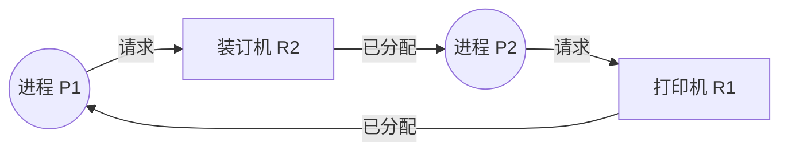

*图：沿图中的节点与箭头阅读，重点是讲清 Coffman 条件、wait-for graph、预防/避免/检测恢复和工程上的锁顺序/超时。*

---

## 死锁是如何产生的?如何预防和避免?

想象这样一个场景:你和同事都要打印一份装订好的文件,需要同时用到「打印机」和「装订机」两台设备。你先抢到了打印机,正准备去拿装订机;而同事恰好先抢到了装订机,正准备来拿打印机。于是你攥着打印机等装订机,他攥着装订机等打印机,谁都不肯先松手——两个人就这样僵在原地,永远等下去。

这就是**死锁(Deadlock)**:一组进程(或线程)各自持有一部分资源,又在等待对方手里的资源,结果谁都无法推进,系统陷入永久阻塞。死锁不是程序崩溃,反而更隐蔽——进程都「活着」,只是再也不干活了。

在并发编程里,死锁是最经典也最折磨人的 bug 之一。它往往在测试环境跑得好好的,一上线遇到高并发就偶发卡死,且难以复现。理解它的成因和应对手段,是每个工程师的基本功。

## 一、死锁产生的四个必要条件

1971 年 Coffman 等人总结出:死锁的发生**必须同时满足**以下四个条件,缺一不可。这一点至关重要——它直接告诉我们:**只要破坏其中任意一个,死锁就不可能发生**。

| 条件 | 含义 | 上面例子中的体现 |
|------|------|------------------|
| **互斥(Mutual Exclusion)** | 资源在同一时刻只能被一个进程占用 | 打印机不能两人同时用 |
| **持有并等待(Hold and Wait)** | 进程已持有至少一个资源,又在等待新资源,且不释放手中已有资源 | 你抓着打印机,又去等装订机 |
| **不可剥夺(No Preemption)** | 资源只能由持有者主动释放,不能被强行抢走 | 不能强行从同事手里夺走装订机 |
| **循环等待(Circular Wait)** | 存在一个进程等待环:P1 等 P2 的资源,P2 等 P1 的资源,首尾相接 | 你等他、他等你,形成闭环 |

为什么强调「同时满足」?因为前三个条件描述的是「资源能被独占且不肯放手」的客观属性,第四个条件描述的是「等待关系恰好构成了一个环」。只有当独占的资源恰好被环形地互相等待时,系统才真正死锁。

我们可以用资源分配图直观表示「循环等待」。下图中,实线箭头表示「资源已分配给进程」,虚线箭头表示「进程在请求资源」:



可以看到 `P1 → R2 → P2 → R1 → P1` 构成了一个闭环。**当资源分配图中出现环,且环上每种资源只有一个实例时,死锁就一定发生了。**(如果资源有多个实例,有环只是死锁的「可能」而非「必然」。)

## 二、应对死锁的三种思路

针对死锁,操作系统理论给出了三大方向:**预防、避免、检测与恢复**。它们的代价和严格程度依次递减。

### 1. 预防(Prevention):破坏四个必要条件之一

预防的思路很直接:既然四个条件缺一不可,那我从设计上保证其中一个永远不成立即可。

- **破坏互斥**:让资源可共享。但很多资源(如打印机、写锁)本质上无法共享,适用面窄。
- **破坏持有并等待**:要求进程在开始执行前**一次性申请**它需要的全部资源,要么全拿到、要么一个都不拿。缺点是资源利用率低(早早占着用不上的资源),且可能「饥饿」(永远凑不齐全部资源)。
- **破坏不可剥夺**:当进程请求新资源失败时,强制它释放已持有的全部资源,之后再重新申请。适合状态易于保存和恢复的资源(如 CPU、内存),但对打印机这类资源不现实。
- **破坏循环等待**:给所有资源**统一编号**,规定进程只能按编号递增的顺序申请资源。这样就不可能形成环(因为环必然要求「先申请高号、再申请低号」,与规则矛盾)。

最后这条——**统一加锁顺序**,是工程中最实用、最常用的预防手段,后文会重点展开。

### 2. 避免(Avoidance):银行家算法的思想

预防太「一刀切」,会牺牲并发度。避免则更聪明:**允许四个条件存在,但在每次分配资源前先做一次「安全性检查」,只有当分配后系统仍处于「安全状态」时才放行,否则让请求方等待。**

这就是 Dijkstra 提出的**银行家算法(Banker's Algorithm)**。把操作系统想象成银行家,进程是要贷款的客户:

- 银行家知道每个客户**最大可能需求**(Max);
- 每次客户申请放款前,银行家假设放款后,检查是否还存在一种放款次序,能让**所有客户**最终都拿到所需资金并归还(即系统是否「安全」);
- 只要存在这样一个「安全序列」,就放款;否则拒绝,让客户等待。

**安全状态**的定义是:存在一个进程执行序列 `P1, P2, ..., Pn`,使得每个 `Pi` 所需的剩余资源都能由「系统当前可用资源 + 排在它前面的进程释放的资源」满足。处于安全状态就一定不会死锁;处于不安全状态则**有可能**(并非必然)死锁。

银行家算法的局限很明显:它要求**预先知道每个进程的最大资源需求**,而这在真实系统中往往无法准确预估;同时每次分配都要做 O(n²) 的检查,开销不小。因此它更多是一种**思想**——「分配前评估风险、宁可保守等待也不要走入危险局面」——这种「准入控制 + 风险预判」的理念,在限流、连接池、配额调度里随处可见。

### 3. 检测与恢复(Detection & Recovery)

如果既不预防也不避免,就只能允许死锁发生,然后**定期检测**、发现后**恢复**。

- **检测**:周期性地构建资源分配图(或其简化的「等待图」),用类似拓扑排序的算法找环。能完整「化简」掉所有进程则无死锁,化简不掉的进程即处于死锁中。数据库系统普遍采用这种做法。
- **恢复**:
  - **终止进程**:杀掉死锁环中的一个或多个进程,释放其资源。可以「一次全杀」,也可以「逐个杀、每杀一个就重新检测」直到环消失。
  - **资源剥夺**:从某些进程强行抢回资源给别人,被抢的进程回滚到某个安全检查点(checkpoint)后重做。
  - 选择「牺牲品」时通常挑代价最小的:优先级低、已运行时间短、回滚代价小的进程。

## 三、工程实战:写并发代码时如何避开死锁

理论之外,真正落到代码里,有几条久经考验的实践原则。

### 1. 统一加锁顺序(破坏循环等待)

绝大多数应用层死锁,根源都是**不同线程以不同顺序获取同一组锁**。解决办法就是约定一个全局一致的加锁次序,所有线程都严格遵守。

```java
// 反例:转账时按账户参数顺序加锁,A->B 和 B->A 并发就会死锁
void transfer(Account from, Account to, int amount) {
    synchronized (from) {
        synchronized (to) {           // 线程1: lock(A) 等 lock(B)
            from.debit(amount);       // 线程2: lock(B) 等 lock(A)  -> 死锁
            to.credit(amount);
        }
    }
}

// 正解:按账户 id 大小决定加锁顺序,任何线程顺序都一致,环无法形成
void transfer(Account from, Account to, int amount) {
    Account first  = from.id < to.id ? from : to;
    Account second = from.id < to.id ? to   : from;
    synchronized (first) {
        synchronized (second) {
            from.debit(amount);
            to.credit(amount);
        }
    }
}
```

### 2. tryLock / 超时:破坏「持有并等待」与「不可剥夺」

[POSIX `pthread_mutex_lock()`](https://pubs.opengroup.org/onlinepubs/9799919799/functions/pthread_mutex_lock.html) 规定不同 mutex 类型的阻塞、递归和错误行为；`EDEADLK` 只在相应条件下报告，不能把它当作通用死锁检测器。


用「带超时的尝试加锁」代替「无限期阻塞加锁」。拿不到第二把锁时主动放弃、退避重试,而不是死等。

```java
boolean transfer(Account from, Account to, int amount) throws InterruptedException {
    long deadline = System.currentTimeMillis() + 1000;
    while (System.currentTimeMillis() < deadline) {
        if (from.lock.tryLock(50, TimeUnit.MILLISECONDS)) {
            try {
                if (to.lock.tryLock(50, TimeUnit.MILLISECONDS)) {
                    try {
                        from.debit(amount);
                        to.credit(amount);
                        return true;
                    } finally { to.lock.unlock(); }
                }
            } finally { from.lock.unlock(); } // 拿不到第二把锁就释放第一把
        }
        Thread.sleep(ThreadLocalRandom.current().nextInt(10)); // 随机退避,避免活锁
    }
    return false;
}
```

注意退避要加随机抖动,否则两个线程同步重试、同步失败、再同步重试,会陷入**活锁(Livelock)**——它们一直在动,却始终无法推进。

### 3. 减小锁粒度、缩短持锁时间

锁的范围越大、持有越久,冲突越多、死锁风险越高。常见手段:

- **缩小临界区**:只把真正需要互斥的代码放进锁内,I/O、网络调用、日志等耗时操作移到锁外。
- **细分锁**:用分段锁 / 分桶锁(如 `ConcurrentHashMap` 的思想)替代一把全局大锁,让不相关的操作并行。
- **用无锁结构**:CAS 原子操作、不可变对象、消息队列等,从根本上减少加锁。
- **能不嵌套加锁就别嵌套**:死锁几乎只发生在「持有 A 再求 B」的嵌套场景。

> 在 AI Agent 工程里,这类问题也很常见。当多个 Agent 或多个工具调用并发访问共享状态(会话内存、向量库写入、限流配额),又或者编排器里 A 任务等 B 任务的产物、B 又回头等 A 的资源时,就会出现「逻辑层死锁」。应对思路与操作系统完全一致:给资源定义统一的获取顺序,对外部调用一律设置超时与重试,把共享状态的临界区压到最小。

## 四、与数据库死锁的联系

数据库里的死锁,本质和操作系统一模一样——只不过「资源」变成了**行锁、表锁、间隙锁**,「进程」变成了**事务**。

```sql
-- 事务 T1
UPDATE account SET balance = balance - 100 WHERE id = 1;  -- 持有 id=1 的行锁
UPDATE account SET balance = balance + 100 WHERE id = 2;  -- 等待 id=2 的行锁

-- 事务 T2(并发执行)
UPDATE account SET balance = balance - 50 WHERE id = 2;   -- 持有 id=2 的行锁
UPDATE account SET balance = balance + 50 WHERE id = 1;   -- 等待 id=1 的行锁  -> 死锁
```

两个事务以相反顺序更新同两行，就可能构成循环等待。PostgreSQL 会自动检测死锁并中止其中一个事务，让另一个继续；应用若要重试，应重新执行完整事务并保留幂等边界。不同数据库的检测时机和 victim 选择策略并不相同，不能把某一实现规则泛化。（参见 [PostgreSQL explicit locking: Deadlocks](https://www.postgresql.org/docs/current/explicit-locking.html#LOCKING-DEADLOCKS)）

降低数据库死锁概率的手段,和应用层一脉相承:

- **固定更新顺序**:多行更新时按主键升序操作(等价于统一加锁顺序);
- **缩短事务**:事务越短,持锁时间越短,冲突窗口越小;
- **降低隔离级别 / 合理使用索引**:避免不必要的间隙锁、把表锁退化为行锁;
- **一次锁定 + 重试**:必要时用 `SELECT ... FOR UPDATE` 一次性按序锁好所需行,并对死锁异常做重试。

## 小结

死锁的核心是一句话:**一组进程因互相等待对方持有的、不可剥夺的独占资源而永久阻塞。** 它需要互斥、持有并等待、不可剥夺、循环等待四个条件同时成立。

应对策略有三层:**预防**(从设计上破坏某个条件,统一加锁顺序最实用)、**避免**(以银行家算法的思想做分配前的安全性评估)、**检测与恢复**(允许发生,事后找环并回滚)。落到工程里,记住三板斧足以应对大多数场景——**统一加锁顺序、tryLock 加超时、减小锁粒度**。而无论是操作系统、数据库,还是多 Agent 编排系统,这套规律都是通用的:谁先松手、按什么顺序拿、等多久就放弃,想清楚这三件事,死锁就无处藏身。

## 参考资料

- [PostgreSQL explicit locking: Deadlocks](https://www.postgresql.org/docs/current/explicit-locking.html#LOCKING-DEADLOCKS)
- [POSIX pthread_mutex_lock](https://pubs.opengroup.org/onlinepubs/9799919799/functions/pthread_mutex_lock.html)
