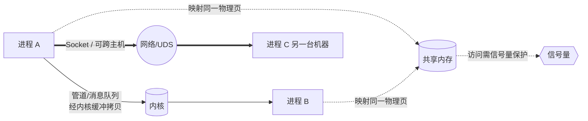

# 进程间通信(IPC)有哪些方式?

设想这样一个场景:你在 Linux 上敲下 `ps aux | grep node`。这一行命令里其实启动了两个独立的进程——`ps` 负责列出所有进程,`grep` 负责过滤。`ps` 的输出怎么"流"到 `grep` 的输入里去的?两个进程各自拥有独立的虚拟地址空间,彼此的内存互相看不见,凭什么能传数据?

答案就是**进程间通信(Inter-Process Communication,IPC)**。操作系统为了隔离与安全,刻意让每个进程"以为整台机器都是自己的",这带来了稳定性,却也立起了一道墙。IPC 就是在这道墙上凿出的、受内核管控的"洞":一组让独立进程能够交换数据、传递信号、协调动作的机制。

理解 IPC 的关键不是背 API,而是想清楚一个问题:**数据要从一个地址空间到另一个地址空间,中间必然要经过内核或某块共享区域。** 不同 IPC 方式的本质区别,就在于"经过哪里""拷贝几次""谁来同步"。下面我们逐个拆解。

## 一、管道:最朴素的字节流

### 匿名管道(Pipe)

匿名管道是最古老的 IPC。内核维护一块环形缓冲区,提供两个文件描述符:一个只读、一个只写。一端写,另一端读,数据像水管里的水一样单向流动。

```c
int fd[2];
pipe(fd);          // fd[0] 读端,fd[1] 写端
if (fork() == 0) {
    close(fd[1]);  // 子进程关掉写端,只读
    read(fd[0], buf, sizeof(buf));
} else {
    close(fd[0]);  // 父进程关掉读端,只写
    write(fd[1], "hello", 5);
}
```

它的硬限制很明显:**只能用于有亲缘关系的进程**(父子、兄弟),因为文件描述符要靠 `fork()` 继承传递。它也是**半双工**的——想双向通信得开两根管道。Shell 里的 `|` 就是匿名管道的典型应用。

- 优点:简单、内核自动处理同步与流量控制(缓冲区满则写阻塞,空则读阻塞)。
- 缺点:只能亲缘进程、半双工、只能传无格式字节流。

### 命名管道(FIFO)

为了打破"亲缘关系"的限制,命名管道在文件系统里留下一个特殊文件作为"约定的会合点":

```bash
mkfifo /tmp/myfifo
# 终端 A
cat < /tmp/myfifo
# 终端 B
echo "hello" > /tmp/myfifo
```

两个**毫无关系**的进程,只要都知道这个路径名,就能通过它通信。注意:这个文件只是一个"名字",真正的数据仍然走内核缓冲区,**不会落盘**。

- 优点:支持任意进程通信,用法和普通文件读写一致。
- 缺点:仍是字节流、本机限定;通常需要读写两端都就绪才能打通。

> 对 Agent 工程的意义:很多 Agent 框架用子进程跑工具(如启动一个 Python 沙箱执行代码),父进程与子进程之间最自然的通道就是匿名管道——把工具的 stdout/stderr 接到管道上读取执行结果,简单且零依赖。

## 二、消息队列:带边界的消息链表

管道传的是连续字节流,接收方自己分不清"一条消息"从哪到哪。消息队列(Message Queue)解决了这个问题:它在内核里维护一个**消息链表**,每次发送一个有类型、有边界的消息单元。

```c
struct msgbuf { long mtype; char mtext[256]; };
int qid = msgget(key, IPC_CREAT | 0666);
msgsnd(qid, &msg, len, 0);              // 投递一条消息
msgrcv(qid, &msg, len, mtype, 0);       // 按类型取一条消息
```

接收方可以按 `mtype` 选择性地取某一类消息,这是管道做不到的。消息队列还是**全双工、异步**的:发送方投递完就走,不必等接收方在线;消息会在内核里排队,直到被取走。

- 优点:有消息边界、可按类型读取、收发解耦(异步)。
- 缺点:单条消息有大小上限、队列总容量有限;每次收发都要在用户态和内核态之间**拷贝一次**数据,大数据量下开销不小;System V 消息队列的生命周期跟随内核(进程退出也不会自动销毁),容易遗留。

适用于本机进程间传递控制指令、小型任务这类"短消息"场景,比如一个分发器把任务 ID 投进队列,多个 worker 各取所需。

## 三、共享内存:最快,但要自己同步

前面几种方式都有个共同的"原罪":数据要在内核缓冲区里中转,至少经历"用户态 → 内核态 → 用户态"两次拷贝。共享内存(Shared Memory)直接釜底抽薪——**让多个进程的虚拟地址映射到同一块物理内存**。

```c
int shmid = shmget(key, 4096, IPC_CREAT | 0666);
char *p = shmat(shmid, NULL, 0);   // 映射进自己的地址空间
strcpy(p, "data");                 // 直接读写,如同操作普通内存
```

一旦映射建立,进程读写这块内存就和读写自己的变量一样,**没有任何系统调用、没有任何拷贝**。这是所有 IPC 中速度最快的方式,没有之一。

但天下没有免费的午餐:内核帮你把内存共享出来,却**完全不管同步**。两个进程同时写同一块区域,就会发生数据竞争;一个在写、一个在读,可能读到写了一半的脏数据。因此**共享内存几乎从不单独使用,必须搭配一个同步机制**——通常就是下面要讲的信号量。

- 优点:速度最快,适合大数据量、高频交换。
- 缺点:不提供任何同步,必须自行加锁;只能本机使用。

## 四、信号量:不是用来传数据的,而是用来"看门"

信号量(Semaphore)经常和共享内存一起出现,但它的角色完全不同:**它不传输数据,而是一个用于协调访问的计数器。**

信号量本质上是一个内核维护的整数,配两个原子操作:
- **P 操作(wait)**:计数减一,若结果小于 0 则阻塞,直到有资源可用。
- **V 操作(signal)**:计数加一,若有进程在等待则唤醒它。

```
信号量 sem = 1            // 二值信号量,等价于一把互斥锁
进程 A: P(sem) → 访问共享内存 → V(sem)
进程 B: P(sem) → (阻塞,等 A 释放) ... → 访问 → V(sem)
```

把信号量初值设为 1,它就是一把互斥锁,保护临界区;设为 N,它就能控制"最多 N 个进程同时访问"。共享内存 + 信号量是 System V IPC 的经典黄金搭档:**共享内存负责"快",信号量负责"对"。**

- 优点:轻量,是实现进程同步与互斥的基础设施。
- 缺点:本身不传数据;用错(忘了 V、P/V 配对不当)极易造成死锁。

## 五、信号:进程的"异步中断"

信号(Signal)是 IPC 中最特殊的一种——它传递的信息量极小,本质上只是一个"编号",用来**异步通知进程"发生了某件事"**。它像是软件层面的中断。

你按 `Ctrl+C`,内核就给前台进程发 `SIGINT`;进程访问非法内存,触发 `SIGSEGV`;子进程退出,父进程收到 `SIGCHLD`。进程可以注册处理函数来响应:

```c
void handler(int sig) { printf("收到信号 %d,优雅退出\n", sig); }
signal(SIGTERM, handler);
// 另一进程:kill(pid, SIGTERM);
```

信号是**异步**的:它随时可能打断进程的正常执行流去跑处理函数,所以处理函数里只能调用"异步信号安全"的函数,这是个常见坑。

- 优点:开销极小,适合事件通知、进程控制(终止、暂停、重载配置)。
- 缺点:信息量极小(基本只有信号编号),不适合传数据;标准信号不排队,同一信号短时间内多次到达可能被合并丢失。

> 对 Agent 工程的意义:一个长跑的 Agent 执行体接到外部"取消任务"的指令时,常用的实现就是父进程对子进程发 `SIGTERM`,让其捕获后清理资源、优雅落幕,而非粗暴 `SIGKILL`。理解信号的语义,才能正确实现可中断、可超时的工具调用。

## 六、套接字 Socket:唯一能跨主机的方式

前面所有方式都有一个共同的天花板:**只能在同一台机器上**。当通信双方分处不同主机,就只剩 Socket。

Socket 原本是为网络通信设计的(TCP/UDP),但它同样能用于本机:**Unix Domain Socket(UDS)**走内核内部转发,不经过网络协议栈,性能远高于走 TCP 回环。所以 Socket 实际上覆盖了"本机"和"跨机"两个场景:

| 类型 | 地址形式 | 范围 | 特点 |
| --- | --- | --- | --- |
| Unix Domain Socket | 文件路径 `/tmp/x.sock` | 本机 | 比 TCP 回环快,常用于本机服务间通信 |
| TCP Socket | IP + 端口 | 跨主机 | 可靠、有序、面向连接 |
| UDP Socket | IP + 端口 | 跨主机 | 无连接、可能丢包、低延迟 |

- 优点:**唯一能跨主机**;全双工;生态成熟,几乎所有语言都原生支持。
- 缺点:相比共享内存有协议栈/拷贝开销;编程模型(连接、字节流分包)比管道复杂。

Docker、数据库、消息中间件大量使用 UDS 做本机进程通信,正是看中了它"接口统一(以后想跨机只改地址)、本机又够快"的特性。

## 横向对比

| 方式 | 数据形态 | 范围 | 同步 | 速度 | 典型场景 |
| --- | --- | --- | --- | --- | --- |
| 匿名管道 | 字节流 | 本机·亲缘进程 | 内核自动 | 中 | shell `\|`、父子进程 |
| 命名管道 FIFO | 字节流 | 本机·任意进程 | 内核自动 | 中 | 无亲缘的本机进程 |
| 消息队列 | 有边界消息 | 本机 | 内核自动 | 中 | 控制指令、小任务分发 |
| 共享内存 | 裸内存 | 本机 | **需自行同步** | **最快** | 大数据高频交换 |
| 信号量 | 不传数据 | 本机 | —(它本身就是同步工具) | — | 配合共享内存做互斥 |
| 信号 | 信号编号 | 本机 | 异步 | 快 | 事件通知、进程控制 |
| Socket | 字节流/数据报 | **本机+跨机** | 自行处理 | 中(UDS 较快) | 网络服务、微服务 |

数据流向可以这样直观理解:



## 工程选型:多进程 worker / 微服务 / 多 Agent 怎么选?

把上面的机制对应到真实架构,选型逻辑其实很清晰:

**1. 同机多进程 worker(如 Nginx、Node Cluster、Python multiprocessing)**
- 任务分发、小消息:用**消息队列**或**管道**,内核帮你做好排队与流控,简单可靠。
- 需要共享大块状态(如共享缓存、大数组):用**共享内存 + 信号量/锁**,避免反复拷贝。例如多个推理 worker 共享同一份只读模型权重映射,就是共享内存的绝佳用例。
- 控制类指令(重载、退出):用**信号**。

**2. 微服务 / 跨主机**
- 没得选,只能用 **Socket**。服务一旦可能部署在不同机器(或不同容器、不同 Pod),就必须用网络协议(TCP/HTTP/gRPC)。即使现在同机,也建议用 UDS 或 TCP,**为未来的水平扩展留好接口**——这是"先用 Socket 抽象、后续平滑迁移到跨机"的核心收益。

**3. 多进程 Agent 执行体**

这是个混合场景,往往多种机制叠加使用:
- **主控 → 工具子进程**:工具(代码执行、shell、浏览器)通常作为子进程启动,用**管道**接其 stdin/stdout/stderr 收发输入与结果,最为自然。
- **取消 / 超时控制**:主控对子进程发**信号**(`SIGTERM`)实现优雅中断。
- **跨进程 / 跨机的 Agent 协作**:多个 Agent 分布在不同进程甚至不同节点时,用 **Socket**(常封装为 HTTP/gRPC/消息中间件)交换任务与中间结果。
- **大上下文 / 大向量共享**:若多个本机 Agent 需共享同一份大体量上下文或向量缓存,可考虑**共享内存**减少序列化与拷贝开销,但务必配合同步原语。

一句话总结选型直觉:**比速度选共享内存(配信号量),要解耦选消息队列,要可跨机选 Socket,做通知与控制选信号,跑子进程拿输出选管道。** 没有"最好"的 IPC,只有"最匹配你约束条件"的 IPC——而那个约束,通常就是**数据量、是否跨机、谁负责同步**这三件事。
