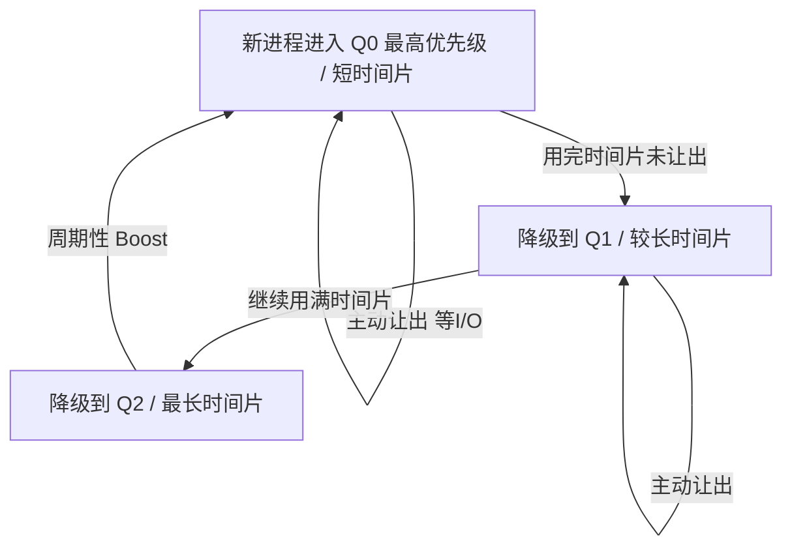

# 操作系统的进程调度算法有哪些?

想象你在咖啡馆点单:只有一位咖啡师(CPU),却同时来了五位顾客。有人只要一杯美式(几秒搞定),有人要一份现磨手冲加拉花(好几分钟),还有店长插队来杯紧急样品。咖啡师该先做谁?是按到店先后排队,还是先做快的让队伍流动起来,还是给店长开绿灯?——这就是**进程调度**要回答的问题。

操作系统里,可运行的进程(更准确地说是线程)往往远多于 CPU 核心数。**调度器(scheduler)**的职责,就是决定"下一个把 CPU 交给谁、交多久"。这个看似简单的决策,直接决定了系统是流畅还是卡顿、是公平还是有人被饿死。本文从调度目标讲起,把经典算法一个个拆开,讲清楚每种算法"为什么这么设计、解决了什么、又引入了什么新问题"。

## 一、先问目标:好的调度长什么样?

在比较算法之前,必须先明确我们在优化什么。调度器没有"绝对最优",只有"在某组目标下的权衡"。常见指标如下:

| 指标 | 含义 | 谁在乎 |
| --- | --- | --- |
| 吞吐量(Throughput) | 单位时间完成的进程数 | 批处理、后台计算 |
| 周转时间(Turnaround) | 从提交到完成的总耗时 | 任务整体效率 |
| 等待时间(Waiting) | 在就绪队列里干等的时间 | 资源利用率 |
| 响应时间(Response) | 从提交到**首次**被响应的时间 | 交互式应用、用户体感 |
| 公平性(Fairness) | 每个进程是否拿到合理份额 | 多租户、避免饥饿 |

关键在于,这些目标常常**互相矛盾**。比如想要高吞吐量,就倾向于让短任务先跑、少切换;但想要低响应时间,就得频繁打断长任务去照顾交互请求,而频繁切换又会拉低吞吐量。调度算法的演进史,本质上就是一部"如何在这些目标间找平衡"的历史。

还有一个贯穿全文的分类维度:

- **非抢占式(Non-preemptive)**:进程一旦拿到 CPU,就一直跑到主动让出(结束或阻塞 I/O)。实现简单,但一个长任务能把所有人堵在后面。
- **抢占式(Preemptive)**:调度器可以在时钟中断时强行收回 CPU,交给更该跑的进程。响应快、更公平,代价是上下文切换成本和实现复杂度。

现代通用操作系统(Linux、Windows、macOS)几乎都是抢占式的。

## 二、经典调度算法逐个看

### 1. 先来先服务 FCFS(First-Come, First-Served)

最朴素的策略:按到达顺序排队,谁先来谁先跑,跑完才轮到下一个。非抢占式,本质就是一个 FIFO 队列。

它的致命问题是**护航效应(convoy effect)**:一个耗时很长的进程排在前面,后面一堆短进程只能干等。假设有三个进程,运行时间分别是 100、1、1:

```
| P1 (100) ............................ | P2 (1) | P3 (1) |
0                                       100      101     102
```

P2、P3 各自只需要 1 个时间单位,平均等待时间却被 P1 拖到了 (0 + 100 + 101) / 3 ≈ 67。如果让短的先跑,平均等待会骤降。这就引出了下一个算法。

### 2. 最短作业优先 SJF / 最短剩余时间优先 SRTF

**SJF(Shortest Job First)**:每次从就绪队列里挑**预计运行时间最短**的进程先跑。可以证明,在所有进程同时到达的前提下,SJF 能取得**理论上最优的平均等待时间**——因为把短任务前置,能让队列里所有人的累计等待都缩短。

把上面的例子换成 SJF:

```
| P2 (1) | P3 (1) | P1 (100) ............................ |
0        1        2                                      102
```

平均等待变成 (0 + 1 + 2) / 3 = 1,效果立竿见影。

SJF 的抢占式版本叫 **SRTF(Shortest Remaining Time First)**:新进程到达时,如果它的运行时间比当前进程的**剩余时间**还短,就立刻抢占。

但 SJF/SRTF 有两个现实难题:

1. **运行时间无法预知**。操作系统并不知道一个进程还要跑多久,只能用历史行为做**指数加权平均**来估计(预测下一次 CPU 突发长度)。
2. **饥饿(Starvation)**。如果短任务源源不断地来,长任务可能永远排不上号,被无限期推迟。

### 3. 优先级调度(Priority Scheduling)

给每个进程一个优先级数值,调度器永远先跑优先级最高的。SJF 其实就是"以运行时间为优先级"的特例。优先级可以静态指定(如系统进程高于用户进程),也可以动态调整。

它同样面临**饥饿**:低优先级进程在高优先级任务不断涌入时可能永远得不到 CPU。经典解决方案是**老化(Aging)**:进程在就绪队列里等得越久,优先级就逐步提升,确保它终有出头之日。

> 历史上有个著名教训:1997 年火星探路者号探测器频繁重启,根因正是**优先级反转**——一个低优先级任务持有锁,挡住了高优先级任务,而中等优先级任务又抢占了低优先级任务,形成死锁式僵局。解决办法是**优先级继承**:持锁的低优先级进程临时继承等待者的高优先级。

### 4. 时间片轮转 RR(Round Robin)

为了照顾交互式系统的**响应时间**,RR 给每个进程分配一个固定的**时间片(time quantum)**,比如 10ms。进程跑满时间片若还没结束,就被抢占,重新排到队尾,CPU 交给下一个。本质是"带时间片的抢占式 FCFS",天然公平。

时间片大小是关键权衡:

- 时间片**太大** → 退化成 FCFS,长任务又开始霸占 CPU,响应变差。
- 时间片**太小** → 响应很快,但上下文切换过于频繁,大量 CPU 浪费在切换本身,吞吐量下降。

实践中通常取 10–100ms 这个量级,让一次切换的开销远小于一个时间片。

### 5. 多级反馈队列 MLFQ(Multi-Level Feedback Queue)

前面的算法各有短板:SJF 最优但需要预知未来,RR 公平但对短任务不够友好。MLFQ 的巧妙之处在于:**不需要预知运行时间,而是通过观察进程的历史行为来动态推断它是"交互型"还是"计算型"**。

它维护多个优先级队列,核心规则是:

1. 新进程进入**最高优先级**队列。
2. 高优先级队列时间片短,低优先级队列时间片长。
3. 一个进程如果用完整个时间片还没让出 CPU(说明它是 CPU 密集型),就**降级**到下一级队列;如果它在时间片用完前就主动让出(说明在等 I/O,是交互型),则**保持**当前优先级。
4. 调度时优先服务高优先级队列。



这套机制自动实现了:交互型进程(频繁等 I/O)始终待在高优先级、响应飞快;CPU 密集型任务逐步沉到低优先级、安静地利用空闲算力。为防止低优先级队列被饿死,还会**周期性地把所有进程提升回最高队列(priority boost)**,这正是"老化"思想的体现。Windows 和早期 macOS/BSD 都采用过 MLFQ 类调度器。

## 三、Linux 的 CFS:用"虚拟时间"实现完全公平

Linux 在 2.6.23 内核引入了 **CFS(Completely Fair Scheduler,完全公平调度器)**,放弃了固定时间片的思路,改用一个优雅的核心概念:**vruntime(虚拟运行时间)**。

CFS 的理想是模拟一个"理想多任务 CPU":N 个进程**同时**各跑 1/N 的算力。现实中 CPU 只能轮流跑,于是 CFS 给每个进程记一个 vruntime,表示它"已经累计占用的虚拟时间"。调度规则极简:**永远挑选 vruntime 最小的进程来跑**——也就是目前最"吃亏"、欠它最多的那个。

进程运行时 vruntime 持续累加,跑得越久 vruntime 越大,自然就会被别人反超而让出 CPU。所有进程的 vruntime 因此被"拉平",公平由此而来。CFS 用**红黑树**按 vruntime 排序管理就绪进程,取最小值是 O(1)(缓存最左节点),插入/删除是 O(log n)。

优先级(nice 值,-20 到 +19)如何融入?CFS 不再用它分配时间片,而是让 vruntime 的**累加速度**与权重挂钩:高优先级进程权重大,vruntime 走得**慢**,于是能更频繁地被选中、占用更多真实 CPU 时间。一句话:**nice 值决定 vruntime 这块"秒表"走多快**。

> 补充:从 6.6 内核起,Linux 用 **EEVDF**(Earliest Eligible Virtual Deadline First)取代了 CFS,在公平之外引入了"虚拟截止时间",对延迟敏感任务更友好。但理解 vruntime 的公平思想,仍是看懂现代 Linux 调度的基础。

## 四、绕不开的成本:上下文切换

每次从进程 A 切到进程 B,CPU 都要做一堆"换岗交接":保存 A 的寄存器、程序计数器、栈指针到它的 PCB(进程控制块),再加载 B 的上下文;如果切换的是不同进程(而非同进程内的线程),还要切换**地址空间**,刷新 TLB,甚至导致 CPU **缓存失效**——后者往往是隐性的大头,新进程要重新把数据"焐热"到缓存里。

这个开销通常在**微秒级**,听起来不大,但在每秒成千上万次切换的高负载系统里会快速累积。这也是为什么时间片不能设得太小、为什么 CPU 密集型任务该被沉到低优先级少打扰它们——**减少不必要的切换,本身就是一种优化**。

## 五、对高并发服务与 Agent 任务编排的启发

这些诞生于操作系统的思想,如今在应用层、在 AI 工程里到处都能看到影子。当我们用 Agent 编排大量并发任务、设计任务队列时,面对的本质是同一道题:**有限资源(模型并发额度、GPU、API 速率限制)如何分配给众多待处理任务。**

- **别让长任务护航短任务**:一个耗时的 Agent 长链路推理若独占工作线程,会把大量轻量请求堵死——这正是 FCFS 的护航效应。引入优先级队列或为长任务单开通道,能保住整体响应。
- **优先级 + 老化要配套**:给"用户实时对话"高于"后台批量摘要"的优先级很合理,但务必加上老化机制,否则高峰期低优先级的批处理任务会被永久饿死。
- **公平调度防止租户互相挤占**:多租户 Agent 平台可借鉴 CFS 的 vruntime 思路,按各租户已消耗的 token/算力分配下一次调度权,确保没人霸占资源。
- **切换是有成本的**:在 LLM 场景里,频繁切换上下文意味着丢失 KV-Cache、重复 prompt 预填充——和 CPU 缓存失效如出一辙。把同一会话的请求尽量批在一起(batching),就是在"减少上下文切换成本"。

## 小结

| 算法 | 抢占 | 核心思想 | 主要问题 |
| --- | --- | --- | --- |
| FCFS | 否 | 先到先服务 | 护航效应 |
| SJF / SRTF | SRTF 是 | 短任务优先,平均等待最优 | 需预知时间、饥饿 |
| 优先级调度 | 可两者 | 按优先级 | 饥饿(靠老化缓解) |
| RR | 是 | 轮流给固定时间片 | 时间片大小难权衡 |
| MLFQ | 是 | 用历史行为推断任务类型 | 参数调优复杂 |
| CFS | 是 | vruntime 完全公平 | 实现较复杂 |

调度算法没有银弹,所有设计都是在吞吐量、响应、公平之间做权衡。理解了"为什么 FCFS 会护航、为什么 SJF 最优却不可行、为什么 RR 公平却要权衡时间片、为什么 CFS 用 vruntime 就能公平"这条逻辑链,你不仅看懂了操作系统的核心,也握住了一把通用钥匙——无论是高并发后端,还是 AI Agent 的任务编排,本质都是同一道资源分配题。
