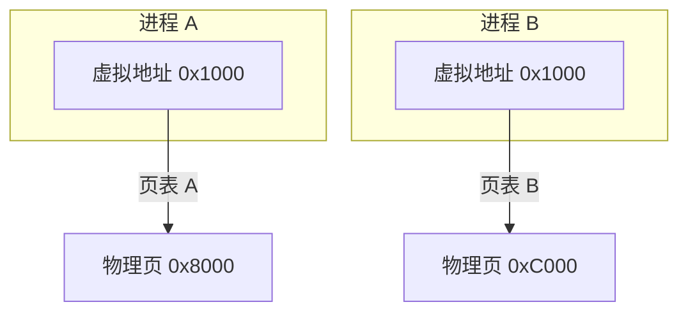
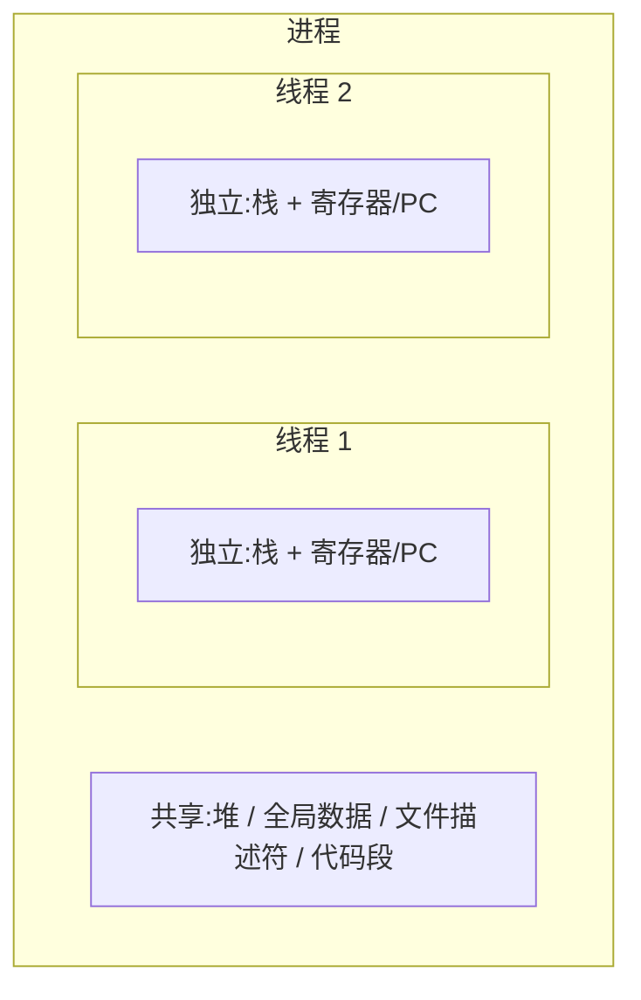
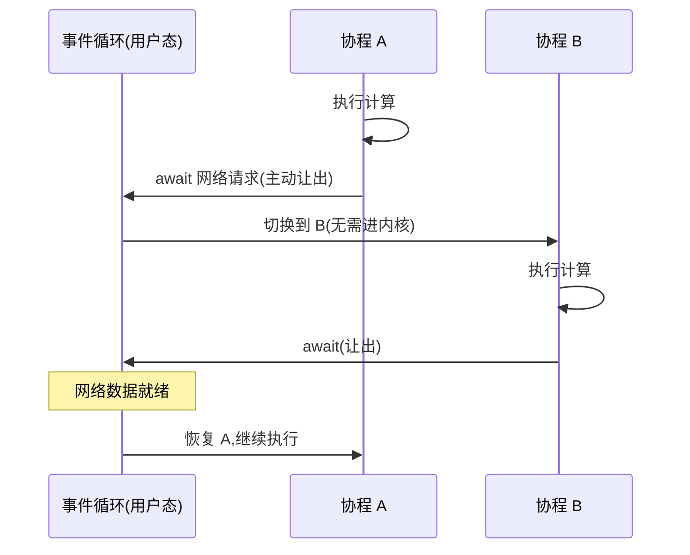

# 进程、线程与协程有什么区别?

设想你打开浏览器看视频,同时还在用编辑器写代码、用音乐软件听歌。这三个程序互不干扰:浏览器崩溃了不会把你的代码弄丢,音乐也照样播放。但当你切到编辑器时,它内部其实又同时在做好几件事——光标闪烁、自动保存、语法高亮、拼写检查。这两层"同时进行",分别对应着操作系统里两个最基础的概念:**进程**和**线程**。而当你写一段网络爬虫,需要同时发起上千个 HTTP 请求时,你可能又会听到第三个词:**协程**。

这三者经常被混在一起讲,但它们其实回答的是不同问题:操作系统如何分配资源?CPU 如何被调度?以及——我们如何用极低的成本榨干 IO 等待中的时间?这篇文章把它们讲清楚。

## 一、进程:资源分配的基本单位

进程是"一个正在运行的程序"。但更精确地说,**进程是操作系统进行资源分配的基本单位**。

当你双击一个可执行文件,操作系统会为它创建一个进程,并为这个进程划拨一整套独立的资源:

- **独立的虚拟地址空间**:每个进程都以为自己独占了整片内存(比如 64 位系统下理论上 256TB 的地址空间),代码段、数据段、堆、栈各居其位。
- **打开的文件描述符表**:它打开了哪些文件、哪些 socket。
- **其他内核资源**:信号处理设置、当前工作目录、环境变量等。

关键在于"独立"。进程 A 用地址 `0x1000` 存的数据,和进程 B 用地址 `0x1000` 存的数据,是物理内存里完全不同的两块区域。这层隔离由 CPU 的内存管理单元(MMU)配合操作系统的页表实现:每个进程有自己的一套页表,把相同的虚拟地址映射到不同的物理页上。

这种隔离带来了**安全与稳定**:一个进程访问越界、写坏了自己的内存,顶多搞垮自己,操作系统会把它单独杀掉,不会殃及其他进程。这也是为什么浏览器现在普遍采用"每个标签页一个进程"——一个网页崩溃,不至于整个浏览器陪葬。

代价是:进程之间想交换数据很麻烦。它们不能直接读对方的内存,必须借助操作系统提供的**进程间通信(IPC)**机制,如管道、消息队列、共享内存、socket 等,这些都需要经过内核,成本不低。

## 二、线程:CPU 调度的基本单位

如果一个进程内部想同时做多件事(比如编辑器一边响应键盘一边自动保存),就需要线程。

**线程是 CPU 调度的基本单位**。一个进程至少有一个线程(主线程),也可以有多个。同一进程内的所有线程**共享该进程的地址空间和资源**——同一片堆内存、同样的文件描述符、同样的全局变量。但每个线程有自己**独立的栈和寄存器状态(包括程序计数器)**,因为它们各自执行着不同的代码路径,需要记住"我执行到哪了、我的局部变量是什么"。

"共享地址空间"是线程的核心优势,也是它最大的陷阱:

- **优势**:线程间通信几乎零成本,直接读写同一个变量即可,不必走 IPC。
- **陷阱**:多个线程同时读写同一块内存,会产生**竞态条件(race condition)**。比如两个线程都执行 `count++`,这条语句在底层是"读—加—写"三步,可能交错执行导致结果错误。所以多线程编程必须用锁(mutex)、信号量、原子操作等手段做**同步**,而锁用不好又会带来死锁和性能瓶颈。

## 三、上下文切换:进程 vs 线程的成本差异

无论进程还是线程,当 CPU 从执行一个切换到另一个时,都要保存当前执行流的状态、加载下一个的状态,这叫**上下文切换**。但两者成本差距很大。

**线程切换(同进程内)**:只需保存/恢复寄存器、程序计数器和栈指针。因为地址空间没变,内核态和用户态的切换开销也相对小。

**进程切换**:除了上述这些,还要切换整个**地址空间**。这意味着要更换页表,而 CPU 为了加速虚拟地址翻译,维护了一个叫 **TLB(快表)** 的缓存。切换页表通常会导致 TLB 大面积失效,之后的内存访问要重新走页表查询,这部分"隐性成本"往往比保存寄存器本身更昂贵。此外 CPU 缓存(L1/L2)的命中率也会因工作集变化而下降。

所以经验上:**进程切换显著慢于线程切换**。这也是"多线程比多进程轻"的根本原因之一。

但请注意:无论进程还是线程,切换都由**操作系统内核**主导,需要从用户态陷入内核态(一次 trap),由调度器决定下一个该谁跑。这是一种**抢占式调度**——你的线程可能在任何一条指令之间被强行暂停。这次"陷入内核"本身,就是接下来协程要极力避免的东西。

## 四、协程:用户态的轻量执行单元

进程和线程都是操作系统的概念,由内核调度。**协程(coroutine)则是用户态的概念,由程序自己调度。**

协程是一种可以**主动挂起和恢复**的函数。它的关键特征是:**协作式调度,而非抢占式**。一个协程不会被强行打断,它只在遇到 `yield` / `await` 这样的让出点时,主动交出执行权;调度器(通常是语言运行时或一个事件循环,运行在用户态)再挑选下一个就绪的协程来跑。

为什么协程切换"极便宜"?因为它**完全发生在用户态,不需要陷入内核**。切换一个协程,本质上只是保存/恢复几个寄存器和切换一个栈(或在无栈协程里只是保存几个局部变量),由用户态代码完成,没有 trap、不经过内核调度器、不刷 TLB。一次协程切换可能只有几十纳秒,而一次线程切换通常在微秒级。一个进程里开几千个线程会让系统不堪重负,但开几万、几十万个协程却轻而易举,因为协程的栈可以很小且按需增长,且它们复用着少数几个内核线程。

代价是:**协程不能真正并行**。同一个内核线程上的多个协程,在任意时刻只有一个在跑;而且如果某个协程不让出(比如执行了一段纯 CPU 密集计算或调用了一个阻塞式的同步 API),它会"霸占"线程,让同线程上的其他协程统统饿死。所以协程要发挥威力,依赖整条链路都是**非阻塞 / 异步**的。

## 五、三者对比

| 维度 | 进程 | 线程 | 协程 |
| --- | --- | --- | --- |
| 本质定位 | 资源分配的基本单位 | CPU 调度的基本单位 | 用户态的轻量执行单元 |
| 地址空间 | 各自独立 | 进程内共享 | 共享(同所属线程) |
| 调度者 | 操作系统内核 | 操作系统内核 | 用户态运行时 / 事件循环 |
| 调度方式 | 抢占式 | 抢占式 | 协作式(主动让出) |
| 切换成本 | 最高(换页表、刷 TLB) | 中等(换寄存器/栈) | 极低(用户态,不进内核) |
| 是否真并行 | 是(多核) | 是(多核) | 否(单线程内串行) |
| 通信方式 | IPC(管道/共享内存等) | 共享内存 + 锁 | 共享内存(单线程内天然安全) |
| 隔离/容错 | 强,互不影响 | 弱,一个崩溃整进程崩 | 弱,且不让出会饿死同伴 |
| 数量级上限 | 几十~几百 | 几百~几千 | 几万~几十万 |

## 六、各自的适用场景

理解了机制,选型就有了依据:

- **多进程**:需要强隔离、强容错,或要绕开某些语言的全局锁(如 Python 的 GIL 限制了多线程并行执行 CPU 代码,用多进程才能真正吃满多核)。代价是内存占用大、通信成本高。例:浏览器多进程架构、Nginx 的 master-worker 模型、需要沙箱隔离的任务。
- **多线程**:CPU 密集型任务在多核上做并行计算,且任务间需要频繁共享大量数据。比如图像处理、并行排序、科学计算。前提是你愿意承担同步(加锁)的复杂度。
- **协程 / 异步 IO**:**IO 密集型**的高并发场景——程序大部分时间在"等"(等网络、等磁盘、等数据库),CPU 其实很闲。这种场景下协程是最优解。

## 七、为什么高并发 IO 更适合协程 / 异步 IO

这是最值得讲透的"为什么"。

设想一个服务要同时处理一万个请求,每个请求都要去查一次远程数据库,网络往返要 50 毫秒。

如果用**同步多线程**模型:每来一个请求开一个线程,线程发出请求后就**阻塞**在那里干等 50ms。要扛住一万并发,就得开一万个线程。但每个线程默认占用约 1MB 栈空间(一万个就是约 10GB 内存),再加上内核要在这一万个线程间频繁做上下文切换,光切换开销就能把 CPU 吃光。这就是经典的 "C10K 问题"。本质矛盾在于:**线程在等待 IO 时白白占着资源,却什么也没干。**

而**协程 + 异步 IO** 换了个思路:当一个协程发出网络请求后,它不傻等,而是立刻 `await` **让出**,把内核线程交给其他就绪的协程去跑。底层由操作系统的 IO 多路复用机制(Linux 的 epoll、macOS/BSD 的 kqueue)统一监听所有 socket,哪个数据回来了就通知事件循环,事件循环再恢复对应的协程。于是少数几个内核线程,配合一个事件循环,就能照看上万个并发连接——CPU 几乎不浪费在"等待"和"无谓切换"上。

一句话:**协程把"等待 IO 的时间"变成了"去干别的活的时间",且这种切换不花内核的钱。**

> 对 Agent 工程的意义:一个 Agent 在一轮里常常要并发调用多个 LLM、检索多个知识库、触发多个工具(function call),这些几乎全是网络 IO,且单次往返动辄几百毫秒到数秒。如果用同步阻塞方式逐个等待,延迟会线性累加,体验糟糕。用协程 / 异步 IO(如 Python 的 `asyncio.gather`、JS 的 `Promise.all`)把这些独立调用并发出去,总耗时就趋近于"最慢的那一个",而不是"所有之和"。这也是为什么主流 Agent 框架和 LLM SDK 都重度依赖异步接口——它们面对的正是典型的高并发 IO 场景,而非 CPU 密集计算。

## 小结

- **进程**是资源分配单位,地址空间相互隔离,安全但切换贵、通信难。
- **线程**是 CPU 调度单位,进程内共享地址空间,切换较轻,但要小心竞态与加锁。
- **协程**是用户态的协作式调度单元,靠主动让出而非内核抢占,切换成本极低,但不能真并行、且要求全程非阻塞。

三者不是替代关系,而是不同抽象层次的工具:操作系统用进程隔离程序、用线程压榨多核,而我们用协程在 IO 等待的缝隙里塞进海量并发。选对工具的前提,永远是先看清你的任务到底卡在 CPU 还是卡在 IO。
