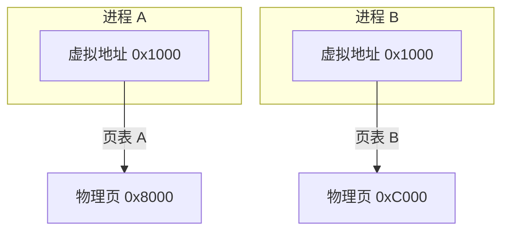
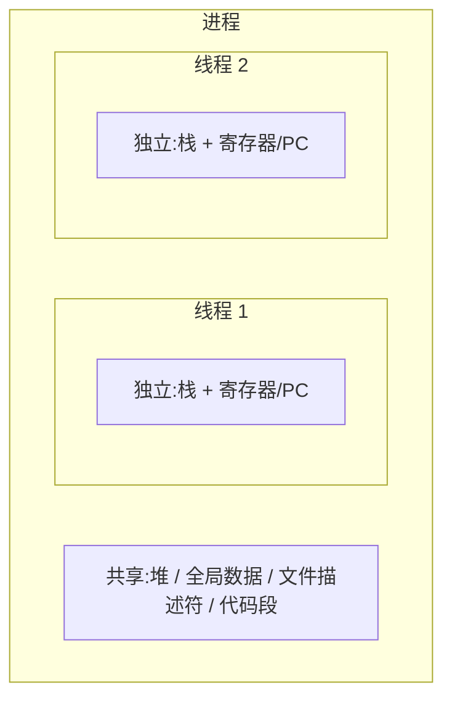
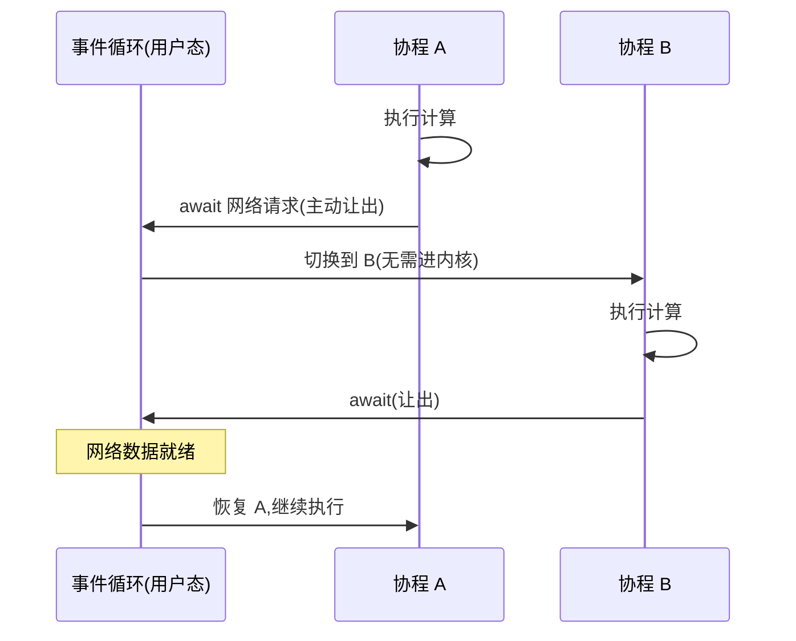

*图：沿图中的节点与箭头阅读，重点是从地址空间、调度单位、共享状态和切换成本区分进程、线程与协程，避免把语言级 coroutine 等同内核线程。*

---

## 进程、线程与协程有什么区别?

设想你打开浏览器看视频,同时还在用编辑器写代码、用音乐软件听歌。这三个程序互不干扰:浏览器崩溃了不会把你的代码弄丢,音乐也照样播放。但当你切到编辑器时,它内部其实又同时在做好几件事——光标闪烁、自动保存、语法高亮、拼写检查。这两层"同时进行",分别对应着操作系统里两个最基础的概念:**进程**和**线程**。而当你写一段网络爬虫,需要同时发起上千个 HTTP 请求时,你可能又会听到第三个词:**协程**。

这三者经常被混在一起讲,但它们其实回答的是不同问题:操作系统如何分配资源?CPU 如何被调度?以及——我们如何用极低的成本榨干 IO 等待中的时间?这篇文章把它们讲清楚。

## 一、进程:资源分配的基本单位

进程是"一个正在运行的程序"。但更精确地说,**进程是操作系统进行资源分配的基本单位**。

当你双击一个可执行文件,操作系统会为它创建一个进程,并为这个进程划拨一整套独立的资源:

- **独立的虚拟地址空间**:每个进程都以为自己独占了整片内存(比如 64 位系统下理论上 256TB 的地址空间),代码段、数据段、堆、栈各居其位。
- **打开的文件描述符表**:它打开了哪些文件、哪些 socket。
- **其他内核资源**:信号处理设置、当前工作目录、环境变量等。

关键在于"独立"。进程 A 用地址 `0x1000` 存的数据,和进程 B 用地址 `0x1000` 存的数据,是物理内存里完全不同的两块区域。这层隔离由 CPU 的内存管理单元(MMU)配合操作系统的页表实现:每个进程有自己的一套页表,把相同的虚拟地址映射到不同的物理页上。

```mermaid
graph TB
    subgraph "进程 A"
        VA["虚拟地址 0x1000"]
    end
    subgraph "进程 B"
        VB["虚拟地址 0x1000"]
    end
    VA -->|页表 A| PA["物理页 0x8000"]
    VB -->|页表 B| PB["物理页 0xC000"]
```

这种隔离带来了**安全与稳定**:一个进程访问越界、写坏了自己的内存,顶多搞垮自己,操作系统会把它单独杀掉,不会殃及其他进程。这也是为什么浏览器现在普遍采用"每个标签页一个进程"——一个网页崩溃,不至于整个浏览器陪葬。

代价是:进程之间想交换数据很麻烦。它们不能直接读对方的内存,必须借助操作系统提供的**进程间通信(IPC)**机制,如管道、消息队列、共享内存、socket 等,这些都需要经过内核,成本不低。

## 二、线程:CPU 调度的基本单位

[POSIX 线程通用概念](https://pubs.opengroup.org/onlinepubs/9799919799/basedefs/V1_chap02.html#tag_02_09) 定义同一进程内线程共享的执行环境以及各线程独有状态；协程则是语言/运行时的协作调度抽象，不能等同于 POSIX 线程。

如果一个进程内部想同时做多件事(比如编辑器一边响应键盘一边自动保存),就需要线程。

**线程是 CPU 调度的基本单位**。一个进程至少有一个线程(主线程),也可以有多个。同一进程内的所有线程**共享该进程的地址空间和资源**——同一片堆内存、同样的文件描述符、同样的全局变量。但每个线程有自己**独立的栈和寄存器状态(包括程序计数器)**,因为它们各自执行着不同的代码路径,需要记住"我执行到哪了、我的局部变量是什么"。

```mermaid
graph TB
    subgraph "进程"
        H["共享:堆 / 全局数据 / 文件描述符 / 代码段"]
        subgraph "线程 1"
            S1["独立:栈 + 寄存器/PC"]
        end
        subgraph "线程 2"
            S2["独立:栈 + 寄存器/PC"]
        end
    end
```

"共享地址空间"是线程的核心优势,也是它最大的陷阱:

- **优势**:线程间通信几乎零成本,直接读写同一个变量即可,不必走 IPC。
- **陷阱**:多个线程同时读写同一块内存,会产生**竞态条件(race condition)**。比如两个线程都执行 `count++`,这条语句在底层是"读—加—写"三步,可能交错执行导致结果错误。所以多线程编程必须用锁(mutex)、信号量、原子操作等手段做**同步**,而锁用不好又会带来死锁和性能瓶颈。

## 三、上下文切换:进程 vs 线程的成本差异

无论进程还是线程,当 CPU 从执行一个切换到另一个时,都要保存当前执行流的状态、加载下一个的状态,这叫**上下文切换**。但两者成本差距很大。

**线程切换(同进程内)**:只需保存/恢复寄存器、程序计数器和栈指针。因为地址空间没变,内核态和用户态的切换开销也相对小。

**进程切换**:除了上述这些,还要切换整个**地址空间**。这意味着要更换页表,而 CPU 为了加速虚拟地址翻译,维护了一个叫 **TLB(快表)** 的缓存。切换页表通常会导致 TLB 大面积失效,之后的内存访问要重新走页表查询,这部分"隐性成本"往往比保存寄存器本身更昂贵。此外 CPU 缓存(L1/L2)的命中率也会因工作集变化而下降。

所以经验上:**进程切换显著慢于线程切换**。这也是"多线程比多进程轻"的根本原因之一。

但请注意:无论进程还是线程,切换都由**操作系统内核**主导,需要从用户态陷入内核态(一次 trap),由调度器决定下一个该谁跑。这是一种**抢占式调度**——你的线程可能在任何一条指令之间被强行暂停。这次"陷入内核"本身,就是接下来协程要极力避免的东西。

## 四、协程:用户态的轻量执行单元

进程和线程都是操作系统的概念,由内核调度。**协程(coroutine)则是用户态的概念,由程序自己调度。**（参见 [PEP 3156: Asynchronous IO Support Rebooted](https://peps.python.org/pep-3156/)）

协程是一种可以**主动挂起和恢复**的函数。在 Python asyncio 这类事件循环中，任务采用协作调度：遇到实际等待点时挂起，循环运行其他就绪任务。`await` 一个立即完成的对象未必让出。运行时轻量任务也可能有不同的调度机制，不能把“所有协程都绝不被抢占”当统一定义。

```mermaid
sequenceDiagram
    participant EL as 事件循环(用户态)
    participant C1 as 协程 A
    participant C2 as 协程 B
    C1->>C1: 执行计算
    C1->>EL: await 网络请求(主动让出)
    EL->>C2: 切换到 B(无需进内核)
    C2->>C2: 执行计算
    C2->>EL: await(让出)
    Note over EL: 网络数据就绪
    EL->>C1: 恢复 A,继续执行
```

用户态挂起与恢复可减少为每个等待任务配置一个内核线程的成本，但具体代价取决于实现、栈、调度和负载，不能套通用的纳秒、线程数或协程数上限。网络 I/O 仍会使用操作系统机制，用户态调度不等于整条链路从不进入内核。

同一个线程同一时刻只能执行一个任务，阻塞调用或长计算可拖住该线程上的其他任务。能否多核并行取决于执行器：[Python asyncio Task](https://docs.python.org/3.14/library/asyncio-task.html#task-object)描述一个事件循环的协作调度；[Go FAQ](https://go.dev/doc/faq#goroutines)说明 goroutine 复用多条线程。不能把单线程事件循环的限制推广成所有轻量执行单元都不能并行。

## 五、三者对比

| 维度 | 进程 | 线程 | 协程 |
| --- | --- | --- | --- |
| 本质定位 | 资源分配的基本单位 | CPU 调度的基本单位 | 用户态的轻量执行单元 |
| 地址空间 | 各自独立 | 进程内共享 | 共享(同所属线程) |
| 调度者 | 操作系统内核 | 操作系统内核 | 用户态运行时 / 事件循环 |
| 调度方式 | 依 OS 调度 | 依 OS 调度 | 依运行时，asyncio Task 为协作式 |
| 切换成本 | 依地址空间、缓存与 OS 实现 | 依上下文与 OS 实现 | 用户态挂起恢复可更轻，实际成本依运行时与负载 |
| 是否真并行 | 依核数与任务 | 依核数、运行时与任务 | 单线程内串行；多线程运行时可并行 |
| 通信方式 | IPC 或共享内存等 | 共享内存需同步 | 单线程也可能在等待点形成逻辑竞态 |
| 隔离/容错 | 强,互不影响 | 弱,一个崩溃整进程崩 | 弱,且不让出会饿死同伴 |
| 容量限制 | 由系统资源与负载决定 | 由栈、资源与负载决定 | 由内存、调度、I/O 与预算决定 |

## 六、各自的适用场景

理解了机制,选型就有了依据:

- **多进程**:需要强隔离、强容错，或让启用 GIL 的 CPython 中的纯 Python CPU 任务并行。GIL 并非所有 Python 实现和构建的统一限制；释放 GIL 的扩展与 [Python 3.14 free-threaded 构建](https://docs.python.org/3.14/howto/free-threading-python.html)也有不同边界。多进程的代价是内存占用与通信成本。例：浏览器多进程架构、Nginx 的 master-worker 模型、需要沙箱隔离的任务。
- **多线程**:CPU 密集型任务在多核上做并行计算,且任务间需要频繁共享大量数据。比如图像处理、并行排序、科学计算。前提是你愿意承担同步(加锁)的复杂度。
- **协程 / 异步 IO**:**IO 密集型**的高并发场景——程序大部分时间在"等"(等网络、等磁盘、等数据库),CPU 其实很闲。可考虑协程或其他异步 I/O 模型，仍需比较负载、库支持与运维成本。

## 七、为什么高并发 IO 更适合协程 / 异步 IO

这是最值得讲透的"为什么"。

设想一个服务要同时处理一万个请求,每个请求都要去查一次远程数据库,网络往返要 50 毫秒。

若为每个等待请求配置一个线程，线程栈、排队与调度都有成本；实际线程数和栈占用由 OS、运行时与配置决定，不宜套固定 1MB 或“最多一万个”的阈值。线程池也必须有界，否则只是把外部等待变成内部积压。

协程配合真正异步的 I/O，可在一个任务等待响应时让执行线程运行其他就绪任务。事件循环借助 epoll/kqueue 等机制获取就绪事件，再恢复任务；已有响应缓存或立即完成的 await 不必发生切换。独立 I/O 可以并发等待，依赖步骤仍需串行；CPU 密集或阻塞调用应放到适合的执行器并控制并发。

一句话:**协程把"等待 IO 的时间"变成了"去干别的活的时间",用户态调度可以减少等待任务的线程开销，但 I/O 和线程调度仍有系统成本。**

> 对 Agent 工程的意义:一个 Agent 在一轮里常常要并发调用多个 LLM、检索多个知识库、触发多个工具(function call),这些几乎全是网络 IO,且单次往返动辄几百毫秒到数秒。如果用同步阻塞方式逐个等待,延迟会线性累加,体验糟糕。用协程 / 异步 IO(如 Python 的 `asyncio.gather`、JS 的 `Promise.all`)把这些独立调用并发出去,总耗时就趋近于"最慢的那一个",而不是"所有之和"。这也是为什么主流 Agent 框架和 LLM SDK 都重度依赖异步接口——它们面对的正是典型的高并发 IO 场景,而非 CPU 密集计算。

## 小结

- **进程**是资源分配单位,地址空间相互隔离,安全但切换贵、通信难。
- **线程**是 CPU 调度单位,进程内共享地址空间,切换较轻,但要小心竞态与加锁。
- **协程**可挂起与恢复；调度方式和并行能力取决于运行时。单线程事件循环中的任务需要避免阻塞，并在共享状态跨等待点时处理逻辑竞态。

三者不是替代关系,而是不同抽象层次的工具:操作系统用进程隔离程序、用线程压榨多核,而我们用协程在 IO 等待的缝隙里塞进海量并发。选对工具的前提,永远是先看清你的任务到底卡在 CPU 还是卡在 IO。

## 出现于（热度来源）

<!-- interview-source-history:start -->
- [拼多多 AI Agent 岗两轮技术面：RAG、多 Agent 与系统能力（2026 年 8 月）](../../../interview/pinduoduo/ai/pinduoduo-ai-1.md)
- [字节 Agent 开发一面：上下文工程、协作与编程基础（2026 年 8 月）](../../../interview/bytedance/base/bytedance-base-19.md)
- [字节飞书 AI 应用一面：Runtime、评测与后端基础（2026 年 9 月发帖）](../../../interview/bytedance/base/bytedance-base-24.md)
- [字节 Agent 开发一面：Skill、MCP 与后端基础（2026 年 7 月）](../../../interview/bytedance/base/bytedance-base-15.md)
- [蚂蚁 Agent 实习一面：缓存、消息与 RAG（2026 年 6 月发帖）](../../../interview/antfin/ai/antfin-ai-6.md)
- [腾讯 Agent 实习一面：RAG、工具与通信（2026 年 3 月发帖）](../../../interview/tencent/ai/tencent-ai-10.md)
- [字节 Agent 后端一面：进程线程、Transformer 与训练](../../../interview/bytedance/base/bytedance-base-31.md)
- [字节全栈二、三面：幂等、索引与字符串匹配](../../../interview/bytedance/base/bytedance-base-32.md)
- [字节 Agent 实习：缓存一致性、定时任务与后端基础](../../../interview/bytedance/base/bytedance-base-47.md)
- [字节后端与 Agent：运行链路、数据库与网络](../../../interview/bytedance/base/bytedance-base-55.md)
- [字节 Agent 后端实习一面：任务恢复、事务与链表](../../../interview/bytedance/base/bytedance-base-59.md)
<!-- interview-source-history:end -->

## 参考资料

- [POSIX General Concepts: Threads](https://pubs.opengroup.org/onlinepubs/9799919799/basedefs/V1_chap02.html#tag_02_09)
- [PEP 3156: Asynchronous IO Support Rebooted](https://peps.python.org/pep-3156/)
