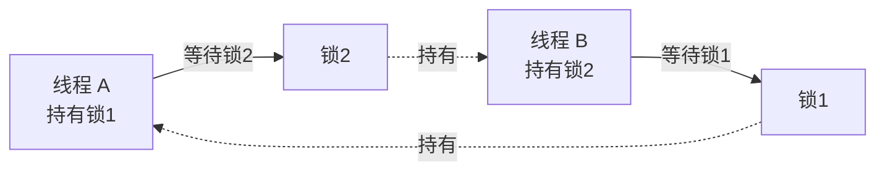

# 线程同步与互斥:锁、信号量与条件变量

设想一个再普通不过的场景:一个网站要统计页面访问量,内存里有个变量 `count`。两个线程几乎同时处理两个请求,都执行 `count++`。你以为最终结果是 `+2`,但很可能只 `+1`。

原因在于 `count++` 并不是一条原子指令,而是三步:

```
1. 读取 count 到寄存器     (load)
2. 寄存器值 +1             (add)
3. 写回 count             (store)
```

如果线程 A 和线程 B 的这三步交错执行——A 读到 100,还没写回,B 也读到 100,两者各自算出 101 并写回——那么两次自增只生效了一次。这种"结果依赖于线程执行的先后/交错顺序"的现象,就叫**竞态条件(Race Condition)**。

竞态的根源是:多个线程**并发**访问**共享的可变状态**,且其中至少有一个是写操作。要么去掉共享,要么去掉并发,要么让访问变得"不可分割"。同步原语解决的就是最后一条路。

## 临界区与互斥

我们把"访问共享资源、必须串行执行的那段代码"称为**临界区(Critical Section)**。上例中 `count++` 就是临界区。

保证临界区**任意时刻最多只有一个线程进入**,这个性质叫**互斥(Mutual Exclusion)**。互斥是同步最基础的需求。一个正确的互斥机制要同时满足:

- **互斥性**:同一时刻只有一个线程在临界区内;
- **无死锁/无饥饿**:想进入的线程最终能进入;
- **不假设线程速度与数量**:正确性不依赖 CPU 调度。

> 对 Agent 工程的意义:Agent 的"会话内存"、"工具调用计数"、"token 预算"本质上都是共享可变状态。当多个并发请求或多个子 Agent 同时读写它们时,如果不做同步,统计会丢失、配额会超发——这就是上面 `count++` 问题在业务层的翻版。

## 互斥锁、读写锁、自旋锁

### 互斥锁 mutex

最常用的互斥工具。线程进入临界区前 `lock()`,离开时 `unlock()`。若锁已被占用,后来者会被**阻塞挂起**(让出 CPU,进入睡眠),被唤醒需要内核介入,有上下文切换开销。

```c
pthread_mutex_lock(&m);
count++;            // 临界区
pthread_mutex_unlock(&m);
```

适用:临界区较长、竞争可能导致较长等待的场景。代价是阻塞/唤醒的系统调用成本(通常微秒级)。

### 自旋锁 spinlock

获取不到锁时,线程**不睡眠,而是忙等(空转循环)反复尝试**:

```c
while (test_and_set(&lock)) { /* busy wait */ }
```

它省去了线程切换的开销,但 CPU 在等待期间被白白占用。

| 维度 | 互斥锁 | 自旋锁 |
|------|--------|--------|
| 等待方式 | 睡眠,让出 CPU | 忙等,占用 CPU |
| 切换开销 | 有(挂起/唤醒) | 无 |
| 适合临界区 | 长 | 极短 |
| 适合场景 | 用户态、可能长等待 | 内核态、多核、持锁时间确定且很短 |

经验法则:**如果等待锁的时间预计比一次线程切换还短,用自旋锁划算;否则用互斥锁。** 单核 CPU 上自旋锁几乎总是错误选择——持锁者得不到 CPU,等待者却在空转。

### 读写锁 rwlock

很多数据"读多写少"。读操作之间并不冲突(都不修改),只有写需要独占。读写锁据此放宽:

- **读锁**可被多个线程同时持有(共享);
- **写锁**独占,与任何读/写互斥。

```
多个读者并行   ✓
读者 + 写者     ✗
多个写者        ✗
```

适用:配置缓存、路由表这类读远多于写的结构。注意写者饥饿问题——读者源源不断时写者可能永远拿不到锁,实现上常用"写优先"策略缓解。

## 信号量 semaphore

信号量是一个带原子操作的**计数器**,由 Dijkstra 提出。两个操作:

- `P()` / `wait()`:计数减 1;若结果 < 0 则阻塞;
- `V()` / `signal()`:计数加 1;若有线程在等则唤醒一个。

它比互斥锁更通用:

- **二值信号量**(初值 1):等价于互斥锁;
- **计数信号量**(初值 N):允许最多 N 个线程同时进入,天然适合"资源池"。

比如限制数据库连接池最多 10 个并发:

```c
sem_t sem;
sem_init(&sem, 0, 10);   // 10 个许可
sem_wait(&sem);          // 占用一个连接
// ... 使用连接 ...
sem_post(&sem);          // 归还
```

互斥锁强调"所有权"(谁加锁谁解锁),信号量则没有所有权概念——一个线程 `wait`、另一个线程 `post` 完全合法,因此它也常用来做线程间的**事件通知**。

## 条件变量:生产者-消费者

光有互斥还不够。考虑一个有界缓冲队列:生产者往里放数据,消费者取走。消费者发现队列空了,该怎么办?

如果一直持锁忙等"队列非空",生产者永远拿不到锁去放数据——死锁。我们需要一种机制:**让线程在某个条件不满足时释放锁并睡眠,等条件可能满足时被唤醒**。这就是**条件变量(Condition Variable)**。

它必须配合一把互斥锁使用,核心三操作:

- `wait(cond, mutex)`:**原子地**释放锁并睡眠;被唤醒后重新拿锁返回;
- `signal(cond)`:唤醒一个等待者;
- `broadcast(cond)`:唤醒所有等待者。

```c
// 消费者
pthread_mutex_lock(&m);
while (queue_is_empty())          // 注意是 while,不是 if
    pthread_cond_wait(&not_empty, &m);
item = dequeue();
pthread_mutex_unlock(&m);
pthread_cond_signal(&not_full);

// 生产者
pthread_mutex_lock(&m);
while (queue_is_full())
    pthread_cond_wait(&not_full, &m);
enqueue(item);
pthread_mutex_unlock(&m);
pthread_cond_signal(&not_empty);
```

两个关键点常被新手忽略:

1. **必须用 `while` 而不是 `if` 重新检查条件**。因为存在"虚假唤醒(spurious wakeup)",也因为被唤醒到真正拿到锁之间,条件可能又被别的线程改变了。
2. `wait` 内部"释放锁 + 睡眠"是原子的,否则会出现"刚判断完条件、还没睡下,信号就来了"的丢失唤醒(lost wakeup)。

> 对 Agent 工程的意义:Agent 里的流式输出队列、待执行工具调用队列,本质都是生产者-消费者模型。模型生成 token 是生产者,前端推送是消费者;用条件变量(或其高级封装 BlockingQueue / Channel)解耦,既不空转 CPU,又不会丢消息。

## 乐观锁 vs 悲观锁

前面的锁都是**悲观锁**:假设冲突很可能发生,所以先上锁再操作。它简单可靠,但有阻塞、上下文切换、死锁等代价。

**乐观锁**则假设冲突很少:不加锁直接操作,**提交时再检查这期间有没有被别人改过**,改过就重试。常见实现是版本号(version)或时间戳:

```sql
UPDATE account SET balance = 90, version = version + 1
WHERE id = 1 AND version = 5;   -- 只在版本仍是 5 时才更新成功
-- 受影响行数为 0 → 说明被人改过 → 重新读取并重试
```

| | 悲观锁 | 乐观锁 |
|---|--------|--------|
| 假设 | 冲突常发生 | 冲突很少 |
| 手段 | 先加锁 | 提交时校验版本/CAS |
| 开销 | 阻塞、切换 | 重试(冲突多时浪费) |
| 适合 | 写密集、强竞争 | 读多写少、弱竞争 |

## CAS、原子操作与 ABA 问题

乐观锁在硬件层面靠 **CAS(Compare-And-Swap)** 实现。CAS 是一条 CPU 原子指令,语义为:

```
CAS(addr, expected, new):
    if *addr == expected:
        *addr = new; return true
    else:
        return false
```

"比较并交换"作为一个不可分割的整体执行。基于它,无需操作系统锁就能实现**原子操作**和**无锁(lock-free)数据结构**。开头的计数器可以这样修:

```c
int old;
do {
    old = count;
} while (!CAS(&count, old, old + 1));   // 失败就重试
```

**ABA 问题**是 CAS 的经典陷阱:线程 1 读到值 A,准备 CAS;期间线程 2 把它从 A 改成 B 又改回 A。线程 1 的 CAS 看到"还是 A",误以为没人动过,实际上中间状态已经变了——这在指针/栈复用场景会引发悬空引用。

解决办法是给值附带一个**版本戳**,把"值"换成"值 + 计数器",每次修改递增计数:`(A,1) → (B,2) → (A,3)`,这样即便值回到 A,版本也不同,CAS 会失败。Java 的 `AtomicStampedReference` 就是干这个的。

## 死锁与加锁顺序

多把锁一起用时,容易出现**死锁**:线程 A 持有锁 1 等锁 2,线程 B 持有锁 2 等锁 1,互相死等。死锁需同时满足四个条件(Coffman 条件):

- **互斥**:资源不可共享;
- **持有并等待**:拿着一个还要另一个;
- **不可剥夺**:不能强抢别人的锁;
- **循环等待**:形成等待环。



破坏任一条件即可避免。工程上最实用的是破坏"循环等待":**给所有锁规定一个全局顺序,所有线程都按同一顺序加锁。** 比如永远先锁编号小的账户再锁编号大的,转账双向都成立,环就不会形成。其他手段还有:用带超时的 `tryLock` 失败即回退、尽量减少持锁范围、用单把粗粒度锁替代多把细粒度锁。

## 何时用哪种:决策清单

| 需求 | 推荐 |
|------|------|
| 简单临界区互斥 | 互斥锁 |
| 临界区极短、多核、内核态 | 自旋锁 |
| 读多写少的共享结构 | 读写锁 |
| 限制并发数量 / 资源池 | 计数信号量 |
| 线程间等待某个条件成立 | 条件变量 + 互斥锁 |
| 单个计数器/标志位自增 | 原子操作(CAS) |
| 读多写少、冲突罕见的数据更新 | 乐观锁(版本号) |
| 写密集、强竞争 | 悲观锁 |

一个递进的思路:**能不共享就不共享**(线程本地存储、不可变数据、消息传递);必须共享时,**能用原子操作就别上锁**;必须上锁时,**选最贴合访问模式的锁**,并控制好粒度与加锁顺序。

## Agent 并发写共享状态如何保证正确

回到 Agent 工程。一个典型场景:一次用户请求触发了多个并行的子 Agent 或工具调用,它们都要更新同一份会话状态——累加 token 消耗、扣减调用配额、向会话记忆追加内容。这正是多写者竞态。常见的正确做法:

- **计数 / 配额扣减**:用原子操作(`AtomicLong` / 数据库 `UPDATE ... SET n = n - 1 WHERE n > 0`)做 CAS 式扣减,避免超发。绝不能"先读余额、再判断、再写回"——那是教科书级的竞态。
- **会话记忆追加**:若是追加到队列,用线程安全队列(生产者-消费者模型);若是更新结构化对象,用乐观锁(版本号)读改写,冲突就重试,因为对话更新冲突通常很少。
- **分布式多实例**:进程内锁不够用了,要靠分布式锁(Redis / 数据库行锁)或把状态收敛到单一可序列化的写入点(如单分区队列)。
- **首选无共享设计**:让每个子 Agent 在隔离的上下文里产出结果,最后由一个汇聚步骤串行合并。把并发写收敛成"并行算 + 串行并",从根上消灭竞态,往往比到处加锁更可靠。

同步的本质不是"加锁",而是**管理共享可变状态的访问顺序**。理解了竞态从何而来,你才能在锁、信号量、条件变量、原子操作之间做出恰当的取舍——无论是在操作系统内核里,还是在一个高并发的 Agent 服务里。
