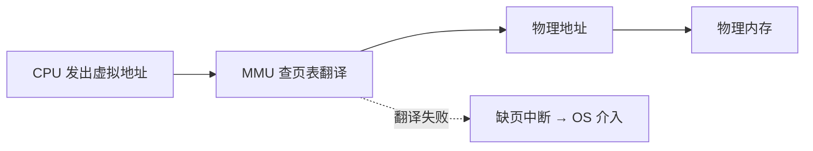

*图：沿图中的节点与箭头阅读，重点是解释虚拟地址、页表、TLB、page fault、匿名/文件映射、copy-on-write 与回收边界。*

---

## 虚拟内存与分页机制是怎么工作的?

设想这样一个场景:你的电脑只有 16GB 物理内存,却同时开着浏览器(几十个标签页)、IDE、Docker、一个本地跑着的大模型推理进程。把它们占用的内存加起来可能远超 16GB,但系统依然在跑——而且每个程序都"以为"自己独占了一整块从 0 开始、连续无缝的地址空间。更神奇的是,浏览器里的一个野指针越界,顶多让浏览器崩溃,绝不会改写 IDE 的内存。

这一切看似矛盾的现象,背后是同一套机制在支撑:**虚拟内存(Virtual Memory)**。理解它,几乎是理解现代操作系统的钥匙。（参见 [Linux kernel memory management documentation](https://docs.kernel.org/mm/index.html)）

## 为什么需要虚拟内存?

如果让进程直接操作物理内存(像早期没有 MMU 的系统那样),会立刻撞上三个难题。虚拟内存正是为了同时解决它们而生。

**第一,进程隔离与保护。** 多个进程同时驻留内存,谁能保证 A 进程不会读写 B 进程的数据?直接用物理地址的话,一个 bug 就能拖垮整个系统。我们需要一道墙,让每个进程只能碰自己的内存。

**第二,连续地址的假象。** 程序员和编译器都希望面对一块"从 0 开始、连续、巨大"的地址空间,这样链接、寻址都简单。但物理内存是被各进程瓜分得支离破碎的。我们需要一层映射,把进程眼中连续的地址,翻译到实际上零散的物理位置。

**第三,超额分配(over-commitment)。** 所有进程声称要用的内存总和可以远大于物理内存。只要它们不在同一瞬间全部真正用到,系统就该让它们都跑起来——把暂时用不到的部分先放到磁盘上。

虚拟内存的核心思想可以一句话概括:**给每个进程一套独立的、虚拟的地址空间,再由硬件+操作系统把虚拟地址翻译成物理地址。** 这层"翻译",就是全部魔法的来源。

## 虚拟地址到物理地址的转换

每个进程看到的地址都是**虚拟地址(Virtual Address)**。CPU 执行指令时给出的地址也都是虚拟地址。但内存条上的存储单元只认**物理地址(Physical Address)**。两者之间的翻译,由 CPU 里一个叫 **MMU(内存管理单元)** 的硬件完成。



关键在于:翻译规则不是一对一硬编码的,而是存在一张**页表(Page Table)**里,由操作系统为每个进程单独维护。进程切换时,操作系统切换页表,MMU 就开始按新表翻译——于是每个进程都活在自己的地址空间里,互不干扰。隔离就是这么实现的。

## 分页:把内存切成等大的块

直接对每个字节做映射显然不现实,映射表会比内存本身还大。于是引入**分页(Paging)**:把虚拟地址空间切成固定大小的**页(Page)**,把物理内存切成同样大小的**页框(Page Frame)**,通常都是 **4KB**。映射以"页"为单位进行,粒度大大降低。

既然按页映射,虚拟地址就被自然拆成两部分:

| 部分 | 含义 |
| --- | --- |
| 页号(高位) | 用来在页表里查找映射到哪个物理页框 |
| 页内偏移(低位) | 在页框内的字节偏移,翻译前后保持不变 |

以 4KB 页为例,低 12 位($2^{12}=4096$)是页内偏移,高位是页号。翻译过程就是:用页号去页表查出对应的物理页框号,再把页框号和原来的偏移拼起来,得到物理地址。

```
虚拟地址:  [   页号 20 位   ][ 偏移 12 位 ]
                  │ 查页表
                  ▼
物理地址:  [ 页框号 ][ 偏移 12 位 ](偏移原样拷贝)
```

页表的每一项(PTE)除了记录物理页框号,还带着一组标志位:是否有效(present)、是否可写、是否可执行、是否被访问过(accessed)、是否被修改过(dirty)。这些标志位是后面缺页、保护、置换算法的基础。

## 多级页表:别让页表自己吃光内存

问题来了:32 位系统有 $2^{20}$ 个页(约 100 万),每项 4 字节,单进程页表就要 4MB;64 位地址空间下更是天文数字。而大多数进程的地址空间是**稀疏**的——代码在低地址、栈在高地址,中间一大片根本没用。为这些空洞也分配页表项,纯属浪费。

解决办法是**多级页表(Multi-level Page Table)**:把页号再切成几段,逐级查找,像查字典先翻部首再翻笔画。只有真正用到的那一段子页表才需要在内存里存在,空洞区域对应的子页表干脆不分配。


x86-64 实际用的是**四级页表**(PML4 → PDPT → PD → PT)。代价是一次地址翻译要访问内存好几次(每级一次),这显然太慢了——于是需要缓存。

## TLB:翻译的高速缓存

如果每次访存都要走四级页表,等于每条指令背后藏着好几次额外内存访问,性能无法接受。于是 CPU 里又加了一块小而快的缓存:**TLB(Translation Lookaside Buffer,快表)**,专门缓存最近用过的"页号 → 页框号"映射。

翻译流程因此变成:

1. MMU 先查 TLB。**命中(TLB hit)**:直接拿到页框号,几乎零开销。
2. **未命中(TLB miss)**:才去走多级页表(称为 page table walk),查到后把结果填回 TLB。

由于程序具有**局部性**——一段时间内反复访问相邻地址——TLB 命中率通常高达 99% 以上,多级页表的查表开销被摊薄到几乎可以忽略。这也是为什么进程切换是"昂贵"的:切换页表往往意味着 TLB 需要刷新或部分失效,接下来一段时间命中率会骤降。

## 缺页中断与按需调页

页表项里的 present 位,是超额分配的开关。当 MMU 发现某个虚拟页对应的 PTE 标记为"无效/不在内存"时,会触发一个**缺页中断(Page Fault)**,把控制权交给操作系统。

操作系统接手后会判断这是哪种情况:

- 这一页从未被加载(比如程序刚启动,代码段还在磁盘上)——这就是**按需调页(Demand Paging)**:不预先把整个程序读进内存,而是用到哪页才加载哪页,省时省内存。
- 这一页之前被换出到了磁盘(swap 区)——把它读回来。
- 这是一次非法访问(访问了根本没映射的地址,即段错误)——发信号杀掉进程。

合法的缺页处理流程大致是:找一个空闲页框 → 从磁盘读入数据 → 更新页表项(置 present)→ 重新执行刚才那条出错的指令。整个过程对程序透明,程序根本不知道自己刚才"卡了一下从磁盘读了页数据"。代价是:一次磁盘缺页可能比一次内存访问慢上几个数量级,缺页率高时性能会断崖式下跌。

## 页面置换算法:内存满了换谁走?

按需调页时,如果没有空闲页框了,就必须**换出**一个已有页面来腾地方。换谁?这就是**页面置换算法(Page Replacement)**要回答的问题。目标是尽量换出"未来最久不会被用到"的页,以降低缺页率。

| 算法 | 思路 | 优缺点 |
| --- | --- | --- |
| FIFO | 换出最早进来的页 | 实现简单;但可能换掉常用页,甚至出现 Belady 异常(加内存反而更多缺页) |
| LRU | 换出最久未被访问的页 | 接近最优;但精确实现需为每次访问记时间戳,硬件开销大 |
| Clock(二次机会) | LRU 的近似 | 用一个 accessed 标志位 + 环形指针,低成本逼近 LRU,实际系统常用 |

理论上最优的是 OPT 算法(换出未来最久不用的页),但它需要预知未来,只能作为衡量其他算法好坏的标尺。**Clock 算法**之所以流行,是因为它只靠硬件自动维护的 accessed 位:指针扫到一页时,若该位为 1 就清零并跳过(给它"第二次机会"),为 0 才换出——用极小成本拿到了接近 LRU 的效果。

## Thrashing:换页换到崩溃

当物理内存严重不足,进程们需要的"活跃页面集合"(工作集)加起来装不下时,会发生一种恶性循环:刚换出去的页马上又被访问,于是又换进来,又得换出别的页……CPU 大部分时间不是在干活,而是在等磁盘读写页面。这种状态叫**内存抖动(Thrashing)**。


现象是:系统看起来"假死",磁盘灯狂闪,CPU 利用率却很低。解决方向只有两个:增加物理内存,或减少同时运行的进程数(降低内存需求)。操作系统也会用**工作集模型**等策略来避免让进程数量超过内存承载能力。

## mmap:把文件直接映射进地址空间

虚拟内存机制还顺手提供了一个强大能力:**内存映射(mmap)**。它把一个文件(或一段匿名内存)直接映射到进程的虚拟地址空间,之后读写这段内存就等同于读写文件——由缺页机制按需把文件内容加载进来,由操作系统在合适时机把脏页写回磁盘。（参见 [POSIX mmap](https://pubs.opengroup.org/onlinepubs/9799919799/functions/mmap.html)）

它的好处是省去了 `read`/`write` 系统调用反复拷贝的开销,还天然支持多个进程映射同一文件实现共享内存。动态库加载、数据库引擎、以及把超大模型权重文件"映射"进内存按需读取,都依赖 mmap。

## 类比:大模型推理里的"显存换页"

如果你做 AI/Agent 工程,这套机制会让你产生强烈的既视感。GPU 显存就像物理内存,稀缺而昂贵;模型权重、KV Cache 就像要驻留的页面。

当一个长上下文的对话(比如几十万 token 的 Agent 任务)让 KV Cache 撑爆显存时,推理框架的做法和操作系统如出一辙:把暂时用不到的 KV 块"换出"到 CPU 内存甚至磁盘(类似 swap),用到时再调回——vLLM 的 **PagedAttention** 干脆直接借用了"分页"的思想,把 KV Cache 切成固定大小的块按需分配,从而避免显存碎片、支持超额分配。同样地,显存频繁在 GPU 与 CPU 之间倒腾,就是 AI 版的 thrashing,会让推理吞吐暴跌。理解了 OS 的虚拟内存,你也就理解了为什么大模型推理引擎要这样设计资源管理。

## 小结

虚拟内存用一层"虚拟地址→物理地址"的翻译,一举解决了隔离、连续假象与超额分配三大问题。分页让映射变得可行,多级页表压缩了页表体积,TLB 把翻译加速到近乎免费;缺页中断与按需调页让程序可以"用到才加载",页面置换算法决定内存紧张时谁出局,而工作集装不下时就会陷入 thrashing。这套从硬件到操作系统协同的设计思想,不仅撑起了你电脑上每一个进程,也悄悄影响着今天大模型推理引擎的资源调度方式。

## 参考资料

- [Linux kernel memory management documentation](https://docs.kernel.org/mm/index.html)
- [POSIX mmap](https://pubs.opengroup.org/onlinepubs/9799919799/functions/mmap.html)
