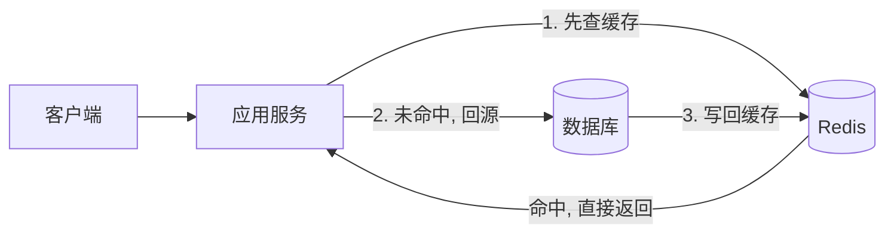
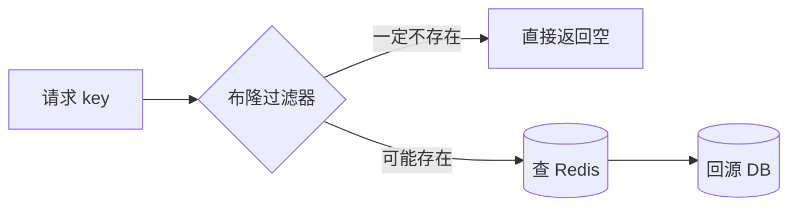

# 缓存穿透、击穿、雪崩及解决方案

## 从一张架构图说起

几乎所有有点流量的系统,数据库前面都会挡一层缓存(通常是 Redis)。它的职责很朴素:把热数据放进内存,让读请求绝大多数命中缓存,只有少量"漏网之鱼"才真正打到数据库。



这套"先查缓存、未命中回源、回源后写回"的模式,正常情况下能把数据库的读压力降低一两个数量级。但缓存终究是一道**会失效、会被绕过、会同时塌掉**的防线。一旦这道防线在某些场景下失灵,请求就会像洪水一样涌向数据库,轻则响应变慢,重则数据库连接被打满、整个系统连环崩溃。

所谓**缓存穿透、击穿、雪崩**,就是这道防线失灵的三种典型形态。它们经常被混为一谈,但成因、影响范围和解法都不一样。讲清楚它们,关键不在于背定义,而在于理解"为什么缓存挡不住这一类请求"。

下面逐一拆解。

## 三者的准确定义与区别

先用一张表把三者放在一起对比,建立整体认知,再深入细节。

| 问题 | 一句话本质 | 数据是否存在 | 影响范围 | 直接后果 |
| --- | --- | --- | --- | --- |
| 缓存穿透 | 查的是**根本不存在**的数据 | 不存在 | 持续性、可被恶意放大 | 每次都绕过缓存打到 DB |
| 缓存击穿 | **单个热点 key** 恰好失效 | 存在 | 集中在某一个热点 key | 瞬时大量请求同时回源 |
| 缓存雪崩 | **大量 key 同时失效**或 Redis 整体宕机 | 存在 | 大面积 | DB 瞬间承受全部读压力 |

记忆的诀窍:**穿透是"查空"、击穿是"一个点被打穿"、雪崩是"一大片同时塌"**。

### 缓存穿透:查询不存在的数据

缓存穿透指的是:请求查询一个**数据库里也不存在**的数据。

因为数据不存在,缓存自然不会有它的记录,于是请求穿过缓存打到数据库;数据库也查不到,返回空,应用通常也不会把"空"写回缓存。结果就是——**每一次这样的请求都会完整地落到数据库上**,缓存形同虚设。

这在正常业务里偶尔发生不要紧,可怕的是被恶意利用:攻击者用大量随机、不存在的 ID(比如 `id = -1`、`id = 999999999`)疯狂请求,缓存全程拦不住,数据库被打爆。

### 缓存击穿:单个热点 key 失效

缓存击穿(也叫"热点 key 失效")指的是:某个**访问极其频繁的热点 key**,在它过期的那一瞬间被大量并发请求同时访问。

由于 key 刚好失效,这些请求集体未命中,于是**同时回源去查数据库、同时重建缓存**。本来应该只有一个请求回源,结果成千上万个请求一起打到数据库的同一行数据上,数据库瞬时压力陡增。

它和穿透的区别很关键:击穿的数据**是存在的**,只是缓存恰好失效了;问题出在"重建缓存的瞬间没有保护",而不是数据本身有问题。

### 缓存雪崩:大量 key 同时失效或 Redis 宕机

缓存雪崩有两种成因:

1. **大量 key 在同一时间集中过期**。比如系统启动时批量预热了一批缓存,设了相同的过期时间(如都是 30 分钟),30 分钟后它们"约好了"一起失效,瞬间大量请求回源。
2. **Redis 实例整体宕机**。缓存层直接没了,所有读请求全部落到数据库。

无论哪种,后果都是数据库在极短时间内承受平时几十倍的压力,极易被压垮,进而引发上游服务超时、线程池耗尽、连锁雪崩——这也是"雪崩"这个名字的由来。

雪崩与击穿的区别在于**规模**:击穿是"一个热点 key",雪崩是"一大批 key 或整个缓存层"。

## 缓存穿透的解决方案

穿透的根因是"查不存在的数据,缓存拦不住"。解法是给这类请求加上**前置拦截**与**结果记忆**。

### 1. 参数校验(第一道闸门)

最廉价也最容易被忽略的一招:在请求入口就把明显非法的参数挡掉。比如 ID 必须是正整数、必须符合长度/格式规范,`id = -1` 这种直接返回错误,根本不进入查询流程。校验拦不住所有情况,但能过滤掉大量低级攻击。

### 2. 缓存空值(缓存"查无此数据"这一事实)

既然问题是"数据库查不到、于是没写缓存",那就**把'查不到'这个结果也缓存起来**。当数据库返回空时,在 Redis 里写入一个空标记(如空字符串或特殊占位符),并设一个**较短的过期时间**(如 1~5 分钟,避免长期占用内存,也防止数据后来真的被创建却读不到)。

```text
查缓存:
  命中真实值  -> 返回
  命中空标记  -> 直接返回空(不再回源)
  未命中      -> 查 DB
                 DB 有  -> 写回真实值
                 DB 无  -> 写回空标记(短 TTL)
```

缺点是:如果攻击者每次都用**不同的**不存在 key,空值缓存会塞进大量无用 key,占内存。这时就需要布隆过滤器。

### 3. 布隆过滤器(在查缓存之前就判断"一定不存在")

布隆过滤器(Bloom Filter)是一种空间效率极高的概率型数据结构。它用一个位数组加多个哈希函数,能以很小的内存代价回答"某个元素**是否可能存在**"。

它的特性是:**判断"不存在"时绝对准确,判断"存在"时有极小的误判率**。利用这一点,我们把所有合法的 key 预先放进布隆过滤器,请求进来先问过滤器:

- 过滤器说"不存在" → 这个 key 一定不存在,直接拒绝,连 Redis 都不用查;
- 过滤器说"可能存在" → 才继续走正常的查缓存、回源流程。



实践中,**布隆过滤器 + 缓存空值**常常搭配使用:布隆过滤器挡掉绝大多数随机攻击,空值缓存兜住误判和边缘情况。

## 缓存击穿的解决方案

击穿的根因是"热点 key 失效瞬间,大量请求一起回源重建"。解法的核心思想是:**让重建动作只发生一次,其余请求等待或读旧值**。

### 1. 互斥锁(只放一个请求回源)

当请求发现缓存未命中,先尝试获取一把分布式锁(如用 Redis 的 `SET key value NX EX`)。只有抢到锁的那个请求才去查数据库、重建缓存;其余请求拿不到锁,就短暂等待后重试读缓存。等第一个请求把缓存重建好,后续请求自然命中。

```text
get(key) 未命中:
  if 抢到锁:
      val = 查DB; 写缓存; 释放锁; 返回 val
  else:
      sleep 一小会儿; 重新 get(key)   // 此时大概率已被别人重建好
```

优点是实现直观、保证数据库只被回源一次;代价是其余请求要短暂阻塞,且需要小心处理锁超时与释放,避免死锁。

### 2. 逻辑过期(永不"物理过期",后台异步刷新)

另一种思路是:**缓存不设物理 TTL(或设很长),而是把"过期时间"作为一个字段存在 value 里**(逻辑过期)。读取时检查这个逻辑过期时间:

- 未逻辑过期 → 直接返回;
- 已逻辑过期 → **仍然先返回旧数据**(保证可用),同时尝试获取锁,由抢到锁的请求**异步开一个线程去重建缓存**。

这样任何请求都不会被阻塞,始终能拿到数据(可能是稍旧的),适合对一致性要求不那么苛刻、但绝不能卡顿的高并发热点场景。代价是会读到短暂的旧数据,且实现更复杂。

### 3. 热点 key 永不过期

对于极少数明确已知的超级热点(如首页配置、热门商品),干脆**不设过期时间**,只通过后台任务或数据变更时**主动更新**缓存。这是逻辑过期的极端简化版,最稳但灵活性最低,只适合数量可控的关键 key。

## 缓存雪崩的解决方案

雪崩有两种成因,对应两类解法:一类针对"大量 key 同时失效",一类针对"Redis 整体不可用"。

### 1. 过期时间加随机扰动(打散失效时间)

针对"集中过期":给每个 key 的过期时间加上一个**随机抖动**,让它们错开失效。比如基础 30 分钟,再加 `0~5 分钟` 的随机量:

```text
ttl = baseTtl + random(0, 300) 秒
```

简单一招,就能把"同一秒钟全部失效"摊平成"在一段时间内陆续失效",数据库压力随之平滑。

### 2. 多级缓存(让请求层层兜底)

在 Redis 之外再叠加本地缓存(如进程内的 Caffeine/本地 Map)形成多级结构:本地缓存 → Redis → 数据库。即使 Redis 整体抖动或部分 key 失效,本地缓存还能扛住一部分热点请求,不至于让压力全部直达数据库。代价是要处理多级之间的一致性。

### 3. 集群与高可用(让 Redis 不那么容易整体宕机)

针对"Redis 宕机":部署 **Redis 主从 + 哨兵(Sentinel)** 或 **Redis Cluster**,主节点挂掉能自动故障转移,避免单点故障导致整个缓存层消失。这是从根上降低雪崩概率的基础设施手段。

### 4. 限流、降级、熔断(最后的保命底线)

即便上面都做了,也要做好"缓存真的失守"时的兜底:

- **限流**:对回源数据库的请求数设上限,超过的快速失败或排队,保护数据库不被打死;
- **降级**:缓存/数据库扛不住时,返回兜底数据或默认值,牺牲部分功能保住核心可用;
- **熔断**:当数据库错误率飙升时,短时间内直接拒绝请求,给数据库喘息恢复的机会。

这三招不解决缓存本身的问题,但能在最坏情况下**避免系统整体崩溃**,是高可用设计的标配。

## 顺带说说缓存一致性

防住了三大问题,还有个绕不开的话题:缓存和数据库的数据怎么保持一致?最主流的是 **Cache-Aside(旁路缓存)** 模式——也就是文章开头那张图的逻辑:读时缓存未命中才回源并写回,**写时由应用自己维护缓存**。

写操作的标准做法是:**先更新数据库,再删除缓存**(而不是更新缓存)。

为什么是"删除"而不是"更新"?因为更新缓存可能写入计算成本高、却短期用不到的值,删除则更简单且能避免并发写覆盖。为什么是"先更库再删缓存"?因为如果先删缓存,在删除后、更新库前的空窗期,可能有读请求把**旧值**重新加载进缓存,导致脏数据长期存在。

但"先更库再删缓存"也不是绝对安全:在极端并发下,一个读请求可能在另一个写请求删缓存之前,刚好读到旧值并准备写回。为缓解这种边缘情况,工程上常用 **延迟双删**:

```text
1. 删除缓存
2. 更新数据库
3. 延迟一小段时间(如 500ms)
4. 再删一次缓存   // 清掉空窗期可能被写回的旧值
```

第二次延迟删除,目的就是清掉"更新库期间可能被并发读请求写回的旧缓存"。需要强调:**任何方案都只能做到最终一致,无法做到强一致**。如果业务对强一致有硬性要求,缓存这条路本身就要慎用。

## 与 AI / Agent 工程的关联:LLM 应答与 Embedding 缓存

这些缓存模式不是后端系统的专利。在 AI / Agent 工程里,它们同样适用,而且经济价值更直接——因为每一次 LLM 调用都是**真金白银的 token 成本和秒级延迟**。

典型场景:

- **LLM 应答缓存**:把"语义相同"的请求结果缓存起来。完全相同的 prompt 可以直接做精确缓存;更进阶的是**语义缓存**——把 prompt 做成向量,用相似度匹配命中历史应答。这里同样会遇到三大问题:用户构造大量奇怪 prompt 查不到结果就是一种"穿透";某个爆款问题的缓存失效引发模型被并发调用就是"击穿"。
- **Embedding 结果缓存**:同一段文本反复算 embedding 是纯粹的浪费。把 `文本 -> 向量` 的映射缓存下来,既省钱又降延迟,这就是最经典的 Cache-Aside。

可以看到,无论是挡在 MySQL 前的 Redis,还是挡在大模型前的应答缓存,**思想是相通的**:用一层廉价、快速的存储拦住昂贵、缓慢的后端,并妥善处理它失效、被绕过、被击穿的各种边界。理解了缓存穿透、击穿、雪崩,你拿到的是一套可以迁移到任何"前置缓存"场景的通用心法。

## 小结

- **穿透**查空数据:参数校验 + 缓存空值 + 布隆过滤器;
- **击穿**热点失效:互斥锁 / 逻辑过期 / 热点不过期;
- **雪崩**大面积失效:过期时间随机扰动 + 多级缓存 + 集群高可用 + 限流降级熔断;
- **一致性**用 Cache-Aside,先更库再删缓存,必要时延迟双删,接受最终一致;
- 同一套思路可平移到 **LLM 应答缓存 / Embedding 缓存**,在 AI 工程里省钱又提速。

把缓存当成一道"会失效的防线"来设计,而不是一个"永远可靠的加速器",你才能在它失守时,系统依然站得住。
