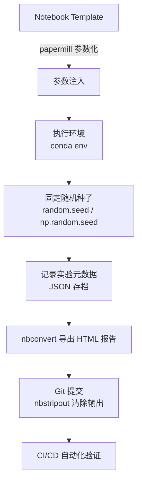

Jupyter 是 AI/Agent 工程师日常实验与模型评估的核心工具，但其交互式特性也埋藏着不少陷阱。本文系统梳理 Jupyter 的工程化用法，覆盖环境管理、版本控制、参数化执行到 CI/CD 集成，帮助你把 Notebook 从"个人草稿"升级为"可复现的工程产物"。

## Jupyter 是什么，工程价值与风险

Jupyter Notebook 本质上是一个将代码（Code）、富文本（Markdown）、输出（Output）混合存储的 JSON 文件（`.ipynb` 格式）。其交互式执行模型（Interactive Execution Model）让数据科学家可以逐 Cell 运行、实时观察结果，非常适合探索性数据分析（EDA, Exploratory Data Analysis）和模型实验。

**工程价值：**

- 快速迭代：修改一个 Cell 立即看到效果，无需重跑整个脚本
- 文档即代码：Markdown Cell 与代码并列，适合实验报告、模型评估报告
- 可视化友好：matplotlib、plotly 等图表直接内嵌输出
- Agent 实验场：LLM prompt 调试、工具链测试、few-shot 样本筛选

**工程风险：**

- 隐式状态（Hidden State）：Cell 执行顺序可以随意打乱，变量残留难以追踪
- 版本控制噪音：输出内容（图片 base64、执行计数）使 git diff 几乎不可读
- 难以测试：函数散落在各 Cell，单元测试（Unit Test）无法直接引用
- 依赖混乱：默认使用全局 Python 环境，多项目容易冲突

---

## 工具横向对比

不同 Jupyter 客户端（Client）各有适用场景，选错工具会显著降低效率。

| 特性 | Jupyter Notebook | JupyterLab | VS Code + Jupyter |
|------|-----------------|------------|-------------------|
| 界面复杂度 | 简单，单文件视图 | 中等，多面板 IDE 风格 | 高，完整 IDE |
| 代码补全 | 基础 IntelliSense | 基础 IntelliSense | LSP 级别，最强 |
| 调试（Debug） | 不支持断点 | 支持（JupyterLab 4+） | 原生断点调试 |
| 扩展生态 | nbextensions | JupyterLab 扩展 | VS Code 插件市场 |
| 协作（Collaboration） | 不支持 | 实时协作（v3.1+） | Live Share |
| Git 集成 | 无 | jupyterlab-git 插件 | 原生 Git 面板 |
| 适用场景 | 快速原型、教学 | 数据科学日常 | 工程化开发 |
| 远程内核支持 | 支持 | 支持 | 支持（SSH Remote） |

**推荐原则：** 纯探索实验用 JupyterLab，需要断点调试或与生产代码深度整合用 VS Code + Jupyter 扩展。

---

## Cell 执行顺序与隐式状态陷阱

这是 Jupyter 最危险的特性。Cell 执行计数（Execution Count，左侧方括号中的数字）记录了每个 Cell 的执行顺序，但用户完全可以跳过、重复执行任意 Cell。

### 典型陷阱示例

```python
# Cell 1 - 初始化数据
data = [1, 2, 3, 4, 5]
print("初始化完成")

# Cell 2 - 修改数据（假设你后来删除了这个 Cell，但变量还在内存中）
data = [10, 20, 30]  # 如果你只是折叠而未执行，data 仍是旧值

# Cell 3 - 依赖 Cell 2 的结果
total = sum(data)
print(f"总和: {total}")
# 如果 Cell 2 被跳过：输出 15
# 如果 Cell 2 已执行：输出 60
# 结果取决于执行历史，而非代码本身
```

```python
# 更隐蔽的陷阱：在 Cell 中定义函数后修改了函数体，但忘记重新执行 Cell
def process(x):
    return x * 2  # 你已经把这里改成 x * 3，但没有重新运行

result = process(5)
# result 仍然是 10（旧版本），不是 15
```

### 检测与防御策略

```python
# 在 Notebook 顶部添加检查：确保从头执行
import sys

# 检查执行环境是否干净（Kernel Restart 后第一次执行）
if 'data_loaded' not in dir():
    print("警告：请从头执行 Notebook（Kernel > Restart & Run All）")

# 标记关键状态
data_loaded = True
```

**最可靠的防御**：养成 `Kernel > Restart & Run All` 的习惯，提交前必须保证全量执行无报错。

---

## Magic 命令速查

Magic 命令（Magic Commands）是 IPython 提供的特殊指令，以 `%`（行魔法）或 `%%`（Cell 魔法）开头。

### 性能分析

```python
# %timeit：自动多次运行取平均，适合微基准测试（Microbenchmark）
%timeit sum(range(10000))
# 输出示例：187 µs ± 2.3 µs per loop (mean ± std. dev. of 7 runs, 1,000 loops each)

# %%time：测量整个 Cell 的挂钟时间（Wall Time）和 CPU 时间
%%time
import time
results = []
for i in range(1000):
    results.append(i ** 2)
# 输出: CPU times: user 312 µs, sys: 45 µs, total: 357 µs  Wall time: 362 µs
```

### 可视化

```python
# %matplotlib inline：在 Notebook 内嵌显示 matplotlib 图表（Inline Backend）
%matplotlib inline
import matplotlib.pyplot as plt
import numpy as np

x = np.linspace(0, 2 * np.pi, 100)
plt.plot(x, np.sin(x))
plt.title("正弦曲线（Sine Wave）")
plt.show()

# 推荐用 retina 提升 Mac 显示分辨率
%config InlineBackend.figure_format = 'retina'
```

### 自动重载（Auto Reload）

```python
# 开发阶段修改了外部模块后无需重启 Kernel
%load_ext autoreload
%autoreload 2  # 模式 2：每次执行前重新加载所有模块

# 现在可以编辑 utils.py，立即在 Notebook 中生效
from utils import preprocess_data
result = preprocess_data(raw_data)  # 自动使用最新版本的函数
```

### 执行外部脚本

```python
# %run：在 Notebook 的命名空间中执行外部 .py 文件
%run scripts/data_pipeline.py
# pipeline.py 中定义的变量和函数在当前 Notebook 中可用

# 带参数执行
%run scripts/train_model.py --lr 0.001 --epochs 50

# %run -i：在当前命名空间中执行（可访问 Notebook 中已有变量）
%run -i scripts/evaluate.py
```

---

## Notebook 组织规范

### 命名约定（Naming Convention）

混乱的文件名是团队协作的噩梦。推荐格式：

```
YYYYMMDD-作者缩写-描述（用连字符分隔）.ipynb

示例：
20240315-ch-gpt4-prompt-ablation-study.ipynb
20240318-ch-agent-tool-call-latency-benchmark.ipynb
20240320-ch-rag-retrieval-precision-eval.ipynb
```

### Cell 结构模板

每个 Notebook 应遵循固定结构，让他人可以快速定位：

```python
# === Cell 1: Markdown 头部 ===
# （Markdown Cell，非代码）
# # 实验标题
# **目标（Objective）**: 验证 GPT-4o 在客服场景下的 tool_call 准确率
# **日期**: 2024-03-15
# **作者**: Chen Hao
# **依赖**: 见 environment.yml

# === Cell 2: 导入（Imports）===
import os
import json
from pathlib import Path
import pandas as pd
import numpy as np
from dotenv import load_dotenv

load_dotenv()  # 加载 .env 文件中的环境变量

# === Cell 3: 常量与配置（Constants & Config）===
DATA_DIR = Path("../data")
MODEL_NAME = "gpt-4o"
MAX_TOKENS = 1024
TEMPERATURE = 0.0

# === Cell 4+: 按逻辑分节 ===
# 每节用 Markdown Cell 分隔，如：## 1. 数据加载  ## 2. 特征工程  ## 3. 模型评估
```

---

## 参数化执行：Papermill

Papermill 是 Netflix 开源的 Notebook 参数化执行工具（Parameterized Notebook Execution），可以将 Notebook 当作函数调用，是 CI/CD 中自动化实验的核心工具。

### 标记参数 Cell

在 JupyterLab 中，选中 Cell 后在右侧属性面板添加 tag `parameters`，或直接编辑 `.ipynb` JSON：

```python
# 这个 Cell 必须打上 "parameters" tag
# Papermill 会在此 Cell 之后插入覆盖参数

model_name = "gpt-3.5-turbo"   # 默认值
temperature = 0.7                # 默认值
dataset_path = "data/eval.jsonl" # 默认值
n_samples = 100                  # 默认值
```

### CLI 用法

```bash
# 基本用法：覆盖参数并输出新 Notebook
papermill \
  template_eval.ipynb \
  outputs/eval_gpt4o_20240315.ipynb \
  -p model_name "gpt-4o" \
  -p temperature 0.0 \
  -p n_samples 500

# 从 YAML 文件读取参数（适合参数较多的情况）
papermill template_eval.ipynb output.ipynb -f params/prod.yaml
```

### CI/CD 集成示例

```yaml
# .github/workflows/model-eval.yml
name: Nightly Model Evaluation

on:
  schedule:
    - cron: '0 2 * * *'  # 每天凌晨 2 点执行

jobs:
  evaluate:
    runs-on: ubuntu-latest
    steps:
      - uses: actions/checkout@v3

      - name: 设置 Python 环境
        uses: actions/setup-python@v4
        with:
          python-version: '3.11'

      - name: 安装依赖
        run: pip install papermill nbconvert jupyter pandas openai

      - name: 执行评估 Notebook
        env:
          OPENAI_API_KEY: ${{ secrets.OPENAI_API_KEY }}
        run: |
          papermill notebooks/model_eval_template.ipynb \
            outputs/eval_$(date +%Y%m%d).ipynb \
            -p model_name "gpt-4o" \
            -p n_samples 200

      - name: 导出 HTML 报告
        run: |
          jupyter nbconvert --to html \
            outputs/eval_$(date +%Y%m%d).ipynb \
            --output reports/eval_$(date +%Y%m%d).html

      - name: 上传报告为 Artifact
        uses: actions/upload-artifact@v3
        with:
          name: eval-report
          path: reports/
```

---

## 版本控制：nbstripout

`.ipynb` 文件本质是 JSON，包含每个 Cell 的输出（图片以 base64 编码存储）和执行计数。这导致每次运行都会产生大量 git diff 噪音，代码 review 几乎不可能。

### 为什么 .ipynb 对 Git 有害

```json
// 一个包含输出的 Cell 在 .ipynb 中的样子（片段）
{
  "cell_type": "code",
  "execution_count": 42,
  "outputs": [
    {
      "data": {
        "image/png": "iVBORw0KGgoAAAANSUhEUgAA...（数千字符的 base64）"
      }
    }
  ]
}
// 即使代码没有任何变化，重新执行后 execution_count 变为 43，产生无意义 diff
```

### 安装与配置

```bash
# 安装 nbstripout
pip install nbstripout

# 为当前仓库启用（在 .git/config 中注册 filter）
nbstripout --install

# 配置 .gitattributes，让 Git 知道对 .ipynb 应用 strip filter
nbstripout --install --attributes .gitattributes

# 查看 .gitattributes 中自动添加的内容
cat .gitattributes
# *.ipynb filter=nbstripout
# *.ipynb diff=ipynb
```

### 团队统一配置

```bash
# 推荐在 README 或 Makefile 中加入团队初始化命令
# Makefile
.PHONY: setup
setup:
	pip install -r requirements.txt
	nbstripout --install
	nbstripout --install --attributes .gitattributes
	@echo "nbstripout 已配置，.ipynb 输出不会被提交到 Git"
```

提交 `.gitattributes` 到仓库后，团队成员只需运行 `nbstripout --install` 即可，无需额外记忆规则。

---

## 导出：nbconvert

nbconvert 是 Jupyter 官方的 Notebook 转换工具（Conversion Tool），支持导出为多种格式。

```bash
# 导出为 HTML（最常用，适合分享报告）
jupyter nbconvert --to html analysis.ipynb
# 输出：analysis.html

# 导出为 Python 脚本（用于生产化）
jupyter nbconvert --to script model_pipeline.ipynb
# 输出：model_pipeline.py（Cell 之间用 # %% 分隔）

# 导出为 PDF（需要安装 LaTeX，适合正式文档）
jupyter nbconvert --to pdf report.ipynb

# --execute 标志：先执行再导出（CI 场景的关键）
# 确保导出的 HTML 包含最新输出，且 Notebook 本身无错误
jupyter nbconvert --to html --execute \
  --ExecutePreprocessor.timeout=600 \
  notebooks/weekly_report.ipynb \
  --output reports/weekly_report.html

# 批量导出
jupyter nbconvert --to html notebooks/*.ipynb --output-dir reports/
```

---

## 依赖管理：Conda 环境与 Kernel 注册

每个项目应有独立的 Python 环境（Isolated Environment），避免依赖冲突（Dependency Conflict）。

### 创建项目专属环境

```bash
# 创建 conda 环境
conda create -n agent-eval python=3.11 -y
conda activate agent-eval

# 安装项目依赖
pip install -r requirements.txt

# 将此环境注册为 Jupyter Kernel
# --name：kernel 的内部标识符
# --display-name：Jupyter 界面中显示的名称
pip install ipykernel
python -m ipykernel install --user \
  --name agent-eval \
  --display-name "Python (agent-eval)"
```

### 管理与清理 Kernel

```bash
# 列出所有已注册的 Kernel
jupyter kernelspec list

# 输出示例：
# Available kernels:
#   agent-eval    /Users/chenhao/Library/Jupyter/kernels/agent-eval
#   python3       /usr/local/share/jupyter/kernels/python3

# 删除不再使用的 Kernel
jupyter kernelspec uninstall agent-eval

# 导出 conda 环境（团队共享）
conda env export > environment.yml

# 从 environment.yml 还原环境
conda env create -f environment.yml
```

### environment.yml 示例

```yaml
# environment.yml
name: agent-eval
channels:
  - conda-forge
  - defaults
dependencies:
  - python=3.11
  - pip
  - pip:
    - openai>=1.0.0
    - langchain>=0.1.0
    - pandas>=2.0.0
    - matplotlib>=3.7.0
    - papermill>=2.4.0
    - nbstripout>=0.6.0
    - ipykernel>=6.0.0
    - python-dotenv>=1.0.0
```

---

## AI/Agent 工程中的 Jupyter 实践

对于 AI/Agent 工程师，Jupyter 不仅是数据分析工具，更是实验追踪（Experiment Tracking）和模型评估（Model Evaluation）的主战场。

### 实验追踪模式

```python
# 在 Notebook 中记录实验元数据（Experiment Metadata）
import json
from datetime import datetime
from pathlib import Path

# 定义实验配置（便于后续对比）
experiment_config = {
    "experiment_id": "exp_001",
    "timestamp": datetime.now().isoformat(),
    "model": "gpt-4o",
    "prompt_version": "v3",
    "dataset": "customer_service_500",
    "parameters": {
        "temperature": 0.0,
        "max_tokens": 512,
        "top_p": 1.0
    }
}

# 保存配置（每次实验自动存档）
output_dir = Path(f"experiments/{experiment_config['experiment_id']}")
output_dir.mkdir(parents=True, exist_ok=True)

with open(output_dir / "config.json", "w") as f:
    json.dump(experiment_config, f, indent=2, ensure_ascii=False)

print(f"实验配置已保存至：{output_dir / 'config.json'}")
```

### 模型评估 Notebook 模式

```python
# 标准化的评估结果记录与可视化
import pandas as pd
import matplotlib.pyplot as plt

# 模拟多轮实验结果
eval_results = pd.DataFrame({
    "model": ["gpt-3.5-turbo", "gpt-4o", "gpt-4o-mini"],
    "accuracy": [0.82, 0.94, 0.89],
    "latency_ms": [450, 1200, 600],
    "cost_per_1k": [0.002, 0.030, 0.005]
})

# 计算综合得分（Composite Score）
eval_results["score"] = (
    eval_results["accuracy"] * 0.6 -
    eval_results["latency_ms"].rank(pct=True) * 0.2 -
    eval_results["cost_per_1k"].rank(pct=True) * 0.2
)

print(eval_results.sort_values("score", ascending=False).to_string(index=False))

# 可视化对比
fig, axes = plt.subplots(1, 3, figsize=(12, 4))
metrics = [("accuracy", "准确率"), ("latency_ms", "延迟 (ms)"), ("cost_per_1k", "千次成本 ($)")]

for ax, (col, label) in zip(axes, metrics):
    ax.bar(eval_results["model"], eval_results[col])
    ax.set_title(label)
    ax.tick_params(axis='x', rotation=15)

plt.tight_layout()
plt.savefig(output_dir / "eval_comparison.png", dpi=150, bbox_inches='tight')
plt.show()
```

### 可复现实验的工作流



---

## 常见坑总结

以下是 AI/Agent 工程师在使用 Jupyter 时最常踩的坑，按严重程度排列。

**状态相关**

- **乱序执行（Out-of-order Execution）**：开发时随意执行 Cell，导致变量状态不一致，最终结果无法复现。提交前必须执行 `Kernel > Restart & Run All`。
- **删除 Cell 后变量残留**：删除了定义某变量的 Cell，但变量仍存在于内存中，后续 Cell 仍能访问，掩盖了真正的依赖关系。
- **`import *` 污染命名空间**：`from module import *` 会引入大量未知名称，与其他变量冲突时极难调试。

**环境相关**

- **忘记激活正确 Kernel**：Notebook 右上角显示的 Kernel 不是项目专属环境，导致 `import` 成功但用的是错误版本的库。
- **硬编码绝对路径**：`pd.read_csv("/Users/chenhao/data/file.csv")` 在他人机器或 CI 环境完全失效，应使用相对路径配合 `pathlib`。
- **在全局 base 环境安装包**：久而久之 base 环境依赖混乱，升级一个包可能破坏所有 Notebook。

**协作相关**

- **未安装 nbstripout 直接提交**：大量 base64 图片输出进入 git 历史，仓库体积暴增，code review 不可用。
- **Notebook 文件命名混乱**：`untitled.ipynb`、`test2_final_v3.ipynb` 等无意义名称让团队无法快速理解文件用途。
- **secrets 写入 Cell 输出**：API Key 打印在输出中，nbstripout 只清除输出，但如果有人在清除前提交了，secrets 就永久进入 git 历史。

---

## 最佳实践

**1. 提交前执行 Restart & Run All**
任何 Notebook 在推送到版本库或分享给他人前，都必须执行一次完整的 `Kernel > Restart & Run All`。这是保证可复现性（Reproducibility）的最低标准。

**2. 团队统一安装 nbstripout**
在项目 README、Makefile 或 onboarding 文档中明确要求所有成员安装 nbstripout，并将 `.gitattributes` 配置提交到仓库。这是零成本的团队规范。

**3. 用 Papermill 替代手动参数修改**
实验参数不应手动修改 Notebook 中的常量，而应使用 Papermill 参数化。这样每次实验有独立的输出文件，参数变更有完整记录，且天然支持批量实验。

**4. 每个项目一个 Conda 环境 + 注册专属 Kernel**
绝不在 base 环境做实验。用 `environment.yml` 锁定依赖，用 `ipykernel` 注册项目 Kernel，确保 Notebook 的执行环境与生产环境一致。

**5. 将核心逻辑抽取为 .py 模块**
Notebook 适合展示流程和结果，不适合存放业务逻辑。可复用的函数应抽取到 `.py` 文件，在 Notebook 中 `import` 使用，配合 `%autoreload 2` 开发体验也不会下降。

---

## 面试常见问题

**Q1：Jupyter Notebook 和 JupyterLab 的主要区别是什么？**

JupyterLab 是 Jupyter Notebook 的下一代界面，采用多面板布局，支持同时打开多个 Notebook、Terminal 和文件浏览器，类似轻量级 IDE。JupyterLab 4.x 以上版本还支持调试器（Debugger）和实时协作。Jupyter Notebook 界面更简洁，适合教学和快速原型；工程团队通常选择 JupyterLab 或 VS Code + Jupyter 扩展。

**Q2：如何解决 Notebook 中的隐式状态问题，保证实验可复现？**

核心措施有三：一，养成 `Restart & Run All` 习惯，确保 Cell 按顺序全量执行无报错；二，避免在 Cell 之间存在隐式执行顺序依赖，关键初始化逻辑放在文件顶部；三，使用 Papermill 参数化执行，每次实验输出独立的 `.ipynb` 文件，参数与结果完全绑定，便于回溯对比。

**Q3：为什么 .ipynb 文件不适合直接用 Git 管理，如何解决？**

`.ipynb` 是 JSON 格式，包含代码、输出（图片 base64 编码）和执行计数。每次执行都会修改 execution_count 和 outputs，即使代码不变也会产生 diff 噪音，code review 几乎不可能。解决方案是使用 nbstripout，它通过 Git clean filter 在 `git add` 阶段自动清除输出，工作目录文件不受影响，但提交到版本库的文件是干净的纯代码版本。

**Q4：在 AI Agent 工程中，如何用 Jupyter 管理大量对比实验？**

推荐的工作流：用一个 Notebook 作为模板（Template），用 `parameters` tag 标记可变参数（模型名、提示词版本、数据集路径等）；用 Papermill CLI 或 Python API 批量执行，每个实验生成独立的输出 Notebook；用 nbconvert 将结果转为 HTML 便于分享；将实验参数和指标存入 JSON 或 CSV 便于程序化对比。如果规模更大，可以引入 MLflow 或 Weights & Biases 等专业实验追踪平台（Experiment Tracking Platform）与 Notebook 配合使用。
