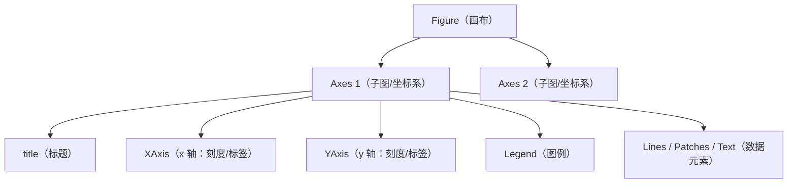

Matplotlib 是 Python 数据可视化的底层引擎，几乎涵盖所有图表需求；Seaborn 建立在 Matplotlib 之上，专为统计图表设计，用更少的代码产出更美观的结果。对于 AI/Agent 工程师而言，这两个库是训练监控、模型评估和数据管道调试不可缺少的工具。

## Matplotlib vs Seaborn：定位对比

| 维度 | Matplotlib | Seaborn |
|------|-----------|---------|
| 定位 | 底层绘图引擎，灵活但冗长 | 统计可视化高层封装 |
| 代码量 | 较多，需手动设置细节 | 少，默认参数即可出图 |
| 图表类型 | 通用（折线、柱状、散点等） | 统计专用（分布、关系、分类） |
| 自定义程度 | 极高，像素级控制 | 高（底层仍是 Matplotlib） |
| 学习曲线 | 陡峭，API 碎片化 | 平缓，语义化参数 |
| 适用场景 | 精确控制每个元素、复杂布局 | 快速探索性数据分析（EDA） |

**选型原则**：探索数据用 Seaborn；制作报告或产品中的精细图表用 Matplotlib 做细节调整；两者可以混用——先用 Seaborn 快速出图，再通过返回的 Axes 对象用 Matplotlib 方法调整细节。

## Matplotlib 核心概念

### Figure 与 Axes 的层级结构

Matplotlib 的对象层级是理解所有 API 的基础：



- **Figure**：整张画布，管理 DPI、尺寸和所有子图
- **Axes**：单个坐标系，是绘图的核心单元，包含坐标轴、数据和装饰元素
- **Artist**：所有可见对象的基类，包括 Line2D、Rectangle（Patch）、Text 等

### pyplot API vs 面向对象（OO）API

Matplotlib 提供两种使用范式，选择错误会导致多图场景下难以追踪的 bug。

**pyplot API（隐式状态机）**：内部维护"当前 Figure/Axes"全局状态，适合一次性脚本和 Jupyter 交互探索。

```python
import matplotlib.pyplot as plt

# plt.plot() 操作的是隐式的"当前 Axes"
plt.plot([1, 2, 3], [4, 5, 6])
plt.title("Quick Plot")
plt.xlabel("x")
plt.ylabel("y")
plt.show()
```

**OO API（显式 Axes 对象）**：显式持有 Figure 和 Axes 引用，推荐用于所有生产代码、函数封装和多图布局。

```python
import matplotlib.pyplot as plt

# 明确创建 Figure 和 Axes，不依赖全局状态
fig, ax = plt.subplots()
ax.plot([1, 2, 3], [4, 5, 6])
ax.set_title("OO Plot")
ax.set_xlabel("x")
ax.set_ylabel("y")
plt.show()
```

**关键区别**：`plt.plot()` 在当前激活的 Axes 上绘图；在循环、函数或多子图场景中，"当前 Axes"可能不是你期望的那个。OO API 通过显式引用完全消除这种歧义。

## 常用图表类型

### Line chart（折线图）

```python
import matplotlib.pyplot as plt
import numpy as np

x = np.linspace(0, 2 * np.pi, 100)

fig, ax = plt.subplots(figsize=(8, 4))

# label 用于图例；linestyle 支持 "-"、"--"、"-."、":"
ax.plot(x, np.sin(x), label="sin(x)", linewidth=2, color="steelblue")
ax.plot(x, np.cos(x), label="cos(x)", linestyle="--", color="coral")

ax.legend(loc="upper right")
ax.set_title("Trigonometric Functions")
ax.set_xlabel("x (radians)")
ax.set_ylabel("Amplitude")

plt.tight_layout()
plt.savefig("line_chart.png", dpi=150, bbox_inches="tight")
plt.show()
```

### Bar chart（柱状图）

```python
categories = ["Model A", "Model B", "Model C", "Model D"]
f1_scores = [0.82, 0.91, 0.76, 0.88]

fig, ax = plt.subplots(figsize=(7, 4))
bars = ax.bar(categories, f1_scores, color="steelblue", edgecolor="white", width=0.6)

# 在柱顶自动标注数值
for bar, val in zip(bars, f1_scores):
    ax.text(
        bar.get_x() + bar.get_width() / 2,  # x 坐标：柱中心
        bar.get_height() + 0.01,             # y 坐标：柱顶上方
        f"{val:.2f}",
        ha="center", va="bottom", fontsize=10
    )

ax.set_ylim(0, 1.05)
ax.set_ylabel("F1 Score")
ax.set_title("Model Comparison")
```

### Scatter plot（散点图）

```python
import numpy as np

rng = np.random.default_rng(42)
# 模拟：预测分数 vs 真实分数，颜色表示样本权重
pred = rng.normal(0.7, 0.15, 300).clip(0, 1)
true = pred * 0.9 + rng.normal(0, 0.1, 300)
weight = rng.uniform(0.1, 1.0, 300)

fig, ax = plt.subplots(figsize=(6, 6))
sc = ax.scatter(true, pred, c=weight, cmap="viridis", alpha=0.7, s=30)

# 添加 colorbar（颜色条）
fig.colorbar(sc, ax=ax, label="Sample Weight")

# 添加 y=x 对角线表示理想预测
diag = np.linspace(0, 1, 50)
ax.plot(diag, diag, "r--", alpha=0.5, label="Perfect Prediction")
ax.legend()
ax.set_xlabel("True Score")
ax.set_ylabel("Predicted Score")
ax.set_title("Prediction vs Ground Truth")
```

### Histogram（直方图）

```python
data = np.random.default_rng(0).normal(loc=5, scale=2, size=1000)

fig, ax = plt.subplots(figsize=(7, 4))
ax.hist(data, bins=30, edgecolor="white", color="coral", alpha=0.85)

# 添加均值线辅助判断分布中心
mean_val = data.mean()
ax.axvline(mean_val, color="navy", linestyle="--", linewidth=1.5,
           label=f"Mean = {mean_val:.2f}")
ax.legend()
ax.set_xlabel("Value")
ax.set_ylabel("Frequency")
ax.set_title("Data Distribution")
```

## Subplots：多图布局

`plt.subplots(nrows, ncols)` 返回 Figure 和二维 Axes 数组，是多图布局的标准方式。

```python
import matplotlib.pyplot as plt
import numpy as np

fig, axes = plt.subplots(nrows=2, ncols=2, figsize=(10, 8),
                         constrained_layout=True)

# 训练损失曲线
epochs = np.arange(1, 51)
train_loss = np.exp(-epochs / 15) + np.random.default_rng(0).normal(0, 0.01, 50)
val_loss   = np.exp(-epochs / 12) + 0.05 + np.random.default_rng(1).normal(0, 0.02, 50)

axes[0, 0].plot(epochs, train_loss, label="Train Loss")
axes[0, 0].plot(epochs, val_loss,   label="Val Loss", linestyle="--")
axes[0, 0].legend()
axes[0, 0].set_title("Training Curve")

# 类别准确率柱状图
classes = ["Cat", "Dog", "Bird", "Fish"]
acc = [0.91, 0.85, 0.78, 0.93]
axes[0, 1].bar(classes, acc, color="teal")
axes[0, 1].set_ylim(0, 1)
axes[0, 1].set_title("Per-Class Accuracy")

# 特征重要性散点图
feat_idx = np.arange(20)
importance = np.random.default_rng(2).exponential(0.5, 20)
axes[1, 0].scatter(feat_idx, importance, c=importance, cmap="plasma")
axes[1, 0].set_title("Feature Importance")

# 误差分布直方图
errors = np.random.default_rng(3).normal(0, 0.3, 500)
axes[1, 1].hist(errors, bins=30, color="salmon", edgecolor="white")
axes[1, 1].axvline(0, color="black", linestyle="--")
axes[1, 1].set_title("Error Distribution")

plt.savefig("dashboard.png", dpi=150, bbox_inches="tight")
plt.show()
```

`constrained_layout=True` 在 Figure 创建时启用，比事后调用 `tight_layout()` 对 colorbar 和 legend 的处理更鲁棒（见面试要点）。

## Seaborn：统计可视化

Seaborn 的核心价值在于将统计操作（分组、聚合、置信区间）内置到绘图函数中，同时提供更美观的默认样式。

### 初始化主题

```python
import seaborn as sns
import matplotlib.pyplot as plt

# style 控制背景网格；palette 控制默认配色
sns.set_theme(style="whitegrid", palette="muted", font_scale=1.1)
```

常用 `style`：`darkgrid`（深色网格）、`whitegrid`（白色网格）、`white`（无网格）、`ticks`（刻度线）

### sns.heatmap（相关性热力图）

```python
import seaborn as sns
import pandas as pd
import numpy as np

# 模拟特征数据，计算 Pearson 相关系数矩阵
df = pd.DataFrame(
    np.random.randn(200, 6),
    columns=["feature_A", "feature_B", "feature_C", "loss", "acc", "f1"]
)
corr = df.corr()

fig, ax = plt.subplots(figsize=(7, 6))
sns.heatmap(
    corr,
    annot=True,      # 在每格内显示数值
    fmt=".2f",       # 数值保留两位小数
    cmap="coolwarm", # 发散色板：正相关红色，负相关蓝色
    vmin=-1, vmax=1, # 固定色标范围，避免视觉误判
    square=True,     # 保持每格正方形
    linewidths=0.5,
    ax=ax
)
ax.set_title("Feature Correlation Heatmap")
plt.tight_layout()
```

`vmin`/`vmax` 非常关键：若不固定范围，相关系数只有 0.3–0.6 时色板会被拉伸，视觉上夸大了相关性。

### sns.boxplot（箱线图）

```python
tips = sns.load_dataset("tips")  # Seaborn 内置示例数据集

fig, ax = plt.subplots(figsize=(8, 5))
sns.boxplot(
    data=tips,
    x="day",         # x 轴分组变量
    y="total_bill",  # y 轴数值变量
    hue="sex",       # 进一步按性别分组并自动着色
    palette="Set2",
    ax=ax
)
ax.set_title("Total Bill by Day and Gender")
ax.set_xlabel("Day of Week")
ax.set_ylabel("Total Bill ($)")
```

`hue` 参数自动按子分组着色并添加图例，无需手动循环，是 Seaborn 相比原生 Matplotlib 最省力的特性之一。

### sns.pairplot（成对关系图）

```python
iris = sns.load_dataset("iris")

# 对角线用 KDE 替代直方图，对角外用散点图，按 species 着色
g = sns.pairplot(iris, hue="species", diag_kind="kde", plot_kws={"alpha": 0.5})
g.fig.suptitle("Iris Feature Pairplot", y=1.02)

# pairplot 返回 PairGrid 对象，通过 g.fig 访问底层 Figure
plt.savefig("pairplot.png", dpi=120, bbox_inches="tight")
plt.show()
```

`pairplot` 适合在数据管道调试时快速判断特征间是否存在线性关系或明显聚类结构。

## 色板：定性 / 顺序 / 发散

颜色选择直接影响图表传达信息的准确性。

| 类型 | 用途 | 推荐色板 |
|------|------|----------|
| 定性（Qualitative） | 无序分类，区分不同类别 | `Set1`、`Set2`、`tab10` |
| 顺序（Sequential） | 数值从低到高单调变化 | `Blues`、`viridis`、`YlOrRd` |
| 发散（Diverging） | 有正负中心（如相关系数） | `coolwarm`、`RdBu`、`PiYG` |

```python
import seaborn as sns

# 查看/预览色板（在 Jupyter 中显示色块）
sns.color_palette("Set2")       # 定性：分类数据，每种颜色等权重
sns.color_palette("Blues")      # 顺序：数值渐变，低=浅，高=深
sns.color_palette("coolwarm")   # 发散：负值蓝色，正值红色，0为白色

# 在 Matplotlib 中使用 Seaborn 色板
colors = sns.color_palette("tab10", n_colors=5)
```

常见错误：用彩虹色（`jet`、`rainbow`）展示连续数值——彩虹色板在灰度打印和色盲用户场景下会严重失真，应优先使用感知均匀色板如 `viridis`、`plasma`。

## 图表尺寸、字体与中文字体处理

```python
import matplotlib.pyplot as plt

# --- 全局 rcParams 配置（应在绘图前设置）---
plt.rcParams.update({
    "figure.figsize":    (9, 5),   # 默认图表尺寸（英寸）
    "figure.dpi":        100,      # 屏幕显示分辨率
    "font.size":         11,       # 全局基础字体大小
    "axes.titlesize":    13,       # 坐标轴标题字体大小
    "axes.labelsize":    11,       # 坐标轴标签字体大小
    "xtick.labelsize":   9,
    "ytick.labelsize":   9,
    "legend.fontsize":   9,
})

# --- 中文字体处理 ---
# macOS：使用系统内置的 PingFang SC 或 Arial Unicode MS
plt.rcParams["font.sans-serif"] = ["PingFang SC", "Arial Unicode MS", "SimHei"]
# Windows：使用 SimHei（黑体）或 Microsoft YaHei（微软雅黑）
# plt.rcParams["font.sans-serif"] = ["Microsoft YaHei", "SimHei"]

# 必须设置：防止负号"-"渲染为方块
plt.rcParams["axes.unicode_minus"] = False

# 验证当前字体配置是否生效
fig, ax = plt.subplots(figsize=(5, 3))
ax.set_title("模型训练损失曲线")
ax.set_xlabel("训练轮次（Epoch）")
ax.set_ylabel("损失值（Loss）")
ax.plot([0.8, 0.5, 0.3, 0.2, 0.15])
plt.tight_layout()
plt.show()
```

在 Docker 容器或 CI 环境中，中文字体往往缺失，推荐在 `requirements.txt` 或 Dockerfile 中安装 `fonts-noto-cjk`（Linux），或使用 `matplotlib-fontja` 等工具包。

## 保存图表

```python
import matplotlib.pyplot as plt

fig, ax = plt.subplots(figsize=(8, 5))
ax.plot([1, 2, 3, 4], [10, 8, 6, 4], marker="o")
ax.set_title("Export Demo")

# ⚠️ 必须在 plt.show() 之前调用 savefig
# plt.show() 会清空当前 Figure，之后 savefig 只会保存空白图

# PNG：位图，适合网页展示，dpi 越高越清晰
plt.savefig("output.png", dpi=150, bbox_inches="tight")

# SVG：矢量格式，适合网页内嵌，无限放大不失真
plt.savefig("output.svg", format="svg", bbox_inches="tight")

# PDF：矢量格式，适合论文和印刷
plt.savefig("output.pdf", format="pdf", bbox_inches="tight")

plt.show()
```

`bbox_inches="tight"` 防止坐标轴标签或图例被裁剪；`dpi=150` 适合网页报告，`dpi=300` 适合印刷。

## AI/Agent 工程师的典型应用场景

AI/Agent 工程师使用数据可视化主要集中在以下四类场景：

**1. 训练指标监控（Training Metrics）**

```python
import matplotlib.pyplot as plt
import numpy as np

epochs = np.arange(1, 101)
train_loss = 2.0 * np.exp(-epochs / 30) + np.random.default_rng(0).normal(0, 0.03, 100)
val_loss   = 2.2 * np.exp(-epochs / 25) + 0.15 + np.random.default_rng(1).normal(0, 0.05, 100)

fig, axes = plt.subplots(1, 2, figsize=(12, 4), constrained_layout=True)

axes[0].plot(epochs, train_loss, label="Train Loss", color="steelblue")
axes[0].plot(epochs, val_loss, label="Val Loss", linestyle="--", color="coral")
axes[0].legend()
axes[0].set_title("Loss Curve")
axes[0].set_xlabel("Epoch")

# 计算过拟合开始的点（val_loss 最低点）
best_epoch = val_loss.argmin() + 1
axes[0].axvline(best_epoch, color="gray", linestyle=":", alpha=0.7, label=f"Best Epoch={best_epoch}")
axes[0].legend()

# 学习率调度可视化
lr_schedule = 0.01 * np.exp(-epochs / 40)
axes[1].semilogy(epochs, lr_schedule, color="green")  # 对数 y 轴
axes[1].set_title("Learning Rate Schedule")
axes[1].set_xlabel("Epoch")
axes[1].set_ylabel("Learning Rate (log scale)")
```

**2. 模型性能比较（Model Performance）**

```python
import seaborn as sns
import pandas as pd

# 多模型跨数据集性能对比
results = pd.DataFrame({
    "Model":   ["GPT-4o", "Claude 3.5", "Gemini Pro"] * 3,
    "Dataset": ["Math"] * 3 + ["Code"] * 3 + ["Reasoning"] * 3,
    "Score":   [0.92, 0.89, 0.85, 0.88, 0.91, 0.82, 0.78, 0.84, 0.80]
})

fig, ax = plt.subplots(figsize=(9, 5))
sns.barplot(data=results, x="Dataset", y="Score", hue="Model", palette="Set2", ax=ax)
ax.set_ylim(0.7, 1.0)
ax.set_title("LLM Benchmark Comparison")
ax.legend(title="Model")
```

**3. 数据分布分析（Pipeline Debugging）**

```python
import seaborn as sns
import numpy as np

# 检查 embedding 维度分布，发现数值异常或分布偏移
embeddings = np.random.default_rng(0).normal(0, 1, (500, 5))
col_names = [f"dim_{i}" for i in range(5)]

import pandas as pd
emb_df = pd.DataFrame(embeddings, columns=col_names)

fig, ax = plt.subplots(figsize=(8, 4))
sns.boxplot(data=emb_df, ax=ax, palette="pastel")
ax.axhline(0, color="gray", linestyle="--", alpha=0.5)
ax.set_title("Embedding Dimension Distribution (Outlier Check)")
ax.set_xlabel("Dimension")
ax.set_ylabel("Value")
```

**4. 混淆矩阵（Confusion Matrix）**

```python
import seaborn as sns
import numpy as np

# 分类模型评估
cm = np.array([[85, 5, 2], [8, 90, 3], [3, 4, 88]])
labels = ["Cat", "Dog", "Bird"]

fig, ax = plt.subplots(figsize=(5, 4))
sns.heatmap(cm, annot=True, fmt="d", cmap="Blues",
            xticklabels=labels, yticklabels=labels, ax=ax)
ax.set_xlabel("Predicted")
ax.set_ylabel("Actual")
ax.set_title("Confusion Matrix")
```

## 常见误区

**误区 1：在循环中复用 Figure 导致图叠加**

在 Jupyter 中多次执行绘图单元格，或在 `for` 循环中反复调用 `plt.plot()`，会将所有数据叠加到同一 Figure 上。解决方式是每次用 `fig, ax = plt.subplots()` 显式创建新 Figure，或在循环开始前调用 `plt.close("all")` 清理所有已有 Figure。

```python
# 错误：三条线叠加在一张图上
for i in range(3):
    plt.plot(range(5), [x + i for x in range(5)])
plt.show()

# 正确：每次迭代独立图表
for i in range(3):
    fig, ax = plt.subplots()
    ax.plot(range(5), [x + i for x in range(5)])
    ax.set_title(f"Run {i}")
    plt.show()
    plt.close(fig)  # 释放内存
```

**误区 2：savefig 在 show 之后调用**

`plt.show()` 会把当前 Figure 渲染并清空；之后再调用 `plt.savefig()` 只会保存空白图。永远遵守：先 `savefig`，再 `show`。

**误区 3：使用感知不均匀的彩虹色板**

`jet`、`rainbow` 等色板在不同亮度区域感知变化率不一致，会造成视觉上的虚假对比。展示连续数值时应使用感知均匀色板（perceptually uniform），如 `viridis`、`plasma`、`cividis`；展示正负相关时使用发散色板 `coolwarm` 或 `RdBu`。

**误区 4：中文字体未配置导致乱码**

Matplotlib 默认不包含中文字体，中文字符会渲染为方块（tofu）。必须在代码开头设置 `font.sans-serif` 为系统已安装的中文字体，并设置 `axes.unicode_minus = False`（否则负号也会变成方块）。在无 GUI 的服务器环境中，还需确认字体文件实际存在。

**误区 5：混用 pyplot API 和 OO API 导致操作了错误的 Axes**

```python
fig, (ax1, ax2) = plt.subplots(1, 2)
ax1.plot([1, 2, 3])
plt.title("Ambiguous!")  # ⚠️ 这里操作的是 ax2（最后激活的 Axes），不是 ax1

# 正确：始终通过显式 Axes 对象操作
ax1.set_title("Clear!")
```

## 最佳实践

**1. 生产代码始终使用 OO API**

函数、类或模块中的绘图代码应接受 `ax` 参数或返回 `fig`，而不是依赖 `plt.*` 全局状态。这使函数可测试、可复用，也方便将图表嵌入到更大的多图布局中。

**2. 创建 Figure 时启用 constrained_layout**

```python
fig, axes = plt.subplots(2, 2, figsize=(10, 8), constrained_layout=True)
```

相比事后调用 `tight_layout()`，`constrained_layout` 对带 colorbar 和超长图例的布局处理更鲁棒，且不会产生偶发的 `UserWarning`。

**3. 统一管理全局样式配置**

在项目入口或 Notebook 开头用 `plt.rcParams.update({...})` 或 `sns.set_theme()` 统一设置字体、尺寸和样式，而不是在每个绘图函数中重复设置。这使得图表风格一致，修改时只需改一处。

**4. 封装复用的绘图逻辑**

```python
def plot_training_curve(train_loss, val_loss, ax=None, title="Training Curve"):
    """可复用的训练曲线绘制函数。"""
    if ax is None:
        fig, ax = plt.subplots(figsize=(8, 4))
    ax.plot(train_loss, label="Train Loss")
    ax.plot(val_loss, linestyle="--", label="Val Loss")
    ax.legend()
    ax.set_title(title)
    ax.set_xlabel("Epoch")
    ax.set_ylabel("Loss")
    return ax
```

接受可选 `ax` 参数的设计模式，使函数既能独立使用，也能嵌入到更大的 subplot 布局中。

**5. 大量图表时主动管理内存**

在循环中生成大量图表时，不关闭 Figure 会导致内存持续增长（每个 Figure 都会留在内存中直到 GC）。使用 `plt.close(fig)` 或 `plt.close("all")` 主动释放。

```python
for batch in data_batches:
    fig, ax = plt.subplots()
    ax.plot(batch)
    plt.savefig(f"batch_{batch.id}.png", bbox_inches="tight")
    plt.close(fig)  # 立即释放内存
```

## 面试要点

**Q：Matplotlib 的 pyplot API 和 OO API 分别适合什么场景？**

pyplot API 维护一个隐式的"当前 Figure/Axes"全局状态，调用 `plt.plot()` 等函数时操作的是这个隐式对象。适合 Jupyter Notebook 中的交互式探索和一次性脚本。OO API 显式持有 Figure 和 Axes 引用，适合函数封装、多图复杂布局和测试场景。生产代码应始终使用 OO API——在多子图或函数调用链中，"当前 Axes"很可能不是你期望的那个，全局状态会引入难以追踪的 bug。

**Q：`tight_layout()` 和 `constrained_layout` 有什么区别？**

`plt.tight_layout()` 或 `fig.tight_layout()` 是事后调整算法，在图表创建完成后重新计算子图间距，以防止标题和标签重叠。兼容性好，但有时与 `colorbar`、`suptitle` 发生冲突，且偶尔产生 `UserWarning`。`constrained_layout=True` 在 `plt.subplots()` 创建 Figure 时启用，使用约束求解器在整个渲染过程中动态调整布局，对 colorbar 和图例的处理更鲁棒。推荐新代码使用 `constrained_layout`；维护旧代码时，`tight_layout()` 仍然可用。

**Q：如何在同一张图上叠加 Seaborn 和 Matplotlib 的内容？**

Seaborn 的大多数函数接受 `ax` 参数，将图绘制到指定的 Matplotlib Axes 上，因此两者可以无缝组合：

```python
fig, ax = plt.subplots(figsize=(8, 5))

# 先用 Seaborn 绘制分组箱线图
tips = sns.load_dataset("tips")
sns.boxplot(data=tips, x="day", y="total_bill", ax=ax, palette="pastel")

# 再用 Matplotlib 叠加全局均值线
overall_mean = tips["total_bill"].mean()
ax.axhline(overall_mean, color="red", linestyle="--", linewidth=1.5,
           label=f"Overall Mean: ${overall_mean:.2f}")
ax.legend()
```

**Q：在 AI 工程的哪些场景下最需要可视化？**

三个高频场景：一是训练监控——绘制 loss/accuracy 曲线，及早发现过拟合（val_loss 上升而 train_loss 继续下降）或梯度消失（loss 停止下降）；二是模型比较——用分组柱状图或热力图对比多个模型在多个数据集上的指标，避免用表格难以看出差异；三是数据管道调试——在特征工程和 embedding 提取后，用 pairplot 检查特征间相关性，用箱线图检查异常值，用直方图检查数值分布是否符合预期（正态 vs 偏态），可以快速定位数据质量问题。
