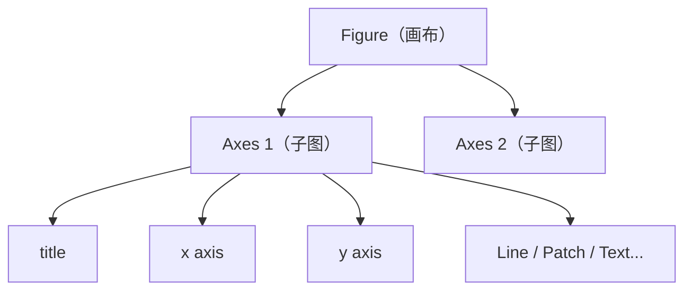

Matplotlib 是 Python 数据可视化的基础库，几乎所有图表需求都能用它完成；Seaborn 建立在 Matplotlib 之上，专为统计图表设计，用更少的代码生成更美观的结果。理解两者的定位和协作方式，是数据分析工作流的必备技能。

## Matplotlib vs Seaborn：定位对比

| 维度 | Matplotlib | Seaborn |
|------|-----------|---------|
| 定位 | 底层绘图引擎，灵活但冗长 | 统计可视化高层封装 |
| 代码量 | 较多，需要手动设置细节 | 少，默认参数即可出图 |
| 图表类型 | 通用（折线、柱状、散点…） | 统计专用（分布、关系、分类） |
| 自定义程度 | 极高 | 高（最终仍调用 Matplotlib） |
| 适用场景 | 精确控制每个元素 | 快速探索性数据分析（EDA） |

**选型原则**：探索数据时优先用 Seaborn；制作用于报告或产品的精细图表时，用 Matplotlib 做精确调整；两者可以混用——先用 Seaborn 出图，再用 Matplotlib 的 Axes API 调整细节。

## Matplotlib 核心概念

### Figure 与 Axes

Matplotlib 的两层结构是理解一切的基础：

- **Figure**：整张画布，一个 Figure 可以包含多个 Axes
- **Axes**：单个坐标系（一个子图），包含 x 轴、y 轴、标题、数据等



### pyplot API vs 面向对象（OO）API

Matplotlib 提供两种使用方式：

**pyplot API（隐式状态机）**：适合快速脚本，不推荐在函数或模块中使用。

```python
import matplotlib.pyplot as plt

plt.plot([1, 2, 3], [4, 5, 6])
plt.title("Quick Plot")
plt.xlabel("x")
plt.ylabel("y")
plt.show()
```

**OO API（显式 Axes）**：推荐用于生产代码，避免全局状态污染。

```python
import matplotlib.pyplot as plt

fig, ax = plt.subplots()
ax.plot([1, 2, 3], [4, 5, 6])
ax.set_title("OO Plot")
ax.set_xlabel("x")
ax.set_ylabel("y")
plt.show()
```

**面试要点**：`plt.plot()` 实际上是在当前激活的 Axes 上绘图。多图或在函数中绘图时，一定要用 OO API，否则当前 Axes 可能不是你期望的那个。

## 常用图表类型

### Line chart（折线图）

```python
import matplotlib.pyplot as plt
import numpy as np

x = np.linspace(0, 2 * np.pi, 100)
fig, ax = plt.subplots(figsize=(8, 4))
ax.plot(x, np.sin(x), label="sin(x)", linewidth=2)
ax.plot(x, np.cos(x), label="cos(x)", linestyle="--")
ax.legend()
ax.set_title("Trigonometric Functions")
plt.tight_layout()
plt.savefig("line_chart.png", dpi=150)
```

### Bar chart（柱状图）

```python
categories = ["A", "B", "C", "D"]
values = [23, 45, 12, 67]

fig, ax = plt.subplots()
bars = ax.bar(categories, values, color="steelblue", edgecolor="white")

# 在柱顶标注数值
for bar, val in zip(bars, values):
    ax.text(bar.get_x() + bar.get_width() / 2, bar.get_height() + 1,
            str(val), ha="center", va="bottom")

ax.set_ylabel("Count")
ax.set_title("Category Distribution")
```

### Scatter plot（散点图）

```python
import numpy as np

rng = np.random.default_rng(42)
x = rng.normal(0, 1, 200)
y = x * 0.8 + rng.normal(0, 0.5, 200)
color = rng.uniform(0, 1, 200)

fig, ax = plt.subplots()
sc = ax.scatter(x, y, c=color, cmap="viridis", alpha=0.7, s=40)
fig.colorbar(sc, ax=ax, label="intensity")
ax.set_title("Scatter Plot with Color Mapping")
```

### Histogram（直方图）

```python
data = np.random.default_rng(0).normal(loc=5, scale=2, size=1000)

fig, ax = plt.subplots()
ax.hist(data, bins=30, edgecolor="white", color="coral")
ax.axvline(data.mean(), color="navy", linestyle="--", label=f"mean={data.mean():.2f}")
ax.legend()
ax.set_title("Distribution of Data")
```

## Subplots：多图布局

```python
fig, axes = plt.subplots(nrows=2, ncols=2, figsize=(10, 8))

axes[0, 0].plot([1, 2, 3])
axes[0, 0].set_title("Line")

axes[0, 1].bar(["A", "B", "C"], [3, 7, 2])
axes[0, 1].set_title("Bar")

axes[1, 0].scatter([1, 2, 3], [4, 2, 5])
axes[1, 0].set_title("Scatter")

axes[1, 1].hist(np.random.randn(200), bins=20)
axes[1, 1].set_title("Histogram")

plt.tight_layout()  # 自动调整子图间距，防止标签重叠
plt.savefig("subplots.png", dpi=150)
```

`plt.tight_layout()` 或 `fig.tight_layout()` 会自动调整子图间距，防止 x 轴标签和上方子图重叠，几乎每次多图都应调用。

## Seaborn：统计可视化

Seaborn 的核心价值是把统计操作（分组、聚合、置信区间）内置到绘图函数中，同时提供更美观的默认样式。

### 初始化与主题

```python
import seaborn as sns
import matplotlib.pyplot as plt

sns.set_theme(style="whitegrid", palette="muted")  # 全局设置主题
```

常用 `style`：`darkgrid`、`whitegrid`、`dark`、`white`、`ticks`

### sns.heatmap（热力图）

```python
import seaborn as sns
import pandas as pd
import numpy as np

# 计算相关系数矩阵
df = pd.DataFrame(np.random.randn(100, 5), columns=list("ABCDE"))
corr = df.corr()

fig, ax = plt.subplots(figsize=(7, 5))
sns.heatmap(corr, annot=True, fmt=".2f", cmap="coolwarm",
            vmin=-1, vmax=1, ax=ax)
ax.set_title("Correlation Heatmap")
plt.tight_layout()
```

`annot=True` 在每格中显示数值，`fmt=".2f"` 控制格式，`vmin`/`vmax` 固定色标范围。

### sns.boxplot（箱线图）

```python
tips = sns.load_dataset("tips")  # Seaborn 内置示例数据集

fig, ax = plt.subplots(figsize=(8, 5))
sns.boxplot(data=tips, x="day", y="total_bill", hue="sex", ax=ax)
ax.set_title("Total Bill by Day and Gender")
```

`hue` 参数自动按分组着色并添加图例，无需手动循环。

### sns.pairplot（成对关系图）

```python
iris = sns.load_dataset("iris")
g = sns.pairplot(iris, hue="species", diag_kind="kde")
g.fig.suptitle("Iris Pairplot", y=1.02)
plt.savefig("pairplot.png", dpi=120, bbox_inches="tight")
```

`pairplot` 返回的是 `PairGrid` 对象，不是普通的 Figure/Axes，调整标题需要用 `g.fig.suptitle()`。

## 样式与输出

### 颜色 Palette

```python
# 列出可用调色板
sns.color_palette("Set2")       # 定性：分类数据
sns.color_palette("Blues")      # 顺序：数值渐变
sns.color_palette("coolwarm")   # 发散：有正负中心
```

### 图表尺寸与字体

```python
# 在创建 Figure 时指定尺寸（单位：英寸）
fig, ax = plt.subplots(figsize=(12, 6))

# 全局字体大小
plt.rcParams["font.size"] = 12
plt.rcParams["axes.titlesize"] = 14

# 如果需要显示中文
plt.rcParams["font.sans-serif"] = ["Arial Unicode MS"]  # macOS
plt.rcParams["axes.unicode_minus"] = False
```

### 保存图表

```python
# bbox_inches="tight" 防止标签被裁剪
plt.savefig("output.png", dpi=150, bbox_inches="tight")

# 保存为矢量格式（适合印刷/论文）
plt.savefig("output.svg", format="svg", bbox_inches="tight")
plt.savefig("output.pdf", format="pdf", bbox_inches="tight")
```

**常见陷阱**：`plt.savefig()` 必须在 `plt.show()` 之前调用。`plt.show()` 会清空当前 Figure，之后再调用 `savefig` 只会保存空白图。

## 常见陷阱

**1. 未清理 Figure 导致图叠加**

在循环或 Jupyter Notebook 中多次绘图时，如果不手动清理，图形会叠加在同一 Figure 上。

```python
# 错误：复用了上次的 Figure
for i in range(3):
    plt.plot([i, i+1, i+2])
plt.show()  # 三条线叠在一起

# 正确：每次创建新的 Figure
for i in range(3):
    fig, ax = plt.subplots()
    ax.plot([i, i+1, i+2])
    plt.show()
```

或者在循环开始时调用 `plt.clf()`（清空当前 Figure）或 `plt.close("all")`（关闭所有窗口）。

**2. Jupyter 中忘记 `%matplotlib inline`**

在 Jupyter Notebook 中，需要在开头执行一次 `%matplotlib inline`，图表才会内嵌显示；或使用 `%matplotlib widget` 获得交互式图表。

**3. 中文字体乱码**

Matplotlib 默认不包含中文字体。解决方法：设置 `font.sans-serif` 为系统中存在的中文字体（如 `SimHei`、`Arial Unicode MS`），并设置 `axes.unicode_minus = False` 防止负号变成方块。

**4. savefig 与 show 顺序**

```python
# 错误顺序
plt.show()
plt.savefig("out.png")  # 保存的是空白图

# 正确顺序
plt.savefig("out.png")
plt.show()
```

## 面试高频考点

**Q：什么时候选 Matplotlib，什么时候选 Seaborn？**

- 需要精确控制每个像素、定制复杂布局时用 Matplotlib
- 快速探索数据、展示统计关系（分布、分组比较、相关性）时用 Seaborn
- 两者不互斥：Seaborn 出图后，通过返回的 Axes 对象调用 Matplotlib 方法做细节调整

**Q：pyplot API 和 OO API 有什么区别，各自适用场景？**

- pyplot API 维护一个隐式"当前 Figure/Axes"状态，适合一次性脚本和交互式探索
- OO API 显式持有 Figure 和 Axes 对象，适合函数封装、多图复杂布局、测试场景
- 生产代码始终用 OO API，避免全局状态导致的难以追踪的 bug

**Q：如何在同一张图上叠加 Seaborn 和 Matplotlib 的内容？**

Seaborn 的大多数函数接受 `ax` 参数，将图绘制到指定的 Axes 上：

```python
fig, ax = plt.subplots()
sns.boxplot(data=tips, x="day", y="total_bill", ax=ax)
ax.axhline(tips["total_bill"].mean(), color="red", linestyle="--", label="overall mean")
ax.legend()
```

**Q：`tight_layout()` 和 `constrained_layout` 的区别？**

- `plt.tight_layout()` 事后调整子图间距，兼容性好但有时和 colorbar 冲突
- `fig, axes = plt.subplots(constrained_layout=True)` 在创建时启用，对 colorbar 和 legend 处理更鲁棒，推荐在新代码中使用
