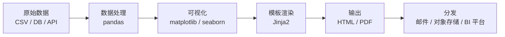

*图：沿图中的节点与箭头阅读，重点是参数、数据版本、环境、计算、图表、叙事和导出串成可复现报告构建，而不是手工复制结果。*

---

手工报告（Manual Reporting）的核心痛点在于：数据取数依赖人工、图表每次重画、格式调整耗时，且无法在数据更新时自动刷新。Python 自动化数据报告（Automated Data Reporting）将"取数 → 聚合 → 可视化 → 渲染 → 分发"全流程变为可调度的代码，既保证可复现性，也释放了数据分析师的重复劳动。

## 手工 vs. 自动化报告

[Quarto 的 Python 计算文档](https://quarto.org/docs/computations/python.html) 将代码、叙事、执行选项与缓存纳入同一构建过程，适合生成可重建的 HTML/PDF artifact。


| 维度 | 手工报告 | 自动化报告 |
|------|----------|----------|
| 数据刷新 | 人工重新取数，易出错 | 定时脚本，版本可追溯 |
| 图表更新 | 每次重画 | 代码驱动，参数化生成 |
| 一致性 | 依赖个人习惯 | 模板统一，样式锁定 |
| 规模 | N 个报告 = N 倍工时 | N 个报告 ≈ 1 倍工时 |
| 可审计 | 难以回溯生成过程 | Git 版本 + 日志可追溯 |

核心价值：将"数据 → 洞察"的流程编码化，让机器代替人做重复搬运。

## 整体 Pipeline 架构



每层职责单一：处理层只关心 DataFrame，可视化层只负责图，模板层只管布局。替换某一层（如用 Plotly 换掉 matplotlib）不影响其他层，是良好的关注点分离（Separation of Concerns）。

## pandas 数据聚合模式

### groupby + agg 字典

`agg` 字典允许对不同列应用不同聚合函数，是生成摘要表的标准姿势：

```python
import pandas as pd

df = pd.read_csv("sales.csv", parse_dates=["date"])

# 按月 + 渠道聚合，对不同指标使用不同函数
monthly = (
    df.groupby([df["date"].dt.to_period("M"), "channel"])
    .agg(
        total_amount=("amount", "sum"),       # 总销售额
        avg_amount=("amount", "mean"),        # 均值
        order_count=("order_id", "count"),    # 订单数
        unique_users=("user_id", "nunique"),  # 去重用户数
    )
    .reset_index()
)
```

### describe() 快速摘要

`describe()` 输出 count / mean / std / min / 25% / 50% / 75% / max，适合报告的"数据概览"模块：

```python
# 数值列的描述性统计，保留 2 位小数
summary = df[["amount", "quantity", "discount"]].describe().round(2)
# 也可以对分类列使用 include="object"
cat_summary = df[["channel", "region"]].describe(include="object")
```

### pivot_table 多维交叉分析

`pivot_table` 是 Excel 数据透视表的 Python 对应，适合生成交叉汇总：

```python
# 按地区（行）× 渠道（列）的销售额透视表，填充 NaN 为 0
pivot = pd.pivot_table(
    df,
    values="amount",
    index="region",
    columns="channel",
    aggfunc="sum",
    fill_value=0,
    margins=True,        # 添加行列合计
    margins_name="合计",
)
```

## 图表生成与 Base64 编码

将 matplotlib 图表转为 Base64（Base64 Encoding）字符串后嵌入 HTML，报告就成为无外部依赖的单文件（Self-contained HTML）：

```python
import matplotlib.pyplot as plt
import matplotlib
import io
import base64

# 解决中文乱码（macOS 使用 PingFang SC，Linux 使用 WenQuanYi Micro Hei）
matplotlib.rcParams["font.family"] = ["PingFang SC", "WenQuanYi Micro Hei", "sans-serif"]
matplotlib.rcParams["axes.unicode_minus"] = False  # 负号正常显示

def fig_to_base64(fig: matplotlib.figure.Figure) -> str:
    """将 matplotlib Figure 转为 Base64 字符串，供 HTML  标签使用。"""
    buf = io.BytesIO()
    fig.savefig(buf, format="png", bbox_inches="tight", dpi=150)
    buf.seek(0)
    b64 = base64.b64encode(buf.read()).decode("utf-8")
    buf.close()
    return b64

fig, ax = plt.subplots(figsize=(10, 4))
ax.bar(monthly["date"].astype(str), monthly["total_amount"], color="#4C72B0")
ax.set_xlabel("月份")
ax.set_ylabel("销售额（元）")
ax.set_title("月度销售额趋势")
plt.xticks(rotation=45, ha="right")
plt.tight_layout()

chart_b64 = fig_to_base64(fig)
plt.close(fig)  # 必须关闭，否则批量生成时内存持续增长
```

## HTML 报告：Jinja2 模板分离

Jinja2（Template Engine）是 Python 生态最主流的模板引擎，核心优势是将数据逻辑与展示完全分离。

### Python 渲染代码

```python
from jinja2 import Environment, FileSystemLoader
from datetime import datetime

env = Environment(
    loader=FileSystemLoader("templates"),
    autoescape=False,   # 关闭自动转义，手动对不可信内容转义
)
template = env.get_template("report.html")

html_output = template.render(
    title="月度销售报告",
    generated_at=datetime.now().strftime("%Y-%m-%d %H:%M"),
    summary_table=summary.to_html(
        classes="table table-striped",
        border=0,
        justify="center",
    ),
    pivot_html=pivot.to_html(classes="table"),
    chart_b64=chart_b64,
    kpis={
        "total_revenue": f"¥{df['amount'].sum():,.0f}",
        "total_orders": len(df),
        "avg_order_value": f"¥{df['amount'].mean():.2f}",
    },
)

with open("output/report.html", "w", encoding="utf-8") as f:
    f.write(html_output)
```

### Jinja2 模板片段（templates/report.html）

```html
<!DOCTYPE html>
<html lang="zh-CN">
<head>
  <meta charset="UTF-8" />
  <title>{{ title }}</title>
  <style>
    body { font-family: "PingFang SC", sans-serif; margin: 2rem; color: #333; }
    .table { border-collapse: collapse; width: 100%; margin: 1rem 0; }
    .table th, .table td { border: 1px solid #ddd; padding: 8px 12px; }
    .table th { background: #4C72B0; color: #fff; }
    .kpi-grid { display: flex; gap: 1.5rem; margin: 1.5rem 0; }
    .kpi-card { background: #f5f7fa; border-radius: 8px; padding: 1rem 1.5rem; flex: 1; }
    .kpi-value { font-size: 1.8rem; font-weight: bold; color: #4C72B0; }
  </style>
</head>
<body>
  <h1>{{ title }}</h1>
  <p style="color:#888;">生成时间：{{ generated_at }}</p>

  <!-- KPI 卡片 -->
  <div class="kpi-grid">
    
    <div class="kpi-card">
      <div class="kpi-value">{{ value }}</div>
      <div>{{ key }}</div>
    </div>
    
  </div>

  <!-- 图表（Base64 内嵌，无外部依赖） -->
  <h2>月度趋势</h2>
  

  <!-- 数据表格，to_html() 输出必须用 | safe 跳过转义 -->
  <h2>描述统计</h2>
  {{ summary_table | safe }}

  <h2>渠道 × 地区交叉分析</h2>
  {{ pivot_html | safe }}
</body>
</html>
```

`| safe` 过滤器告诉 Jinja2 跳过 HTML 转义，pandas `to_html()` 的输出必须使用此过滤器，否则标签会被原样输出为文本。

## PDF 生成方案对比

[nbconvert](https://nbconvert.readthedocs.io/en/latest/) 可以执行、转换并用模板导出 Notebook；在自动报告里应从干净 kernel 重建，而不是把交互会话里的旧输出当作结果。


| 方案 | 安装复杂度 | 输出质量 | 动态内容支持 | 适用场景 |
|------|-----------|---------|------------|---------|
| **weasyprint** | 中（需系统依赖 Pango/Cairo） | 高（CSS 完整支持） | 支持 HTML/CSS | 由 HTML 模板生成精美 PDF |
| **reportlab** | 低（纯 Python） | 高（完全可控） | 完全程序化 | 发票、证书等固定版式 |
| **nbconvert** | 高（需 LaTeX/Pandoc） | 很高（LaTeX 排版） | Jupyter Notebook | 数据科学实验报告导出 |
| **pdfkit** | 中（需安装 wkhtmltopdf 二进制） | 中（浏览器渲染） | 有限 JS 支持 | 快速 HTML → PDF，轻量需求 |

推荐路径：优先用 Jinja2 生成 HTML，再用 weasyprint 转 PDF，一套模板同时产出两种格式：

```python
from weasyprint import HTML as WeasyHTML

WeasyHTML(filename="output/report.html").write_pdf("output/report.pdf")
```

## 快速 EDA：ydata-profiling

ydata-profiling（前身 pandas-profiling）一行代码生成包含分布图、缺失值矩阵、相关性热力图、重复行检测的完整探索性数据分析（EDA）报告：

```python
from ydata_profiling import ProfileReport

profile = ProfileReport(
    df,
    title="销售数据 EDA 报告",
    explorative=True,      # 开启更深度分析，速度较慢
    minimal=False,         # minimal=True 可大幅提速，但分析维度减少
)
profile.to_file("output/eda_report.html")
```

输出为交互式 HTML，包含每列的统计摘要、数据类型推断、前 N 行预览、相关系数矩阵。适合快速了解新数据集，但生产报告建议用自定义模板保证格式统一。

## 自动化调度

### cron（简单单机场景）

```bash
# crontab -e  添加以下条目
# 每天上午 8:00 生成报告（注意使用绝对路径）
0 8 * * * /usr/bin/python3 /opt/reports/generate_report.py >> /var/log/report.log 2>&1

# 每周一 9:00 生成周报
0 9 * * 1 /usr/bin/python3 /opt/reports/weekly_report.py
```

### Apache Airflow DAG（复杂 Pipeline）

Airflow 适合有上游数据依赖、需要重试和告警的场景：

```python
from airflow import DAG
from airflow.operators.python import PythonOperator
from datetime import datetime, timedelta

default_args = {
    "owner": "data-team",
    "retries": 2,
    "retry_delay": timedelta(minutes=5),
    "email_on_failure": True,
    "email": ["alert@example.com"],
}

with DAG(
    dag_id="daily_sales_report",
    default_args=default_args,
    schedule_interval="0 8 * * *",   # 每天 8:00
    start_date=datetime(2026, 1, 1),
    catchup=False,
    tags=["reporting"],
) as dag:

    def extract():
        """从数据库拉取原始数据并写入临时 CSV。"""
        # ... 实际数据库查询逻辑
        pass

    def transform():
        """读取临时 CSV，聚合后保存结果。"""
        pass

    def render_and_send():
        """生成 HTML/PDF 报告并发送邮件。"""
        pass

    t1 = PythonOperator(task_id="extract", python_callable=extract)
    t2 = PythonOperator(task_id="transform", python_callable=transform)
    t3 = PythonOperator(task_id="render_and_send", python_callable=render_and_send)

    t1 >> t2 >> t3  # 串行依赖，任意一步失败则后续不执行
```

## 端到端代码骨架

以下是一个可直接运行的完整脚本，覆盖读取 → 聚合 → 可视化 → 渲染 → 保存的全流程：

```python
"""
report_pipeline.py
完整数据报告生成骨架，可作为生产脚本的起点。
"""

import io
import base64
import logging
from datetime import datetime
from pathlib import Path

import pandas as pd
import matplotlib
import matplotlib.pyplot as plt
from jinja2 import Environment, FileSystemLoader

# ── 配置 ──────────────────────────────────────────────────
matplotlib.rcParams["font.family"] = ["PingFang SC", "WenQuanYi Micro Hei", "sans-serif"]
matplotlib.rcParams["axes.unicode_minus"] = False

OUTPUT_DIR = Path("output")
OUTPUT_DIR.mkdir(parents=True, exist_ok=True)

logging.basicConfig(level=logging.INFO, format="%(asctime)s %(levelname)s %(message)s")
log = logging.getLogger(__name__)


# ── Step 1: 读取数据 ───────────────────────────────────────
def load_data(path: str) -> pd.DataFrame:
    df = pd.read_csv(path, parse_dates=["date"])
    log.info("已加载 %d 行数据", len(df))
    return df


# ── Step 2: 聚合 ───────────────────────────────────────────
def aggregate(df: pd.DataFrame) -> dict:
    monthly = (
        df.groupby(df["date"].dt.to_period("M"))
        .agg(total=("amount", "sum"), orders=("order_id", "count"))
        .reset_index()
    )
    monthly["date"] = monthly["date"].astype(str)
    summary = df[["amount", "quantity"]].describe().round(2)
    return {"monthly": monthly, "summary": summary}


# ── Step 3: 可视化 ─────────────────────────────────────────
def make_chart(monthly: pd.DataFrame) -> str:
    fig, ax = plt.subplots(figsize=(10, 4))
    ax.bar(monthly["date"], monthly["total"], color="#4C72B0", alpha=0.85)
    ax.set_xlabel("月份")
    ax.set_ylabel("销售额（元）")
    ax.set_title("月度销售额")
    plt.xticks(rotation=45, ha="right")
    plt.tight_layout()

    buf = io.BytesIO()
    fig.savefig(buf, format="png", bbox_inches="tight", dpi=150)
    b64 = base64.b64encode(buf.getvalue()).decode()
    plt.close(fig)
    return b64


# ── Step 4: 渲染 HTML ──────────────────────────────────────
def render_html(agg: dict, chart_b64: str) -> str:
    env = Environment(loader=FileSystemLoader("templates"), autoescape=False)
    return env.get_template("report.html").render(
        title="月度销售报告",
        generated_at=datetime.now().strftime("%Y-%m-%d %H:%M"),
        summary_table=agg["summary"].to_html(classes="table"),
        monthly_table=agg["monthly"].to_html(index=False, classes="table"),
        chart_b64=chart_b64,
    )


# ── Step 5: 保存 ───────────────────────────────────────────
def save_report(html: str, output_path: Path) -> None:
    output_path.write_text(html, encoding="utf-8")
    log.info("报告已保存：%s", output_path)


# ── 主流程 ─────────────────────────────────────────────────
if __name__ == "__main__":
    df = load_data("data/sales.csv")
    agg = aggregate(df)
    chart_b64 = make_chart(agg["monthly"])
    html = render_html(agg, chart_b64)
    save_report(html, OUTPUT_DIR / "report.html")
```

## 邮件分发：smtplib + MIME

用 Python 标准库 `smtplib` 将报告作为附件发送：

```python
import smtplib
from email.mime.multipart import MIMEMultipart
from email.mime.base import MIMEBase
from email.mime.text import MIMEText
from email import encoders

def send_report_email(
    smtp_host: str,
    smtp_port: int,
    username: str,
    password: str,
    recipients: list[str],
    subject: str,
    body_text: str,
    attachment_path: str,
) -> None:
    msg = MIMEMultipart()
    msg["From"] = username
    msg["To"] = ", ".join(recipients)
    msg["Subject"] = subject

    # 纯文本摘要（邮件客户端不支持 HTML 时的备用内容）
    msg.attach(MIMEText(body_text, "plain", "utf-8"))

    # 附件：PDF 报告
    with open(attachment_path, "rb") as f:
        part = MIMEBase("application", "octet-stream")
        part.set_payload(f.read())
    encoders.encode_base64(part)
    part.add_header(
        "Content-Disposition",
        f'attachment; filename="{Path(attachment_path).name}"',
    )
    msg.attach(part)

    # 使用 SSL 连接（端口 465）或 STARTTLS（端口 587）
    with smtplib.SMTP_SSL(smtp_host, smtp_port) as server:
        server.login(username, password)
        server.sendmail(username, recipients, msg.as_string())

# 调用示例
send_report_email(
    smtp_host="smtp.example.com",
    smtp_port=465,
    username="report@example.com",
    password="YOUR_PASSWORD",
    recipients=["team@example.com"],
    subject=f"月度销售报告 {datetime.now().strftime('%Y-%m')}",
    body_text="请查收本月销售报告，详见附件。",
    attachment_path="output/report.pdf",
)
```

对于高频发送或需要追踪投递率的场景，推荐接入 SendGrid / AWS SES SDK，以获得退信处理、打开率追踪等能力。

## AI/Agent 场景的报告需求

自动化报告在 AI/Agent 工程中有三个典型应用场景：

**模型性能报告（Model Performance Report）**：每次模型训练结束后自动生成包含 loss 曲线、评估指标（Accuracy / F1 / AUC）、混淆矩阵的 HTML 报告，提交到 MLflow 或内部 artifact 存储，供团队异步 Review。

**数据集质量报告（Dataset Quality Report）**：在数据进入训练 Pipeline 前，自动运行 ydata-profiling 或自定义规则，检测缺失率、异常值、标签分布偏斜，将问题以可视化报告推送给数据标注团队。

**业务指标追踪（Business Metric Tracking）**：AI 产品上线后，自动生成日/周维度的用户调用量、响应延迟、拒绝率、Token 消耗等指标报告，配合告警阈值，用于监控模型在生产环境的健康状态。

三类报告的共同特点是"数据变，代码不变"——模板和聚合逻辑复用，只有数据源和时间范围是参数。

## 常见陷阱

**中文字体乱码**：matplotlib 默认字体不含中文，坐标轴和标题会显示为方框（□□□）。必须在脚本顶部显式设置 `rcParams["font.family"]`，并在 CI 环境中预装对应字体包（如 `fonts-wqy-microhei`）。

**`plt.close()` 缺失导致内存泄漏**：在循环中批量生成图表时，每个未关闭的 Figure 都会常驻内存。养成习惯：生成 Base64 后立即 `plt.close(fig)`，或使用 `matplotlib.use("Agg")` 切换到非交互式后端。

**Jinja2 `| safe` 与 XSS**：`| safe` 告诉 Jinja2 不转义输出，如果数据来自用户输入或外部 API，必须先对数据做清洗（如用 `bleach.clean()`），否则存在 XSS（Cross-Site Scripting）注入风险。

**大数据量直接传入模板**：将几十万行 DataFrame 直接 `to_html()` 会生成巨大 HTML，浏览器渲染卡死。应在聚合阶段将数据压缩到报告所需的粒度（通常几十至几百行），或使用分页方案。

**cron 环境变量丢失**：cron 任务继承的 PATH 和环境变量与交互式 shell 不同，依赖虚拟环境的脚本需使用绝对路径（`/home/user/.venv/bin/python`），并在脚本头部显式设置必要的环境变量（如数据库连接串），否则 cron 环境下会报 `ModuleNotFoundError` 或连接失败。

## 最佳实践

**路径管理统一用 `pathlib.Path`**：避免字符串拼接路径，`Path` 在 Windows/macOS/Linux 均可正确处理分隔符，且 `mkdir(parents=True, exist_ok=True)` 比 `os.makedirs` 更简洁。

**数据层与展示层解耦**：聚合函数只返回 Python 原生类型（dict / DataFrame），不关心输出格式；模板只做展示，不做计算。切换输出格式（HTML → Excel → Slack 消息）时只需新增一个渲染函数，核心聚合逻辑零改动。

**为每份报告记录元数据**：在报告中嵌入生成时间、数据版本（如数据库快照时间）、脚本 Git commit hash，便于复现和排查历史报告的差异。

**图表风格统一配置**：在模块级别设置全局 `rcParams`（颜色调色板、字体大小、DPI），而非在每个函数内部重复设置，保证整份报告视觉一致。

**使用参数化脚本而非硬编码时间范围**：通过 `argparse` 或环境变量接收 `--start-date` / `--end-date`，使脚本既能被 cron 调用（不传参 = 昨天），也能手动回填历史报告（传参指定范围）。

## 面试高频

**Q：如何生成一份完全自包含（Self-contained）的 HTML 报告，不依赖任何外部文件？**

将图表转为 Base64 字符串内嵌到 `` 标签，将 CSS 样式写入 `<style>` 块，将 JavaScript（如有）内联到 `<script>` 块。pandas `to_html()` 已输出完整 HTML 片段，用 Jinja2 组装后即可得到无外部依赖的单文件报告，适合通过邮件传输或存入对象存储。

**Q：报告生成很慢，如何定位和优化瓶颈？**

使用 `cProfile` 或 `line_profiler` 对主流程做性能分析。常见瓶颈依次为：①数据库查询（加索引、缩小时间范围、用列式存储如 Parquet 缓存中间结果）；②pandas 全量数据处理（在数据库侧做预聚合，只拉取报告所需粒度的数据）；③图表生成（批量图表可用 `multiprocessing.Pool` 并行化，每个进程独立生成，最后汇总 Base64）；④HTML 渲染（数据量过大时分页或截断）。

**Q：如何保证在不同时区的服务器上，报告的时间标签一致？**

统一使用 UTC 时间存储和计算，仅在渲染阶段将时间转换为目标时区（用 `pytz` 或 Python 3.9+ 内置的 `zoneinfo`）。在报告元数据中同时记录 UTC 时间和展示时区，避免因服务器时区配置差异导致时间错乱。

```python
from zoneinfo import ZoneInfo
from datetime import datetime

tz_cn = ZoneInfo("Asia/Shanghai")
display_time = datetime.now(tz=tz_cn).strftime("%Y-%m-%d %H:%M %Z")
# 输出示例：2026-06-19 08:00 CST
```

## 参考资料

- [nbconvert documentation](https://nbconvert.readthedocs.io/en/latest/)
- [Quarto computations with Python](https://quarto.org/docs/computations/python.html)
