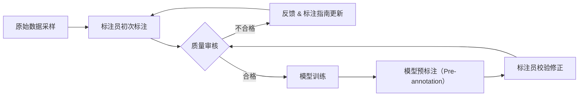

# AI 训练数据采集与标注

AI 模型的上限由训练数据的质量决定——再强大的算法，喂入低质量或标注错误的数据，输出也会失真。理解数据采集与标注的全流程，是每个进入 AI/ML 方向的工程师必须掌握的基础。

## 为什么数据质量是第一优先级

业界有句话："Garbage in, garbage out。"模型本质上是在拟合数据分布，若训练集存在系统性偏差或噪声标签，模型会将错误"学进去"，且往往难以在评估阶段察觉——因为测试集可能来自同一批污染数据。

常见的数据质量问题：

- **标注不一致**：不同标注员对同一样本给出不同 label
- **类别不平衡**：某些类别样本极少，模型倾向于预测多数类
- **分布偏移**：训练数据与线上真实数据分布不一致
- **标注错误**：ground truth 本身有误，模型收到错误的监督信号

---

## 数据采集策略

### 公开数据集

ImageNet、COCO、Common Crawl、Wikipedia Dump 等是最常用的起点。公开数据集经过社区验证，质量相对可控，但往往与业务场景存在 domain gap。

### Web Scraping

针对特定领域（如电商图片、法律文本）从互联网批量抓取。需注意版权合规、robots.txt 约定，以及去重和清洗的成本。

### 用户生成数据（User-Generated Data）

用户在产品中的真实行为往往是最贴近业务分布的数据来源。例如用户的搜索词、点击行为、上传图片。需要做好隐私脱敏和数据治理。

### 合成数据（Synthetic Data）

通过程序生成或已有模型生成数据，用于扩充稀缺类别或模拟极端场景（如自动驾驶中的罕见天气）。合成数据与真实数据之间存在 domain gap，通常作为补充而非替代。

```python
import random

def generate_synthetic_ner_sample(entities: list[dict]) -> dict:
    """
    简单合成 NER 样本示例：将实体插入模板句子。
    entities: [{"text": "北京", "label": "LOC"}, ...]
    """
    templates = [
        "{entity} 是一个重要的地点。",
        "昨天在 {entity} 发生了一件大事。",
        "公司总部位于 {entity}。",
    ]
    entity = random.choice(entities)
    text = random.choice(templates).format(entity=entity["text"])
    # 计算实体在字符串中的 span
    start = text.index(entity["text"])
    end = start + len(entity["text"])
    return {
        "text": text,
        "entities": [{"start": start, "end": end, "label": entity["label"]}],
    }

samples = generate_synthetic_ner_sample([
    {"text": "北京", "label": "LOC"},
    {"text": "上海", "label": "LOC"},
])
print(samples)
```

---

## 标注类型

| 任务类型 | 标注形式 | 典型应用 |
|---|---|---|
| 图像分类 | 单标签 / 多标签 | 内容审核、商品分类 |
| 目标检测 | Bounding box + 类别 | 人脸检测、自动驾驶 |
| 语义分割 | Segmentation mask（像素级） | 医学影像、场景理解 |
| NER | 文本 span + 实体类型 | 信息抽取、知识图谱 |
| 情感分析 | 句子级 / 方面级 sentiment | 舆情监控、评论分析 |
| 关系抽取 | 实体对 + 关系类型 | 知识图谱构建 |

---

## 质量控制

### Inter-Annotator Agreement（标注一致性）

衡量多个标注员对同一数据给出相同结论的程度，常用指标：

- **Cohen's Kappa**：适用于两人标注的分类任务，消除随机一致的影响
- **Fleiss' Kappa**：多人标注版本
- **IoU（Intersection over Union）**：目标检测中衡量 bounding box 的一致性

一般认为 Kappa > 0.8 为高质量，0.6-0.8 为可接受。

```python
from sklearn.metrics import cohen_kappa_score

# 两位标注员对 10 个样本的情感分类结果
annotator_a = [1, 0, 1, 1, 0, 1, 0, 0, 1, 1]
annotator_b = [1, 0, 1, 0, 0, 1, 1, 0, 1, 1]

kappa = cohen_kappa_score(annotator_a, annotator_b)
print(f"Cohen's Kappa: {kappa:.4f}")
# 输出：Cohen's Kappa: 0.6667
```

### Gold Standard Sets

在标注任务中混入少量已有正确答案的样本（gold set），用于实时监控标注员的准确率，识别表现不佳的标注员。

### 迭代精炼（Iterative Refinement）

数据标注不是一次性工作。常见流程：



利用已训练模型进行 pre-annotation，可将标注员的工作从"从零标注"转变为"审核修正"，显著提升效率。

---

## 标注工具概览

| 工具 | 特点 | 适用场景 |
|---|---|---|
| **Label Studio** | 开源、支持多模态（图像/文本/音频）、可自部署 | 小团队、定制化需求 |
| **CVAT** | 开源、专注于计算机视觉标注、支持视频 | 图像/视频检测与分割 |
| **Labelbox** | 商业平台、内置工作流管理与质控 | 企业级大规模标注 |

---

## 数据增强（Data Augmentation）

当样本量不足时，通过变换现有样本来扩充数据集：

**图像增强（常用库：Albumentations、torchvision.transforms）：**
- 随机裁剪、翻转、旋转
- 颜色抖动（亮度、对比度、饱和度）
- Mixup / CutMix（将两张图混合）

**文本增强：**
- 同义词替换
- 回译（Backtranslation）：将文本翻译成另一种语言再翻译回来
- EDA（Easy Data Augmentation）：随机插入、删除、交换词

```python
import albumentations as A
import cv2
import numpy as np

transform = A.Compose([
    A.RandomCrop(width=224, height=224),
    A.HorizontalFlip(p=0.5),
    A.ColorJitter(brightness=0.2, contrast=0.2, saturation=0.2, p=0.5),
    A.GaussNoise(p=0.2),
])

# image: numpy array (H, W, C), uint8
image = np.zeros((256, 256, 3), dtype=np.uint8)  # 示例空图
augmented = transform(image=image)
result_image = augmented["image"]
```

---

## 常见坑与最佳实践

**常见陷阱：**

- 标注指南（annotation guideline）不够明确，导致标注员各自解读不一
- 没有做 train/val/test 的严格分割，导致数据泄漏（data leakage）
- 过度依赖合成数据而忽视 domain gap
- 忽略长尾分布：头部类别准确率高，尾部类别几乎无法学习

**最佳实践：**

- 在正式标注前，先做小批量 pilot 标注并计算 inter-annotator agreement，提前发现歧义
- 标注指南需配合真实样本的边界案例（edge case）一起维护
- 使用分层采样（stratified sampling）确保各类别在 split 中比例一致
- 对噪声标签使用 label smoothing 或学习带噪标签的专用算法（如 Confident Learning）

---

## 面试常见问题

**Q: 如何处理 class imbalance（类别不平衡）？**

常见方案：过采样（SMOTE 等）、欠采样、调整 loss 权重（class weight）、focal loss。核心思路是让模型在少数类上获得足够的梯度信号。

**Q: 如何处理 noisy labels（噪声标签）？**

可以用 Confident Learning 方法估计每个样本的标签置信度，识别并过滤掉可能标注错误的样本；也可以用 label smoothing 降低模型对单一标签的过度拟合；在有多个标注员的情况下，用 majority voting 或 weighted voting 综合结果。

**Q: 如何衡量数据集质量？**

- 计算 inter-annotator agreement（Kappa、IoU 等）
- 检查类别分布是否与线上真实分布匹配
- 对模型预测置信度低的样本进行人工抽样核查
- 用 gold standard set 定期校验标注员质量

**Q: 什么是 data leakage，如何避免？**

Data leakage 指测试集中的信息在训练阶段被模型"看到"，导致评估指标虚高。常见来源：在划分数据集之前就做了全量数据的标准化（应该只在训练集上 fit scaler）；同一用户/文档的样本跨越了 train 和 test。避免方法：先划分，再做特征工程；按用户/文档粒度分组划分。
