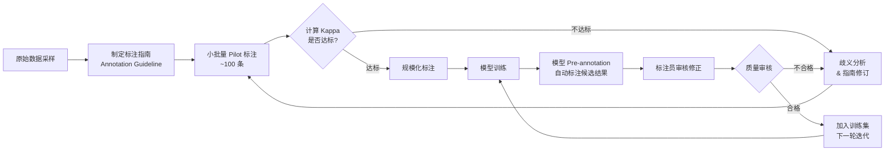

AI 数据采集、标注与审核需要把“机制是什么”“边界在哪里”“怎样验证”放在同一条学习路径中。本文以 [Create instruction pages — Amazon SageMaker AI](https://docs.aws.amazon.com/sagemaker/latest/dg/sms-creating-instruction-pages.html) 对“标注任务的短说明、完整说明，以及用多个示例覆盖边界和困难案例”的说明为事实边界，并用 [Annotation consolidation — Amazon SageMaker AI](https://docs.aws.amazon.com/sagemaker/latest/dg/sms-annotation-consolidation.html) 校准“每个对象由多名 worker 标注、标注相似度/投票或概率合并，以及最终标签与质量权衡”。文中的代码和工程方案用于解释这些机制；涉及具体版本、默认值或部署行为时，应再回到所链接的一手资料确认。


*图：AI 数据采集、标注与审核的核心组件、信息流与验证边界。*

---

AI 模型的上限由训练数据的质量决定——再强大的算法，喂入低质量或标注错误的数据，输出必然失真，这就是业界那句"Garbage in, garbage out"的真正含义。理解数据采集（Data Collection）与标注（Data Annotation）的全流程，是每个 AI/Agent 工程师不可绕过的基础。

## 为什么数据质量是第一优先级

模型本质上是在拟合数据分布。训练集若存在系统性偏差或噪声标签（Noisy Labels），模型会把错误"学进去"，而这类问题往往难以在评估阶段发现——因为测试集可能来自同一批污染数据。

常见的数据质量病灶：

- **标注不一致（Annotation Inconsistency）**：不同标注员对同一样本给出不同 label，模型收到相互矛盾的监督信号
- **类别不平衡（Class Imbalance）**：头部类别样本充足，尾部类别极稀少，模型倾向预测多数类
- **分布偏移（Distribution Shift）**：训练数据与线上真实数据来自不同分布，导致线上效果骤降
- **标注错误（Label Error）**：ground truth 本身有误，模型收到错误的反馈

数据质量问题的代价远高于模型架构的选择。在许多业务场景中，将标注质量从 85% 提升到 95% 带来的效果提升，超过把模型从 BERT-base 换成 BERT-large。

## 数据采集策略

### 公开数据集（Public Datasets）

| 数据集 | 领域 | 规模 | 典型用途 |
|--------|------|------|----------|
| ImageNet | 图像分类 | 1400 万张 / 1000 类 | 视觉预训练、迁移学习 |
| COCO | 目标检测 / 分割 | 33 万张、80 类 | 检测模型基准 |
| Common Crawl | 网页文本 | PB 级 | 语言模型预训练 |
| Wikipedia Dump | 百科文本 | 数十亿词 | 问答、摘要、知识图谱 |
| SQuAD | 阅读理解 | 10 万+ QA 对 | 问答模型训练与评测 |

公开数据集经社区验证，质量相对可控，但往往与具体业务存在**领域差距（Domain Gap）**。直接拿来用效果通常不理想，需要领域适配或微调。

### Web Scraping（网络抓取）

针对特定领域（如电商图片、法律文本、医学报告）批量抓取互联网数据。工程注意事项：

- 遵守 `robots.txt`，注意版权与许可协议
- 抓取后必须做文本清洗（去除 HTML 标签、广告、导航栏噪音）
- 内容去重：先做 URL 去重，再做内容 hash 去重（MinHash/SimHash 处理近似重复）
- 语言过滤：用 `langdetect` 或 fastText 的语言识别模型过滤非目标语言

### 用户生成数据（User-Generated Data）

用户在产品中的真实行为是最贴近业务分布的数据源——搜索词、点击序列、上传图片、用户反馈。

核心挑战是数据治理：隐私脱敏（PII 处理）、合规留存期限、用户授权协议。在 GDPR/个人信息保护法框架下，用户数据的采集与使用需明确法律依据。

### 合成数据（Synthetic Data）

通过程序规则或已有模型生成数据，用于扩充稀缺类别或模拟极端场景。典型场景：

- 自动驾驶：用仿真引擎生成罕见天气、夜间、遮挡场景
- NLP：用模板或 LLM 生成低频实体的 NER 训练样本
- 表格数据：用 CTGAN 等生成满足统计分布的结构化数据

合成数据与真实数据之间存在固有的 domain gap，通常作为补充而非替代，混入比例需通过实验确定。

```python
import random
from typing import Any

# 定义实体候选列表
ENTITIES = {
    "LOC": ["北京", "上海", "深圳", "杭州", "成都"],
    "ORG": ["阿里巴巴", "腾讯", "百度", "字节跳动", "华为"],
    "PER": ["张三", "李四", "王五", "赵六"],
}

# 句子模板，{entity} 为实体占位符
TEMPLATES = {
    "LOC": [
        "{entity}是中国重要的经济中心。",
        "会议将在{entity}召开。",
        "公司总部位于{entity}。",
    ],
    "ORG": [
        "{entity}今日发布了最新财报。",
        "{entity}宣布进军海外市场。",
        "分析师对{entity}的前景持乐观态度。",
    ],
    "PER": [
        "{entity}获得了本届比赛的冠军。",
        "据报道，{entity}将出任新职位。",
    ],
}

def generate_ner_sample(label: str) -> dict[str, Any]:
    """
    生成单条 NER 合成样本。
    返回格式符合 spaCy / Hugging Face datasets 常见约定。
    """
    entity_text = random.choice(ENTITIES[label])
    template = random.choice(TEMPLATES[label])
    text = template.format(entity=entity_text)

    # 精确定位实体在字符串中的字符级 span
    start = text.index(entity_text)
    end = start + len(entity_text)

    return {
        "text": text,
        "entities": [{"start": start, "end": end, "label": label, "text": entity_text}],
    }

# 生成多类别合成数据集
synthetic_dataset = []
for label in ENTITIES:
    for _ in range(50):  # 每类生成 50 条
        synthetic_dataset.append(generate_ner_sample(label))

print(f"生成样本总数：{len(synthetic_dataset)}")
print("示例：", synthetic_dataset[0])
```

## 标注类型全览

| 任务类型 | 标注形式 | 输出示例 | 典型应用 |
|----------|----------|----------|----------|
| 图像分类（Image Classification） | 单标签 / 多标签 | `{"label": "cat"}` | 内容审核、商品分类 |
| 目标检测（Object Detection） | Bounding Box + 类别 | `[x, y, w, h, "person"]` | 人脸检测、自动驾驶 |
| 语义分割（Semantic Segmentation） | 像素级 mask | 每像素一个类别 ID | 医学影像、场景理解 |
| 实例分割（Instance Segmentation） | 每个实例独立 mask | 同类多目标区分 | 工业质检、精细计数 |
| NER（命名实体识别） | 文本 span + 实体类型 | `[{"start":0,"end":2,"label":"LOC"}]` | 信息抽取、知识图谱 |
| 情感分析（Sentiment Analysis） | 句子级 / 方面级情感极性 | `{"sentiment": "positive"}` | 舆情监控、评论分析 |
| 关系抽取（Relation Extraction） | 实体对 + 关系类型 | `("北京","首都","中国")` | 知识图谱构建 |
| RLHF 偏好标注（Preference Labeling） | 回答对的相对排序 | `{"chosen": A, "rejected": B}` | LLM 对齐、RLHF 训练 |

## 质量控制（Quality Control）

### Inter-Annotator Agreement（标注一致性度量）

多标注员独立标注同一数据，通过一致性指标发现歧义和标注员能力差异。

| 指标 | 适用场景 | 公式核心思想 |
|------|----------|-------------|
| Cohen's Kappa | 两人标注的分类任务 | 消除随机一致性的影响 |
| Fleiss' Kappa | 多人标注的分类任务 | Kappa 的多人推广 |
| Krippendorff's Alpha | 多人 + 多种尺度（名义/顺序/区间） | 更通用，处理缺失值 |
| IoU（Intersection over Union） | 目标检测 bbox 一致性 | 两框交集 / 并集 |

**Kappa 解读参考**：< 0.4 较差；0.4–0.6 一般；0.6–0.8 较好；> 0.8 优秀。

```python
from sklearn.metrics import cohen_kappa_score
import numpy as np

# 两位标注员对 10 个样本的情感分类结果（0=负面, 1=中性, 2=正面）
annotator_a = [2, 0, 1, 2, 0, 2, 0, 1, 2, 2]
annotator_b = [2, 0, 1, 1, 0, 2, 1, 1, 2, 2]

kappa = cohen_kappa_score(annotator_a, annotator_b)
print(f"Cohen's Kappa: {kappa:.4f}")
# Kappa > 0.8 表示标注质量达到发布标准

# IoU 示例：比较两个 bounding box 的一致性
def compute_iou(box_a: list[float], box_b: list[float]) -> float:
    """
    box 格式：[x1, y1, x2, y2]（左上角 + 右下角坐标）
    """
    # 计算交集区域
    x_left   = max(box_a[0], box_b[0])
    y_top    = max(box_a[1], box_b[1])
    x_right  = min(box_a[2], box_b[2])
    y_bottom = min(box_a[3], box_b[3])

    if x_right < x_left or y_bottom < y_top:
        return 0.0  # 无交集

    intersection = (x_right - x_left) * (y_bottom - y_top)
    area_a = (box_a[2] - box_a[0]) * (box_a[3] - box_a[1])
    area_b = (box_b[2] - box_b[0]) * (box_b[3] - box_b[1])
    union = area_a + area_b - intersection
    return intersection / union

iou = compute_iou([10, 10, 50, 50], [15, 12, 55, 52])
print(f"Bounding Box IoU: {iou:.4f}")
```

### Gold Standard Sets（黄金标准集）

在标注任务中混入 5%–10% 已有正确答案的样本（gold set），实时计算每位标注员在这些样本上的准确率，用于：

- 识别并剔除质量不达标的标注员
- 检测标注员是否随时间产生疲劳效应
- 在外包团队中建立质量门槛

### 迭代精炼（Iterative Refinement）with Pre-annotation

标注不是一次性工作，而是数据与模型共同演进的循环：



Pre-annotation（预标注）将标注员从"从零创建"转变为"审核修正"，可将标注效率提升 2–5 倍，对 RLHF 流程尤为关键。

## 标注工具对比

| 工具 | 开源/商业 | 支持模态 | 亮点 | 局限 |
|------|-----------|----------|------|------|
| **Label Studio** | 开源（MIT） | 文本、图像、音频、视频、时序 | 高度可定制、支持自部署、插件生态 | 大规模时性能需优化 |
| **CVAT** | 开源（Apache） | 图像、视频 | 视频帧标注强、支持半自动标注 | 非视觉任务支持弱 |
| **Labelbox** | 商业 SaaS | 多模态 | 内置工作流管理、QA 闭环、数据飞轮 | 成本较高 |
| **Scale AI** | 商业（服务） | 多模态 | 提供人工标注服务，质量有保障 | 价格贵、定制灵活度低 |
| **Prodigy** | 商业（本地） | 文本为主 | 主动学习驱动、工程师友好的 CLI | 单用户设计，不适合团队 |

## 数据增强（Data Augmentation）

当样本量不足或分布不均时，通过变换现有样本来扩充数据集。

### 图像增强

```python
import albumentations as A
import numpy as np

# 定义增强策略：训练时用强增强，验证时不增强
train_transform = A.Compose([
    A.RandomCrop(width=224, height=224),        # 随机裁剪
    A.HorizontalFlip(p=0.5),                    # 50% 概率水平翻转
    A.ColorJitter(
        brightness=0.2, contrast=0.2,
        saturation=0.2, hue=0.1, p=0.5         # 颜色抖动
    ),
    A.GaussNoise(p=0.2),                        # 高斯噪声
    A.Normalize(                                # ImageNet 均值/标准差归一化
        mean=[0.485, 0.456, 0.406],
        std=[0.229, 0.224, 0.225]
    ),
])

# image 为 numpy array (H, W, C), dtype=uint8
dummy_image = np.random.randint(0, 255, (256, 256, 3), dtype=np.uint8)
augmented = train_transform(image=dummy_image)
print("增强后 shape：", augmented["image"].shape)
```

### 文本增强

| 技术 | 做法 | 适用场景 | 风险 |
|------|------|----------|------|
| 同义词替换 | WordNet / 词向量近邻替换 | 文本分类 | 语义漂移 |
| 回译（Backtranslation） | 中→英→中，利用翻译引入多样性 | 低资源语言 | 翻译质量依赖 |
| EDA（Easy Data Augmentation） | 随机插入/删除/交换/替换 | 快速原型 | 改变句法结构 |
| LLM 改写 | GPT 系模型对文本做语义等价改写 | RLHF 数据多样化 | 成本较高 |

```python
import random

def eda_random_swap(text: str, n: int = 1) -> str:
    """
    EDA 之随机交换：随机选择两个词的位置互换，重复 n 次。
    适用于短文本分类任务的轻量增强。
    """
    words = text.split()
    if len(words) < 2:
        return text
    for _ in range(n):
        idx1, idx2 = random.sample(range(len(words)), 2)
        words[idx1], words[idx2] = words[idx2], words[idx1]
    return " ".join(words)

sample = "这款手机的摄像头效果非常出色"
print("原文：", sample)
print("增强后：", eda_random_swap(sample, n=2))
```

## AI/Agent 专项：RLHF 数据与 LLM 微调

Agent 工程师在数据标注上有几个特殊需求，区别于传统监督学习：

**RLHF 偏好标注（Preference Labeling）**

- 标注员看到同一 prompt 的两个模型回答（A vs B），选择更符合要求的一个
- 同时标注"为什么 A 更好"——具体哪个维度更好（准确性、安全性、有帮助性）
- 生成 `(prompt, chosen, rejected)` 三元组，供 DPO / PPO 训练使用

**Instruction Dataset 构建**

- 人工编写或 LLM + 人工审核相结合
- 需覆盖多种指令类型：创作、问答、代码、推理、拒绝有害请求
- 多样性比数量更重要：1000 条高质量多样指令 > 10000 条重复低质指令

**Agent Trajectory 标注**

- 标注 Agent 在多步任务中每一步动作选择的质量
- 需标注"步骤是否合理"、"工具调用参数是否正确"、"是否无效循环"
- 是当前 Agent 训练中最稀缺、最昂贵的数据类型

## 常见误区

1. **标注指南不够明确就开始大规模标注**：边界案例（edge case）没有示例说明，导致标注员各自解读，事后发现 Kappa 极低，全部返工。正确做法是先做 100 条 pilot，发现歧义后修订指南，再扩规模。

2. **在数据集划分之前就做全量特征工程**：在整个数据集上 fit 归一化参数（如 StandardScaler），再划分 train/test，造成数据泄漏（Data Leakage），测试集指标虚高。Scaler 必须只在训练集上 fit，然后 transform 验证集和测试集。

3. **过度依赖合成数据**：合成数据方便快捷，但 domain gap 真实存在。没有真实数据验证时，模型在合成数据上 95% 准确率，线上可能只有 60%。合成数据宜作为补充，混入比例需实验确定。

4. **忽视长尾分布**：头部类别数据充足，尾部类别（稀有故障类型、小语种等）只有几十条样本。模型宏平均准确率（Macro F1）很低，但加权平均（Weighted F1）看起来不错，工程师误以为没问题。应始终同时看 Per-class 指标。

5. **没有版本化管理数据集**：训练了多个模型版本，但无法追溯每个版本用了哪批数据，无法重现实验。应引入 DVC 等数据版本管理工具，像管理代码一样管理数据。

## 最佳实践

1. **先 Pilot 再规模化**：正式标注前，先在 50–200 条样本上计算 inter-annotator agreement，确认 Kappa > 0.7 后再投入全量标注资源。

2. **标注指南配合边界案例维护**：指南不只是规则列表，每条规则附上 2–3 个边界样本（应标 A 的例子 / 应标 B 的例子），定期随新发现的歧义更新。

3. **按用户/文档粒度做数据集划分**：同一用户产生的多条样本只能在同一个 split 里，避免数据泄漏。用 `GroupShuffleSplit` 而非普通 `train_test_split`。

4. **为每条训练样本记录标注来源元数据**：标注员 ID、标注时间、标注轮次——便于事后分析哪些标注员引入了更多噪声，哪批数据质量更好。

5. **标注 + 模型协同迭代**：用当前模型的 low-confidence 预测样本优先送标注，而非随机采样，这就是主动学习（Active Learning）的核心思想。在预算有限时，让每一条标注样本的信息价值最大化。

## 面试要点

**Q：如何处理类别不平衡（Class Imbalance）问题？**

数据层面：过采样（SMOTE、随机过采样）、欠采样，或通过数据增强补充少数类样本。训练层面：调整损失函数中各类别的权重（`class_weight="balanced"`）、使用 Focal Loss 让模型更关注难样本。评估层面：不用 Accuracy，改用 Macro F1、AUC-PR 等对不平衡更敏感的指标。核心思想是让模型在少数类上获得足够的梯度信号。

**Q：如何处理噪声标签（Noisy Labels）？**

轻量方案：Label Smoothing 降低模型对单一标签的过度拟合；多标注员 Majority Voting 融合结果。系统方案：Confident Learning（cleanlab 库实现）——先训练一个基础模型，用其预测置信度识别标注错误的样本，然后过滤或修正再重训。适合已有大量标注但质量存疑的场景。

**Q：什么是 Data Leakage，如何避免？**

数据泄漏指测试集信息在训练阶段被模型间接"看到"，导致线下评估指标虚高、线上效果骤降。常见来源：在划分数据集之前做了全量数据的标准化（Scaler 应只在训练集 fit）；同一用户/文档的样本跨越了 train 和 test（应按 group 划分）；测试集参与了超参数搜索（应留出单独的 holdout set）。

**Q：RLHF 的偏好标注与普通分类标注有什么区别？**

普通分类标注是给每个样本分配绝对标签（类别 A / B / C），依赖清晰的类别定义。RLHF 偏好标注是对两个回答做相对排序（A 比 B 好），本质是人类偏好的比较而非绝对真值——人更擅长比较而非打绝对分。这导致 inter-annotator agreement 更难保证，且偏好受评估维度（有帮助 vs 无害 vs 真实）影响，需要在标注指南中明确优先级。

## 参考资料

- [Create instruction pages — Amazon SageMaker AI](https://docs.aws.amazon.com/sagemaker/latest/dg/sms-creating-instruction-pages.html)
- [Annotation consolidation — Amazon SageMaker AI](https://docs.aws.amazon.com/sagemaker/latest/dg/sms-annotation-consolidation.html)
- [Label verification and adjustment — Amazon SageMaker AI](https://docs.aws.amazon.com/sagemaker/latest/dg/sms-verification-data.html)
