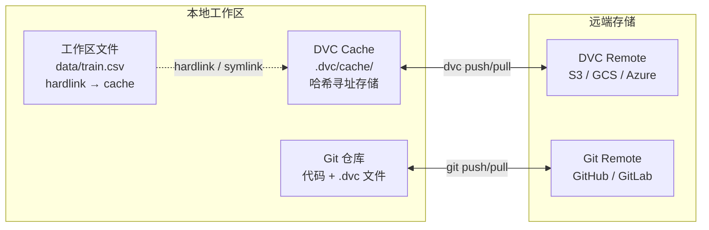
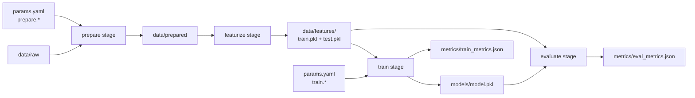

*图：上半部比较 Git 中的 code/dvc.yaml/.dvc metadata 与 DVC cache/remote 的大对象；下半部沿 raw → prepare → train → metrics 读取增量重跑。*

---

机器学习项目的核心挑战之一是**数据与实验的可复现性**——仅用 Git 管理代码，无法追踪训练数据、特征文件和模型权重的版本变化。DVC（Data Version Control）像 Git 管理代码一样管理数据和 ML pipeline，让实验复现和团队协作变得可靠。

## 为什么 Git 不够用

Git 对 ML/AI 项目存在三个根本性局限：

**场景 1：实验无法复现**
三周后想复现某个模型效果，`git checkout` 回到对应代码版本，但训练数据已被同事更新——结果完全不同。Git 从未追踪过数据文件，版本历史里没有数据的任何记录。

**场景 2：大文件污染仓库**
将 2GB 的训练数据 `git add` 后，即使之后删除，文件永久存储在 Git history 中。仓库从此膨胀，所有人 `git clone` 都要等待数分钟，CI 速度大幅下降。GitHub 还会直接拒绝超过 100MB 的单文件提交。

**场景 3：团队协作困难**
每位工程师本地运行不同版本的预处理脚本生成的特征文件，用于训练的数据集各不相同。没有统一的"哪个数据集对应哪个模型"的追踪机制，问题排查极其困难。

**DVC 的解决思路**：数据文件存到远端对象存储（S3、GCS 等），Git 仓库里只保留一个轻量的 `.dvc` 指针文件（几十字节），通过指针的哈希锁定具体数据版本。

## DVC 架构：指针文件 + 远端存储

[`dvc add` 文档](https://doc.dvc.org/command-reference/add) 说明 Git 保存 `.dvc` 元数据，而实际数据进入 DVC cache 并可推送到 remote；切换 Git commit 后仍需 checkout/pull 对齐工作区数据。




**关键机制**：
- `.dvc` 指针文件通过 MD5 哈希精确指向某版本数据，提交到 Git 即完成版本锁定
- DVC Cache 是本地的内容寻址存储，文件以 `ab/cdef1234...` 格式按哈希存储，切换版本开销极小
- 工作区文件是 Cache 中对应文件的**硬链接（hardlink）**，避免存储两份副本

## DVC vs Git：职责划分

| 管理对象 | 负责工具 | 存储位置 | 版本切换方式 |
|----------|----------|----------|--------------|
| 代码、脚本、配置 | Git | GitHub / GitLab | `git checkout` |
| `.dvc` 指针文件 | Git（追踪 DVC 产物） | GitHub / GitLab | `git checkout` |
| `dvc.yaml` pipeline 定义 | Git | GitHub / GitLab | `git checkout` |
| `dvc.lock` 执行状态锁 | Git | GitHub / GitLab | `git checkout` |
| 数据集、特征文件 | DVC | S3 / GCS / 本地 remote | `dvc checkout` |
| 模型权重（.pkl / .pt） | DVC | S3 / GCS / 本地 remote | `dvc checkout` |
| 超参数配置 | Git（`params.yaml`） | GitHub / GitLab | `git checkout` |

**两者配合的关键**：切换 Git 分支或 tag 后，`.dvc` 文件随代码一起变化，执行 `dvc checkout` 即自动切换到该 commit 对应版本的数据和模型文件。

## 核心概念

### .dvc 指针文件结构

执行 `dvc add data/train.csv` 后，DVC 生成 `data/train.csv.dvc`，内容如下：

```yaml
outs:
- md5: a1b2c3d4e5f67890abcdef1234567890
  size: 104857600        # 文件大小，字节
  path: train.csv        # 相对于 .dvc 文件的路径
```

同时，DVC 自动将 `data/train.csv` 写入 `data/.gitignore`，防止大文件误入 Git。提交 `.dvc` 文件到 Git 即完成版本锁定。

### DVC Cache：内容寻址存储

DVC Cache 默认位于 `.dvc/cache/`，文件按 MD5 哈希分目录存储：

```
.dvc/cache/
├── a1/
│   └── b2c3d4e5f67890abcdef1234567890  # 实际数据文件
└── fe/
    └── dcba9876543210fedcba9876543210
```

工作区中的 `data/train.csv` 是指向 cache 中对应文件的硬链接，切换版本时只需更新硬链接，不需要复制文件，速度极快。

### Remote Storage：团队共享中心

Remote 是团队共享数据的中央仓库，类似 Git 的 `origin`：

```bash
# 配置 S3 作为 remote（最常用于生产环境）
dvc remote add -d myremote s3://my-ml-bucket/dvc-storage

# 本地目录 remote（适合单机测试或 NFS 共享）
dvc remote add -d localremote /mnt/shared/dvc-remote

# 查看已配置的 remote
dvc remote list
```

支持的存储类型：Amazon S3、Google Cloud Storage、Azure Blob Storage、SSH/SFTP、本地目录、HDFS 等。

## 基本工作流

### 初始化项目

```bash
git init my-ml-project && cd my-ml-project
dvc init
# dvc init 会创建 .dvc/ 目录并自动 git add 相关配置文件
git commit -m "chore: initialize DVC"
```

### 追踪数据文件

```bash
# 追踪单个文件
dvc add data/train.csv

# 追踪整个目录（目录内所有文件统一管理）
dvc add data/raw/

# 将指针文件和 .gitignore 提交到 Git
git add data/.gitignore data/train.csv.dvc
git commit -m "feat: add training dataset v1"

# 推送数据到 remote 存储
dvc push
```

### 团队成员获取数据

```bash
# 克隆仓库（只有代码和 .dvc 指针文件，没有实际数据）
git clone https://github.com/org/my-ml-project.git
cd my-ml-project

# 配置 remote 凭证（CI/CD 中通过环境变量注入）
export AWS_ACCESS_KEY_ID=...
export AWS_SECRET_ACCESS_KEY=...

# 从 remote 拉取数据（根据 .dvc 文件中的哈希下载对应版本）
dvc pull
```

### 数据版本切换

```bash
# 切换到历史版本的代码（.dvc 文件随之变化）
git checkout v1.0.0

# 根据新的 .dvc 文件恢复对应版本的数据
dvc checkout
# 此时工作区的 data/train.csv 已自动切换为 v1.0.0 对应的数据
```

## DVC Pipelines：可复现的 ML 工作流

Pipeline 是 DVC 最核心的能力，将数据处理和模型训练定义为有依赖关系的 stage，实现**增量执行**——只有 deps 发生变化的 stage 才会重新运行。

### dvc.yaml 完整示例

```yaml
stages:
  # Stage 1: 数据预处理
  prepare:
    cmd: python src/prepare.py --input data/raw --output data/prepared
    deps:
      - src/prepare.py          # 脚本变化时重新执行
      - data/raw                # 原始数据变化时重新执行
    params:
      - params.yaml:            # 超参数变化时重新执行
          - prepare.test_split
          - prepare.random_seed
    outs:
      - data/prepared           # 输出目录，自动进入 DVC cache

  # Stage 2: 特征工程
  featurize:
    cmd: python src/featurize.py
    deps:
      - src/featurize.py
      - data/prepared
    outs:
      - data/features/train.pkl
      - data/features/test.pkl

  # Stage 3: 模型训练
  train:
    cmd: python src/train.py
    deps:
      - src/train.py
      - data/features/train.pkl
    params:
      - params.yaml:
          - train.learning_rate
          - train.n_estimators
          - train.max_depth
    outs:
      - models/model.pkl        # 模型文件进入 DVC cache
    metrics:
      - metrics/train_metrics.json:
          cache: false          # 指标文件不入 cache，让 Git 直接追踪

  # Stage 4: 模型评估
  evaluate:
    cmd: python src/evaluate.py
    deps:
      - src/evaluate.py
      - models/model.pkl
      - data/features/test.pkl
    metrics:
      - metrics/eval_metrics.json:
          cache: false
    plots:
      - metrics/confusion_matrix.json:
          cache: false
```

对应的 `params.yaml` 超参数文件：

```yaml
prepare:
  test_split: 0.2
  random_seed: 42

train:
  learning_rate: 0.01
  n_estimators: 100
  max_depth: 5
```

### Pipeline 依赖关系图



### dvc repro：增量执行原理

```bash
# 执行完整 pipeline（仅重新运行有变化的 stage）
dvc repro

# 查看 pipeline 依赖关系图
dvc dag

# 强制重新执行所有 stage（忽略 cache）
dvc repro --force
```

`dvc repro` 的增量执行基于内容哈希：每个 stage 会比较所有 deps 文件的当前哈希与 `dvc.lock` 中记录的哈希，只有哈希不同时才重新运行该 stage。修改 `train.py` 不会触发 `prepare` 和 `featurize` 重跑，节省大量计算时间。

`dvc.lock` 是 pipeline 的执行快照，记录每次 `dvc repro` 后各 stage 的输入输出哈希，提交到 Git 即锁定了完整的实验状态，任何人 `git checkout` 到这个 commit 后执行 `dvc checkout` 都能还原完全相同的数据和模型。

## 实验追踪：指标对比与参数管理

```bash
# 查看当前实验指标
dvc metrics show

# 对比当前与上一个 Git commit 的指标变化
dvc metrics diff HEAD~1

# 对比两个不同 commit/branch 的超参数
dvc params diff main

# 示例输出（dvc metrics diff）
# Path                          Metric    HEAD~1    HEAD    Change
# metrics/eval_metrics.json     accuracy  0.891     0.923   0.032
# metrics/eval_metrics.json     f1        0.873     0.911   0.038
```

**实验版本管理工作流**：

```bash
# 每次实验完成后，打 Git tag 锁定实验状态
git add dvc.lock metrics/
git commit -m "exp: lr=0.01 n_est=100 acc=0.923"
git tag exp-lr0.01-acc0.923

# 需要复现时
git checkout exp-lr0.01-acc0.923
dvc checkout   # 恢复对应的模型文件
dvc repro      # 验证 pipeline 可复现
```

## AI/Agent 场景中的 DVC 应用

**可复现的训练数据管理**：将训练集、验证集的每个版本用 DVC 追踪，结合 Git tag，团队可以精确复现任意历史实验。当模型性能下降时，可以 `dvc diff` 对比当前数据与上个稳定版本的差异，快速定位数据质量问题。

**模型权重版本管理**：大型模型的权重文件（`.pt`、`.bin`、ONNX 格式）动辄数 GB，用 DVC 追踪后既不污染 Git 仓库，又能精确关联"哪个代码版本 + 哪个数据版本 = 哪个模型权重"。

**特征工程 Pipeline**：将特征生成过程定义为 `dvc.yaml` stages，通过 `dvc repro` 保证特征文件与原始数据、特征代码的一致性。修改特征逻辑时只需更新脚本，`dvc repro` 自动识别需要重新生成的特征。（参见 [DVC data pipelines](https://doc.dvc.org/start/data-pipelines/data-pipelines)）

**RAG 知识库版本管理**：将文档库的向量化结果（embedding 文件）用 DVC 追踪，知识库更新时可以追溯是哪次文档变更导致了 RAG 效果变化。

## CI/CD 集成

在 GitHub Actions 中集成 DVC pipeline：

```yaml
# .github/workflows/ml-pipeline.yml
name: ML Pipeline CI

on:
  push:
    branches: [main]
  pull_request:
    paths:
      - "src/**"
      - "params.yaml"
      - "dvc.yaml"

jobs:
  run-pipeline:
    runs-on: ubuntu-latest
    steps:
      - uses: actions/checkout@v4

      - name: Setup Python
        uses: actions/setup-python@v5
        with:
          python-version: "3.11"

      - name: Install dependencies
        run: pip install dvc[s3] -r requirements.txt

      - name: Configure DVC remote credentials
        env:
          AWS_ACCESS_KEY_ID: ${{ secrets.AWS_ACCESS_KEY_ID }}
          AWS_SECRET_ACCESS_KEY: ${{ secrets.AWS_SECRET_ACCESS_KEY }}
        run: dvc remote modify myremote access_key_id $AWS_ACCESS_KEY_ID

      - name: Pull data from remote
        run: dvc pull --run-cache   # --run-cache 同时拉取已缓存的 stage 结果

      - name: Reproduce pipeline
        run: dvc repro              # 只重新运行有变化的 stage

      - name: Show metrics
        run: dvc metrics show

      - name: Push results to remote
        run: dvc push
```

## 常见陷阱

**陷阱 1：大文件意外提交到 Git**
最高频的错误。一旦提交，即使之后删除，文件永久驻留在 Git history，仓库永久膨胀，所有人 `clone` 都受影响。

```bash
# 预防：配置 pre-commit 检查大文件
# pip install pre-commit
# .pre-commit-config.yaml 中添加 check-added-large-files hook

# 补救（危险，影响所有人历史记录）：
git filter-repo --path data/large_file.csv --invert-paths
```

**陷阱 2：DVC Cache 无限膨胀**
每个追踪版本的数据都保留在 `.dvc/cache/`，长期不清理会耗尽磁盘空间。

```bash
# 清理不再被任何 .dvc / dvc.lock 文件引用的 cache（保留当前工作区使用的版本）
dvc gc --workspace

# 保留所有 Git branch 对应的 cache，清理其余（适合 CI 环境）
dvc gc --all-branches --all-tags
```

**陷阱 3：dvc.lock 频繁 merge conflict**
多人并行修改同一个 pipeline 时，`dvc.lock` 容易产生 merge conflict（它是自动生成的二进制混合文件，手动解决冲突容易出错）。解决方式：保持 stage 职责单一，将一个大 pipeline 按功能拆分，减少多人同时修改同一 `dvc.yaml` 的情况。conflict 出现时，接受一方的 `dvc.lock` 后执行 `dvc repro --force` 重新生成。

**陷阱 4：混淆 dvc push/pull 与 git push/pull**
`dvc push` 只同步数据到 DVC remote，不影响 Git。`git push` 只同步代码和指针文件，不影响数据。两者必须配合使用，且顺序很重要：先 `dvc push`（确保数据已上传）再 `git push`（上传指针），否则他人 `git pull` + `dvc pull` 时会找不到对应版本的数据。

## 最佳实践

1. **`params.yaml` 集中管理超参数**：将所有超参数（学习率、batch size、数据分割比例）统一写入 `params.yaml`，在 `dvc.yaml` 中声明为 `params` 依赖。参数变更时 DVC 自动感知并重新执行相关 stage，实验结果完全可追溯。

2. **评估指标设置 `cache: false`**：指标文件（JSON、CSV 格式）应让 Git 直接追踪而非进入 DVC cache，这样可以直接用 `dvc metrics diff` 和 `git log` 对比历史实验结果，无需 `dvc checkout`。

3. **每次重要实验打 Git tag**：`git tag exp-lr0.01-depth5-acc0.923`，配合 `.dvc` 文件和 `dvc.lock`，精确复现任意历史实验。命名规范建议包含关键超参数和结果指标。

4. **CI/CD 使用 `--run-cache`**：`dvc pull --run-cache` 会同时拉取已缓存的 stage 执行结果，避免 CI 中重复运行昂贵的训练 stage，大幅节省 CI 时间和成本。

5. **远端凭证通过环境变量注入**：绝不将 AWS Key、GCS Service Account 等凭证硬编码到 `.dvc/config` 并提交到 Git。CI/CD 中通过 Secrets 注入，本地开发使用 `~/.aws/credentials` 或 `gcloud auth`。

## 面试常问

**Q1：DVC 和 MLflow 的区别是什么？两者能否同时使用？**

| 维度 | DVC | MLflow |
|------|-----|--------|
| 核心定位 | 数据/模型**版本管理** + pipeline 编排 | 实验**追踪** + 模型注册 + 模型服务 |
| 数据管理 | 深度支持，外部 remote（S3 等） | 不管理原始数据 |
| 与 Git 关系 | 深度集成，依赖 Git 工作流 | 独立运行，有自己的 UI 和数据库 |
| Pipeline 支持 | 原生支持增量 pipeline（dvc.yaml） | 不支持 pipeline 编排 |
| 实验对比 UI | 命令行（`dvc metrics diff`） | 完整的 Web UI，可视化对比 |
| 模型注册 | 不支持 | 支持 Model Registry 和生命周期管理 |
| 学习曲线 | 中（需要理解 Git 集成） | 低（SDK 直接集成到训练脚本） |

两者不冲突，推荐组合使用：**DVC 管数据版本和 pipeline**，**MLflow 追踪实验指标和模型注册**。在训练脚本中同时调用 `mlflow.log_metrics()` 和用 `dvc repro` 执行 pipeline，获得最完整的可复现性保障。

**Q2：如何保证 ML 实验的完整可复现性？**

完整可复现性需要四个要素全部锁定：① **代码版本**（Git commit hash）；② **数据版本**（DVC + `.dvc` 文件中的 MD5 哈希）；③ **超参数**（`params.yaml` 提交到 Git）；④ **运行环境**（Docker 镜像 tag 或 `requirements.txt` + Python 版本）。缺少任何一个都可能导致结果无法复现。实践中用 `git tag` + `dvc.lock` 锁定前三者，用 Dockerfile 锁定第四者。

**Q3：数据集有 TB 级别，DVC 还适用吗？如何优化？**

DVC 本身支持 TB 级数据，但需要针对性优化：① 配置 `cache.type = symlink`（Linux）减少磁盘占用，避免 hardlink 在跨设备场景下失效；② 不要追踪单个超大文件，而是按时间分区追踪（如 `dvc add data/2024-01/`），减少单次 `push/pull` 的粒度，支持部分拉取；③ 使用 `dvc pull --jobs 8` 并行下载；④ 在 CI 中只拉取当前 stage 所需的数据（`dvc pull data/raw.dvc`）而非全量 `dvc pull`。

**Q4：`dvc repro` 和直接运行训练脚本相比有什么核心优势？**

三个核心优势：① **增量执行**——基于内容哈希检测变化，只重新运行必要的 stage，避免因改了评估脚本而重新跑耗时数小时的训练 stage；② **依赖顺序保证**——自动按依赖图顺序执行，不会出现用旧版特征文件训练新模型的逻辑错误；③ **状态锁定**——执行完成后更新 `dvc.lock`，提交到 Git 后任何人都能用 `dvc repro` 验证这个 commit 的实验是否完全可复现。直接运行脚本没有任何这三个保证。

## 参考资料

- [DVC add command](https://doc.dvc.org/command-reference/add)
- [DVC data pipelines](https://doc.dvc.org/start/data-pipelines/data-pipelines)
