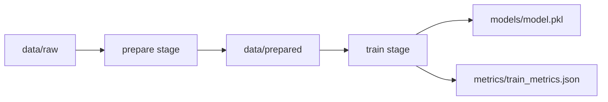

# 数据版本管理（DVC）

机器学习项目的核心挑战之一是数据和模型的可复现性——仅用 Git 管理代码，无法追踪训练数据、特征文件和模型权重的变化。DVC（Data Version Control）正是为此而生，它像 Git 管理代码一样管理数据和 ML pipeline，让团队协作与实验复现变得可靠。

---

## 为什么需要数据版本管理

在 ML 项目中，以下场景极为常见：

- 三周后再运行同一实验，结果不可复现，原因是训练数据已被更新
- 团队成员无法共享同一份处理好的特征文件，各自重复预处理
- 模型准确率突然下降，找不到是哪次数据变更导致的

Git 本身不适合存储大文件（GitHub 限制单文件 100MB），而数据集动辄 GB/TB 级别。DVC 的解决思路是：**数据文件存到远端（S3、GCS 等），只把轻量的 `.dvc` 指针文件提交到 Git**，从而获得版本追踪能力，同时不污染代码仓库。

---

## DVC vs Git：各自负责什么

| 管理对象 | 工具 | 存储位置 |
|---|---|---|
| 代码、配置、脚本 | Git | GitHub / GitLab |
| 数据集、特征文件 | DVC | S3 / GCS / 本地 remote |
| 模型权重 | DVC | S3 / GCS / 本地 remote |
| `.dvc` 指针文件 | Git（跟踪 DVC 产物）| GitHub / GitLab |
| `dvc.yaml` pipeline 定义 | Git | GitHub / GitLab |

两者配合：切换 Git 分支时，`.dvc` 文件随之变化，执行 `dvc checkout` 即可自动切换到对应版本的数据。

---

## 核心概念

### .dvc 文件

`dvc add data/train.csv` 会生成 `data/train.csv.dvc`，内容示例：

```yaml
outs:
- md5: a1b2c3d4e5f6...
  size: 104857600
  path: train.csv
```

这个小文件通过 MD5 哈希精确指向某一版本的数据，提交到 Git 后即完成版本锁定。同时，DVC 会自动将 `data/train.csv` 加入 `.gitignore`，防止大文件误入 Git。

### DVC Cache

DVC 在本地维护一个 `.dvc/cache` 目录（默认），所有被追踪的文件都按哈希值存储在此。工作区的数据文件实际上是 cache 中对应文件的硬链接（或拷贝），切换版本时开销极小。

### Remote Storage

Remote 是团队共享数据的中央仓库，类似 Git 的 origin。常见配置：

```bash
# 添加 S3 remote
dvc remote add -d myremote s3://my-bucket/dvc-storage

# 添加本地目录作为 remote（适合本地测试）
dvc remote add -d localremote /tmp/dvc-remote
```

支持的存储类型：Amazon S3、Google Cloud Storage、Azure Blob Storage、SSH、本地目录等（以官方文档为准）。

---

## 基本工作流

### 初始化

```bash
git init
dvc init
git commit -m "init DVC"
```

`dvc init` 会在 `.dvc/` 目录下创建配置文件，并自动提交 `.dvc/.gitignore` 等基础文件。

### 追踪数据

```bash
# 追踪整个目录
dvc add data/

# 追踪单个文件
dvc add data/train.csv

# 将 .dvc 文件提交到 Git
git add data/.gitignore data/train.csv.dvc
git commit -m "add training data v1"
```

### 推送与拉取

```bash
# 推送数据到 remote
dvc push

# 团队成员拉取数据
git pull
dvc pull
```

`dvc pull` 会根据当前 `.dvc` 文件中的哈希，从 remote 下载对应版本的文件到本地 cache 并恢复到工作区。

### 数据版本切换

```bash
git checkout v1.0
dvc checkout   # 自动恢复到 v1.0 对应的数据
```

---

## DVC Pipelines

Pipeline 是 DVC 最强大的功能之一，将数据处理和模型训练定义为有依赖关系的 stage，实现自动化的增量执行。

### dvc.yaml 结构

```yaml
stages:
  prepare:
    cmd: python src/prepare.py
    deps:
      - src/prepare.py
      - data/raw
    outs:
      - data/prepared

  train:
    cmd: python src/train.py
    deps:
      - src/train.py
      - data/prepared
    outs:
      - models/model.pkl
    metrics:
      - metrics/train_metrics.json:
          cache: false
```

### 执行 Pipeline

```bash
# 执行整个 pipeline（仅重新运行有变化的 stage）
dvc repro

# 查看 pipeline 依赖关系图
dvc dag
```

`dvc repro` 会检测每个 stage 的 deps 是否发生变化，只重新执行必要的步骤，显著节省时间。

### Pipeline 流程示意



---

## 与 Git 的完整集成

一个典型的项目结构：

```
project/
├── .dvc/
│   ├── config          # remote 配置
│   └── .gitignore
├── data/
│   ├── .gitignore      # 自动生成，忽略 raw/prepared 等大文件
│   └── raw.dvc         # 指针文件，提交到 Git
├── models/
│   └── model.pkl.dvc
├── src/
│   ├── prepare.py
│   └── train.py
├── dvc.yaml            # pipeline 定义
├── dvc.lock            # pipeline 执行状态锁文件（类似 package-lock.json）
└── params.yaml         # 超参数文件
```

`dvc.lock` 记录每次 `dvc repro` 后各 stage 的输入输出哈希，提交到 Git 后即锁定了完整的实验状态。

---

## 常见陷阱

**1. 大文件意外提交到 Git**

最常见的错误。一旦提交，即使之后删除，文件依然存在于 Git history 中，仓库会永久膨胀。

```bash
# 预防：配置 pre-commit hook 检查文件大小
# 或在 .gitattributes 中强制检查

# 补救（危险操作，影响所有人）：
git filter-branch 或 git-filter-repo
```

**2. Cache 目录无限增长**

每个版本的数据都保存在 `.dvc/cache`，长期使用后占用大量磁盘。

```bash
# 清理不再被任何 .dvc 文件引用的 cache
dvc gc --workspace

# 只保留最近 N 个 Git commit 对应的 cache
dvc gc --all-commits
```

**3. 未配置 remote 就执行 push/pull**

会报错。团队协作时应将 remote 配置写入 `.dvc/config` 并提交，避免每人单独配置。

**4. dvc.lock 冲突**

多人并行修改 pipeline 时，`dvc.lock` 容易产生 merge conflict。解决方式：保持 stage 职责单一，减少并行修改同一 stage 的情况。

---

## 最佳实践

- **params.yaml 管理超参数**：将学习率、batch size 等配置统一放入 `params.yaml`，在 `dvc.yaml` 中声明为 `params` 依赖，变更超参数时 DVC 会自动感知并重新执行相关 stage
- **metrics 不入 cache**：评估指标文件设置 `cache: false`，让 Git 直接追踪，方便用 `dvc metrics show` 和 `dvc metrics diff` 对比实验结果
- **每次实验打 Git tag**：`git tag exp-lr0.01-acc0.92` 配合 `.dvc` 文件，精确复现任意历史实验
- **CI/CD 中配置 DVC remote 凭证**：通过环境变量注入 AWS/GCS 凭证，避免硬编码到配置文件

---

## 面试高频问题

**Q: 如何保证 ML 实验的可复现性？**

完整的可复现性需要三要素：代码版本（Git commit）、数据版本（DVC + `.dvc` 文件）、环境版本（Docker 镜像或 `requirements.txt`）。仅靠 Git 管代码远远不够，数据变化同样会导致结果差异。

**Q: DVC 和 MLflow 有什么区别？**

| 维度 | DVC | MLflow |
|---|---|---|
| 核心定位 | 数据/模型版本管理 + pipeline | 实验追踪 + 模型注册 |
| 数据存储 | 外部 remote（S3 等）| 不管理原始数据 |
| 与 Git 关系 | 深度集成，依赖 Git | 独立运行 |
| Pipeline 支持 | 原生支持 | 不支持 |

两者常配合使用：DVC 管数据和 pipeline，MLflow 追踪实验指标和模型版本。

**Q: 如果数据集非常大（TB 级别），DVC 还适用吗？**

适用，但需要注意：local cache 空间可能成为瓶颈，可以配置 `cache.type = symlink` 减少磁盘占用；对于超大数据集，可以只追踪数据集的分区目录而非整体，减少单次 push/pull 的粒度。

**Q: dvc repro 和直接运行脚本有什么优势？**

`dvc repro` 基于内容哈希进行增量执行——只要 deps 没有变化，即使重新运行也会跳过该 stage，避免重复的高成本计算（如数据预处理、模型训练）。同时它保证了执行顺序符合依赖图，不会出现用旧数据训练新模型的错误。
