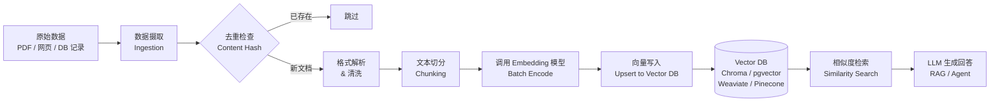

*图：沿图中的节点与箭头阅读，重点是文档版本、解析、chunking、模型版本、批处理、去重、索引发布和回滚做成可重放管道。*

---

Embedding Pipeline 是将原始文档转化为向量表示并持久化到向量数据库的完整自动化流程，是 RAG（Retrieval-Augmented Generation）系统和 Agent 记忆（Memory）模块的核心基础设施。这条管道的每一个设计决策——切分粒度、模型选择、ID 策略——都直接影响检索质量和系统的可维护性。

## 整体架构



管道各步骤存在质量乘法效应：任何一环做差，后续步骤无法弥补。上游的 chunking 策略决定了向量的语义粒度，直接影响下游的召回率（Recall）。

## 第一步：数据摄取（Ingestion）

数据来源通常多样——PDF 报告、网页、数据库记录、Markdown 文档、代码文件。摄取阶段需解决三个核心问题。

### 格式解析与清洗

- **PDF**：用 `pdfplumber` 或 `pymupdf` 提取文本，注意去除页眉页脚、页码、水印
- **HTML**：用 `BeautifulSoup` 去除标签、导航栏、广告等噪音，保留正文
- **Markdown/代码**：保留结构信息（标题层级、代码块），有助于后续语义切分

### 基于内容哈希的去重

```python
import hashlib
from dataclasses import dataclass, field
from typing import Optional

@dataclass
class Document:
    """统一的文档数据模型，贯穿整个 pipeline。"""
    doc_id: str                    # 业务层唯一标识（如文件路径或 URL）
    content: str                   # 清洗后的纯文本
    content_hash: str = field(init=False)  # 内容指纹，用于去重
    metadata: dict = field(default_factory=dict)  # 来源 URL、创建时间等

    def __post_init__(self):
        # SHA-256 比 MD5 碰撞概率更低，推荐用于去重
        self.content_hash = hashlib.sha256(
            self.content.encode("utf-8")
        ).hexdigest()

class DocumentStore:
    """维护已处理文档的哈希集合，支持增量去重。"""

    def __init__(self):
        self._seen_hashes: set[str] = set()

    def is_duplicate(self, doc: Document) -> bool:
        return doc.content_hash in self._seen_hashes

    def mark_seen(self, doc: Document) -> None:
        self._seen_hashes.add(doc.content_hash)
```

### 元数据提取

每条文档记录应携带充足的 metadata，供后续按来源、时间、权限过滤检索：

```python
import os
from datetime import datetime

def extract_metadata(file_path: str) -> dict:
    """从文件系统提取基础元数据。"""
    stat = os.stat(file_path)
    return {
        "source": file_path,
        "file_name": os.path.basename(file_path),
        "file_size_bytes": stat.st_size,
        "created_at": datetime.fromtimestamp(stat.st_ctime).isoformat(),
        "modified_at": datetime.fromtimestamp(stat.st_mtime).isoformat(),
    }
```

## 第二步：文本切分（Chunking）

Chunking 是 embedding pipeline 中对检索质量影响最大的环节。没有放之四海皆准的最优策略，需根据文档类型和查询粒度权衡。

### 三种主流策略对比

| 策略 | 实现思路 | 优点 | 缺点 | 适用场景 |
|------|----------|------|------|----------|
| 固定大小（Fixed-size） | 按字符数 / token 数切分，允许重叠 | 实现简单，速度快 | 可能在语义中间截断 | 快速原型、均匀格式文档 |
| 句子级（Sentence-based） | 按标点断句，合并到阈值大小 | 语义完整性好 | Chunk 大小不均匀 | 新闻、文章、FAQ |
| 语义切分（Semantic chunking） | 计算相邻句子 embedding 距离，距离突变处切分 | 边界最准确 | 计算成本高 | 长篇合同、技术规范 |

### 固定大小切分（带重叠）

```python
def fixed_size_chunk(
    text: str,
    chunk_size: int = 512,
    overlap: int = 64,
) -> list[str]:
    """
    固定大小切分，overlap 防止关键信息被物理截断。
    overlap 建议取 chunk_size 的 10%–20%。
    """
    chunks = []
    start = 0
    while start < len(text):
        end = min(start + chunk_size, len(text))
        chunks.append(text[start:end])
        if end == len(text):
            break
        # 下一个 chunk 从 (start + chunk_size - overlap) 开始
        start += chunk_size - overlap
    return chunks
```

### 语义切分（Semantic Chunking）核心思路

```python
from sentence_transformers import SentenceTransformer
import numpy as np

def semantic_chunk(
    text: str,
    model: SentenceTransformer,
    threshold: float = 0.3,  # 余弦距离超过该阈值则切分
) -> list[str]:
    """
    计算相邻句子的 embedding 余弦距离，距离突变处作为 chunk 边界。
    threshold 越小，切分越细；越大，切分越粗。
    """
    # 简单按句号断句（生产环境建议用 spaCy 或 NLTK）
    sentences = [s.strip() for s in text.split("。") if s.strip()]
    if len(sentences) <= 1:
        return sentences

    embeddings = model.encode(sentences, normalize_embeddings=True)

    chunks = []
    current_chunk_sentences = [sentences[0]]

    for i in range(1, len(sentences)):
        # 余弦相似度 = 归一化向量的点积；距离 = 1 - 相似度
        similarity = float(np.dot(embeddings[i - 1], embeddings[i]))
        distance = 1 - similarity

        if distance > threshold:
            # 语义发生显著跳变，在此处切分
            chunks.append("。".join(current_chunk_sentences) + "。")
            current_chunk_sentences = [sentences[i]]
        else:
            current_chunk_sentences.append(sentences[i])

    if current_chunk_sentences:
        chunks.append("。".join(current_chunk_sentences) + "。")

    return chunks
```

### 选择建议

- **技术文档 / FAQ**：句子级或固定大小（chunk_size ≈ 256–512 tokens）
- **长篇叙述 / 法律合同**：语义切分，保证段落语义完整
- **代码文件**：按函数 / 类边界切分，而非字符数
- **快速原型验证**：固定大小 + overlap，够用且易调试

## 第三步：Embedding 模型选型

### 开源 vs API 对比

| 维度 | 开源（sentence-transformers） | API（如 OpenAI、Cohere） |
|------|-------------------------------|--------------------------|
| 成本 | 仅推理算力（GPU/CPU） | 按 token 数计费 |
| 延迟 | 本地推理，可控、无网络 RTT | 受网络和限流影响 |
| 运维 | 自行部署、管理模型版本 | 全托管，零运维 |
| 向量维度 | 通常 384 / 768 / 1024 | 取决于提供商 |
| 中文支持 | 需选中文预训练模型 | 多语言模型通常支持较好 |

常用开源模型参考：
- `all-MiniLM-L6-v2`（英文，384 维，速度快）
- `paraphrase-multilingual-MiniLM-L12-v2`（多语言，384 维）
- `BAAI/bge-large-zh-v1.5`（中文优化，1024 维，质量高）

### 批量 Embedding 实现

```python
from sentence_transformers import SentenceTransformer
from typing import Optional
import numpy as np

class EmbeddingEncoder:
    """封装 embedding 模型，支持批量编码和错误重试。"""

    def __init__(self, model_name: str = "BAAI/bge-large-zh-v1.5"):
        # 固定模型版本，避免升级后向量空间变化导致检索失效
        self.model = SentenceTransformer(model_name)
        self.model_name = model_name

    def encode_batch(
        self,
        texts: list[str],
        batch_size: int = 32,
        normalize: bool = True,
    ) -> list[list[float]]:
        """
        批量编码文本。normalize=True 输出 L2 归一化向量，
        归一化后余弦相似度等价于点积，向量库查询更高效。
        """
        if not texts:
            return []

        embeddings: np.ndarray = self.model.encode(
            texts,
            batch_size=batch_size,
            normalize_embeddings=normalize,
            show_progress_bar=len(texts) > 100,  # 大批量时显示进度
        )
        return embeddings.tolist()
```

**批量处理注意事项**：

- 使用 API 时，单次请求不超过模型 token 上限（通常 8192 tokens），大批量需分批请求
- API 调用加指数退避重试（Exponential Backoff），防止限流（Rate Limiting）导致数据丢失
- 本地 GPU 推理时，`batch_size` 过大会 OOM，从 32 开始调参

## 第四步：写入向量数据库（Upsert）

[pgvector 维护者文档](https://github.com/pgvector/pgvector) 区分精确扫描、HNSW 与 IVFFlat，并记录距离操作符和索引参数；发布新索引前应以目标过滤条件验证召回与延迟。


### 主流向量数据库选型参考

| 数据库 | 部署方式 | 亮点 | 适用场景 |
|--------|----------|------|----------|
| **Chroma** | 本地 / 自部署 | 零配置、开发友好 | 原型开发、小规模 |
| **pgvector** | PostgreSQL 扩展 | 无额外基础设施 | 已有 PG、混合查询 |
| **Weaviate** | 自部署 / 云托管 | 内置 BM25 混合搜索 | 需要关键词 + 向量混合 |
| **Pinecone** | 全托管 SaaS | 零运维、高并发 | 生产环境快速上线 |
| **Qdrant** | 自部署 / 云托管 | 高性能、支持 payload 过滤 | 大规模、复杂过滤 |

### Upsert 写入示例（Chroma）

Upsert（有则更新、无则插入）是标准写入模式，必须携带**稳定且唯一的 ID**，通常用 `{doc_id}_chunk_{index}` 格式。

```python
import chromadb
from chromadb.config import Settings

# 创建持久化客户端（生产环境指定存储路径）
client = chromadb.PersistentClient(path="./chroma_db")
collection = client.get_or_create_collection(
    name="knowledge_base",
    metadata={"hnsw:space": "cosine"},  # 指定相似度空间
)

def upsert_chunks(
    chunks: list[str],
    embeddings: list[list[float]],
    doc_id: str,
    doc_metadata: dict,
) -> None:
    """
    将切分后的 chunks 和对应 embeddings 写入向量库。
    ID 格式：{doc_id}_chunk_{index}，支持按 doc_id 前缀批量删除。
    """
    ids = [f"{doc_id}_chunk_{i}" for i in range(len(chunks))]

    # 每个 chunk 继承文档级 metadata，并记录 chunk 位置
    metadatas = [
        {**doc_metadata, "chunk_index": i, "total_chunks": len(chunks)}
        for i in range(len(chunks))
    ]

    collection.upsert(
        ids=ids,
        documents=chunks,
        embeddings=embeddings,
        metadatas=metadatas,
    )
    print(f"[upsert] {doc_id}: {len(chunks)} chunks 写入完成")
```

## 完整 Pipeline 骨架

将以上四步串联成可复用的自动化管道：

```python
from dataclasses import dataclass, field
import hashlib

@dataclass
class PipelineConfig:
    """Pipeline 配置，集中管理可调参数。"""
    chunk_size: int = 512
    chunk_overlap: int = 64
    embedding_model: str = "BAAI/bge-large-zh-v1.5"
    embedding_batch_size: int = 32
    collection_name: str = "knowledge_base"

class EmbeddingPipeline:
    """端到端 Embedding Pipeline，从原始文本到向量库写入。"""

    def __init__(self, config: PipelineConfig):
        self.config = config
        self.encoder = EmbeddingEncoder(config.embedding_model)
        self.doc_store = DocumentStore()
        # 初始化向量库连接（此处以 Chroma 为示例）
        self._init_vector_store()

    def _init_vector_store(self):
        import chromadb
        client = chromadb.PersistentClient(path="./chroma_db")
        self.collection = client.get_or_create_collection(
            name=self.config.collection_name,
            metadata={"hnsw:space": "cosine"},
        )

    def process_document(self, doc: Document) -> bool:
        """
        处理单篇文档的完整流程。
        返回 True 表示成功处理，False 表示跳过（重复）。
        """
        # Step 1: 去重检查
        if self.doc_store.is_duplicate(doc):
            print(f"[skip] {doc.doc_id} 内容未变更，跳过")
            return False

        # Step 2: 文本切分
        chunks = fixed_size_chunk(
            doc.content,
            chunk_size=self.config.chunk_size,
            overlap=self.config.chunk_overlap,
        )

        # Step 3: Embedding 编码
        embeddings = self.encoder.encode_batch(
            chunks,
            batch_size=self.config.embedding_batch_size,
        )

        # Step 4: 写入向量库
        upsert_chunks(
            chunks=chunks,
            embeddings=embeddings,
            doc_id=doc.doc_id,
            doc_metadata={**doc.metadata, "content_hash": doc.content_hash},
        )

        # 标记已处理
        self.doc_store.mark_seen(doc)
        return True

    def process_batch(self, docs: list[Document]) -> dict:
        """批量处理，返回统计摘要。"""
        processed, skipped = 0, 0
        for doc in docs:
            if self.process_document(doc):
                processed += 1
            else:
                skipped += 1
        return {"processed": processed, "skipped": skipped, "total": len(docs)}
```

## 增量更新：新增 / 修改 / 删除

生产环境中文档会持续变化，pipeline 必须支持增量更新而非全量重建。

```python
def update_document(collection, doc: Document, encoder: EmbeddingEncoder) -> None:
    """
    文档更新策略：先删除所有旧 chunk，再写入新 chunk。
    不可原地修改，因为 chunk 数量和边界可能都变了。
    """
    # 1. 删除该文档的所有旧 chunk
    delete_document(collection, doc.doc_id)

    # 2. 重新切分 + embed + upsert
    chunks = fixed_size_chunk(doc.content)
    embeddings = encoder.encode_batch(chunks)
    upsert_chunks(chunks, embeddings, doc.doc_id, doc.metadata)
    print(f"[update] {doc.doc_id} 更新完成，新 chunk 数：{len(chunks)}")

def delete_document(collection, doc_id: str) -> None:
    """按 doc_id metadata 过滤并批量删除对应的所有 chunk vector。"""
    results = collection.get(where={"doc_id": doc_id})
    if results["ids"]:
        collection.delete(ids=results["ids"])
        print(f"[delete] {doc_id}: 删除 {len(results['ids'])} 个 chunk")
    else:
        print(f"[delete] {doc_id}: 未找到对应 chunk，忽略")
```

## 生产环境考量

### 异步任务队列

[Airflow 核心概念](https://airflow.apache.org/docs/apache-airflow/stable/core-concepts/index.html) 用 DAG、task、数据间隔和重试表达可重放编排；embedding 管道应让每步输出可识别版本，才能安全重试。


大规模 embedding 是 CPU/GPU 密集型操作，不应阻塞主进程。使用 Celery + Redis 或 RQ 将每篇文档作为独立任务异步执行：

```python
# 使用 Celery 的示意（配置以官方文档为准）
# from celery import Celery
# app = Celery("pipeline", broker="redis://localhost:6379/0")
#
# @app.task(bind=True, max_retries=3, default_retry_delay=60)
# def embed_document_task(self, doc_id: str, content: str, metadata: dict):
#     try:
#         doc = Document(doc_id=doc_id, content=content, metadata=metadata)
#         pipeline.process_document(doc)
#     except Exception as exc:
#         raise self.retry(exc=exc)
```

### 模型版本固定（Model Version Pinning）

Embedding 模型升级后，新旧向量处于不同的语义空间，**无法混用**。策略：

1. 在 metadata 中记录每条 vector 使用的模型名称和版本
2. 升级模型时，重新 embed 全库（可分批在低峰期执行）
3. 灰度期间维护新旧两个 collection，逐步迁移流量

### 监控 Embedding 质量

[MTEB](https://arxiv.org/abs/2210.07316) 证明 embedding 表现随任务和数据集而变化，因此模型升级必须在领域评测集上比较，而不能只检查向量是否成功写入。


```python
import numpy as np

def evaluate_retrieval_quality(
    collection,
    qa_pairs: list[dict],  # [{"query": "...", "expected_doc_id": "..."}]
    encoder: EmbeddingEncoder,
    top_k: int = 5,
) -> dict:
    """
    用 ground truth QA 对评估检索命中率（Hit Rate@k）。
    这是评估 chunking + embedding 策略效果的标准方法。
    """
    hits = 0
    for qa in qa_pairs:
        query_embedding = encoder.encode_batch([qa["query"]])[0]
        results = collection.query(
            query_embeddings=[query_embedding],
            n_results=top_k,
        )
        # 检查 expected doc 是否在 top-k 结果中
        retrieved_doc_ids = [
            m["doc_id"] for m in results["metadatas"][0]
        ]
        if qa["expected_doc_id"] in retrieved_doc_ids:
            hits += 1

    hit_rate = hits / len(qa_pairs) if qa_pairs else 0.0
    return {"hit_rate_at_k": hit_rate, "k": top_k, "total_queries": len(qa_pairs)}
```

## AI/Agent 专项应用

**Agent 知识库（Knowledge Base for Agents）**

Agent 通过 RAG 访问外部知识，避免将所有信息塞入 context window。Embedding pipeline 是知识库的写入通道，检索器（Retriever）是读取通道。工具调用中通常封装为 `search_knowledge_base(query: str) -> list[str]`。

**语义记忆（Semantic Memory）**

Agent 将历史对话或执行轨迹以 embedding 形式存储，后续通过语义相似度检索相关记忆，而非简单地保留最近 N 条。这是 Long-term Memory 的核心实现方式。

**多租户向量存储（Multi-tenant Vector Stores）**

SaaS 场景中，不同用户/租户的知识库必须严格隔离。实现方式：
- 物理隔离：每个租户一个 collection（简单，但 collection 数量受限）
- 逻辑隔离：共用 collection，用 `tenant_id` 作为 metadata 过滤条件（推荐大规模场景）

## 常见误区

1. **Chunk 过大或过小**：chunk 过大（>1024 tokens）时单个 chunk 信息密度高但与短查询的语义对齐度低，召回不精准；chunk 过小（<64 tokens）时丢失上下文，LLM 生成回答时信息不足。合理起点：128–512 tokens，根据 Hit Rate 实验调整。

2. **不带 overlap 的固定切分**：跨 chunk 边界的关键句子被物理截断，两个相邻 chunk 都只含半段信息，检索时两个都无法准确命中。固定大小切分必须配合 overlap（建议 10%–20%）。

3. **未设计 ID 策略就写入**：随机生成 UUID 作为 chunk ID，文档更新时无法定位旧 chunk，导致向量库累积大量过时向量，污染检索结果。ID 必须可预测：`f"{doc_id}_chunk_{index}"`。

4. **Embedding 模型升级后未重建索引**：新旧模型的向量空间不兼容，混用导致检索结果随机错乱，且问题难以定位。每次模型升级必须全库重新 embed。

5. **只看 embedding 相似度、不做端到端评估**：两个向量的余弦相似度高不等于检索对下游 LLM 生成有帮助。正确做法是构建包含 ground truth 的 QA 评估集，以 Hit Rate@k 或 MRR 为主要指标，端到端评估整条 RAG 链路。

## 最佳实践

1. **先用小数据集做策略实验**：在 200–500 条文档上对比不同 chunking 策略（固定大小 / 句子级 / 语义切分）和 chunk_size 参数的 Hit Rate，确定最优配置后再上线全量。

2. **为每条 vector 存储充足 metadata**：至少包含 `doc_id`、`source`、`chunk_index`、`model_name`、`created_at`。Metadata 是后续按来源过滤、按时间刷新、按租户隔离的基础，缺失后无法补救。

3. **embedding 模型固定版本，升级前重建全库**：在 `requirements.txt` 中固定 `sentence-transformers` 和模型版本；模型更新时，全库重新 embed 并切换 collection，不要新旧混用。

4. **大规模 pipeline 用异步任务队列驱动**：将 embedding 任务提交到 Celery/RQ 队列，主进程异步触发，失败自动重试，并监控队列积压情况，避免阻塞 API 服务。

5. **定期监控 Hit Rate，建立数据飞轮**：收集用户反馈（如 RAG 回答的点赞/踩）和真实查询日志，构建 QA 评估集，每次更新 chunking 策略或 embedding 模型后跑评估对比，形成数据驱动的持续优化循环。

## 面试高频

**Q：如何选择合适的 chunk 大小？**

没有固定答案，取决于查询粒度和文档特性。查询通常是短问题时，chunk 应更小（128–256 tokens）以提高精准度；查询需要段落级上下文时，chunk 可更大（512–1024 tokens）。实践方法：构建包含 ground truth 的 QA 评估集，对不同 chunk_size 和 overlap 参数计算 Hit Rate@5，选择最优配置。代码要简单，实验不能省。

**Q：文档更新后如何处理已有 embedding？**

标准做法：以 `doc_id` 为键，先按 metadata 过滤删除该文档所有旧 chunk vector，再对新内容重新切分 + embed + upsert。不能原地修改，因为文档修改后 chunk 的数量和边界通常都变了，旧 ID 与新内容无法对应。删除 + 重写是最简单可靠的策略。

**Q：cosine similarity 和欧氏距离在向量检索中如何选择？**

cosine similarity 度量向量方向（语义方向相似度），对向量长度不敏感，适合文本 embedding——不同长度的文档词频不同，向量模长差异大。欧氏距离度量绝对距离，适合向量已归一化或各维度含义一致的场景。大多数文本 embedding 模型输出 L2 归一化向量，此时两者等价。选型时以向量库默认配置和模型官方推荐为准。

**Q：如何解决 embedding 召回率低的问题？**

排查路径：(1) 检查 embedding 模型与语言/领域是否匹配（中文场景用中文预训练模型）；(2) 检查 chunking 策略是否将关键信息截断（缩小 chunk_size 或加大 overlap）；(3) 检查查询与 chunk 的语义对称性——用查询的多种表达方式测试是否都能命中目标 chunk；(4) 考虑混合搜索（BM25 + dense vector），BM25 对关键词精确匹配效果好，可以互补；(5) 必要时对领域数据做 embedding 模型的 fine-tune。

## 参考资料

- [Apache Airflow core concepts](https://airflow.apache.org/docs/apache-airflow/stable/core-concepts/index.html)
- [MTEB: Massive Text Embedding Benchmark](https://arxiv.org/abs/2210.07316)
- [pgvector official documentation](https://github.com/pgvector/pgvector)
