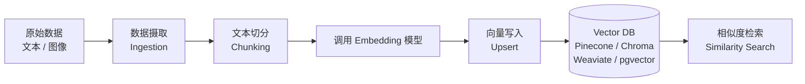

Embedding pipeline 是将原始文本（或图像）转化为向量表示、并持久化到向量数据库的完整自动化流程，是 RAG（Retrieval-Augmented Generation）系统的核心基础设施。构建好这条管道，直接决定了后续相似度检索的质量和系统的可维护性。

## 整体架构



管道的每一步都存在设计决策，错误的选择会导致召回率低或存储浪费。

## 第一步：数据摄取（Ingestion）

数据来源多样——PDF、网页、数据库记录、代码文件。摄取阶段需要解决：

- **格式解析**：PDF 去除页眉页脚、HTML 去除标签噪音
- **去重**：根据内容哈希（如 MD5 / SHA256）判断文档是否已存在，避免重复 embedding
- **元数据提取**：记录来源 URL、创建时间、文档 ID，便于后续过滤检索

```python
import hashlib

def compute_doc_hash(text: str) -> str:
    return hashlib.sha256(text.encode("utf-8")).hexdigest()

def is_duplicate(doc_hash: str, seen_hashes: set) -> bool:
    return doc_hash in seen_hashes
```

## 第二步：文本切分（Chunking）

Chunking 是 embedding pipeline 中最影响质量的环节，没有银弹，需根据场景权衡。

### 三种主流策略

| 策略 | 做法 | 优点 | 缺点 |
|------|------|------|------|
| 固定大小（Fixed-size） | 按字符数或 token 数切分，允许少量重叠（overlap） | 实现简单、速度快 | 可能在语义中间截断 |
| 句子级（Sentence-based） | 按句号/换行分句，合并到阈值大小 | 语义完整性好 | chunk 大小不均匀 |
| 语义切分（Semantic chunking） | 计算相邻句子的 embedding 距离，距离突变处切分 | 语义边界最准确 | 计算成本高，速度慢 |

**重叠（Overlap）的作用**：固定大小切分时加入 10%–20% 的字符重叠，防止跨 chunk 的上下文丢失。代价是存储量略有增加。

```python
def fixed_size_chunk(text: str, chunk_size: int = 512, overlap: int = 64) -> list[str]:
    chunks = []
    start = 0
    while start < len(text):
        end = start + chunk_size
        chunks.append(text[start:end])
        start += chunk_size - overlap
    return chunks
```

### 选择建议

- 技术文档、代码：句子级或固定大小（chunk_size ≈ 512 tokens）
- 长篇叙述、法律合同：语义切分，保证段落完整
- 快速原型：固定大小 + 少量 overlap，够用且易调试

## 第三步：调用 Embedding 模型

### 开源 vs API 对比

| 维度 | 开源（sentence-transformers） | API（如 OpenAI、Cohere） |
|------|-------------------------------|--------------------------|
| 成本 | 仅推理算力 | 按 token 计费 |
| 延迟 | 本地推理，可控 | 网络 RTT |
| 维护 | 自行部署、更新 | 托管，零运维 |
| 向量维度 | 取决于模型（常见 384、768） | 取决于提供商 |

**开源用法骨架**（以 `sentence-transformers` 为例，以官方文档为准）：

```python
from sentence_transformers import SentenceTransformer

model = SentenceTransformer("all-MiniLM-L6-v2")  # 384 维，速度快

def embed_chunks(chunks: list[str]) -> list[list[float]]:
    # encode 支持批量输入，返回 numpy array
    embeddings = model.encode(chunks, batch_size=32, show_progress_bar=False)
    return embeddings.tolist()
```

**API 用法骨架**（通用模式，具体参数以官方文档为准）：

```python
import openai  # 版本以官方文档为准

def embed_chunks_api(chunks: list[str], model: str = "text-embedding-3-small") -> list[list[float]]:
    response = openai.embeddings.create(input=chunks, model=model)
    return [item.embedding for item in response.data]
```

**批量处理注意事项**：
- 单次请求不要超过模型的 token 上限
- 大批量时加指数退避重试，防止限流
- 本地模型用 GPU 时注意显存，batch_size 过大会 OOM

## 第四步：写入向量数据库（Upsert）

常见选型简介：

- **Chroma**：本地优先，开发调试方便，适合原型
- **pgvector**：PostgreSQL 扩展，已有 PG 基础设施时零额外成本
- **Weaviate**：自带模块化 embedding 集成，支持混合搜索（BM25 + vector）
- **Pinecone**：全托管，运维零成本，适合生产环境快速上线

Upsert（有则更新、无则插入）是 embedding pipeline 的标准写入模式，必须携带稳定的 `id`（通常用文档 hash 或 `{doc_id}_{chunk_index}`）以支持增量更新。

```python
# 以 Chroma 为例（以官方文档为准）
import chromadb

client = chromadb.Client()
collection = client.get_or_create_collection("knowledge_base")

def upsert_to_store(
    chunks: list[str],
    embeddings: list[list[float]],
    doc_id: str,
) -> None:
    ids = [f"{doc_id}_chunk_{i}" for i in range(len(chunks))]
    collection.upsert(
        ids=ids,
        documents=chunks,
        embeddings=embeddings,
        metadatas=[{"doc_id": doc_id, "chunk_index": i} for i in range(len(chunks))],
    )
```

## 完整 Pipeline 骨架

将以上步骤串联成可复用的自动化管道：

```python
import hashlib
from typing import Protocol

class VectorStore(Protocol):
    def upsert(self, ids, documents, embeddings, metadatas): ...

def run_embedding_pipeline(
    raw_text: str,
    doc_id: str,
    store: VectorStore,
    seen_hashes: set[str],
    chunk_size: int = 512,
    overlap: int = 64,
) -> None:
    # 1. 去重检查
    doc_hash = hashlib.sha256(raw_text.encode()).hexdigest()
    if doc_hash in seen_hashes:
        print(f"[skip] {doc_id} 已存在，跳过")
        return
    seen_hashes.add(doc_hash)

    # 2. 切分
    chunks = fixed_size_chunk(raw_text, chunk_size, overlap)

    # 3. Embedding
    embeddings = embed_chunks(chunks)  # 返回 list[list[float]]

    # 4. 写入向量库
    ids = [f"{doc_id}_{i}" for i in range(len(chunks))]
    store.upsert(
        ids=ids,
        documents=chunks,
        embeddings=embeddings,
        metadatas=[{"doc_id": doc_id, "chunk_index": i} for i in range(len(chunks))],
    )
    print(f"[done] {doc_id}: {len(chunks)} chunks 已写入")
```

## 增量更新与去重

生产环境的 pipeline 需要处理文档的新增、修改、删除：

- **新增**：hash 不在库中，正常写入
- **修改**：先删除旧 chunk（按 `doc_id` 前缀过滤），再写入新 chunk
- **删除**：按 metadata 中的 `doc_id` 批量删除对应 vector

```python
def delete_doc_from_store(collection, doc_id: str) -> None:
    # 查询该文档的所有 chunk id，再批量删除
    results = collection.get(where={"doc_id": doc_id})
    if results["ids"]:
        collection.delete(ids=results["ids"])
```

## 常见坑与最佳实践

**坑：**
- chunk 过大：单个 chunk 信息密度高但与查询的相关性低，导致召回不精准
- chunk 过小：丢失上下文，模型生成回答时缺乏足够信息
- 不带 overlap 的固定切分：跨 chunk 的关键信息被物理截断
- 同一文档多次写入且没有 id 策略：向量库中出现重复数据，影响排名

**最佳实践：**
- 先用小数据集对不同 chunk 策略做 end-to-end 评估（检索准确率），再上线
- embedding 模型固定版本，升级前需要重新 embed 全库
- 为每条 vector 存储充足 metadata，便于后续按来源、时间过滤
- 大规模场景用异步任务队列（Celery、RQ）驱动 pipeline，避免阻塞主进程

## 面试高频问题

**Q：如何选择 chunk 大小？**  
没有固定答案，取决于查询的粒度。查询通常是短句时，chunk 应更小（128–256 tokens）以提高精准度；查询需要段落级上下文时，chunk 可更大（512–1024 tokens）。建议用 RAG 评估集（ground truth QA pairs）实测不同参数的命中率。

**Q：文档更新后如何处理已有 embedding？**  
标准做法：以 `doc_id` 为键，先删除该文档的所有旧 chunk vector，再重新 chunk + embed + upsert。不要原地修改 vector，因为 chunk 数量和边界可能都变了。

**Q：cosine similarity 和欧氏距离在向量检索中如何选择？**  
cosine similarity 度量方向相似度，对向量长度不敏感，适合文本 embedding（不同长度的文档）；欧氏距离度量绝对距离，适合向量已归一化或维度含义一致的场景。大多数文本 embedding 模型输出已归一化，两者等价，但向量库默认配置以官方文档为准。

**Q：如何避免 embedding 质量差导致的低召回？**  
选择与任务语言和领域匹配的模型（如中文场景选中文预训练模型）；做 query 和 document 的对称性测试（同一语义的问法变体是否能命中相同 chunk）；必要时对领域数据做 fine-tune 或使用支持 instruction 的 embedding 模型。
