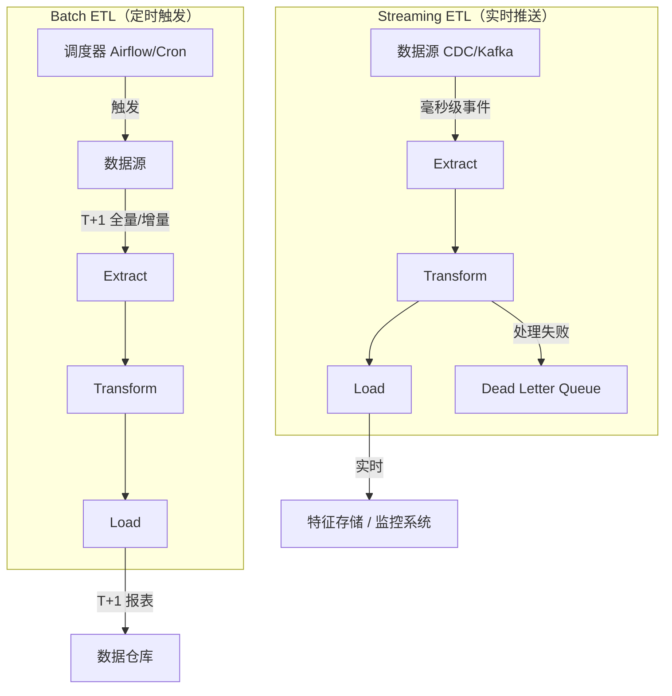

ETL（Extract、Transform、Load）是数据工程的基础架构模式，负责将分散的原始数据经过抽取、清洗转换后加载到目标存储，是构建数据仓库、AI 训练数据管道和特征存储（Feature Store）的核心能力。

## ETL 与 ELT：选型决策

ETL 和 ELT（Extract、Load、Transform）的本质区别在于**转换发生的位置**——是在数据进入目标系统之前，还是之后。

| 维度 | ETL | ELT |
|------|-----|-----|
| 转换时机 | 加载前在中间层转换 | 加载后在目标系统内转换 |
| 目标系统要求 | 写入质量高，目标算力低也可用 | 需目标系统有强大的计算能力（BigQuery、Snowflake） |
| 数据量级 | 适合中小规模（GB 级） | 适合大规模（TB/PB 级）|
| 灵活性 | 转换逻辑固化在管道中，改动成本高 | 转换逻辑（SQL）可随时修改，不需重新导入数据 |
| 典型工具 | Airflow + pandas/Spark | dbt + Snowflake/BigQuery |
| AI 场景 | 特征工程预处理写入特征存储 | 数仓内生成训练集，直接导出 |

**决策原则**：如果目标系统是传统 OLAP 数据库或者对写入数据质量有严格要求，选 ETL；如果目标系统是云数仓且转换逻辑频繁迭代，选 ELT。

## 三个核心阶段

### Extract（抽取）：增量策略是关键

全量抽取（Full Extract）简单但代价高，生产环境几乎都需要**增量抽取（Incremental Extract）**。三种主流策略：

| 策略 | 原理 | 优点 | 局限 |
|------|------|------|------|
| 时间戳（Timestamp） | `WHERE updated_at > last_run_time` | 实现简单，普遍适用 | 无法感知物理删除；依赖源表有 `updated_at` 字段 |
| 自增 ID（Auto-increment ID） | `WHERE id > last_max_id` | 绝对准确，无漂移问题 | 仅适合只追加不修改的表 |
| CDC（Change Data Capture） | 监听数据库 binlog（MySQL）或 WAL（PostgreSQL） | 捕获所有变更包括 DELETE；延迟最低 | 需要源库权限；架构复杂度高；需要 Debezium 等组件 |
| 全量哈希对比 | 对比两次快照的 MD5/hash | 无需源表改造 | 数据量大时性能差，通常只作兜底方案 |

CDC 是 AI 数据管道中使用最广的方式，能以近实时的方式将业务库变更同步到特征存储。

### Transform（转换）：隔离错误是核心原则

转换阶段最重要的设计原则是**错误隔离**——单条数据转换失败不能导致整个批次失败。常见操作分类：

**数据质量操作**
- **清洗（Cleaning）**：去除首尾空白、统一编码（UTF-8）、替换非法字符
- **去重（Deduplication）**：按业务主键（如 `order_id`）去重，而非依赖数据库自增主键
- **类型转换（Type Conversion）**：字符串日期 → `datetime`、货币字符串 → `Decimal`

**结构化操作**
- **聚合（Aggregation）**：按维度汇总指标（如按天统计用户 UV）
- **关联（Join）**：补全维度信息（如用 `user_id` 关联用户地区）
- **规范化（Normalization）**：将非结构化字段（JSON 列）拆展为标准列

### Load（加载）：写入策略影响幂等性

| 策略 | 操作 | 适用场景 | 幂等性 |
|------|------|----------|--------|
| 全量覆盖（Full Refresh） | 清空目标表再全量插入 | 小维度表、配置表 | 天然幂等 |
| 追加插入（Append） | 仅写入新增数据 | 日志、事件流水 | 需要去重保证 |
| Upsert（Merge） | 有则更新，无则插入 | 维度表、状态实体 | 天然幂等 |
| 分区覆盖（Partition Overwrite） | 按日期分区替换 | 大事实表的天级刷新 | 天然幂等（按分区） |

**Upsert 是最推荐的加载策略**，因为它天然支持幂等性，且对网络抖动、任务重试都能安全处理。

## Batch vs Streaming ETL



| 维度 | Batch ETL | Streaming ETL |
|------|-----------|---------------|
| 数据延迟 | 分钟到小时（T+1 常见） | 毫秒到秒 |
| 开发复杂度 | 低，失败直接重跑 | 高，需处理 exactly-once 语义 |
| 容错模型 | 重跑幂等批次 | Checkpoint + 偏移量管理 |
| 背压处理 | 不需要 | 必须设计背压（backpressure）策略 |
| 典型工具 | Airflow + Spark / pandas | Flink / Kafka Streams / Spark Structured Streaming |
| AI 适用场景 | 离线特征生成、训练数据准备 | 实时推荐特征更新、风控规则实时触发 |

**选型建议**：99% 的 BI 报表和 AI 离线训练用 Batch 就够了。Streaming 的运维成本是 Batch 的数倍，只有业务有明确实时性要求时才引入。

## 幂等性设计：ETL 健壮性的核心

**幂等性（Idempotency）** 指同一个操作执行一次和执行多次的结果完全相同。ETL 任务随时可能因网络超时、机器重启而中断，能否安全重试直接决定系统可靠性。

**实现幂等性的三种模式**：

1. **分区先删后插**：每次运行前先 `DELETE WHERE date_partition = '2024-01-01'`，再插入当天数据。适合按日期分区的事实表。

2. **Upsert**：利用数据库的 `ON CONFLICT DO UPDATE`（PostgreSQL）或 `REPLACE INTO`（MySQL），用业务主键做冲突检测。

3. **批次状态表**：维护一张 `etl_job_status` 表，记录每个 `(job_name, batch_date)` 的执行状态。任务启动时检查状态，跳过已成功的批次。

```python
# 幂等性检查示例：批次状态管理
def is_batch_already_processed(conn, job_name: str, batch_date: str) -> bool:
    """检查批次是否已成功处理，避免重复执行"""
    cursor = conn.execute(
        "SELECT status FROM etl_job_status WHERE job_name=? AND batch_date=?",
        (job_name, batch_date)
    )
    row = cursor.fetchone()
    return row is not None and row[0] == "success"

def mark_batch_success(conn, job_name: str, batch_date: str) -> None:
    conn.execute(
        """INSERT INTO etl_job_status (job_name, batch_date, status, updated_at)
           VALUES (?, ?, 'success', CURRENT_TIMESTAMP)
           ON CONFLICT(job_name, batch_date) DO UPDATE SET status='success'""",
        (job_name, batch_date)
    )
    conn.commit()
```

## 错误处理：Dead Letter Queue 模式

将错误分为两类，采用不同处理策略：

| 错误类型 | 示例 | 处理方式 |
|----------|------|----------|
| **可重试（Retryable）** | 网络超时、数据库连接断开、rate limit | 指数退避重试（exponential backoff），最多 3 次 |
| **不可重试（Non-retryable）** | 数据格式错误、字段缺失、业务规则违反 | 写入 Dead Letter Queue，记录原因，继续处理后续数据 |

**Dead Letter Queue（DLQ）** 是存放无法正常处理的脏数据的队列/表，关键设计要点：
- 保存原始数据（不丢失任何信息）
- 记录失败原因（error message + stack trace）
- 提供人工审核和补录机制

## Python 完整实现示例

下面是一个生产可用的 ETL pipeline，展示生成器抽取、错误隔离转换和批量 upsert 加载：

```python
import sqlite3
import requests
import logging
from datetime import datetime, timezone
from typing import Iterator
from dataclasses import dataclass, field

logging.basicConfig(level=logging.INFO, format="%(asctime)s %(levelname)s %(message)s")
logger = logging.getLogger(__name__)


@dataclass
class PipelineStats:
    """pipeline 运行统计，用于监控和告警"""
    extracted: int = 0
    transformed_ok: int = 0
    transform_failed: int = 0
    loaded: int = 0
    dead_letter: list = field(default_factory=list)

    @property
    def error_rate(self) -> float:
        if self.extracted == 0:
            return 0.0
        return self.transform_failed / self.extracted


# ── Extract ───────────────────────────────────────────────────────────────────

def extract_orders(api_url: str, since_id: int = 0, page_size: int = 100) -> Iterator[dict]:
    """
    分页抽取订单数据（生成器实现，避免一次性加载全量数据到内存）。
    since_id 实现基于自增 ID 的增量抽取。
    """
    page = 1
    while True:
        try:
            resp = requests.get(
                api_url,
                params={"page": page, "size": page_size, "since_id": since_id},
                timeout=10,
            )
            resp.raise_for_status()
        except requests.exceptions.Timeout:
            # 网络超时：可重试错误，向上抛出由调度层处理重试
            logger.error("API 请求超时，page=%d", page)
            raise
        except requests.exceptions.HTTPError as e:
            # 4xx 客户端错误通常不可重试（除 429）
            logger.error("API 返回错误: %s", e)
            raise

        data = resp.json()
        if not data:
            break  # 没有更多数据，终止分页

        for record in data:
            yield record

        page += 1


# ── Transform ─────────────────────────────────────────────────────────────────

def transform_order(raw: dict) -> dict | None:
    """
    清洗单条订单记录。
    返回 None 表示脏数据，由调用方写入 dead letter queue。
    每条记录独立处理，失败不影响整体 pipeline。
    """
    try:
        amount = float(str(raw["amount"]).replace(",", "").strip())
        if amount < 0:
            raise ValueError(f"负数金额: {amount}")

        return {
            "order_id": str(raw["id"]).strip(),
            "user_id": int(raw["user_id"]),
            "amount": amount,
            # 统一 status 格式：小写并去除空白
            "status": raw.get("status", "unknown").lower().strip(),
            # 统一时区为 UTC
            "created_at": datetime.fromisoformat(raw["created_at"]).astimezone(timezone.utc),
        }
    except (KeyError, ValueError, TypeError) as e:
        # 不可重试的数据错误，返回 None 而非抛出异常
        logger.warning("转换失败 raw_id=%s error=%s", raw.get("id"), e)
        return None


# ── Load ──────────────────────────────────────────────────────────────────────

def load_orders_upsert(conn: sqlite3.Connection, orders: list[dict]) -> int:
    """
    批量 upsert 订单到目标表。
    ON CONFLICT 保证幂等性：重复执行结果一致。
    返回实际写入行数。
    """
    if not orders:
        return 0

    sql = """
        INSERT INTO orders (order_id, user_id, amount, status, created_at)
        VALUES (:order_id, :user_id, :amount, :status, :created_at)
        ON CONFLICT(order_id) DO UPDATE SET
            amount     = excluded.amount,
            status     = excluded.status,
            created_at = excluded.created_at
    """
    cursor = conn.cursor()
    cursor.executemany(sql, orders)
    conn.commit()
    return len(orders)  # executemany 的 rowcount 在部分驱动下不可靠，用 len 更安全


# ── Pipeline 入口 ─────────────────────────────────────────────────────────────

def run_pipeline(
    api_url: str,
    db_path: str,
    batch_date: str,
    since_id: int = 0,
    batch_size: int = 500,
) -> PipelineStats:
    """
    完整的 ETL pipeline 入口，含幂等性检查、错误隔离和统计收集。
    batch_date 用于幂等性检查，同一天重复运行会跳过。
    """
    conn = sqlite3.connect(db_path)
    stats = PipelineStats()

    # 幂等性检查：跳过已成功处理的批次
    if is_batch_already_processed(conn, "order_etl", batch_date):
        logger.info("批次 %s 已处理，跳过", batch_date)
        conn.close()
        return stats

    batch: list[dict] = []

    try:
        for raw in extract_orders(api_url, since_id=since_id):
            stats.extracted += 1
            record = transform_order(raw)

            if record is None:
                # 转换失败：写入 dead letter queue，不中断 pipeline
                stats.transform_failed += 1
                stats.dead_letter.append(raw)
                continue

            stats.transformed_ok += 1
            batch.append(record)

            # 达到批次大小时执行一次加载
            if len(batch) >= batch_size:
                stats.loaded += load_orders_upsert(conn, batch)
                batch.clear()
                logger.info("已加载 %d 条记录", stats.loaded)

        # 处理最后一个不满批次的数据
        if batch:
            stats.loaded += load_orders_upsert(conn, batch)

        # 标记批次成功，防止重复执行
        mark_batch_success(conn, "order_etl", batch_date)

        # 错误率超过阈值时触发告警（生产环境应接入告警系统）
        if stats.error_rate > 0.05:
            logger.warning("错误率过高: %.1f%%，请检查 dead letter queue", stats.error_rate * 100)

        logger.info(
            "Pipeline 完成: 抽取=%d 转换成功=%d 失败=%d 写入=%d",
            stats.extracted, stats.transformed_ok, stats.transform_failed, stats.loaded,
        )

    except Exception:
        logger.exception("Pipeline 运行时错误")
        raise
    finally:
        conn.close()

    return stats
```

**核心设计点总结**：
- `extract` 使用生成器（`yield`）流式处理，避免 OOM；`since_id` 参数支持增量抽取
- `transform` 每条记录独立捕获异常，失败返回 `None` 写入 DLQ，不阻塞主流程
- `load` 使用 `ON CONFLICT DO UPDATE` 实现 upsert 幂等性，批量提交减少 I/O 往返
- pipeline 入口封装幂等性检查和错误率监控

## 编排与调度：Airflow 核心概念

Apache Airflow 是最主流的 ETL 编排工具，核心概念：

- **DAG（Directed Acyclic Graph）**：有向无环图，定义任务依赖关系
- **Operator**：任务执行单元（`PythonOperator`、`BashOperator`、`SparkSubmitOperator`）
- **Task Instance**：DAG 中某个 Operator 在某次运行中的实例
- **XCom**：任务间传递小型数据（注意：XCom 不适合传递大数据集）
- **Sensor**：等待外部条件满足（如等待文件到达、等待上游 API 就绪）

```python
# Airflow DAG 示例：每天凌晨 1 点运行订单 ETL
from airflow import DAG
from airflow.operators.python import PythonOperator
from datetime import datetime, timedelta

default_args = {
    "retries": 3,                          # 失败自动重试 3 次
    "retry_delay": timedelta(minutes=5),   # 重试间隔 5 分钟
    "email_on_failure": True,
}

with DAG(
    dag_id="order_etl",
    default_args=default_args,
    schedule_interval="0 1 * * *",         # 每天 01:00 执行
    start_date=datetime(2024, 1, 1),
    catchup=False,                          # 不补跑历史任务
) as dag:
    run = PythonOperator(
        task_id="run_order_etl",
        python_callable=run_pipeline,
        op_kwargs={
            "api_url": "https://api.example.com/orders",
            "db_path": "/data/warehouse.db",
            "batch_date": "{{ ds }}",       # Airflow 模板变量，自动注入执行日期
        },
    )
```

## ETL 在 AI/Agent 体系中的角色

ETL pipeline 是 AI 系统的数据基础设施层：

**训练数据管道**：原始业务数据 → ETL 清洗去重 → 标注数据集 → 模型训练。ETL 的数据质量直接决定模型质量，"garbage in, garbage out"在这里尤为关键。

**特征存储（Feature Store）**：Feast、Tecton 等特征存储的背后都是 ETL pipeline——离线特征通过 Batch ETL 定期生成写入离线存储（Hive/S3），在线特征通过 Streaming ETL 实时写入在线存储（Redis/DynamoDB）。

**RAG 数据管道**：Retrieval-Augmented Generation 系统需要定期将文档库向量化并写入向量数据库，本质上是一个 ETL pipeline（Extract 文档 → Transform 分块+嵌入 → Load 向量数据库）。

**Agent 工具数据**：AI Agent 调用工具时依赖的知识库、工具状态数据，需要 ETL 保持实时同步。

## 常见误区

**误区 1：用 INSERT 代替 UPSERT，任务重试时产生重复数据。**
任何 ETL 任务都可能因各种原因重跑，不做幂等设计是在埋定时炸弹。即便业务上"只追加"，也应该在加载层做重复检测。

**误区 2：在 Transform 层使用 `try...except: pass`，静默吞掉所有错误。**
错误数据被静默跳过后，下游报表或模型悄无声息地在错误数据上运行，问题往往要到业务发现异常时才被察觉。正确做法是写入 DLQ 并记录原因，设置错误率告警阈值。

**误区 3：一次性将所有数据加载到内存再处理（`rows = cursor.fetchall()`）。**
数据量从 1 万增长到 1000 万时会直接 OOM。应使用生成器、游标的 `fetchmany()`、或数据库的 server-side cursor 实现流式处理。

**误区 4：时间戳增量抽取没有处理时区问题。**
源库是 UTC+8，目标库是 UTC，`updated_at > '2024-01-01 00:00:00'` 会漏掉 8 小时的数据。所有时间比较必须先统一为同一时区（推荐全程使用 UTC）。

**误区 5：忽视 CDC 的 DELETE 事件。**
基于时间戳的增量抽取无法感知物理删除。如果源表有删除操作，目标库的数据会永久保留已删除的数据，造成数据不一致。需要结合 CDC 或软删除（`is_deleted` 字段）来处理。

**误区 6：DAG 任务粒度过粗，一个任务包含完整 ETL 三阶段。**
任务粒度过粗导致失败后必须从头重跑，浪费资源。应将 Extract、Transform、Load 拆成独立任务，利用中间层（Staging Area）存储中间结果。

## 最佳实践

1. **始终设计幂等性**：所有加载操作使用 Upsert 或分区先删后插，保证任意次数重试结果一致。

2. **错误隔离 + Dead Letter Queue**：区分可重试错误和不可重试错误，脏数据写入 DLQ 并记录原因，设置错误率告警（通常 5% 作为阈值），防止静默数据质量下降。

3. **流式处理，避免全量内存加载**：Extract 层使用生成器，批量处理而非一次性加载全部数据，防止 OOM。

4. **时间戳统一使用 UTC**：源库、管道逻辑、目标库全程 UTC，不在管道中做隐式时区转换。

5. **维护数据血缘（Data Lineage）**：记录每条数据从哪个源、哪个批次来，方便问题定位和合规审计。

6. **Staging Area 分层设计**：原始层（Raw）→ 清洗层（Staging）→ 目标层（DW），每层数据独立存储，出问题时可以从中间层重跑，不需要重新抽取。

7. **监控先行**：在 pipeline 中埋点统计抽取量、转换成功率、加载量，接入监控系统，数据量突变（如突然为 0）时立即告警。

## 面试要点

**Q1：如何设计一个支持断点续传的 ETL 任务？**

维护一张 `etl_checkpoint` 表，记录每个 `(job_name, batch_date)` 的处理状态、最后处理的 ID/时间戳。任务启动时查询检查点，从断点继续而非从头重跑。结合 Upsert 加载，可以安全重试而不产生重复数据。关键：checkpoint 的写入要在数据成功加载之后，保证原子性（最好在同一个事务内）。

**Q2：增量抽取的三种方式及各自局限是什么？**

时间戳方式实现简单但无法感知 DELETE，且存在时区漂移风险；自增 ID 方式准确但只适合只追加不修改的表；CDC 方式最全面（能捕获 INSERT/UPDATE/DELETE），但需要源库 binlog 权限，架构复杂度最高，需要 Debezium 等专用组件。实际项目通常优先用时间戳，有 DELETE 需求时升级到 CDC。

**Q3：ETL 任务失败如何排查？**

按数据流方向逐层排查：① Extract 层——源系统是否可达、数据量是否异常（突然为 0 或暴增）、认证是否过期；② Transform 层——是否有新出现的脏数据格式、日志中第一个报错的字段；③ Load 层——目标数据库连接、磁盘空间、约束冲突（唯一键、外键）。查看任务日志时看**第一个**报错而非最后一个，最后的错误往往是级联失败的结果。

**Q4：如何保证数据质量？**

在 Transform 层加入数据质量校验规则：非空检查（关键字段不能为 NULL）、值域范围（金额不能为负）、唯一性（业务主键不能重复）、关联完整性（外键 ID 必须存在于维度表）。超过阈值（如空值率 > 5%、记录数环比下降 > 20%）时触发告警，而非静默写入错误数据。推荐使用 Great Expectations 或 dbt tests 框架化数据质量校验。

**Q5：ETL 和 ELT 如何选型？在 AI 项目中各适合什么场景？**

核心看转换逻辑的复杂度和变更频率，以及目标系统的计算能力。AI 离线训练场景常用 ELT——数据先 Load 到数仓（Snowflake/BigQuery），再用 SQL 或 dbt 做特征工程，灵活性高；特征存储的实时特征写入场景用 ETL，需要在写入前完成特征计算以降低在线推理延迟。训练数据管道的数据质量要求更高，通常在 ETL 阶段加入严格的数据质量门控。
