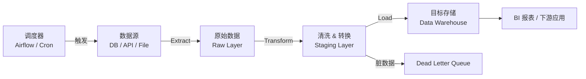

ETL（Extract、Transform、Load）是数据工程的核心模式，负责将分散的原始数据抽取、清洗整合后写入目标存储，是构建数据仓库和分析系统的基础能力。

## ETL 与 ELT 的区别

| 模式 | 顺序 | 适用场景 |
|------|------|----------|
| ETL | 先转换再加载 | 目标系统算力有限，数据量适中，需严格控制写入质量 |
| ELT | 先加载再转换 | 目标系统算力强（如 BigQuery、Snowflake），数据量极大，转换逻辑频繁变更 |

ETL 适合传统数据仓库，ELT 更适合云数仓场景。前端开发者转型数据方向时，通常先接触 ETL。

## 三个核心阶段

### Extract（抽取）

从源系统读取数据，常见来源：

- **关系型数据库**：通过 SQL 查询，支持增量抽取（按时间戳或自增 ID）
- **REST API**：分页请求，处理 rate limit 和认证
- **文件**：CSV、JSON、Parquet、Excel 等
- **消息队列**：Kafka、RabbitMQ 等实时流数据

增量抽取（Incremental Extract）比全量抽取更高效，通常用 `updated_at` 字段或 CDC（Change Data Capture）实现。

### Transform（转换）

转换是 ETL 最复杂的阶段，常见操作：

- **数据清洗**：去除空值、修正格式、统一编码
- **去重**：按业务主键去重，而非依赖数据库主键
- **类型转换**：将字符串日期转为 `datetime`，将货币字符串转为浮点数
- **聚合**：按维度汇总指标（如按天统计 UV）
- **关联**：多表 join，补全维度信息

### Load（加载）

将转换后的数据写入目标，常见策略：

- **全量覆盖**（Full Refresh）：清空目标表再插入，简单但不适合大表
- **追加插入**（Append）：仅写入新增数据，适合日志类数据
- **Upsert**：有则更新，无则插入，适合维度表同步

## Batch 与 Streaming ETL

```
Batch ETL:    [源数据] ──定时触发──> [抽取] -> [转换] -> [加载] -> [目标]
Streaming ETL: [源数据] ──实时推送──> [抽取] -> [转换] -> [加载] -> [目标]
                                        ↑ 毫秒级延迟
```

| 维度 | Batch | Streaming |
|------|-------|-----------|
| 延迟 | 分钟到小时 | 毫秒到秒 |
| 复杂度 | 低 | 高 |
| 容错 | 重跑即可 | 需要 exactly-once 语义 |
| 适用场景 | 报表、数仓 | 实时监控、风控 |

## 常用工具

- **Apache Airflow**：调度和编排 Batch ETL，DAG 定义任务依赖
- **Apache Spark**：大规模分布式数据处理，支持 Batch 和 Streaming
- **pandas**：小规模数据转换，适合原型开发
- **dbt**：面向 ELT 的 SQL 转换框架，适合数仓内转换
- **Flink / Kafka Streams**：流处理场景

## 幂等性与错误处理

**幂等性**（Idempotency）是 ETL 设计的核心原则：同一任务重复执行多次，结果与执行一次相同。

实现幂等性的常见做法：

1. 加载前先按批次 ID 或日期分区删除旧数据，再插入
2. 使用 Upsert 而非 Insert
3. 记录处理状态，跳过已成功的批次

**错误处理**要点：

- 区分可重试错误（网络超时）和不可重试错误（数据格式错误）
- 将脏数据写入 dead letter queue，不阻塞主流程
- 保留原始数据备份，支持数据回溯

## Python 实现示例

下面是一个从 API 抽取、转换、写入 SQLite 的简单 ETL pipeline：

```python
import sqlite3
import requests
from datetime import datetime, timezone
from typing import Iterator

# --- Extract ---
def extract_orders(api_url: str, page_size: int = 100) -> Iterator[dict]:
    """分页抽取订单数据，支持增量（实际场景可加 since 参数）"""
    page = 1
    while True:
        resp = requests.get(api_url, params={"page": page, "size": page_size}, timeout=10)
        resp.raise_for_status()
        data = resp.json()
        if not data:
            break
        yield from data
        page += 1

# --- Transform ---
def transform_order(raw: dict) -> dict | None:
    """清洗单条订单，返回 None 表示跳过脏数据"""
    try:
        return {
            "order_id": str(raw["id"]).strip(),
            "user_id": int(raw["user_id"]),
            "amount": float(raw["amount"]),
            "status": raw.get("status", "unknown").lower(),
            "created_at": datetime.fromisoformat(raw["created_at"]).replace(tzinfo=timezone.utc),
        }
    except (KeyError, ValueError, TypeError):
        # 生产环境应记录日志，写入 dead letter queue
        return None

# --- Load ---
def load_orders(conn: sqlite3.Connection, orders: list[dict]) -> int:
    """Upsert 订单到目标表，返回写入行数"""
    sql = """
        INSERT INTO orders (order_id, user_id, amount, status, created_at)
        VALUES (:order_id, :user_id, :amount, :status, :created_at)
        ON CONFLICT(order_id) DO UPDATE SET
            amount = excluded.amount,
            status = excluded.status
    """
    cursor = conn.cursor()
    cursor.executemany(sql, orders)
    conn.commit()
    return cursor.rowcount

# --- Pipeline 入口 ---
def run_pipeline(api_url: str, db_path: str) -> None:
    conn = sqlite3.connect(db_path)
    batch: list[dict] = []
    batch_size = 500
    total_loaded = 0

    for raw in extract_orders(api_url):
        record = transform_order(raw)
        if record is None:
            continue  # 跳过脏数据
        batch.append(record)

        if len(batch) >= batch_size:
            total_loaded += load_orders(conn, batch)
            batch.clear()

    # 处理剩余数据
    if batch:
        total_loaded += load_orders(conn, batch)

    print(f"Pipeline 完成，共写入 {total_loaded} 条记录")
    conn.close()
```

关键设计点：

- `extract` 用生成器（`yield from`）避免一次性加载全部数据到内存
- `transform` 对每条数据独立处理，失败不影响整体流程
- `load` 使用 Upsert 保证幂等性，按批次写入减少数据库往返次数

## 架构流程图



## 常见面试题

**1. 如何设计一个支持断点续传的 ETL 任务？**

记录每个批次的处理状态（批次 ID、时间范围、状态）到状态表。任务启动时查询未完成批次，从断点继续，而非从头重跑。结合幂等加载，可安全重试。

**2. ETL 任务突然失败，如何排查？**

按顺序检查：抽取阶段（源系统是否可达、数据量是否异常）→ 转换阶段（是否有新的脏数据格式）→ 加载阶段（目标库连接、磁盘空间、约束冲突）。查看任务日志中的第一个报错，而非最后一个。

**3. 增量抽取有哪些方式？各有什么局限？**

| 方式 | 原理 | 局限 |
|------|------|------|
| 时间戳 | 查询 `updated_at > 上次运行时间` | 删除操作无法感知 |
| 自增 ID | 查询 `id > 上次最大 ID` | 仅适合追加型表 |
| CDC | 监听数据库 binlog | 需要源库权限，架构复杂 |
| 全量对比 | Hash 对比检测变更 | 数据量大时性能差 |

**4. 如何保证数据质量？**

在转换阶段加入数据质量校验：非空检查、值域范围、唯一性、关联完整性。超过阈值（如空值率 > 5%）时触发告警，而非静默写入错误数据。

**5. Batch ETL 与 Streaming ETL 如何选型？**

先确认业务对数据延迟的容忍度。T+1 报表用 Batch 即可，运维监控或风控需要 Streaming。Streaming 的开发、运维成本远高于 Batch，不要为了技术新颖而过度设计。
