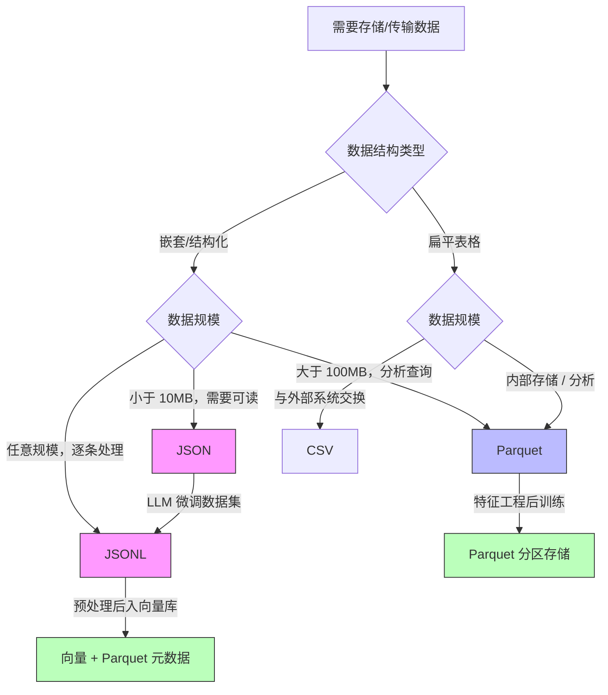

JSON / CSV / Parquet 数据格式需要把“机制是什么”“边界在哪里”“怎样验证”放在同一条学习路径中。本文以 [RFC 8259: The JavaScript Object Notation Data Interchange Format](https://www.rfc-editor.org/rfc/rfc8259.html) 对“JSON 语法、值类型、编码和互操作要求”的说明为事实边界，并用 [RFC 4180: Common Format and MIME Type for CSV Files](https://www.rfc-editor.org/rfc/rfc4180.html) 校准“CSV 常见格式、转义与 MIME 类型”。文中的代码和工程方案用于解释这些机制；涉及具体版本、默认值或部署行为时，应再回到所链接的一手资料确认。


*图：JSON / CSV / Parquet 数据格式的核心组件、信息流与验证边界。*

---

在 AI 工程链路中，数据格式的选择直接影响训练速度、推理吞吐和 RAG 系统的检索质量。一个训练集如果用低效格式存储，加载本身就可能成为 GPU 利用率的瓶颈；一个 RAG 流水线如果格式转换不当，可能在向量化前悄悄截断文本或丢失元数据。JSON、CSV、Parquet 是 AI 数据工程中最高频出现的三种格式，弄清它们的内部机制、适用场景和陷阱，是 Agent 工程师必备的基础技能。

## JSON：灵活但有代价

JSON（JavaScript Object Notation）是 LLM 应用中最常见的数据交换格式。Agent 的 Tool Call 返回值、RAG 文档的元数据、多轮对话历史，几乎无处不在。

### 标准库 vs 高性能库

Python 标准库 `json` 模块功能完备但速度有限。当需要处理百万级 JSON 记录时，应考虑替代方案：

```python
import json
import ujson     # pip install ujson
import orjson    # pip install orjson

data = {"messages": [{"role": "user", "content": "你好"}], "tokens": 12}

# 标准库
text = json.dumps(data, ensure_ascii=False)
obj  = json.loads(text)

# ujson：速度约为标准库的 3-5x，API 兼容
text = ujson.dumps(data, ensure_ascii=False)

# orjson：速度约为标准库的 5-10x，dumps 返回 bytes
text = orjson.dumps(data)               # bytes
obj  = orjson.loads(text)               # 接受 bytes/str
```

性能对比（单条 1KB JSON，百万次操作）：

| 库 | dumps | loads | 特点 |
|---|---|---|---|
| json (stdlib) | 基准 1x | 基准 1x | 无依赖，随处可用 |
| ujson | ~4x | ~3x | API 兼容，C 扩展 |
| orjson | ~8x | ~6x | 最快，支持 dataclass/datetime/numpy |

**工程建议**：对话历史缓存、工具调用序列化用 `orjson`；对外 API 接口、配置文件用标准库，保证最大兼容性。

### 复杂嵌套结构的处理

LLM 的 Function Calling 返回往往是深层嵌套结构。用 `jmespath` 提取比手写多层索引更健壮：

```python
import jmespath  # pip install jmespath

response = {
    "choices": [{
        "message": {
            "tool_calls": [{
                "function": {"name": "search", "arguments": '{"query": "AI"}'}
            }]
        }
    }]
}

# 安全提取，避免 KeyError
name = jmespath.search("choices[0].message.tool_calls[0].function.name", response)
# → "search"
```

## JSON Lines：LLM 微调数据集的事实标准

JSON Lines（`.jsonl`）格式是每行一个独立 JSON 对象，没有外层数组括号。它之所以成为 LLM 训练/微调数据集的标准格式，有三个关键原因：

1. **流式友好**：可以逐行读取，无需把整个文件载入内存
2. **追加安全**：新数据直接 `append`，不破坏已有内容
3. **工具链支持**：Hugging Face `datasets`、OpenAI 微调 API、LLaMA-Factory 全部原生支持 `.jsonl`

```python
import json

# 写入 JSONL（微调数据集，Alpaca 风格）
samples = [
    {"instruction": "翻译成英文", "input": "你好世界", "output": "Hello World"},
    {"instruction": "写一首诗", "input": "", "output": "春风送暖入屠苏..."},
]

with open("train.jsonl", "w", encoding="utf-8") as f:
    for sample in samples:
        f.write(json.dumps(sample, ensure_ascii=False) + "\n")

# 流式读取（大文件场景，避免 OOM）
def iter_jsonl(path):
    with open(path, "r", encoding="utf-8") as f:
        for line in f:
            line = line.strip()
            if line:
                yield json.loads(line)
```

OpenAI 微调 API 要求的 Chat 格式 JSONL，每行一条对话：

```json
{"messages": [{"role": "system", "content": "你是助手"}, {"role": "user", "content": "问题"}, {"role": "assistant", "content": "答案"}]}
{"messages": [{"role": "user", "content": "另一个问题"}, {"role": "assistant", "content": "另一个答案"}]}
```

## CSV：简单背后的陷阱

CSV（Comma-Separated Values）看起来最简单，却是实际工程中踩坑最多的格式。

### 编码陷阱与引号转义

```python
import csv
import pandas as pd

# 标准库写 CSV：正确处理引号与换行
rows = [
    ["id", "text", "label"],
    [1, 'He said "hello"', "positive"],   # 含双引号
    [2, "line1\nline2", "neutral"],        # 含换行
    [3, "中文内容，带逗号", "neutral"],    # 含分隔符
]

with open("data.csv", "w", newline="", encoding="utf-8-sig") as f:
    # utf-8-sig 添加 BOM，Excel 打开不乱码
    writer = csv.writer(f, quoting=csv.QUOTE_MINIMAL)
    writer.writerows(rows)

# pandas 读取时的关键参数
df = pd.read_csv(
    "data.csv",
    encoding="utf-8-sig",
    dtype={"id": str},          # 防止前导零被吞掉
    na_values=["", "NULL", "N/A"],
    keep_default_na=False,
)
```

**常见陷阱**：
- 不指定 `newline=""` 写 CSV 会导致 Windows 下出现空行
- Excel 默认 GBK 编码，读取 UTF-8 文件必须加 BOM 或显式指定编码
- 字段内含逗号/换行未正确引用，会导致列偏移
- 18 位数字 ID 被 pandas 推断为 `float64` 后精度丢失，必须用 `dtype` 显式指定为 `str`

### csv 模块 vs pandas

| 场景 | 推荐方案 | 原因 |
|---|---|---|
| 文件 < 100MB，需要分析 | `pandas.read_csv` | API 丰富，类型推断 |
| 文件 > 1GB | `csv` 模块逐行读取 | 避免 OOM |
| 生成供 Excel 查看的报告 | `pandas` + `utf-8-sig` | BOM 保证兼容性 |
| 与外部系统交换结构化数据 | `csv` 模块 | 无额外依赖 |

## Parquet：AI 数据工程的基石

Parquet 是 Apache 开源的列式存储格式，是大规模 AI 数据集存储的首选。Hugging Face Hub 上绝大多数数据集都以 Parquet 分发。

### 列式存储原理

行式存储（CSV/JSON）按行将数据写在一起；列式存储（Parquet）将同一列的所有值连续存放：

```
行式存储（CSV）：
[id=1, name="Alice", age=25] [id=2, name="Bob", age=30] ...

列式存储（Parquet）：
[id: 1, 2, 3, ...] [name: "Alice", "Bob", ...] [age: 25, 30, ...]
```

当查询只需要 `name` 列时，列式存储可以跳过所有其他列的 IO。同列数据类型相同，还能用 Run-Length Encoding、字典编码等专门算法大幅压缩。

### 读写与分区

```python
import pandas as pd
import pyarrow.parquet as pq

df = pd.DataFrame({
    "doc_id": range(1000),
    "text":   ["文档内容..." for _ in range(1000)],
    "source": ["wiki"] * 500 + ["arxiv"] * 500,
})

# 基础写法
df.to_parquet("docs.parquet", engine="pyarrow", compression="snappy")

# 分区写法（按 source 分区，查询时可跳过无关分区）
df.to_parquet(
    "docs_partitioned/",
    engine="pyarrow",
    partition_cols=["source"],
    compression="zstd",   # zstd 压缩率高于 snappy，推荐用于归档
)

# 只读需要的列（列剪枝，Column Pruning）
df_text = pd.read_parquet("docs.parquet", columns=["doc_id", "text"])

# 读取分区数据集，自动按 filter 过滤
df_wiki = pd.read_parquet(
    "docs_partitioned/",
    filters=[("source", "=", "wiki")],
)

# 流式批量读取，适合超大文件
parquet_file = pq.ParquetFile("docs.parquet")
for batch in parquet_file.iter_batches(batch_size=256, columns=["doc_id", "text"]):
    df_batch = batch.to_pandas()
    # 处理每批...
```

**压缩算法选择**：

| 算法 | 压缩率 | 速度 | 推荐场景 |
|---|---|---|---|
| snappy | 中 | 最快 | 频繁读写的热数据 |
| zstd | 高 | 快 | 归档、冷数据 |
| gzip | 高 | 慢 | 与外部系统兼容 |
| uncompressed | 无 | 最快 | 调试、内存映射 |

## 格式对比总览

| 维度 | JSON | JSONL | CSV | Parquet |
|---|---|---|---|---|
| 存储方式 | 行式（嵌套） | 行式（流式） | 行式（扁平） | 列式 |
| 可读性 | 高 | 高 | 高 | 低（二进制） |
| 压缩率 | 低 | 低 | 低 | 高（3-10x） |
| 流式读取 | 困难 | 原生支持 | 支持 | 支持（按列批次） |
| 类型保真 | 中（无日期类型） | 中 | 低（全字符串） | 高（强类型） |
| 嵌套结构 | 原生支持 | 原生支持 | 不支持 | 有限支持（struct） |
| AI 训练数据集 | 小规模配置 | 标准格式 | 不推荐 | 大规模首选 |
| RAG 文档存储 | 适合（含元数据） | 适合 | 仅纯文本 | 适合大规模 |
| Agent 工具调用 | 标准格式 | 不适用 | 不适用 | 不适用 |

## AI 数据流格式选型决策树



## AI/RAG 场景格式链路

一个典型的 RAG 系统，每个阶段都有最优的格式选择：

```python
import json
import pandas as pd
import pyarrow.parquet as pq

# 阶段 1：原始数据收集 → JSONL（流式写入，不怕中断）
with open("raw_docs.jsonl", "a", encoding="utf-8") as f:
    doc = {
        "id": "doc_001",
        "text": "文档正文...",
        "source": "arxiv",
        "created_at": "2024-01-15",
    }
    f.write(json.dumps(doc, ensure_ascii=False) + "\n")

# 阶段 2：清洗 + 分块 → Parquet（持久化中间结果，节省重复计算）
chunks = []
for doc in iter_jsonl("raw_docs.jsonl"):
    for i, chunk in enumerate(split_text(doc["text"], size=512)):
        chunks.append({
            "chunk_id": f"{doc['id']}_chunk_{i}",
            "doc_id":   doc["id"],
            "text":     chunk,
            "source":   doc["source"],
        })

pd.DataFrame(chunks).to_parquet("chunks.parquet", compression="zstd")

# 阶段 3：向量化 → 从 Parquet 流式批量读取，控制内存占用
parquet_file = pq.ParquetFile("chunks.parquet")
for batch in parquet_file.iter_batches(batch_size=256, columns=["chunk_id", "text"]):
    df_batch = batch.to_pandas()
    embeddings = embed_model.encode(df_batch["text"].tolist())
    vector_db.upsert(ids=df_batch["chunk_id"].tolist(), vectors=embeddings)
```

核心原则：**写入用 JSONL（流式安全），中间态用 Parquet（压缩+类型+可查询），接口传输用 JSON（通用兼容）**。

## 常见误区

**误区 1：JSON 适合存储大规模数据集**。JSON 没有列式压缩，100GB 的 JSON 文件用 Parquet 存储通常只需 10-20GB，且查询速度快 10 倍以上。大规模数据集请用 Parquet，不要用 JSON 数组文件。

**误区 2：CSV 类型安全**。CSV 所有列本质上都是字符串，`1`、`"1"`、`01` 读进来可能被推断成不同类型。用 Pandas 读 CSV 后必须检查 `df.dtypes`，必要时显式指定 `dtype` 参数，尤其是 ID 类字段。

**误区 3：JSONL 和 JSON 可以混用**。`.jsonl` 文件不能直接用 `json.load()` 解析（会报错），必须逐行处理。反过来，`.json` 文件也不能用 JSONL 阅读器逐行读取。两者是不同的格式，文件首字节是 `[` 则是 JSON 数组，是 `{` 则通常是 JSONL。

**误区 4：Parquet 不支持追加写入**。标准 Parquet 文件确实不支持原地追加，但"多文件分区目录"完全可以：每批数据写一个新文件，查询时 `pd.read_parquet("dir/")` 自动合并所有分区。

**误区 5：`ensure_ascii=True` 是安全的默认值**。默认值虽然不会报错，但会把所有中文转义为 `\uXXXX`，文件体积膨胀约 3 倍，可读性极差。AI 工程中涉及中文数据时，永远加 `ensure_ascii=False`。

## 最佳实践

- **LLM 微调数据集**：始终用 `.jsonl`，保留完整元数据字段，用 `json.dumps(ensure_ascii=False)` 保留 Unicode；验证时用 `wc -l` 快速统计条数
- **大规模特征/文档存储**：用 Parquet + `zstd` 压缩，按时间或类别分区，读取时用 `columns` 参数做列剪枝（Column Pruning）
- **CSV 跨系统交换**：写入时加 BOM（`utf-8-sig`），用 `csv.QUOTE_MINIMAL` 最小化引号，读取时显式指定 `dtype`，不依赖自动类型推断
- **Agent 工具调用序列化**：用 `orjson` 提速，用 `jmespath` 安全提取深层字段，避免裸 `dict["key"]["key"]` 链式访问
- **格式转换大文件**：Parquet → JSONL 用 `iter_batches` 流式转换，避免一次性 `to_dict('records')` 撑爆内存
- **Hugging Face 数据集上传**：推送前转为 Parquet，Hub 会自动生成列统计、数据预览和 SQL 查询界面

## 面试常问

**Q：JSON 和 JSONL 的区别是什么？各自适合什么场景？**

JSON 是一个完整文档（对象或数组），必须全量解析；JSONL 每行一个独立 JSON 对象，天然支持流式读取和追加写入。JSON 适合配置文件、API 响应；JSONL 是 LLM 训练/微调数据集的事实标准。

**Q：为什么 Parquet 在 AI 数据工程中比 CSV 更受欢迎？**

四点核心优势：(1) 列式存储只读需要的列，IO 减少数倍；(2) 内置强类型系统，不存在 CSV 的类型推断问题；(3) 压缩率高（通常 3-10x），存储成本低；(4) 支持谓词下推（Predicate Pushdown），查询时自动跳过无关分区。

**Q：`orjson` 相比标准 `json` 库有什么优势？有什么限制？**

优势：序列化速度快 5-10 倍，原生支持 `datetime`、`numpy` 数组、Python `dataclass`，无需自定义 Encoder。限制：`dumps` 返回 `bytes` 而非 `str`（需 `.decode()` 转换）；不支持 `cls` 参数（改用 `default` 回调）。

**Q：处理含中文的 CSV 文件时，如何保证 Excel 正确打开？**

写入时使用 `encoding="utf-8-sig"`，在文件头部添加 UTF-8 BOM（Byte Order Mark），Excel 读到 BOM 会识别为 UTF-8，而不是系统默认的 GBK 编码。

**Q：Parquet 列式存储为什么压缩率高？**

同一列的值类型相同，重复值多，天然适合字典编码（Dictionary Encoding）和游程编码（Run-Length Encoding，RLE）。例如 `source` 列只有 `"wiki"`/`"arxiv"` 两种值，RLE 可以把 500 个连续相同值压缩成一条记录，而行式存储无法利用这一规律。

## 参考资料

- [RFC 8259: The JavaScript Object Notation Data Interchange Format](https://www.rfc-editor.org/rfc/rfc8259.html)
- [RFC 4180: Common Format and MIME Type for CSV Files](https://www.rfc-editor.org/rfc/rfc4180.html)
- [Apache Parquet file format](https://parquet.apache.org/docs/file-format/)
