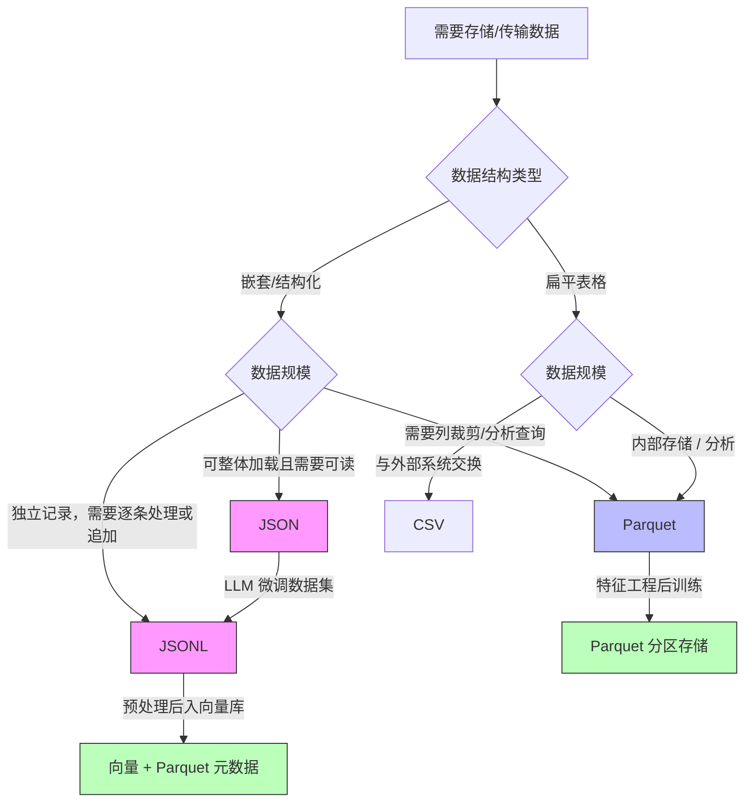

*图：沿图中的节点与箭头阅读，重点是JSON、CSV 和 Parquet 的结构、schema、类型、压缩、列裁剪与跨系统互操作比较，不做单一格式推荐。*

---

在 AI 工程链路中，数据格式的选择直接影响训练速度、推理吞吐和 RAG 系统的检索质量。一个训练集如果用低效格式存储，加载本身就可能成为 GPU 利用率的瓶颈；一个 RAG 流水线如果格式转换不当，可能在向量化前悄悄截断文本或丢失元数据。JSON、CSV、Parquet 是 AI 数据工程中最高频出现的三种格式，弄清它们的内部机制、适用场景和陷阱，是 Agent 工程师必备的基础技能。

## JSON：灵活但有代价

[RFC 8259](https://www.rfc-editor.org/rfc/rfc8259.html) 定义 JSON 的对象、数组、字符串、数字、布尔和 null 语法，并对编码与互操作提出要求；它不提供独立的 schema 或日期类型。


JSON（JavaScript Object Notation）是 LLM 应用中最常见的数据交换格式。Agent 的 Tool Call 返回值、RAG 文档的元数据、多轮对话历史，几乎无处不在。

### 标准库 vs 高性能库

Python 标准库 `json` 模块功能完备但速度有限。当需要处理百万级 JSON 记录时，应考虑替代方案：

```python
import json
import ujson     # pip install ujson
import orjson    # pip install orjson

data = {"messages": [{"role": "user", "content": "你好"}], "tokens": 12}

# 标准库
text = json.dumps(data, ensure_ascii=False)
obj  = json.loads(text)

# ujson：第三方实现；性能与兼容性应在目标数据和版本上实测
text = ujson.dumps(data, ensure_ascii=False)

# orjson：dumps 返回 bytes；性能应在目标数据和版本上实测
text = orjson.dumps(data)               # bytes
obj  = orjson.loads(text)               # 接受 bytes/str
```

性能不能脱离 payload、选项、Python/库版本与 CPU 给固定倍数。用真实数据分别测 `dumps`/`loads` 吞吐、峰值内存、输出字节数和兼容性；标准库无额外依赖，第三方库可能提供 bytes 输出或扩展类型，但必须验证边界值与升级行为。对外协议优先保证互操作，确认序列化确为瓶颈后再替换实现。

### 复杂嵌套结构的处理

LLM 的 Function Calling 返回往往是深层嵌套结构。用 `jmespath` 提取比手写多层索引更健壮：

```python
import jmespath  # pip install jmespath

response = {
    "choices": [{
        "message": {
            "tool_calls": [{
                "function": {"name": "search", "arguments": '{"query": "AI"}'}
            }]
        }
    }]
}

# 安全提取，避免 KeyError
name = jmespath.search("choices[0].message.tool_calls[0].function.name", response)
# → "search"
```

## JSON Lines：独立记录带来的工程优势

JSON 本身并不等于“只能全量读取”：增量 JSON 解析器可以边接收边解析一个大型数组或对象；只是 Python 标准库常用的 `json.load()` 会把整个文档解析成内存对象。JSON Lines（`.jsonl`）把每个非空行约定为一个独立 JSON 值，因此逐条读取、校验、追加和失败恢复更直接。它常被训练工具采用，但最终仍应服从目标平台的输入契约。

1. **记录独立**：一行解析失败时，可以定位到具体记录而不必重新解析整个文档
2. **便于追加**：在确保前一条记录已用换行结束后，可以追加新记录而不重写外层数组
3. **逐条消费**：普通逐行读取器就能控制峰值内存；标准 JSON 若要达到类似效果，需要增量解析器

```python
import json

# 写入 JSONL（微调数据集，Alpaca 风格）
samples = [
    {"instruction": "翻译成英文", "input": "你好世界", "output": "Hello World"},
    {"instruction": "写一首诗", "input": "", "output": "春风送暖入屠苏..."},
]

with open("train.jsonl", "w", encoding="utf-8") as f:
    for sample in samples:
        f.write(json.dumps(sample, ensure_ascii=False) + "\n")

# 流式读取（大文件场景，避免 OOM）
def iter_jsonl(path):
    with open(path, "r", encoding="utf-8") as f:
        for line in f:
            line = line.strip()
            if line:
                yield json.loads(line)
```

OpenAI 微调 API 要求的 Chat 格式 JSONL，每行一条对话：

```json
{"messages": [{"role": "system", "content": "你是助手"}, {"role": "user", "content": "问题"}, {"role": "assistant", "content": "答案"}]}
{"messages": [{"role": "user", "content": "另一个问题"}, {"role": "assistant", "content": "另一个答案"}]}
```

## CSV：简单背后的陷阱

CSV（Comma-Separated Values）看起来最简单，却是实际工程中踩坑最多的格式。

### 编码陷阱与引号转义

```python
import csv
import pandas as pd

# 标准库写 CSV：正确处理引号与换行
rows = [
    ["id", "text", "label"],
    [1, 'He said "hello"', "positive"],   # 含双引号
    [2, "line1\nline2", "neutral"],        # 含换行
    [3, "中文内容，带逗号", "neutral"],    # 含分隔符
]

with open("data.csv", "w", newline="", encoding="utf-8-sig") as f:
    # 若目标 Excel/区域设置需要 BOM，可用 utf-8-sig；先用目标环境验证
    writer = csv.writer(f, quoting=csv.QUOTE_MINIMAL)
    writer.writerows(rows)

# pandas 读取时的关键参数
df = pd.read_csv(
    "data.csv",
    encoding="utf-8-sig",
    dtype={"id": str},          # 防止前导零被吞掉
    na_values=["", "NULL", "N/A"],
    keep_default_na=False,
)
```

**常见陷阱**：
- Python `csv` 文档建议打开文件时使用 `newline=""`，避免换行层与 CSV 层重复转换
- Excel 对无 BOM UTF-8 CSV 的识别取决于版本、平台、导入方式和区域设置；面向已知接收端时，可选择 `utf-8-sig` 或让用户在导入时显式选择 UTF-8
- 字段内含逗号/换行未正确引用，会导致列偏移
- 18 位数字 ID 被 pandas 推断为 `float64` 后精度丢失，必须用 `dtype` 显式指定为 `str`

### csv 模块 vs pandas

| 场景 | 推荐方案 | 原因 |
|---|---|---|
| 数据能在内存预算内展开，需要分析 | `pandas.read_csv` | API 丰富，便于显式指定类型 |
| 数据可能超过内存预算 | `csv` 模块逐行读取或分块处理 | 控制峰值内存；阈值需按 schema 与机器实测 |
| 生成供 Excel 查看的报告 | `pandas`；按接收端选择 `utf-8` / `utf-8-sig` | BOM 是部分 Excel 工作流的兼容选项，不是跨平台保证 |
| 与外部系统交换结构化数据 | `csv` 模块 | 无额外依赖 |

## Parquet：AI 数据工程的基石

Parquet 是 Apache 的列式存储格式，常用于分析型数据集和批量特征数据。它是否优于 JSON/CSV 取决于 schema、列裁剪、压缩、嵌套结构和跨系统互操作需求。

### 列式存储原理

[Apache Parquet 文件格式](https://parquet.apache.org/docs/file-format/) 按列块组织数据并保存 metadata、encoding 与嵌套结构信息，因此分析查询可以只读取所需列；收益仍取决于数据布局和读取模式。


行式存储（CSV/JSON）按行将数据写在一起；列式存储（Parquet）将同一列的所有值连续存放：

```
行式存储（CSV）：
[id=1, name="Alice", age=25] [id=2, name="Bob", age=30] ...

列式存储（Parquet）：
[id: 1, 2, 3, ...] [name: "Alice", "Bob", ...] [age: 25, 30, ...]
```

当查询只需要 `name` 列时，列式存储可以跳过其他列的 IO。同一列往往更容易出现重复值、连续游程或较小的值域，可供字典编码、Run-Length Encoding 等编码利用；随后使用的通用压缩 codec 也能利用重复字节模式。实际压缩效果取决于数据分布、排序、编码和 codec。

### 读写与分区

```python
import pandas as pd
import pyarrow.parquet as pq

df = pd.DataFrame({
    "doc_id": range(1000),
    "text":   ["文档内容..." for _ in range(1000)],
    "source": ["wiki"] * 500 + ["arxiv"] * 500,
})

# 基础写法
df.to_parquet("docs.parquet", engine="pyarrow", compression="snappy")

# 分区写法（按 source 分区，查询时可跳过无关分区）
df.to_parquet(
    "docs_partitioned/",
    engine="pyarrow",
    partition_cols=["source"],
    compression="zstd",   # 示例选择；应按目标数据的体积、CPU 与兼容性实测
)

# 只读需要的列（列剪枝，Column Pruning）
df_text = pd.read_parquet("docs.parquet", columns=["doc_id", "text"])

# 读取分区数据集，自动按 filter 过滤
df_wiki = pd.read_parquet(
    "docs_partitioned/",
    filters=[("source", "=", "wiki")],
)

# 流式批量读取，适合超大文件
parquet_file = pq.ParquetFile("docs.parquet")
for batch in parquet_file.iter_batches(batch_size=256, columns=["doc_id", "text"]):
    df_batch = batch.to_pandas()
    # 处理每批...
```

**压缩算法选择**：

| 算法 | 主要取舍 | 选型提示 |
|---|---|---|
| snappy | 通常偏向较低 CPU 开销 | 先确认消费端支持，并用实际读写负载测量 |
| zstd | 可调整压缩级别，在体积与 CPU 之间取舍 | 适合把存储成本纳入权衡的场景，不能假定总是更优 |
| gzip | 生态兼容较广，但 CPU/体积结果依数据和实现而变 | 外部系统只支持 gzip 时再选择 |
| uncompressed | 不执行 codec 压缩，文件可能更大 | 调试或上层已经压缩的数据可评估 |

## 格式对比总览

| 维度 | JSON | JSONL | CSV | Parquet |
|---|---|---|---|---|
| 存储方式 | 行式（嵌套） | 行式（流式） | 行式（扁平） | 列式 |
| 可读性 | 高 | 高 | 高 | 低（二进制） |
| 压缩率 | 取决于内容与压缩器 | 取决于内容与压缩器 | 取决于内容与压缩器 | 可利用列内相似性，结果依数据、编码与 codec 而定 |
| 流式读取 | 需要增量解析器；`json.load` 通常全量构建对象 | 逐行读取简单 | 支持逐行/分块 | 支持按 row group/批次读取 |
| 类型保真 | 中（无日期类型） | 中 | 低（全字符串） | 高（强类型） |
| 嵌套结构 | 原生支持 | 原生支持 | 不支持 | 有限支持（struct） |
| AI 训练数据集 | 小规模配置 | 标准格式 | 不推荐 | 大规模首选 |
| RAG 文档存储 | 适合（含元数据） | 适合 | 仅纯文本 | 适合大规模 |
| Agent 工具调用 | 标准格式 | 不适用 | 不适用 | 不适用 |

## AI 数据流格式选型决策树



## AI/RAG 场景格式链路

一个典型的 RAG 系统，每个阶段都有最优的格式选择：

```python
import json
import pandas as pd
import pyarrow.parquet as pq

# 阶段 1：原始数据收集 → JSONL（流式写入，不怕中断）
with open("raw_docs.jsonl", "a", encoding="utf-8") as f:
    doc = {
        "id": "doc_001",
        "text": "文档正文...",
        "source": "arxiv",
        "created_at": "2024-01-15",
    }
    f.write(json.dumps(doc, ensure_ascii=False) + "\n")

# 阶段 2：清洗 + 分块 → Parquet（持久化中间结果，节省重复计算）
chunks = []
for doc in iter_jsonl("raw_docs.jsonl"):
    for i, chunk in enumerate(split_text(doc["text"], size=512)):
        chunks.append({
            "chunk_id": f"{doc['id']}_chunk_{i}",
            "doc_id":   doc["id"],
            "text":     chunk,
            "source":   doc["source"],
        })

pd.DataFrame(chunks).to_parquet("chunks.parquet", compression="zstd")

# 阶段 3：向量化 → 从 Parquet 流式批量读取，控制内存占用
parquet_file = pq.ParquetFile("chunks.parquet")
for batch in parquet_file.iter_batches(batch_size=256, columns=["chunk_id", "text"]):
    df_batch = batch.to_pandas()
    embeddings = embed_model.encode(df_batch["text"].tolist())
    vector_db.upsert(ids=df_batch["chunk_id"].tolist(), vectors=embeddings)
```

这只是一个可行链路，不是通用定律：采集阶段若需要独立追加和逐条恢复可选 JSONL；分析中间态若需要 schema、列裁剪和批量读取可评估 Parquet；接口传输则按协议契约选择 JSON 或其他媒体类型。

## 常见误区

**误区 1：只按文件扩展名判断大规模数据性能**。JSON 缺少 Parquet 的列式布局、页统计与列裁剪，但实际体积和查询耗时还取决于 schema、数据分布、codec、分区、查询列和引擎。用目标数据同时测压缩后字节数、扫描列、谓词与端到端读取时间，不能套用固定倍数。

**误区 2：CSV 类型安全**。CSV 所有列本质上都是字符串，`1`、`"1"`、`01` 读进来可能被推断成不同类型。用 Pandas 读 CSV 后必须检查 `df.dtypes`，必要时显式指定 `dtype` 参数，尤其是 ID 类字段。（参见 [RFC 4180: Common Format and MIME Type for CSV Files](https://www.rfc-editor.org/rfc/rfc4180.html)）

**误区 3：JSONL 和 JSON 可以靠首字节互相识别**。`.jsonl` 通常要求每个非空行都是一个独立 JSON 值，因此不能把多行 JSON 文档直接交给逐行阅读器；标准库 `json.load()` 也不会把多条顶层 JSON 值当作 JSONL。`{` 既可能是普通 JSON 对象，也可能是 JSONL 第一条记录，不能仅凭首字节判定；应由文件契约、媒体类型或逐行解析验证决定。

**误区 4：Parquet 不支持追加写入**。标准 Parquet 文件确实不支持原地追加，但"多文件分区目录"完全可以：每批数据写一个新文件，查询时 `pd.read_parquet("dir/")` 自动合并所有分区。

**误区 5：把 `ensure_ascii` 当成安全开关**。`ensure_ascii=True` 会把非 ASCII 字符转义，体积变化取决于字符构成和后续压缩；它不提供安全边界。需要 UTF-8 可读输出时可设 `ensure_ascii=False`，同时按 JSON/传输层规则处理编码。

## 最佳实践

- **LLM 微调数据集**：若目标训练平台要求逐条 JSON 对象，可用 `.jsonl` 并按其 schema 验证；其他平台可能接受 Parquet、Arrow 或专用格式，先服从消费端契约
- **大规模特征/文档存储**：用 Parquet + `zstd` 压缩，按时间或类别分区，读取时用 `columns` 参数做列剪枝（Column Pruning）
- **CSV 跨系统交换**：先约定编码、分隔符、换行和 schema；只有目标接收端需要时才写入 BOM（`utf-8-sig`），并用 CSV 库正确引用字段。读取 ID 等敏感列时显式指定 `dtype`
- **Agent 工具调用序列化**：先用真实 payload 基准比较标准库与候选序列化器；选择 `orjson` 时同时验证 bytes 返回值、选项和兼容行为。深层字段提取可用显式校验模型或查询工具，避免无校验的索引链
- **格式转换大文件**：Parquet → JSONL 用 `iter_batches` 流式转换，避免一次性 `to_dict('records')` 撑爆内存
- **Hugging Face 数据集上传**：推送前转为 Parquet，Hub 会自动生成列统计、数据预览和 SQL 查询界面

## 面试常问

**Q：JSON 和 JSONL 的区别是什么？各自适合什么场景？**

JSON 表示一个完整文档；常见 `json.load()` 会一次构建整个对象，但增量解析器也能流式处理 JSON。JSONL 则让每行成为独立 JSON 值，普通逐行读取器即可逐条消费，并便于追加记录。JSON 常见于配置和 API 响应；当训练平台要求逐条记录时，JSONL 是常见选择，但不是所有平台的唯一格式。

**Q：为什么 Parquet 在 AI 数据工程中比 CSV 更受欢迎？**

核心机制是：(1) 列式存储允许读取所需列；(2) 文件 schema 提供比无 schema CSV 更稳定的类型；(3) 列内相似性利于字典、RLE 与压缩编码；(4) 统计信息可帮助引擎做谓词下推和数据跳过。收益大小必须在目标数据和引擎上测量。（参见 [Apache Parquet file format](https://parquet.apache.org/docs/file-format/)）

**Q：`orjson` 相比标准 `json` 库有什么优势？有什么限制？**

优势是 `dumps` 返回 bytes，并提供 datetime、NumPy、dataclass 等扩展选项；限制包括 API/兼容行为与标准库不同。速度取决于数据形状、版本、CPU 和选项，应在真实 payload 上基准测试，而不是引用固定倍数。

**Q：处理含中文的 CSV 文件时，如何保证 Excel 正确打开？**

先确定用户的 Excel 版本、平台、区域设置和导入方式。部分直接双击打开 CSV 的 Excel 环境可通过 `encoding="utf-8-sig"` 写入 UTF-8 BOM 来改善识别；另一些环境可在“导入文本/CSV”时显式选择 UTF-8。BOM 不是所有表格软件的通用要求，发布前应在目标环境验证。

**Q：Parquet 列式存储为什么压缩率高？**

列式布局把同一字段的值放在一起；若该列有重复值、连续游程或较小值域，字典编码与 RLE 就有机会用更紧凑的表示。之后的压缩 codec 还能利用编码后或原始数据中的重复模式。行式数据同样可以被 gzip 等通用算法压缩，只是列式布局与专用编码可能让某些数据分布更容易被利用；收益必须实测。

## 参考资料

- [RFC 8259: The JavaScript Object Notation Data Interchange Format](https://www.rfc-editor.org/rfc/rfc8259.html)
- [RFC 4180: Common Format and MIME Type for CSV Files](https://www.rfc-editor.org/rfc/rfc4180.html)
- [Apache Parquet file format](https://parquet.apache.org/docs/file-format/)
