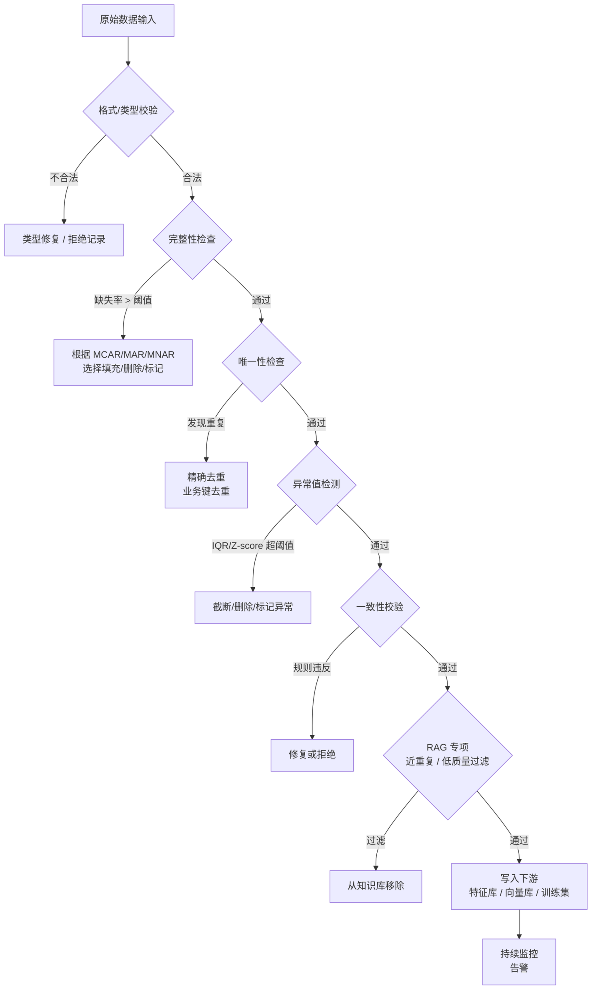

数据质量评估与异常检测需要把“机制是什么”“边界在哪里”“怎样验证”放在同一条学习路径中。本文以 [ISO/IEC 25012 Data Quality Model](https://www.iso.org/standard/35736.html) 对“数据质量模型与内在/系统依赖质量特性”的说明为事实边界，并用 [Automating Large-scale Data Quality Verification](https://www.vldb.org/pvldb/vol11/p1781-schelter.pdf) 校准“Deequ 数据质量约束、分析器和大规模验证方法”。文中的代码和工程方案用于解释这些机制；涉及具体版本、默认值或部署行为时，应再回到所链接的一手资料确认。


*图：数据质量评估与异常检测的核心组件、信息流与验证边界。*

---

在大语言模型（LLM）和检索增强生成（RAG）系统大行其道的今天，数据质量问题早已不再是传统数仓工程师的专属课题。对 AI/Agent 工程师而言，喂给模型或向量库的每一条文本、每一行结构化记录，都直接影响推理质量与召回精度。计算机科学有一条古老定律——**GIGO（Garbage In, Garbage Out，垃圾进垃圾出）**，在 LLM 时代被再次放大：低质量的训练数据会让微调模型产生幻觉；重复的文档块会让 RAG 召回结果冗余；字段缺失的结构化数据会让 Agent 的工具调用逻辑出错。系统性地评估并修复数据质量，往往比反复调参带来更大的收益。

## 数据质量六维度（Six Dimensions of Data Quality）

业界通常用六个维度衡量数据质量，每个维度对 AI 系统都有具体映射：

| 维度 | 含义 | AI/RAG 典型影响 |
|------|------|----------------|
| **完整性**（Completeness） | 必要字段/文本是否存在 | 特征缺失导致模型降级；文档段落被截断影响召回 |
| **准确性**（Accuracy） | 数据是否反映真实世界 | 错误事实进入知识库，RAG 生成错误答案 |
| **一致性**（Consistency） | 跨系统/跨字段逻辑是否自洽 | 同一概念多种写法导致向量空间分裂 |
| **时效性**（Timeliness） | 数据是否在有效时间窗口内 | 过期文档被召回，Agent 使用过时工具结果 |
| **唯一性**（Uniqueness） | 主键/业务键是否重复 | 重复文档块拉偏相似度排名，特征穿越 |
| **有效性**（Validity） | 数据是否符合格式/业务规则 | 非法枚举值触发 Agent 工具调用异常 |

实践中**唯一性**和**时效性**是 RAG 系统最常被忽视的两个维度，也是导致检索质量下降的高频原因。

## 缺失值检测与处理（Missing Value Detection & Imputation）

### 缺失率统计

```python
import pandas as pd

def missing_report(df: pd.DataFrame) -> pd.DataFrame:
    total = len(df)
    missing = df.isnull().sum()
    rate = missing / total
    report = pd.DataFrame({
        "missing_count": missing,
        "missing_rate": rate.round(4)
    }).query("missing_count > 0").sort_values("missing_rate", ascending=False)
    return report

# 使用示例
# report = missing_report(df)
# print(report)
```

缺失率超过 **30%** 的字段需要重点关注。直接均值填充可能引入噪声，直接删除可能丢失信号。

### 三种缺失机制（MCAR / MAR / MNAR）

理解缺失机制是选择处理策略的前提：

- **MCAR**（Missing Completely At Random）：缺失与所有变量无关，可以安全 `dropna` 或均值填充。
- **MAR**（Missing At Random）：缺失与其他已观测字段相关（如高收入用户更少填写年龄），建议用多重插补或 KNN 填充。
- **MNAR**（Missing Not At Random）：缺失与该字段本身的值相关（如病情越严重越不愿填写），填充会引入系统偏差，建议新增 `is_missing` 二元特征保留信号。

```python
# fillna 常用策略
df["age"].fillna(df["age"].median(), inplace=True)          # 数值：中位数
df["category"].fillna(df["category"].mode()[0], inplace=True)  # 类别：众数
df["text"].fillna("", inplace=True)                          # 文本：空字符串占位

# dropna：只删除关键字段缺失的行
df.dropna(subset=["user_id", "query_text"], inplace=True)
```

## 重复数据检测与去重（Deduplication）

```python
def dedup_report(df: pd.DataFrame, subset: list[str]) -> dict:
    total = len(df)
    dup_mask = df.duplicated(subset=subset, keep=False)
    dup_count = dup_mask.sum()
    return {
        "total_rows": total,
        "duplicate_rows": int(dup_count),
        "duplicate_rate": round(dup_count / total, 4),
        "deduplicated_df": df.drop_duplicates(subset=subset, keep="first")
    }

# 查看重复样本
dup_rows = df[df.duplicated(subset=["user_id", "session_id"], keep=False)]
```

常见陷阱：**只对主键去重而忽略业务键**。例如同一用户在同一秒触发两次支付回调，两条记录 `order_id` 相同但表示不同事件，此时需结合时间戳和状态字段综合判断。

## 异常值检测（Outlier Detection）

### IQR 方法（四分位距）

IQR 对偏态分布更鲁棒，是结构化数据清洗的首选方法：

```python
import numpy as np

def iqr_outliers(series: pd.Series, k: float = 1.5) -> pd.Series:
    q1, q3 = series.quantile(0.25), series.quantile(0.75)
    iqr = q3 - q1
    lower, upper = q1 - k * iqr, q3 + k * iqr
    return series[(series < lower) | (series > upper)]
```

### Z-score 方法

适合近似正态分布的数值字段，阈值通常取 ±3：

```python
def zscore_outliers(series: pd.Series, threshold: float = 3.0) -> pd.Series:
    z = (series - series.mean()) / series.std()
    return series[z.abs() > threshold]
```

**选择原则**：默认优先 IQR；Z-score 适合业务含义明确要求基于均值时（如统计过程控制）。注意：Z-score 对极端离群点本身敏感——极端值会拉高均值和标准差，导致漏检。

### 可视化辅助

箱线图将 IQR 可视化：盒体为 Q1–Q3，须线延伸至 `Q1 - 1.5×IQR` 和 `Q3 + 1.5×IQR`，超出须线的点即为离群点。EDA 阶段用箱线图快速定位问题字段，再用程序化方法批量处理，是高效的工作流。

## 数据一致性校验（Consistency Validation）

### 跨字段规则校验

```python
def validate_business_rules(df: pd.DataFrame) -> list[str]:
    errors = []
    # 时序约束
    invalid_time = df["end_time"] < df["start_time"]
    if invalid_time.any():
        errors.append(f"end_time < start_time: {invalid_time.sum()} 条记录")
    # 数值范围
    if (df["age"] < 0).any() or (df["age"] > 120).any():
        errors.append(f"age 超出 [0,120] 范围: {((df['age']<0)|(df['age']>120)).sum()} 条")
    # 枚举合法性
    valid_status = {"pending", "processing", "done", "failed"}
    invalid_status = ~df["status"].isin(valid_status)
    if invalid_status.any():
        errors.append(f"非法 status 值: {df.loc[invalid_status,'status'].unique()}")
    return errors
```

### Pydantic 校验（推荐用于 Agent 工具入参）

对于 Agent 的工具调用（Tool Call）参数，Pydantic 是更工程化的校验方案：

```python
from pydantic import BaseModel, field_validator, model_validator
from datetime import datetime

class OrderRecord(BaseModel):
    order_id: str
    amount: float
    start_time: datetime
    end_time: datetime
    status: str

    @field_validator("amount")
    @classmethod
    def amount_positive(cls, v: float) -> float:
        if v <= 0:
            raise ValueError(f"amount 必须大于 0，得到 {v}")
        return v

    @model_validator(mode="after")
    def time_order(self) -> "OrderRecord":
        if self.end_time < self.start_time:
            raise ValueError("end_time 不能早于 start_time")
        return self
```

Pydantic 的优势在于与 LLM 的 structured output（结构化输出）天然集成——模型返回 JSON 后立即做校验，拦截幻觉字段。

## 数据类型校验与转换（Type Validation & Casting）

类型问题是数据管道（Pipeline）中最隐蔽的故障源之一：

```python
# 自动类型推断后的二次校验
def type_check(df: pd.DataFrame, schema: dict[str, str]) -> list[str]:
    """schema: {"col_name": "expected_dtype_keyword"}"""
    issues = []
    for col, expected in schema.items():
        if col not in df.columns:
            issues.append(f"缺少字段: {col}")
            continue
        actual = str(df[col].dtype)
        if expected not in actual:
            issues.append(f"{col}: 期望 {expected}，实际 {actual}")
    return issues

# 安全类型转换
def safe_to_numeric(df: pd.DataFrame, cols: list[str]) -> pd.DataFrame:
    for col in cols:
        df[col] = pd.to_numeric(df[col], errors="coerce")  # 无法转换的变为 NaN
    return df
```

`errors="coerce"` 是关键——它将无法转换的值静默变为 `NaN` 而不是抛出异常，配合后续的缺失值处理完成链路闭环。

## RAG 数据质量专项（RAG-Specific Data Quality）

RAG 系统的数据质量问题有其特殊性，主要体现在文档/文本层面。

### 文档精确去重（Exact Dedup）

```python
import hashlib

def exact_dedup_docs(docs: list[str]) -> list[str]:
    """基于 MD5 的精确去重"""
    seen = set()
    unique_docs = []
    for doc in docs:
        h = hashlib.md5(doc.strip().encode()).hexdigest()
        if h not in seen:
            seen.add(h)
            unique_docs.append(doc)
    return unique_docs
```

### 近重复检测（Near-Dedup）

精确去重无法处理"内容高度相似但不完全相同"的文档块（如不同格式的同一公告）。近重复检测（Near-Duplicate Detection）常用 **MinHash + LSH** 方案：

```python
from datasketch import MinHash, MinHashLSH

def build_lsh_index(docs: list[str], threshold: float = 0.85,
                    num_perm: int = 128) -> MinHashLSH:
    lsh = MinHashLSH(threshold=threshold, num_perm=num_perm)
    for i, doc in enumerate(docs):
        m = MinHash(num_perm=num_perm)
        for token in doc.lower().split():
            m.update(token.encode())
        lsh.insert(f"doc_{i}", m)
    return lsh
```

`threshold=0.85` 表示 Jaccard 相似度超过 85% 视为近重复，实际调整依业务场景而定。

### 低质量文本过滤

```python
import re

def is_low_quality(text: str, min_len: int = 50,
                   max_repeat_ratio: float = 0.3) -> bool:
    """过滤低质量文档块"""
    text = text.strip()
    # 长度过短
    if len(text) < min_len:
        return True
    # 重复字符比例过高（乱码/爬虫噪声）
    chars = list(text)
    most_common_ratio = max(chars.count(c) for c in set(chars)) / len(chars)
    if most_common_ratio > max_repeat_ratio:
        return True
    # 非文字内容占比过高
    non_text = len(re.findall(r"[^\w\s一-鿿]", text))
    if non_text / len(text) > 0.4:
        return True
    return False
```

## 数据质量监控管道设计（Monitoring Pipeline）

生产环境的数据质量保障需要从一次性脚本升级为持续运行的监控管道：

```python
from dataclasses import dataclass, field
from typing import Callable

@dataclass
class QualityRule:
    name: str
    check_fn: Callable[[pd.DataFrame], list[str]]
    severity: str = "error"  # "error" | "warning" | "info"

class DataQualityPipeline:
    def __init__(self, rules: list[QualityRule]):
        self.rules = rules

    def run(self, df: pd.DataFrame) -> dict:
        results = {"errors": [], "warnings": [], "info": []}
        for rule in self.rules:
            issues = rule.check_fn(df)
            results[rule.severity + "s"].extend(
                [f"[{rule.name}] {issue}" for issue in issues]
            )
        results["passed"] = len(results["errors"]) == 0
        return results
```

这种插件式设计让规则可以独立迭代，也方便接入告警系统（如 Slack webhook 或 PagerDuty）。

## 数据质量检验流程图



---

## 常见误区

**1. 把"缺失值"等同于 0 或空字符串**
将 `NaN` 填充为 0 可能对模型意义完全不同（如收入为 0 vs 收入未知），应根据业务语义选择填充值，或保留 `is_missing` 特征。

**2. 只做精确去重忽略近重复**
RAG 知识库中大量格式不同的近重复文档会稀释相关结果的排名，精确 hash 去重远不够，必须引入 MinHash/SimHash 等近重复检测。

**3. 数据清洗是一次性工作**
数据是流动的，线上数据分布会随时间漂移（Data Drift）。需要将质量检查内嵌到数据摄入管道，而非仅在项目初期执行。

**4. 对所有字段用同一阈值判断异常**
IQR k=1.5 对某些业务字段可能过于严格（如用户购买金额本身呈幂律分布），阈值应结合字段的业务分布分别设定。

**5. 用训练集的统计量填充测试集**
数据泄露（Data Leakage）的常见来源：应先 `fit` 填充器于训练集，再 `transform` 测试集（Scikit-learn Pipeline 可以防止此类错误）。

---

## 最佳实践

- **schema-first**：在数据进入管道之前，用 Pydantic 或 JSON Schema 定义字段类型和约束，让非法数据在入口拦截。
- **分级告警**：区分 Error（阻断写入）/ Warning（人工复核）/ Info（记录统计），避免告警疲劳。
- **保留原始数据**：清洗逻辑不覆盖原始记录，所有修改以衍生字段或新版本存储，便于回溯。
- **RAG 知识库定期重建**：设置文档的 TTL（Time To Live），对时效性强的领域（金融、医疗）每日或每周重建，避免过期信息影响召回。
- **量化质量指标**：每次数据更新后输出缺失率、重复率、规则通过率等指标并写入监控看板，形成可追踪的质量趋势。
- **与 MLflow / LangSmith 集成**：将数据质量报告作为 Artifact 记录到实验追踪系统，实现训练数据和模型版本的联动溯源。

---

## 面试常问

**Q：GIGO 原则在 RAG 系统中如何体现？**

检索器召回的文档块质量直接决定生成器的输出上限。低质量的块（重复、截断、过时）会：①占用有限的 context window；②引入错误或矛盾信息；③降低 LLM 对相关段落的注意力权重。因此 RAG 系统的数据质量问题比传统 ML 更为直接。

**Q：如何选择缺失值处理策略？**

需要区分缺失机制：MCAR 可安全删除或均值填充；MAR 建议 KNN 或模型插补；MNAR 建议保留 `is_missing` 二元特征，直接填充会引入系统偏差。还需考虑下游模型：树模型可原生处理 `NaN`，线性模型不能，策略选择要匹配模型类型。

**Q：Z-score 和 IQR 的区别与适用场景？**

Z-score 假设正态分布，且对极端离群点本身敏感（极端值会拉高均值/标准差，导致漏检）；IQR 基于分位数，对分布形状假设更弱，对偏态分布更鲁棒。偏态数据（如用户消费金额）优先用 IQR，近正态且需要基于均值解释（如传感器控制图）时用 Z-score。

**Q：RAG 中近重复检测（Near-Dedup）为什么重要，原理是什么？**

相同或高度相似的文档块在知识库中出现多次，会导致相关查询召回大量冗余结果，稀释真正有用的多样化内容，还会浪费向量存储和检索时延。MinHash 通过对文本的 n-gram 集合做多次随机哈希得到签名向量，LSH（Locality-Sensitive Hashing）将签名相近的文档映射到同一 bucket，从而实现亚线性时间复杂度的近重复检测，适合大规模语料库。

**Q：数据质量监控管道应包含哪些核心组件？**

① 入口校验层（Schema 校验 + 类型检查）；② 统计分析层（缺失率、唯一性、分布统计）；③ 规则引擎层（业务约束校验）；④ 告警与报告层（分级告警、指标持久化）；⑤ 血缘追踪层（记录每条数据的来源、处理版本，用于问题溯源）。生产环境中可以用 Great Expectations 或自研轻量 Pipeline 实现，关键是与数据摄入流程集成而非独立运行。

## 参考资料

- [ISO/IEC 25012 Data Quality Model](https://www.iso.org/standard/35736.html)
- [Automating Large-scale Data Quality Verification](https://www.vldb.org/pvldb/vol11/p1781-schelter.pdf)
