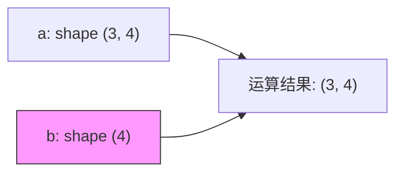

*图：左侧沿 shape/dtype/strides 把二维 ndarray 映射到字节内存，比较共享 slice 与独立 copy；右侧读取 `(3,1)` 和 `(1,4)` 的广播结果。*

---

NumPy 是 Python 科学计算的基石，也是 AI/ML 工程师绕不开的底层工具。无论是手写余弦相似度、理解 PyTorch Tensor 的内存布局，还是调试广播维度错误，扎实的 NumPy 基础都能让你在向量化思维上快人一步。本文以 AI/RAG/Agent 工程场景为主线，系统梳理 NumPy 的核心知识点。

## NumPy 在 AI 向量计算中的地位

现代 AI 系统的核心操作——Embedding 检索、注意力矩阵乘法、Dropout 掩码——本质上都是多维数组的批量数值运算。NumPy 在这条链路上扮演的角色：

- **数据预处理层**：文本转 token id、归一化特征、批量向量拼接
- **Embedding 运算层**：余弦相似度、Top-K 检索（RAG 的核心步骤）
- **框架互操作层**：PyTorch / TensorFlow Tensor 与 ndarray 的零拷贝互转
- **调试与原型层**：不想跑完整训练时，用 NumPy 快速验证算法逻辑

```
RAG Pipeline 中的 NumPy 位置：
文本 → Embedding 模型 → np.ndarray (float32) → 余弦相似度检索 → Top-K 文档
```

## ndarray 基础

[NumPy Fundamentals](https://numpy.org/doc/stable/user/basics.html) 将 `ndarray` 的 shape、dtype、索引、view/copy 与 ufunc 作为核心语义；切片是否共享内存要按具体索引方式判断。


### 核心属性

`ndarray`（N-dimensional array）是一块**内存连续**、**同质类型**的多维数组。与 Python list 相比，它将数据紧凑排布，可整体交给底层 C/Fortran 批量计算，速度快几个数量级。

| 属性 | 含义 | 示例值 |
|------|------|--------|
| `shape` | 各维度长度的元组 | `(1000, 768)` |
| `dtype` | 元素数据类型 | `float32`、`int64`、`bool` |
| `ndim` | 维度数（`len(shape)`） | `2` |
| `strides` | 各维度跨越的字节数 | `(3072, 4)` — 理解视图的关键 |

```python
import numpy as np

# 创建 embedding 矩阵（1000 条文档，每条 768 维）
docs = np.random.rand(1000, 768).astype(np.float32)
print(docs.shape)    # (1000, 768)
print(docs.dtype)    # float32
print(docs.strides)  # (3072, 4)  — 每行跨 3072 字节，每列跨 4 字节
```

### 常用创建方式

```python
# 从 Python 对象创建（明确指定 dtype，避免默认 float64）
a = np.array([1.0, 2.0, 3.0], dtype=np.float32)

# 填充数组
zeros = np.zeros((3, 4), dtype=np.float32)   # 全 0
ones  = np.ones_like(docs)                   # 与 docs 同形同类型的全 1

# 等差序列
np.arange(0, 10, 2)          # [0, 2, 4, 6, 8]，step 为整数优先用此
np.linspace(0, 1, 5)         # [0, 0.25, 0.5, 0.75, 1.0]，浮点步长优先用此

# 单位矩阵（Attention 中的掩码初始化）
eye = np.eye(4, dtype=np.float32)  # 4×4 单位矩阵
```

**dtype 陷阱**：NumPy 默认 `float64`，而 PyTorch 默认 `float32`，混用会触发隐式上转型，既浪费内存又影响性能。在 AI 工程中，创建数组时养成显式声明 `dtype=np.float32` 的习惯。

## 索引与切片

### 基础索引（返回视图）

```python
a = np.arange(12).reshape(3, 4)
# [[ 0  1  2  3]
#  [ 4  5  6  7]
#  [ 8  9 10 11]]

a[1, 2]       # 单元素: 6
a[:, 1]       # 第 1 列（列向量）: [1, 5, 9]
a[1:, 2:]     # 右下角子矩阵: [[6,7],[10,11]]
a[-1]         # 最后一行: [8, 9, 10, 11]
```

基础切片返回**视图（view）**，修改视图会影响原数组。需要独立副本时调用 `.copy()`。

### 布尔索引（返回副本）

```python
scores = np.array([85, 42, 91, 60, 73])
# 过滤：取分数 > 70 的元素
print(scores[scores > 70])   # [85, 91, 73]

# AI 场景：过滤相似度低于阈值的结果
sim_scores = np.array([0.91, 0.43, 0.78, 0.55])
valid = sim_scores[sim_scores > 0.6]   # [0.91, 0.78]
```

### 花式索引（Fancy Indexing，返回副本）

```python
embeddings = np.random.rand(10000, 768)   # 文档库
top_ids = np.array([42, 7, 1337])         # 检索结果的 id 列表

# 一次性取出多行，返回 shape (3, 768)
selected = embeddings[top_ids]
```

花式索引始终返回副本，与基础切片不同，是高频混淆点。用 `np.shares_memory(a, b)` 可验证两数组是否共享内存。

## 广播机制（Broadcasting）

Broadcasting 允许形状兼容的数组参与运算；NumPy 通常不会先把较小输入复制成完整的平铺数组，但具体运算的输出或中间结果仍可能分配内存。（参见 [NumPy broadcasting](https://numpy.org/doc/stable/user/basics.broadcasting.html)）

**广播规则**：从尾部维度开始对齐，两个维度兼容的条件是：**值相等**，或**其中一个为 1**。



```python
# 示例 1：矩阵 + 行向量
a = np.ones((3, 4))
b = np.array([1, 2, 3, 4])          # shape (4,) → 广播为 (3, 4)
print((a + b).shape)                 # (3, 4)

# 示例 2：列向量 + 行向量（外积式广播）
col = np.array([[1], [2], [3]])      # shape (3, 1)
row = np.array([[10, 20, 30, 40]])   # shape (1, 4)
print((col + row).shape)             # (3, 4)

# AI 场景：为每个 embedding 加上位置编码
embeddings = np.zeros((32, 512, 768))   # (batch, seq_len, dim)
pos_enc    = np.zeros((1, 512, 768))    # (1, seq_len, dim)
output = embeddings + pos_enc           # 广播 batch 维，shape (32, 512, 768)
```

**常见失败**：

```python
a = np.ones((3, 4))
b = np.ones((3,))     # 尾部维 3 ≠ 4，且不为 1 → 报错
# ValueError: operands could not be broadcast together with shapes (3,4) (3,)
# 修正：b.reshape(3, 1) 变为列向量后可广播
```

## 通用函数（ufunc）与向量化计算

NumPy 的 ufunc（universal function）底层是 C 实现，向量化运算通常比纯 Python 循环快 **50–200 倍**。

```python
n = 1_000_000
a = np.random.rand(n).astype(np.float32)
b = np.random.rand(n).astype(np.float32)

# 向量化乘法（推荐）
c = a * b                  # 约 0.002s

# Python 循环（不推荐）
c = [a[i] * b[i] for i in range(n)]  # 约 0.15s，慢 75 倍
```

常用 ufunc：

```python
np.sqrt(a)          # 逐元素开平方
np.exp(a)           # 逐元素 e^x（Softmax 基础）
np.log(a)           # 逐元素 ln(x)（交叉熵损失）
np.maximum(a, 0)    # ReLU 激活函数
np.clip(a, 0, 1)    # 截断到 [0, 1] 区间
```

聚合函数支持 `axis` 参数，控制沿哪个维度运算：

```python
m = np.random.rand(4, 768)
m.sum(axis=1)       # 每行求和，shape (4,)
m.mean(axis=0)      # 每列均值，shape (768,)  ← 计算特征均值常用
m.max()             # 全局最大值（标量）
```

## 矩阵运算

### dot、matmul 与 @ 运算符

| 函数 | 适用场景 | 备注 |
|------|----------|------|
| `np.dot(a, b)` | 2D 矩阵乘法 | 高维时语义复杂，慎用 |
| `a @ b` / `np.matmul` | 批量矩阵乘法 | 推荐，语义清晰 |
| `np.einsum` | 任意张量缩并 | 灵活，可读性高，适合复杂运算 |

```python
q = np.random.rand(8, 64)    # query: (batch=8, d_k=64)
k = np.random.rand(64, 100)  # key 转置: (d_k=64, seq=100)

# 注意力分数（简化版）
scores = q @ k               # (8, 100)，矩阵乘法

# einsum：等价写法，语义更显式
scores2 = np.einsum('bd,ds->bs', q, k)  # b=batch, d=dim, s=seq
```

`einsum` 的格式遵循爱因斯坦求和约定（Einstein summation convention）：`'bd,ds->bs'` 意为将 `b×d` 矩阵与 `d×s` 矩阵缩并 `d` 维，输出 `b×s`。

## 常用形状操作

```python
a = np.arange(24)

# reshape：重塑形状（不拷贝数据，返回视图）
a.reshape(4, 6)           # 4 行 6 列
a.reshape(2, 3, 4)        # 三维
a.reshape(-1, 8)          # -1 表示自动推断，结果 (3, 8)

# transpose：轴置换
m = np.ones((2, 3, 4))
m.transpose(0, 2, 1)      # shape (2, 4, 3)，交换最后两轴
m.T                        # 完全转置，shape (4, 3, 2)

# 拼接与堆叠
a = np.ones((3, 4))
b = np.ones((3, 4))

np.concatenate([a, b], axis=0)  # 沿行叠加，shape (6, 4)
np.concatenate([a, b], axis=1)  # 沿列拼接，shape (3, 8)
np.stack([a, b], axis=0)        # 新增一轴，shape (2, 3, 4)

# 拆分
parts = np.split(a, 3, axis=0)  # 沿行均分为 3 块，每块 (1, 4)
```

`stack` vs `concatenate`：`stack` 会新增一个维度，常用于将多个样本组成 batch；`concatenate` 沿已有维度拼接，不增加维度数。

## 随机数（np.random）在 AI 中的应用

### 推荐新 API：`default_rng`

```python
# 旧 API（全局状态，不推荐）
np.random.seed(42)
np.random.randn(3, 3)

# 新 API（独立生成器对象，可复现，线程安全）
rng = np.random.default_rng(seed=42)
rng.standard_normal((3, 3))    # 标准正态
rng.uniform(0, 1, (3, 3))      # 均匀分布
rng.integers(0, 100, size=10)  # 随机整数
```

### AI 场景：参数初始化与 Dropout

```python
rng = np.random.default_rng(0)

# He 初始化（适合 ReLU 激活）
fan_in = 768
W = rng.standard_normal((fan_in, 256)) * np.sqrt(2.0 / fan_in)

# Dropout 掩码（训练时随机置零）
def dropout(x: np.ndarray, p: float, rng) -> np.ndarray:
    """p 为丢弃概率，训练时使用"""
    mask = rng.random(x.shape) > p          # bool 掩码
    return x * mask / (1 - p)              # 缩放保持期望不变

x = np.ones((4, 768))
out = dropout(x, p=0.1, rng=rng)
```

## 相似度计算：余弦相似度与 RAG 检索

余弦相似度（cosine similarity）是 RAG 检索的核心指标，衡量两个向量方向的接近程度，不受向量长度影响。

```
cosine_similarity(a, b) = (a · b) / (‖a‖ × ‖b‖)
```

```python
def cosine_similarity(a: np.ndarray, b: np.ndarray) -> float:
    """计算两个 1D embedding 向量的余弦相似度"""
    return np.dot(a, b) / (np.linalg.norm(a) * np.linalg.norm(b))


def batch_cosine_similarity(query: np.ndarray, docs: np.ndarray) -> np.ndarray:
    """
    向量化计算 query 与文档库所有 embedding 的余弦相似度

    Args:
        query: shape (d,)          — 单条 query embedding
        docs:  shape (n, d)        — n 条文档 embedding

    Returns:
        scores: shape (n,)         — 每篇文档的相似度分数
    """
    query_norm = np.linalg.norm(query)                  # 标量
    docs_norm  = np.linalg.norm(docs, axis=1)           # (n,)
    dot_prods  = docs @ query                            # (n,)
    return dot_prods / (docs_norm * query_norm)


# 模拟 RAG 检索
rng = np.random.default_rng(42)
query    = rng.standard_normal(768).astype(np.float32)
doc_bank = rng.standard_normal((10000, 768)).astype(np.float32)

scores   = batch_cosine_similarity(query, doc_bank)     # (10000,)
top5_idx = np.argsort(scores)[::-1][:5]                 # 降序取 Top-5
print("Top-5 doc ids:", top5_idx)
print("Top-5 scores: ", scores[top5_idx])
```

关键技巧：用矩阵-向量乘法 `docs @ query` 代替循环，一次完成 10000 次点积，这正是向量化思维的体现。

## 与 PyTorch Tensor 的互转

NumPy ndarray 与 PyTorch Tensor 可以**零拷贝共享内存**（CPU 上），这在调试和混合编程时非常重要。

```python
import numpy as np
import torch

# ndarray → Tensor（共享内存，不拷贝）
arr = np.array([1.0, 2.0, 3.0], dtype=np.float32)
t = torch.from_numpy(arr)
arr[0] = 99.0
print(t)   # tensor([99.,  2.,  3.])  ← 同步修改了！

# Tensor → ndarray（CPU Tensor 共享内存）
t2  = torch.ones(3, 4)
arr2 = t2.numpy()

# GPU Tensor 需要先搬回 CPU，再 detach
gpu_t = torch.ones(3, 4, device='cuda', requires_grad=True)
arr3  = gpu_t.detach().cpu().numpy()   # ← 两步缺一不可
```

**互转注意事项**：

| 场景 | 操作 | 是否共享内存 |
|------|------|-------------|
| CPU ndarray → Tensor | `torch.from_numpy(arr)` | 是 |
| CPU Tensor → ndarray | `t.numpy()` | 是 |
| GPU Tensor → ndarray | `t.detach().cpu().numpy()` | 否（已拷贝） |
| 带梯度 Tensor | 需先 `detach()` | — |

---

## 常见误区

**1. 视图 vs 副本混淆**
基础切片（`a[1:3]`）返回视图，布尔/花式索引返回副本。修改视图会污染原数组。不确定时用 `np.shares_memory(a, b)` 检查，需要副本时显式调用 `.copy()`。

**2. dtype 默认 float64**
NumPy 默认 `float64`，但 GPU 训练和大多数 Embedding 模型用 `float32`。不显式声明会导致数组传入 PyTorch 时触发隐式转换，内存翻倍且性能下降。

**3. 广播静默成功但语义错误**
广播不会报错，但方向搞反会产生非预期的形状。例如将 `(3,)` 误认为列向量参与运算，结果是行向量广播。遇到多维广播时先打印 `shape`，或用 `np.broadcast_shapes(a.shape, b.shape)` 提前验证。

**4. 循环替代向量化**
逐元素 Python 循环在大规模数组上慢几十倍。任何形如 `for i in range(len(arr))` 的操作都应优先考虑向量化重写。

**5. 全局随机种子线程不安全**
`np.random.seed()` 是全局状态，多线程 DataLoader 中会导致随机性失控。始终使用 `np.random.default_rng(seed)` 创建独立生成器。

---

## 最佳实践

- **创建时明确 dtype**：`np.zeros((n, d), dtype=np.float32)`，不依赖默认值。
- **向量化优先**：消灭显式 for 循环，借助广播和 ufunc 表达批量计算。
- **用 `@` 替代 `np.dot`**：`@` 语义更清晰，高维行为与 `np.matmul` 一致。
- **`reshape(-1, n)` 代替硬编码维度**：增加代码对 batch size 变化的鲁棒性。
- **Embedding 归一化后再存储**：若检索时只需比较方向，提前 `arr / np.linalg.norm(arr, axis=1, keepdims=True)` 归一化，检索时只需点积，省去除法开销。
- **互转不要忘记 `.detach()`**：GPU Tensor 转 ndarray 必须先 `detach().cpu()`，否则报错。

---

## 面试常问

**Q：ndarray 切片与花式索引各返回什么？**
基础索引（整数下标、切片）返回视图（view），修改会同步到原数组；布尔索引和花式索引（整数数组/列表）始终返回副本（copy）。

**Q：描述广播规则并举出失败案例。**
从尾部维度对齐，相等或其中一个为 1 则兼容，否则报错。`(3, 4)` 与 `(3,)` 会失败，因为尾部维 4 ≠ 3 且都不为 1；修正为 `(3, 1)` 则可广播。

**Q：`np.dot`、`@`、`np.matmul` 有何区别？**
对 2D 数组三者等价。区别在高维：`np.dot` 将第一个操作数的最后轴与第二个操作数的倒数第二轴做缩并，行为特殊；`@` / `np.matmul` 将高维视为 batch 维度，语义更直观，推荐在 AI 代码中统一使用 `@`。

**Q：如何手动实现批量余弦相似度，避免 for 循环？**
对文档矩阵 `(n, d)` 用 `docs @ query` 得到点积向量 `(n,)`，再除以各向量的 L2 范数。关键是用 `np.linalg.norm(docs, axis=1)` 批量计算行范数，整个过程无循环。

**Q：CPU 上 ndarray 与 Tensor 共享内存的前提是什么？**
`torch.from_numpy()` 和 `.numpy()` 均共享内存，但 Tensor 必须在 CPU 上且不能 `requires_grad=True`（有梯度时需先 `detach()`）。任何一方修改数据，另一方立即可见。

## 参考资料

- [NumPy fundamentals](https://numpy.org/doc/stable/user/basics.html)
- [NumPy broadcasting](https://numpy.org/doc/stable/user/basics.broadcasting.html)
