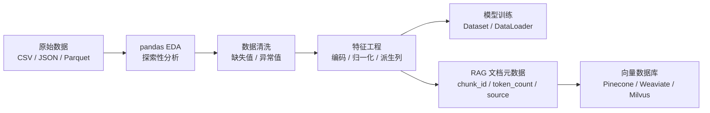

*图：先看两个 DataFrame 如何按 index/column labels 对齐并产生 NA，再沿 dtype 规范化 → 缺失处理 → 过滤 → groupby 聚合读取清洗管线。*

---

数据处理通常占据 AI 工程流水线的显著工作量，但比例会随数据质量、团队与任务而变化。pandas 适合处理中小规模表格数据，可用于特征工程、RAG 元数据和结构化分析；数据超过单机内存或需要分布式执行时，应评估其他引擎。

## pandas 在 AI 数据工程中的定位



对 AI/Agent 工程师而言，pandas 的核心使用场景有三类：

| 场景 | 典型操作 |
|------|----------|
| EDA（Exploratory Data Analysis） | `describe`、`value_counts`、`corr` |
| 数据清洗与预处理 | `dropna`、`fillna`、`astype`、`apply` |
| RAG 元数据管理 | 批量构造 chunk DataFrame，追踪 embedding 状态 |

## Series 与 DataFrame 核心概念

[pandas 入门指南](https://pandas.pydata.org/docs/user_guide/10min.html) 展示 Series/DataFrame、基于标签的选择、对齐、合并和分组操作；运算默认按索引标签对齐，而非仅按物理位置拼接。


### 索引机制（Index）

pandas 中最容易被忽视的设计就是**索引**。Series 和 DataFrame 都有显式的行索引（Index），它不同于数组的位置下标：

```python
import pandas as pd

s = pd.Series([88.5, 92.0, 78.3], index=['alice', 'bob', 'charlie'])
print(s['bob'])      # 92.0  —— 按标签访问
print(s.iloc[1])     # 92.0  —— 按位置访问
```

索引的意义在于：做 `merge`、`join`、`align` 时，pandas 会自动按索引对齐，避免因行序不同而产生错位。理解这一点能解释很多"结果行数不对"的 Bug。

### dtype 与内存

```python
df = pd.DataFrame({
    'doc_id':   ['d001', 'd002', 'd003'],
    'chunk':    ['...', '...', '...'],
    'tokens':   [128, 256, 512],
    'embedded': [False, True, False],
})

df.dtypes
# doc_id      object
# chunk       object
# tokens       int64
# embedded      bool
```

`object` dtype 本质是 Python 字符串的指针数组，内存开销高；对重复值多的类别列（如来源文件名、标签），改用 `category` dtype 可节省 50–90% 内存。

## 数据读取

pandas 支持几乎所有主流格式，生产中最常见的三种：

```python
# CSV：通用，但类型推断不可靠
df = pd.read_csv('docs.csv', encoding='utf-8', dtype={'doc_id': str})

# JSON：orient='records' 对应 [{...}, {...}] 的列表格式
df = pd.read_json('docs.json', orient='records')

# Parquet：列式存储，类型保真，读取速度比 CSV 快 5-10 倍
df = pd.read_parquet('docs.parquet', engine='pyarrow')
```

**格式选型建议**：与外部系统交换数据用 CSV/JSON；内部流水线存储用 Parquet；需要 SQL 查询大文件时考虑 DuckDB 直接读取 Parquet，绕开 pandas 的内存限制。

超大文件（> 内存的 1/5）用 `chunksize` 分批处理：

```python
chunks = []
for chunk in pd.read_csv('big_corpus.csv', chunksize=50_000):
    chunk = chunk[chunk['language'] == 'zh']   # 先过滤，减少内存
    chunks.append(chunk)
df = pd.concat(chunks, ignore_index=True)
```

## 数据探索（EDA）

拿到新数据集的标准流程：

```python
df.shape          # (行数, 列数)
df.head(5)        # 目测结构
df.info()         # dtype、非空计数——一眼定位缺失列
df.describe()     # 数值列统计：均值、标准差、四分位数
df.describe(include='all')  # 含类别列

df['source'].value_counts()              # 频次分布
df['source'].value_counts(normalize=True)  # 归一化为占比
df.nunique()      # 每列唯一值数量，快速判断是否为 ID 列或枚举列
```

`info()` 中 Non-Null Count 小于总行数时，该列存在缺失值，需决策处理策略。

## 数据选取

### iloc 与 loc

```python
# loc：基于标签，切片两端均包含
df.loc[10:20, ['doc_id', 'tokens']]

# iloc：基于整数位置，遵循 Python 左闭右开
df.iloc[0:5, 1:3]

# 条件过滤（布尔索引）
df[df['tokens'] > 512]

# 多条件：必须用 & / |，每个条件加括号
df[(df['tokens'] > 256) & (df['embedded'] == False)]

# query：可读性更强，适合动态拼接条件字符串
df.query("tokens > 256 and embedded == False")
```

> **原则**：优先用 `loc` + 布尔索引，避免 `iloc` 依赖位置顺序；动态条件拼接用 `query`，它内部会编译为 numexpr 表达式，比布尔索引稍快。

## 数据变换

### assign / rename / astype

```python
df = (
    df
    .rename(columns={'chunk': 'content', 'tokens': 'token_count'})
    .assign(
        char_count=lambda d: d['content'].str.len(),
        token_ratio=lambda d: d['token_count'] / d['char_count']
    )
    .astype({'token_count': 'int32'})
)
```

`assign` 返回新 DataFrame（不修改原对象），支持链式调用，是特征工程的推荐写法。

### fillna / dropna

[pandas missing data 指南](https://pandas.pydata.org/docs/user_guide/missing_data.html) 区分多种缺失值标记和 nullable dtype；填充或删除前必须先确认列类型和缺失语义，不能把所有 NA 当成同一种业务状态。


```python
df['source'].fillna('unknown', inplace=True)          # 类别列补占位符
df['token_count'].fillna(df['token_count'].median())  # 数值列补中位数
df.dropna(subset=['content'], inplace=True)           # 内容为空的行直接删除
```

Pandas 2.x 中 `fillna(method='ffill')` 已废弃，改用：

```python
df['price'] = df['price'].ffill()  # 时序向前填充
```

### apply 与向量化的取舍

```python
# 能用向量化就不用 apply
df['is_long'] = df['token_count'] > 512                    # 向量化：快
df['is_long'] = df['token_count'].apply(lambda x: x > 512) # apply：慢 10x+

# apply 的合理场景：复杂逻辑、多列联合计算
def build_prompt(row):
    return f"[{row['source']}] {row['content'][:200]}"

df['prompt'] = df.apply(build_prompt, axis=1)
```

`map` 是 Series 专属，适合值映射：

```python
lang_map = {'zh': '中文', 'en': '英文', 'ja': '日文'}
df['lang_label'] = df['lang'].map(lang_map)
```

## 分组聚合（groupby + agg）

```python
# 统计每个来源的文档数和平均 token 数
stats = (
    df.groupby('source')
    .agg(
        doc_count=('doc_id', 'count'),
        avg_tokens=('token_count', 'mean'),
        total_tokens=('token_count', 'sum'),
    )
    .reset_index()
    .sort_values('doc_count', ascending=False)
)
```

`transform` 与 `agg` 的区别：`agg` 压缩行数，`transform` 保持原长度并回填，常用于添加分组统计列：

```python
df['source_avg_tokens'] = df.groupby('source')['token_count'].transform('mean')
```

## 合并操作（merge / concat / join）

```python
# merge：类似 SQL JOIN，按键列对齐
df_meta = pd.merge(df_chunks, df_files, on='file_id', how='left')

# concat：同结构 DataFrame 纵向堆叠
df_all = pd.concat([df_batch1, df_batch2], ignore_index=True)

# join：按行索引对齐（适合特征矩阵拼接）
df_features = df_tfidf.join(df_embedding, how='inner')
```

| 操作 | 对齐依据 | SQL 等价 |
|------|----------|----------|
| `merge` | 指定列 | JOIN |
| `concat` | 不对齐，直接追加 | UNION ALL |
| `join` | 行索引 | JOIN ON index |

**陷阱**：`merge` 默认 inner join，键列有重复值时会产生笛卡尔积，合并后立即检查 `len(result)` 是否合理。

## 性能优化

### 向量化优先，远离 iterrows

```python
# 错误：iterrows 每次迭代创建 Series，百万行慢数十倍
for idx, row in df.iterrows():
    df.at[idx, 'cost'] = row['tokens'] * 0.002

# 正确：整列运算，底层为 C 的 NumPy 操作
df['cost'] = df['token_count'] * 0.002
```

### 字符串操作用 .str 向量化接口

```python
# 错误：apply + Python 字符串
df['title'] = df['content'].apply(lambda x: x[:50].strip())

# 正确：str accessor
df['title'] = df['content'].str[:50].str.strip()
```

### 内存优化三步法

```python
# 1. 读取时只加载需要的列
df = pd.read_csv('corpus.csv', usecols=['doc_id', 'content', 'tokens'])

# 2. 类别列转 category
for col in ['source', 'language', 'status']:
    df[col] = df[col].astype('category')

# 3. 整数列降精度
df['token_count'] = df['token_count'].astype('int32')

print(df.memory_usage(deep=True).sum() / 1e6, 'MB')
```

## AI/RAG 场景实战

在 RAG（Retrieval-Augmented Generation）系统中，pandas 常用于管理文档 chunk 的元数据和批量处理 embedding 输入：

```python
import pandas as pd

# 构造 chunk 元数据 DataFrame
chunks_df = pd.DataFrame({
    'chunk_id':   [f'c{i:04d}' for i in range(1000)],
    'doc_id':     ['doc_001'] * 500 + ['doc_002'] * 500,
    'content':    ['...'] * 1000,
    'token_count': [128] * 1000,
    'embedded':   [False] * 1000,
})

# 找出尚未 embedding 的 chunk，按 token 数排序（小的先处理，节省 API 费用）
pending = (
    chunks_df[~chunks_df['embedded']]
    .sort_values('token_count')
    .reset_index(drop=True)
)

# 批量构造 embedding 请求（batch_size=32）
batch_size = 32
for i in range(0, len(pending), batch_size):
    batch = pending.iloc[i:i+batch_size]
    texts = batch['content'].tolist()
    # embeddings = embed_model.encode(texts)
    # 回写状态
    chunks_df.loc[
        chunks_df['chunk_id'].isin(batch['chunk_id']), 'embedded'
    ] = True

# 查询某文档的 embedding 覆盖率
coverage = chunks_df.groupby('doc_id')['embedded'].mean()
print(coverage)
```

这套模式在 Agent 工具链中同样适用——把工具调用的输入/输出、Token 消耗、耗时等结构化为 DataFrame，便于后续分析和成本优化。

## 常见误区

**误区 1：inplace=True 更高效**
`inplace=True` 并不会节省内存，pandas 内部仍会创建中间对象；且 Copy-on-Write（Pandas 2.0+）下行为更复杂。推荐始终使用赋值写法：`df = df.dropna()`。

**误区 2：链式索引赋值**
```python
# 危险：修改的可能是副本
df[df['age'] > 30]['score'] = 0   # SettingWithCopyWarning

# 安全：使用 loc
df.loc[df['age'] > 30, 'score'] = 0
```

**误区 3：apply 是万能的**
`apply` 逐元素调用 Python 函数，无法享受向量化加速，在大数据集上是性能杀手。优先考虑 `str` accessor、`np.where`、`pd.cut` 等内置向量化方案。

**误区 4：忽视 merge 后的行数膨胀**
键列有重复值时，`merge` 会产生笛卡尔积。合并后必须断言行数在预期范围内。

## 最佳实践

- **链式调用（Method Chaining）**：用括号包裹多步变换，保持代码可读性，避免创建大量中间变量。
- **尽早过滤**：在读取阶段用 `usecols`、`nrows` 或条件过滤减小 DataFrame 体积，后续操作都会更快。
- **生产格式用 Parquet**：类型保真、压缩高效，配合 `pyarrow` 读写速度比 CSV 快 5–10 倍。
- **超大数据考虑 Polars/DuckDB**：pandas 的内存占用约为数据本身的 5–10 倍；GB 级数据推荐切换到 Polars（lazy evaluation）或 DuckDB（SQL on Parquet）。
- **开启 Copy-on-Write**：`pd.options.mode.copy_on_write = True`，消除链式赋值歧义，Pandas 3.0 将默认启用。

## 面试常问

**Q：`loc` 和 `iloc` 的切片边界有何不同？**
`loc` 按标签切片，两端均包含；`iloc` 按整数位置切片，左闭右开（与 Python 列表一致）。

**Q：`apply` 和向量化操作的性能差距有多大？**
对于简单算术，向量化比 `apply` 快 10–100 倍，因为向量化底层调用 C 实现的 NumPy，而 `apply` 在 Python 层循环。

**Q：`groupby` 中 `agg` 和 `transform` 的区别？**
`agg` 返回每组一行的压缩结果；`transform` 返回与原 DataFrame 等长的结果，可直接赋值为新列，常用于添加分组统计特征。

**Q：`merge` 的 `how` 参数有哪些，分别对应 SQL 的什么？**
`inner`（默认）= INNER JOIN，`left` = LEFT JOIN，`right` = RIGHT JOIN，`outer` = FULL OUTER JOIN。

**Q：如何处理 pandas 读取 GB 级 CSV 文件内存溢出的问题？**
三个方向：① `chunksize` 分批读取后聚合；② `usecols` + `dtype` 减少单次加载体积；③ 换用 Polars 或 DuckDB 直接 SQL 查询，彻底绕开 pandas 的内存模型。

## 参考资料

- [pandas 10 minutes to pandas](https://pandas.pydata.org/docs/user_guide/10min.html)
- [pandas missing data](https://pandas.pydata.org/docs/user_guide/missing_data.html)
