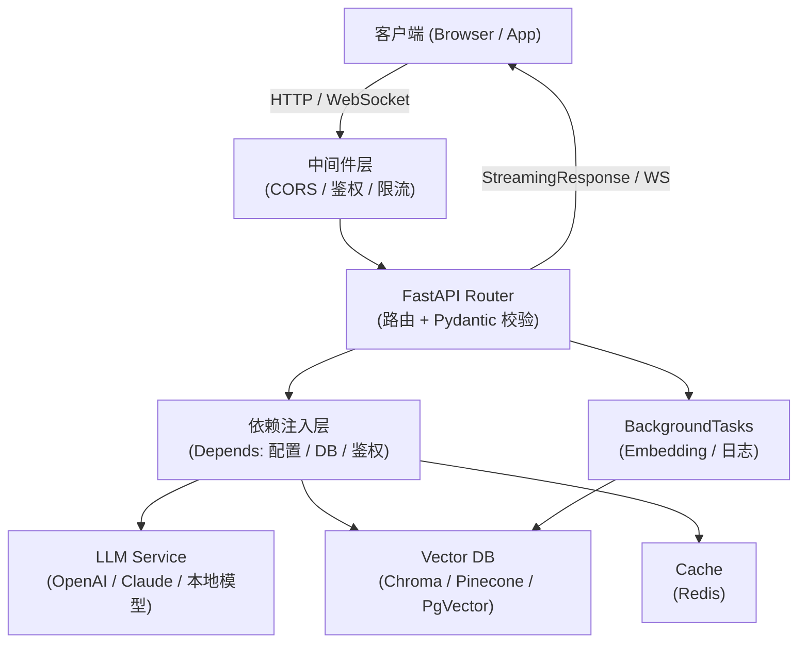

FastAPI 构建 AI 服务需要把“机制是什么”“边界在哪里”“怎样验证”放在同一条学习路径中。本文以 [FastAPI request body tutorial](https://fastapi.tiangolo.com/tutorial/body/) 对“Pydantic 请求体声明、解析、校验与 OpenAPI”的说明为事实边界，并用 [FastAPI concurrency and async/await](https://fastapi.tiangolo.com/async/) 校准“async path operation、阻塞调用与并发边界”。文中的代码和工程方案用于解释这些机制；涉及具体版本、默认值或部署行为时，应再回到所链接的一手资料确认。


*图：FastAPI 构建 AI 服务的核心组件、信息流与验证边界。*

---

在 AI 工程领域，后端框架的选型往往被低估。当你需要把一个 LLM 调用、向量检索、Agent 编排包装成一个可靠的 HTTP 服务时，框架的 async 能力、类型系统和文档化水平会直接影响开发效率与系统稳定性。FastAPI 在这三个维度上同时做到了行业领先，这也是当前大多数 AI 后端项目优先选择它的原因。

## 为什么 FastAPI 适合 AI 后端

LLM 调用的本质是高延迟的网络 I/O（通常 1–30 秒），这与数据库查询的毫秒级延迟有本质差异。在同步框架（如 Flask、Django 默认模式）里，一个请求在等待 LLM 响应时会占住一个线程，100 个并发请求就需要 100 个线程。FastAPI 基于 Starlette 和 asyncio，路由函数可以是 `async def`，等待 LLM 时不占线程，事件循环可以继续处理其他请求，这对 AI 后端是根本性的架构优势。

| 特性 | FastAPI | Flask | Django |
|------|---------|-------|--------|
| 原生 async/await | ✅ 一等公民 | ⚠️ 2.x 支持但生态偏同步 | ⚠️ 3.x ASGI 但历史包袱重 |
| 请求体自动校验 | ✅ Pydantic 内置 | ❌ 需 marshmallow 等 | ❌ 需 DRF Serializer |
| 自动生成 OpenAPI 文档 | ✅ `/docs` `/redoc` | ❌ 需插件 | ❌ 需 drf-spectacular |
| 适合 AI 微服务 | ✅ 轻量，专注 HTTP | ✅ 但 async 体验差 | ❌ 全栈框架过重 |

三个核心优势对 AI/RAG/Agent 工程师的具体意义：

- **原生 async**：LLM 调用、向量库查询、多工具并发调用（`asyncio.gather`）均可无缝组合
- **Pydantic 集成**：LLM 的输入输出往往需要严格的结构化，Pydantic 的嵌套模型、Field 校验、`model_validator` 让结构化提示词和响应解析更可靠
- **自动文档**：AI 接口通常参数复杂（temperature、top_p、system_prompt、工具列表），自动文档让前端和算法团队直接在 `/docs` 联调，减少沟通成本

## 项目结构与基础路由

一个生产级 AI 后端推荐的目录结构：

```
ai_backend/
├── main.py            # FastAPI app 入口
├── routers/
│   ├── chat.py        # /chat 相关路由
│   └── agent.py       # /agent 相关路由
├── models/
│   ├── request.py     # Pydantic 请求模型
│   └── response.py    # Pydantic 响应模型
├── services/
│   ├── llm.py         # LLM 调用逻辑
│   └── vector.py      # 向量检索逻辑
├── dependencies.py    # 公共 Depends 函数
└── config.py          # 配置（读取环境变量）
```

基础路由示例，覆盖 GET/POST、路径参数、查询参数：

```python
from fastapi import FastAPI, Query, Path

app = FastAPI(title="AI Backend", version="1.0.0")

# 路径参数：{session_id} 自动映射，int 类型注解会触发自动校验
@app.get("/sessions/{session_id}/messages")
async def list_messages(
    session_id: int = Path(..., ge=1),
    limit: int = Query(20, ge=1, le=100),
    before_id: int | None = Query(None),
):
    return {"session_id": session_id, "limit": limit, "before_id": before_id}

# 路由模块化：用 APIRouter 拆分后在 main.py 注册
from fastapi import APIRouter
router = APIRouter(prefix="/v1/chat", tags=["Chat"])

@router.post("/completions")
async def chat_completions():
    ...

app.include_router(router)
```

## 请求与响应模型（Pydantic BaseModel）

Pydantic v2 是 FastAPI 的核心依赖，`BaseModel` 负责序列化、反序列化和运行时校验，`response_model` 参数负责响应体的字段裁剪和文档生成：

```python
from pydantic import BaseModel, Field, model_validator
from typing import Literal

class Message(BaseModel):
    role: Literal["system", "user", "assistant"]
    content: str = Field(..., min_length=1)

class ChatRequest(BaseModel):
    messages: list[Message] = Field(..., min_length=1)
    model: str = "gpt-4o"
    temperature: float = Field(0.7, ge=0.0, le=2.0)
    stream: bool = False
    max_tokens: int | None = Field(None, ge=1, le=32768)

    # 跨字段校验：stream 模式下不允许指定 max_tokens（示例）
    @model_validator(mode="after")
    def check_stream_compat(self):
        if self.stream and self.max_tokens is not None:
            raise ValueError("stream 模式下请通过 stop 控制长度")
        return self

class ChatResponse(BaseModel):
    id: str
    model: str
    content: str
    usage: dict

# response_model 自动裁剪多余字段，防止内部字段泄露
@app.post("/chat", response_model=ChatResponse)
async def chat(req: ChatRequest):
    ...
```

`response_model` 是安全边界：即使服务内部返回了包含 `api_key`、`cost` 等字段的字典，FastAPI 也只会按 `ChatResponse` 的字段输出，避免敏感信息泄露。

## 依赖注入（Dependency Injection）

`Depends` 是 FastAPI 实现横切关注点（cross-cutting concerns）的核心机制，适合鉴权、数据库会话、配置注入、速率限制等场景：

```python
from fastapi import Depends, HTTPException, Header
from functools import lru_cache
from pydantic_settings import BaseSettings

# 配置依赖：lru_cache 保证只读取一次环境变量
class Settings(BaseSettings):
    openai_api_key: str
    vector_db_url: str
    class Config:
        env_file = ".env"

@lru_cache
def get_settings() -> Settings:
    return Settings()

# 鉴权依赖
async def verify_api_key(
    x_api_key: str = Header(...),
    settings: Settings = Depends(get_settings),
):
    if x_api_key != settings.openai_api_key:  # 实际应查数据库
        raise HTTPException(status_code=401, detail="Invalid API Key")
    return x_api_key

# 路由依赖组合：Depends 支持嵌套，执行顺序由 FastAPI 自动推导
@app.post("/chat")
async def chat(
    req: ChatRequest,
    _: str = Depends(verify_api_key),          # 鉴权
    settings: Settings = Depends(get_settings), # 配置
):
    return {"key": settings.openai_api_key[:8] + "***"}
```

依赖函数也可以是 `async def`，与路由函数完全一致。测试时可通过 `app.dependency_overrides` 替换依赖，这是 `Depends` 相比装饰器的重要优势。

## 流式响应（StreamingResponse / SSE）

流式输出是 AI 后端与传统后端最显著的差异。LLM 逐 token 生成，用户需要实时看到输出，而非等待完整响应，这要求后端支持 Server-Sent Events（SSE）或 chunked transfer：

```python
from fastapi.responses import StreamingResponse
import httpx, json

async def openai_stream(messages: list[dict], model: str, api_key: str):
    """代理 OpenAI 流式响应，逐行转发 SSE 事件"""
    headers = {
        "Authorization": f"Bearer {api_key}",
        "Content-Type": "application/json",
    }
    payload = {"model": model, "messages": messages, "stream": True}

    async with httpx.AsyncClient(timeout=120) as client:
        async with client.stream(
            "POST",
            "https://api.openai.com/v1/chat/completions",
            json=payload,
            headers=headers,
        ) as resp:
            resp.raise_for_status()
            async for line in resp.aiter_lines():
                if line:
                    yield f"{line}\n\n"  # SSE 规范：每条事件后跟两个换行

@app.post("/v1/chat/completions/stream")
async def stream_chat(req: ChatRequest, settings: Settings = Depends(get_settings)):
    messages = [m.model_dump() for m in req.messages]
    return StreamingResponse(
        openai_stream(messages, req.model, settings.openai_api_key),
        media_type="text/event-stream",
        headers={
            "Cache-Control": "no-cache",
            "X-Accel-Buffering": "no",  # 关键：禁止 Nginx 缓冲流式内容
            "Connection": "keep-alive",
        },
    )
```

关键注意点：生成器必须是 `async def` + `yield`，使用 `httpx.AsyncClient` 而非同步的 `requests`，否则整个事件循环在等待 LLM 期间会被阻塞，服务实际退化为单并发。

## 后台任务（BackgroundTasks）与异步 LLM 调用

某些 AI 任务不需要实时等待结果：文档 embedding 入库、异步 Agent 任务、用量统计记录。`BackgroundTasks` 在响应发送后执行，不阻塞当前请求：

```python
from fastapi import BackgroundTasks

async def embed_and_store(doc_id: str, text: str, settings: Settings):
    """异步向量化并存入向量库"""
    # 调用 embedding API，写入 vector DB
    ...

@app.post("/documents/{doc_id}/index", status_code=202)
async def index_document(
    doc_id: str,
    text: str,
    background_tasks: BackgroundTasks,
    settings: Settings = Depends(get_settings),
):
    # 立即返回 202 Accepted，后台执行向量化
    background_tasks.add_task(embed_and_store, doc_id, text, settings)
    return {"status": "indexing", "doc_id": doc_id}
```

对于更复杂的异步 Agent 任务（需要跟踪状态、支持取消），应考虑 Celery + Redis 或 ARQ，`BackgroundTasks` 适合轻量的「fire-and-forget」场景，不适合长时间任务（进程重启会丢失）。

## 中间件、CORS 与错误处理

```python
from fastapi.middleware.cors import CORSMiddleware
from fastapi import Request
from fastapi.responses import JSONResponse
import time, uuid

# CORS：AI 后端常被前端直调，生产环境必须指定 origins
app.add_middleware(
    CORSMiddleware,
    allow_origins=["https://your-app.com"],  # 不要在生产用 "*"
    allow_credentials=True,
    allow_methods=["GET", "POST", "DELETE"],
    allow_headers=["Authorization", "Content-Type", "X-Request-ID"],
)

# 请求追踪中间件：为每个请求注入唯一 ID，方便日志关联
@app.middleware("http")
async def request_id_middleware(request: Request, call_next):
    request_id = request.headers.get("X-Request-ID", str(uuid.uuid4()))
    start = time.perf_counter()
    response = await call_next(request)
    duration = time.perf_counter() - start
    response.headers["X-Request-ID"] = request_id
    response.headers["X-Response-Time"] = f"{duration:.3f}s"
    return response

# 全局异常处理：捕获未处理的异常，统一响应格式
@app.exception_handler(Exception)
async def global_exception_handler(request: Request, exc: Exception):
    return JSONResponse(
        status_code=500,
        content={"error": type(exc).__name__, "detail": str(exc)},
    )
```

## WebSocket 支持（Agent 实时通信）

多轮 Agent 对话、工具调用过程展示、思维链实时输出等场景需要双向通信，SSE 只能服务端推送，而 WebSocket 支持全双工，更适合 Agent 交互：

```python
from fastapi import WebSocket, WebSocketDisconnect

@app.websocket("/ws/agent/{session_id}")
async def agent_websocket(websocket: WebSocket, session_id: str):
    await websocket.accept()
    try:
        while True:
            # 接收用户输入
            data = await websocket.receive_json()
            user_message = data.get("message", "")

            # 流式推送 Agent 思考过程
            await websocket.send_json({"type": "thinking", "content": "正在调用工具..."})

            # 模拟工具调用结果
            await websocket.send_json({
                "type": "tool_result",
                "tool": "search",
                "content": "找到 3 条相关结果",
            })

            # 推送最终回答
            await websocket.send_json({"type": "answer", "content": "根据搜索结果..."})

    except WebSocketDisconnect:
        # 清理 session 资源
        print(f"Session {session_id} disconnected")
```

WebSocket 路由同样支持 `Depends`，可以在 `websocket.accept()` 之前完成鉴权。

## 典型 AI 后端架构



请求链路说明：
1. 客户端发起请求，经中间件完成 CORS 检查、请求 ID 注入、速率限制
2. FastAPI 路由层完成 Pydantic 校验，参数非法立即返回 422
3. 依赖注入层提供鉴权结果、数据库连接、配置对象
4. 业务层并发调用 LLM 和 Vector DB（`asyncio.gather`）
5. 流式场景通过 StreamingResponse 或 WebSocket 实时返回
6. 后台任务异步处理 embedding、日志、统计等副作用

## 常见误区

**1. 在 async 路由里使用同步阻塞调用**
`requests.get()`、同步 ORM 查询、`time.sleep()` 等都会阻塞事件循环。应替换为 `httpx.AsyncClient`、异步 ORM（SQLAlchemy async / Tortoise），或用 `asyncio.get_event_loop().run_in_executor()` 将同步代码推到线程池。

**2. StreamingResponse 生成器用了 `def` 而非 `async def`**
同步生成器在 FastAPI 的 ASGI 上下文中会被当作普通迭代器处理，无法在 yield 之间让出事件循环，导致流式返回退化为阻塞。

**3. CORS 在生产用 `allow_origins=["*"]`**
允许所有来源会绕过浏览器的同源保护，且与 `allow_credentials=True` 组合时 CORS 规范要求浏览器拒绝请求，会造成诡异的跨域失败。

**4. 把 API Key 直接硬编码在路由函数里**
应通过 `pydantic-settings` 的 `BaseSettings` 读取环境变量，并用 `Depends` 注入，方便测试时 mock，也避免密钥进入代码库。

**5. 忽略 BackgroundTasks 的生命周期**
`BackgroundTasks` 绑定到进程，进程重启时未完成的任务会丢失。长时间任务（> 30s）或需要重试的任务应放到消息队列（Celery、ARQ、RQ）。

## 最佳实践

- **统一响应格式**：定义 `APIResponse[T]` 泛型模型，所有路由通过 `response_model=APIResponse[YourModel]` 保证格式一致
- **版本化路由**：用 `APIRouter(prefix="/v1")` 和 `APIRouter(prefix="/v2")` 隔离版本，避免破坏性变更
- **依赖分层**：基础依赖（配置、DB）放 `dependencies.py`，业务依赖（当前用户、权限检查）放对应的 router 文件
- **LLM 调用超时**：`httpx.AsyncClient(timeout=httpx.Timeout(connect=5, read=120))` 分别设置连接超时和读取超时，LLM 首 token 可能需要 10–30s
- **结构化日志**：用 `structlog` 或 `loguru` 输出 JSON 日志，结合请求追踪中间件的 `request_id`，在分布式系统中快速定位问题
- **Lifespan 管理连接池**：用 `@asynccontextmanager` 的 lifespan 在应用启动时初始化 DB 连接池、LLM 客户端，关闭时释放，避免每次请求重建连接

```python
from contextlib import asynccontextmanager

@asynccontextmanager
async def lifespan(app: FastAPI):
    # 启动：初始化资源
    app.state.http_client = httpx.AsyncClient(timeout=120)
    yield
    # 关闭：释放资源
    await app.state.http_client.aclose()

app = FastAPI(lifespan=lifespan)
```

## 面试常问

**Q：FastAPI 的并发模型是什么？与多线程、多进程有何区别？**
A：FastAPI 基于 asyncio 单线程事件循环，通过协程实现并发，适合 I/O 密集型任务（LLM 调用、DB 查询）。CPU 密集型任务（本地推理、向量计算）应用 `run_in_executor` 推到线程池，或启动独立进程。生产环境通常用 `gunicorn -w 4 -k uvicorn.workers.UvicornWorker` 启动多 worker 利用多核。

**Q：`Depends` 和直接在函数里调用有什么区别？**
A：三个核心优势：1) 依赖可以嵌套，FastAPI 自动推导执行顺序和去重；2) 测试时可通过 `app.dependency_overrides[dep_fn] = mock_fn` 替换，无需修改业务代码；3) 依赖支持 `yield`（类似上下文管理器），可以在请求结束后执行清理（如关闭 DB 事务）。

**Q：SSE 和 WebSocket 如何选择？**
A：SSE（Server-Sent Events）是单向的服务端推送，基于普通 HTTP，实现简单，天然支持自动重连，适合 LLM 流式输出。WebSocket 是全双工，需要协议升级，适合 Agent 对话（需要客户端实时发送工具执行结果给服务端）。如果只是 LLM token 流式返回，SSE + StreamingResponse 足够，且对代理、CDN 的兼容性更好。

**Q：如何在 FastAPI 中实现 RAG 接口？**
A：典型流程：① Pydantic 校验请求（问题 + 可选的上下文窗口大小）→ ② `Depends` 注入 Vector DB 客户端和 LLM 客户端 → ③ 异步调用 embedding API 将问题向量化 → ④ 异步查询 Vector DB 得到相关文档 → ⑤ 构造带上下文的 prompt → ⑥ 调用 LLM，用 `StreamingResponse` 流式返回答案。关键：步骤 ③④ 可用 `asyncio.gather` 并发执行以降低延迟。

**Q：`response_model` 的作用是什么？**
A：两个作用：1) 文档生成，Swagger UI 会展示响应体的字段和类型；2) 数据过滤，FastAPI 会按 `response_model` 的字段裁剪响应，即使 handler 返回了多余字段也不会输出，防止内部数据泄露。如果需要关闭校验只保留文档，可用 `response_model_exclude_unset=True` 或设置 `response_model=None`。

## 参考资料

- [FastAPI request body tutorial](https://fastapi.tiangolo.com/tutorial/body/)
- [FastAPI concurrency and async/await](https://fastapi.tiangolo.com/async/)
