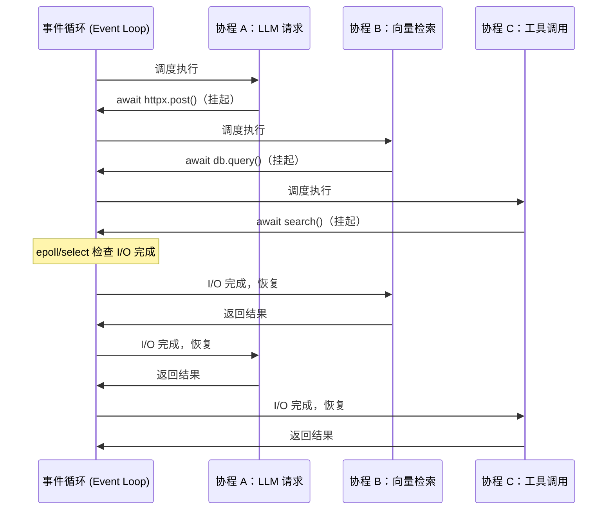
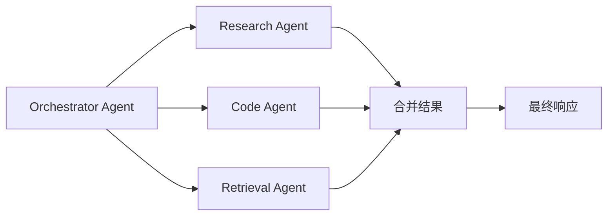

在构建 AI Agent 系统时，一个绕不过去的技术选择是：是否使用异步编程（Asynchronous Programming）。调用 LLM API、读取向量数据库、执行 Web 搜索——这些操作延迟从几十毫秒到数十秒不等，如果全部串行执行，系统吞吐量将严重受限。Python 的 `asyncio` 模块正是解决这类问题的核心工具，理解它的工作原理是每一位 AI/RAG/Agent 工程师的必修课。

## 同步 vs 异步：I/O 密集 vs CPU 密集

程序中的等待主要来自两类操作：

| 类型 | 典型场景 | 瓶颈 | 推荐方案 |
|------|----------|------|----------|
| I/O 密集型（I/O-bound） | LLM API 调用、数据库查询、HTTP 请求、文件读写 | 等待网络/磁盘响应 | `asyncio` |
| CPU 密集型（CPU-bound） | 矩阵运算、图像处理、本地模型推理、加解密 | CPU 计算时间 | `multiprocessing` / `ProcessPoolExecutor` |
| 混合型 | 批量 embedding + 向量检索 | 两者都有 | 异步 I/O + 进程池 |

**为什么 LLM API 调用必须异步？** 一次 GPT-4 调用平均耗时 3-15 秒。若 Agent 同时处理 50 个用户请求，同步模式需要 50 × 10s = 8 分钟；异步模式下，事件循环（Event Loop）在等待某个请求时切换去处理其他请求，总耗时接近单次调用时间。`asyncio` 的并发切换成本仅为微秒级，远低于线程（Thread）的毫秒级上下文切换开销。

> Python 的 GIL（全局解释器锁）限制了多线程并行执行 Python 字节码，但不影响 I/O 等待期间的并发。`asyncio` 通过单线程协作式调度绕开了这一限制。

## 事件循环（Event Loop）与协程（Coroutine）

事件循环是 `asyncio` 的调度核心，本质是一个无限循环，持续检查"哪个任务的 I/O 已完成、可以继续执行"。

协程（Coroutine）是可以在执行中途暂停（suspend）并在之后恢复（resume）的函数。Python 用 `async def` 定义协程函数，调用它返回的是一个协程对象，而非立即执行。



关键认知：事件循环在同一时刻只运行一段 Python 代码（单线程），协程通过 `await` 主动让出控制权，而非被强制抢占。这意味着：**协程内部如果执行了耗时的同步计算，会阻塞整个事件循环**。

## async/await 基本语法与执行模型

```python
import asyncio
import httpx

# async def 定义协程函数，调用后返回协程对象，不会立即执行
async def call_llm(prompt: str) -> str:
    async with httpx.AsyncClient() as client:
        resp = await client.post(
            "https://api.openai.com/v1/chat/completions",
            json={"model": "gpt-4o-mini", "messages": [{"role": "user", "content": prompt}]},
            headers={"Authorization": f"Bearer {API_KEY}"},
        )
        return resp.json()["choices"][0]["message"]["content"]

async def main():
    # await 挂起当前协程，把控制权交回事件循环
    result = await call_llm("用一句话解释 asyncio")
    print(result)

# asyncio.run() 是 Python 3.7+ 推荐的唯一入口
asyncio.run(main())
```

`await` 只能用在 `async def` 内部，否则触发 `SyntaxError`。`asyncio.run()` 会创建新的事件循环、运行协程、完成后自动关闭——不要手动管理 `get_event_loop()` / `loop.close()`。

**Jupyter Notebook 特例**：Jupyter 内部已有运行中的事件循环，直接 `asyncio.run()` 会抛 `RuntimeError`。解决方案：直接 `await main()`，或安装 `nest_asyncio` 库。

## asyncio 核心 API

### asyncio.gather — 批量并发

`gather` 并发调度多个协程，等所有完成后按传入顺序返回结果列表。这是 Agent 中并行调用多个工具（Tool Call）的标准写法。

```python
async def parallel_tool_calls(tool_calls: list[dict]) -> list:
    """Agent 并行执行多个 tool call，总耗时 = 最慢那个工具"""
    async def run_one(call: dict):
        tool = TOOL_REGISTRY[call["name"]]
        return await tool.ainvoke(call["arguments"])

    # return_exceptions=True：单个工具失败不影响其他工具继续执行
    results = await asyncio.gather(
        *[run_one(c) for c in tool_calls],
        return_exceptions=True,
    )
    return results
```

### asyncio.create_task — 即时调度

`create_task` 将协程立即包装为 `Task` 并加入调度队列，无需等待 `await`。适合"先启动、后汇聚"的模式，或需要单独取消某个任务的场景。

```python
async def main():
    # 两个任务已经开始并发运行
    task_llm = asyncio.create_task(call_llm("问题A"))
    task_embed = asyncio.create_task(embed_text("文档B"))

    # 此处可以做其他工作，之后再等待结果
    answer = await task_llm
    vector = await task_embed
```

`Task` 对象支持 `.cancel()`、`.done()`、`.result()`、`.add_done_callback()` 等方法，控制粒度比 `gather` 更细。

### asyncio.wait — 细粒度等待

`wait` 接受 Task 集合，返回 `(done, pending)` 两个集合，配合 `return_when` 参数实现"第一个完成即返回"等策略：

```python
async def race_llms(prompts: list[str]):
    """多个 LLM 提供商竞速，用最快的那个结果"""
    tasks = {asyncio.create_task(call_llm(p)) for p in prompts}
    done, pending = await asyncio.wait(tasks, return_when=asyncio.FIRST_COMPLETED)

    # 取消其余未完成的任务
    for t in pending:
        t.cancel()

    return done.pop().result()
```

`gather` vs `wait` 选择原则：需要有序结果且统一处理用 `gather`；需要先处理最快完成的或部分取消用 `wait`。

## 异步上下文管理器与异步迭代器

### async with — 异步上下文管理器

实现 `__aenter__` / `__aexit__` 即可，常见于数据库连接池（asyncpg、motor）、HTTP 会话（aiohttp、httpx）：

```python
async def fetch_embeddings(texts: list[str]) -> list[list[float]]:
    async with httpx.AsyncClient(timeout=30) as client:
        # client 会在 with 块结束时自动关闭，即便发生异常
        tasks = [client.post(EMBED_URL, json={"input": t}) for t in texts]
        responses = await asyncio.gather(*tasks)
    return [r.json()["data"][0]["embedding"] for r in responses]
```

### async for — 异步迭代器与流式输出

`async for` 配合异步生成器（`async def` + `yield`）实现 LLM 流式输出（Streaming），用户看到逐 token 输出而非等待完整响应：

```python
async def stream_response(prompt: str):
    """逐 token 流式输出，适合前端实时展示"""
    async with httpx.AsyncClient() as client:
        async with client.stream(
            "POST", CHAT_URL,
            json={"model": "gpt-4o", "messages": [...], "stream": True},
        ) as resp:
            async for line in resp.aiter_lines():
                if line.startswith("data: ") and line != "data: [DONE]":
                    chunk = json.loads(line[6:])
                    delta = chunk["choices"][0]["delta"].get("content", "")
                    if delta:
                        yield delta  # 调用方 async for 逐块消费

async def main():
    async for token in stream_response("讲解 asyncio"):
        print(token, end="", flush=True)
```

## 并发控制：asyncio.Semaphore

`Semaphore`（信号量）限制同时执行的协程数量，防止并发过高触发 API 速率限制（Rate Limit）或压垮服务端。在批量处理 RAG 索引、批量 embedding 等场景中**必须**使用。

```python
async def batch_embed(texts: list[str], max_concurrent: int = 20) -> list[list[float]]:
    """批量 embedding，限制最多 20 个并发请求，避免触发 OpenAI Rate Limit"""
    sem = asyncio.Semaphore(max_concurrent)

    async def embed_one(text: str) -> list[float]:
        async with sem:  # 超过上限的协程在此阻塞等待
            resp = await openai_client.embeddings.create(
                input=text,
                model="text-embedding-3-small",
            )
            return resp.data[0].embedding

    return await asyncio.gather(*[embed_one(t) for t in texts], return_exceptions=True)
```

`Semaphore` 的值即最大并发数，`async with sem` 进入时计数减一，退出时计数加一，为零时后续协程阻塞等待。

## 与同步代码集成

事件循环是单线程的，**在协程内直接调用阻塞的同步函数（如 `requests.get`、`time.sleep`、同步文件 I/O）会冻结整个事件循环，使所有其他协程无法运行**。

### asyncio.to_thread（Python 3.9+，推荐）

```python
import asyncio
import requests  # 同步库

async def fetch_sync_wrapped(url: str) -> str:
    # 把同步阻塞函数放到线程池，不阻塞事件循环
    response = await asyncio.to_thread(requests.get, url)
    return response.text
```

### loop.run_in_executor（兼容旧版本）

```python
from concurrent.futures import ProcessPoolExecutor
import asyncio

def cpu_heavy(data: bytes) -> bytes:
    """CPU 密集型操作，如本地向量化、压缩"""
    ...

async def main():
    loop = asyncio.get_running_loop()
    # CPU 密集型用进程池，绕开 GIL
    with ProcessPoolExecutor() as pool:
        result = await loop.run_in_executor(pool, cpu_heavy, data)
```

选择原则：I/O 阻塞同步库 → `asyncio.to_thread`（线程池）；CPU 密集计算 → `run_in_executor` + `ProcessPoolExecutor`（进程池）。

## AI Agent 中的异步模式

### 多 Agent 并发编排

在 Multi-Agent 系统中，多个子 Agent 同时执行互不依赖的任务，汇聚后合并结果：



```python
async def orchestrate(query: str) -> str:
    research, code_context, docs = await asyncio.gather(
        research_agent.arun(query),
        code_agent.arun(query),
        retrieval_agent.arun(query),
    )
    return synthesize(research, code_context, docs)
```

### Python 3.11+ TaskGroup — 结构化并发

`TaskGroup` 是对 `gather` 的结构化升级，任一任务异常会自动取消组内所有其他任务，并将异常集合到 `ExceptionGroup` 中：

```python
async def run_agents():
    async with asyncio.TaskGroup() as tg:
        task_a = tg.create_task(agent_a.arun())
        task_b = tg.create_task(agent_b.arun())
    # TaskGroup 退出后所有任务已完成，异常已传播
    return task_a.result(), task_b.result()
```

生产环境优先选用 `TaskGroup`，其结构化取消语义远比裸 `gather` 更安全。

---

## 常见误区

**误区 1：忘记 `await`**

```python
# 错误：协程对象没有执行，Python 3.12+ 会抛 RuntimeWarning
async def main():
    call_llm("hello")  # 漏掉 await，无任何效果

# 正确
async def main():
    result = await call_llm("hello")
```

**误区 2：在协程中调用同步阻塞函数**

```python
# 错误：time.sleep 会冻结整个事件循环
async def bad():
    time.sleep(2)  # 全部协程被阻塞 2 秒

# 正确
async def good():
    await asyncio.sleep(2)  # 只挂起当前协程
```

**误区 3：CPU 密集型任务误用 asyncio**

`asyncio` 无法加速 CPU 计算，协程切换只发生在 `await` 处。本地模型推理（如 `llama.cpp`）应放在 `ProcessPoolExecutor` 中，而非直接在协程中运行。

**误区 4：不限并发导致 Rate Limit 或 OOM**

对 OpenAI / Claude 等 API 无节制地并发，会触发 `429 Too Many Requests`。始终在批量处理场景中使用 `asyncio.Semaphore`。

**误区 5：在 Jupyter 中调用 `asyncio.run()`**

Jupyter 已有运行中的事件循环，`asyncio.run()` 会报错。使用 `await coroutine()` 或 `nest_asyncio.apply()` 解决。

---

## 最佳实践

- **入口只用 `asyncio.run()`**：不要手动创建或管理事件循环，不要嵌套调用 `asyncio.run()`。
- **同步阻塞代码一律隔离**：`requests`、`time.sleep`、`open()` 等必须用 `asyncio.to_thread` 或 `run_in_executor` 包裹。
- **批量 API 调用必加 Semaphore**：LLM 和 Embedding API 都有速率限制，`max_concurrent` 建议设为 10-50，视服务商限额调整。
- **`gather` 加 `return_exceptions=True`**：批处理场景下单个失败不应导致全部丢弃，错误由调用方逐条处理。
- **Python 3.11+ 优先使用 `TaskGroup`**：结构化并发，自动处理异常传播和任务取消，比裸 `gather` 更安全。
- **框架层保持 async 一致性**：FastAPI、Starlette 等框架的路由处理器全部用 `async def`；混用同步处理器会退化为线程执行，丧失异步优势。
- **流式输出尽早 yield**：LLM 流式接口能显著改善用户感知延迟，Agent 框架应贯通 `async for` 管道，避免中间层缓冲。

---

## 面试常问

**Q：协程（Coroutine）与线程（Thread）的核心区别？**

协程是**用户态、协作式**调度，在 `await` 处主动让出控制权，切换成本约 1μs，无竞争条件，无需加锁；线程是**内核态、抢占式**调度，切换成本约 1-10ms，存在竞争条件，需要锁保护共享状态。asyncio 可轻松维护数万个协程，线程通常上千就会出现性能问题。

**Q：`asyncio.gather` 与 `asyncio.wait` 的区别？**

`gather` 接受协程或任务，返回**有序结果列表**，任一异常默认取消其余任务（`return_exceptions=True` 可改变此行为）；`wait` 接受 Task 集合，返回 `(done, pending)` 集合，支持 `FIRST_COMPLETED` / `FIRST_EXCEPTION` / `ALL_COMPLETED` 策略，控制粒度更细，适合竞速或部分取消场景。

**Q：事件循环的运行原理？**

事件循环维护一个**就绪队列**（ready queue）和一个 **I/O 等待集合**。每次 tick：① 执行就绪队列中所有回调；② 调用 `select`/`epoll`/`kqueue` 等系统调用，检查哪些 I/O 已完成；③ 将完成 I/O 对应的协程放入就绪队列；④ 重复。时间复杂度接近 O(n) 的 I/O 多路复用，是其高并发的底层支撑。

**Q：Task 取消（Cancel）的机制是什么？**

调用 `task.cancel()` 会在协程的下一个 `await` 点注入 `CancelledError`。协程可用 `try/except asyncio.CancelledError` 捕获并执行清理逻辑，但**清理后必须重新 `raise`**，否则取消请求被静默吞掉，`Task` 不会标记为已取消。`asyncio.shield(coro)` 可保护内层协程不受外层取消影响，适合"取消外层操作但数据库写入必须完成"的场景。

**Q：如何在同步函数中调用异步函数？**

三种方式：① 将包装函数改为 `async def`（推荐，彻底异步化）；② 使用 `asyncio.run(coro)` 作为顶层入口；③ 在已有事件循环中用 `loop.run_until_complete(coro)`（需持有 loop 引用，不推荐）。切忌在协程内嵌套调用 `asyncio.run()`，会抛 `RuntimeError: This event loop is already running`。
