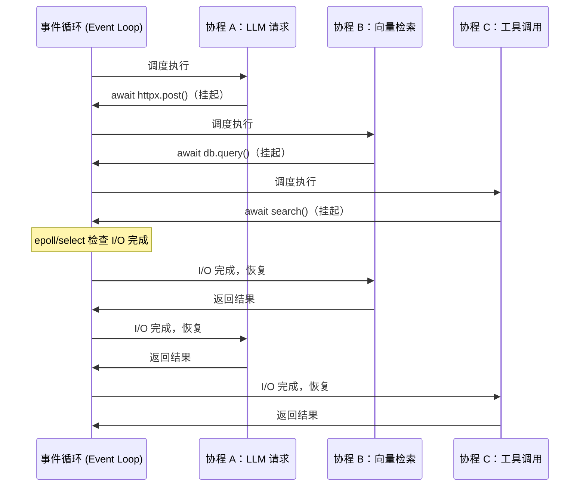
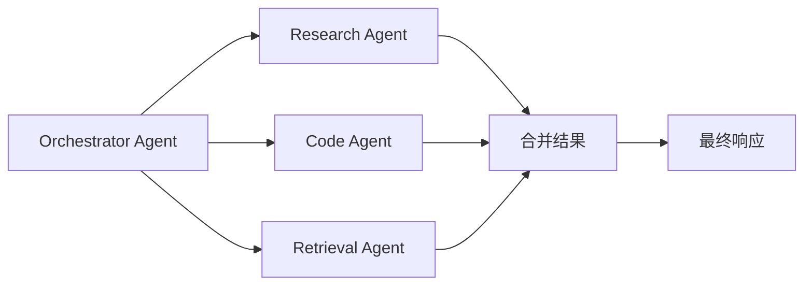

*图：三个 Task 在 `await` I/O 时把执行权交回 event loop，I/O ready 后恢复；TaskGroup 内一个失败会触发 sibling cancellation，并在 `finally` 清理。*

---

在构建 AI Agent 系统时，一个绕不过去的技术选择是：是否使用异步编程（Asynchronous Programming）。调用 LLM API、读取向量数据库、执行 Web 搜索都可能花大量时间等待远端 I/O；若把互不依赖的等待全部串行化，吞吐和端到端延迟会受影响。Python 的 `asyncio` 为这类协作式并发提供 event loop、Future 与 Task 等抽象。（参见 [PEP 3156: Asynchronous IO Support Rebooted](https://peps.python.org/pep-3156/)）

## 同步 vs 异步：I/O 密集 vs CPU 密集

程序中的等待主要来自两类操作：

| 类型 | 典型场景 | 瓶颈 | 推荐方案 |
|------|----------|------|----------|
| I/O 密集型（I/O-bound） | LLM API 调用、数据库查询、HTTP 请求、文件读写 | 等待网络/磁盘响应 | `asyncio` |
| CPU 密集型（CPU-bound） | 矩阵运算、图像处理、本地模型推理、加解密 | CPU 计算时间 | `multiprocessing` / `ProcessPoolExecutor` |
| 混合型 | 批量 embedding + 向量检索 | 两者都有 | 异步 I/O + 进程池 |

**为什么 LLM API 调用适合异步？** 网络请求的大部分时间在等待远端响应。同步串行代码会让后续请求一直排队；异步代码可以在一个请求等待 I/O 时推进其他任务。实际吞吐、延迟和调度开销取决于网络、限流、客户端实现与运行环境，应以压测结果为准，不能用一组固定数字外推。

> Python 的 GIL（全局解释器锁）限制了多线程并行执行 Python 字节码，但不影响 I/O 等待期间的并发。`asyncio` 通过单线程协作式调度绕开了这一限制。

## 事件循环（Event Loop）与协程（Coroutine）

事件循环是 `asyncio` 的调度核心，本质是一个无限循环，持续检查"哪个任务的 I/O 已完成、可以继续执行"。

协程（Coroutine）是可以在执行中途暂停（suspend）并在之后恢复（resume）的函数。Python 用 `async def` 定义协程函数，调用它返回的是一个协程对象，而非立即执行。



关键认知：事件循环在同一时刻只运行一段 Python 代码（单线程），协程通过 `await` 主动让出控制权，而非被强制抢占。这意味着：**协程内部如果执行了耗时的同步计算，会阻塞整个事件循环**。

## async/await 基本语法与执行模型

```python
import asyncio
import httpx

# async def 定义协程函数，调用后返回协程对象，不会立即执行
async def call_llm(prompt: str) -> str:
    async with httpx.AsyncClient() as client:
        resp = await client.post(
            "https://api.openai.com/v1/chat/completions",
            json={"model": "gpt-4o-mini", "messages": [{"role": "user", "content": prompt}]},
            headers={"Authorization": f"Bearer {API_KEY}"},
        )
        return resp.json()["choices"][0]["message"]["content"]

async def main():
    # await 挂起当前协程，把控制权交回事件循环
    result = await call_llm("用一句话解释 asyncio")
    print(result)

# 单次命令行程序的常规顶层入口
asyncio.run(main())
```

`await` 只能出现在支持异步语法的上下文。`asyncio.run()` 会创建事件循环、运行协程并在完成后关闭，适合单次命令行入口；它不是所有场景的唯一 API。[Python asyncio runners](https://docs.python.org/3/library/asyncio-runner.html)还提供 Python 3.11+ 的 `asyncio.Runner`，用于在同一 event loop/context 中多次运行顶层 async 函数。

**Jupyter Notebook 特例**：Jupyter 内部已有运行中的事件循环，直接 `asyncio.run()` 会抛 `RuntimeError`。在支持 top-level await 的单元格直接 `await main()`；不要把给现有 loop 打补丁作为默认方案。

## asyncio 核心 API

### asyncio.gather — 批量并发

[`asyncio.gather`](https://docs.python.org/3/library/asyncio-task.html#asyncio.gather) 会并发运行传入的 awaitable，并在全部成功时按传入顺序返回结果列表。它适合需要把一组结果汇总起来的调用，但错误传播和取消语义必须显式设计。

```python
async def parallel_tool_calls(tool_calls: list[dict]) -> list[dict]:
    """并发执行工具，并把每项成功或失败显式编码到返回值。"""
    async def run_one(call: dict):
        tool = TOOL_REGISTRY[call["name"]]
        return await tool.ainvoke(call["arguments"])

    # 结果元素的运行时类型是正常返回值或 BaseException。
    results = await asyncio.gather(
        *[run_one(c) for c in tool_calls],
        return_exceptions=True,
    )
    outcomes = []
    for call, result in zip(tool_calls, results):
        if isinstance(result, asyncio.CancelledError):
            raise result  # 不把当前操作的取消伪装成普通工具失败
        if isinstance(result, BaseException):
            outcomes.append({
                "tool": call["name"],
                "ok": False,
                "error_type": type(result).__name__,
                "error": str(result),
            })
        else:
            outcomes.append({"tool": call["name"], "ok": True, "value": result})
    return outcomes
```

### asyncio.create_task — 即时调度

`create_task` 将协程立即包装为 `Task` 并加入调度队列，无需等待 `await`。适合"先启动、后汇聚"的模式，或需要单独取消某个任务的场景。

```python
async def main():
    # 两个任务已经开始并发运行
    task_llm = asyncio.create_task(call_llm("问题A"))
    task_embed = asyncio.create_task(embed_text("文档B"))

    # 此处可以做其他工作，之后再等待结果
    answer = await task_llm
    vector = await task_embed
```

`Task` 对象支持 `.cancel()`、`.done()`、`.result()`、`.add_done_callback()` 等方法，控制粒度比 `gather` 更细。

### asyncio.wait — 细粒度等待

`wait` 接受 Task 集合，返回 `(done, pending)` 两个集合，配合 `return_when` 参数实现"第一个完成即返回"等策略：

```python
async def race_llms(prompts: list[str]):
    """多个 LLM 提供商竞速，用最快的那个结果"""
    tasks = {asyncio.create_task(call_llm(p)) for p in prompts}
    done, pending = await asyncio.wait(tasks, return_when=asyncio.FIRST_COMPLETED)
    winner = next(iter(done))

    # 取消其余任务后仍要等待它们结束，让 finally/连接清理真正完成。
    for t in tasks:
        if t is not winner and not t.done():
            t.cancel()
    await asyncio.gather(
        *(t for t in tasks if t is not winner),
        return_exceptions=True,
    )

    # winner 若失败，在完成清理后把原异常传播给调用方。
    return winner.result()
```

`gather` vs `wait` 选择原则：需要有序结果且统一处理用 `gather`；需要先处理最快完成的或部分取消用 `wait`。

## 异步上下文管理器与异步迭代器

### async with — 异步上下文管理器

实现 `__aenter__` / `__aexit__` 即可，常见于数据库连接池（asyncpg、motor）、HTTP 会话（aiohttp、httpx）：

```python
async def fetch_embeddings(texts: list[str]) -> list[list[float]]:
    async with httpx.AsyncClient(timeout=30) as client:
        # client 会在 with 块结束时自动关闭，即便发生异常
        tasks = [client.post(EMBED_URL, json={"input": t}) for t in texts]
        responses = await asyncio.gather(*tasks)
    return [r.json()["data"][0]["embedding"] for r in responses]
```

### async for — 异步迭代器与流式输出

`async for` 配合异步生成器（`async def` + `yield`）实现 LLM 流式输出（Streaming），用户可以逐步看到提供商返回的文本增量，而非等待完整响应；一个增量片段不一定恰好对应一个 token：

```python
async def stream_response(prompt: str):
    """逐增量文本片段输出，适合前端实时展示。"""
    async with httpx.AsyncClient() as client:
        async with client.stream(
            "POST", CHAT_URL,
            json={"model": "gpt-4o", "messages": [...], "stream": True},
        ) as resp:
            async for line in resp.aiter_lines():
                if line.startswith("data: ") and line != "data: [DONE]":
                    chunk = json.loads(line[6:])
                    delta = chunk["choices"][0]["delta"].get("content", "")
                    if delta:
                        yield delta  # 调用方 async for 逐块消费

async def main():
    async for delta in stream_response("讲解 asyncio"):
        print(delta, end="", flush=True)
```

## 并发控制：asyncio.Semaphore

`Semaphore`（信号量）限制同时执行的协程数量，防止并发过高触发 API 速率限制（Rate Limit）或压垮服务端。在批量处理 RAG 索引、批量 embedding 等场景中**必须**使用。

```python
async def batch_embed(texts: list[str], max_concurrent: int) -> list[list[float]]:
    """批量 embedding，限制最多 20 个并发请求，避免触发 OpenAI Rate Limit"""
    sem = asyncio.Semaphore(max_concurrent)

    async def embed_one(text: str) -> list[float]:
        async with sem:  # 超过上限的协程在此阻塞等待
            resp = await openai_client.embeddings.create(
                input=text,
                model="text-embedding-3-small",
            )
            return resp.data[0].embedding

    # 这里选择整体失败语义，因此不把异常混入 list[list[float]]。
    return await asyncio.gather(*[embed_one(t) for t in texts])
```

`Semaphore` 的值即最大并发数，`async with sem` 进入时计数减一，退出时计数加一，为零时后续协程阻塞等待。

## 与同步代码集成

事件循环是单线程的，**在协程内直接调用阻塞的同步函数（如 `requests.get`、`time.sleep`、同步文件 I/O）会冻结整个事件循环，使所有其他协程无法运行**。

### asyncio.to_thread（Python 3.9+，推荐）

```python
import asyncio
import requests  # 同步库

async def fetch_sync_wrapped(url: str) -> str:
    # 把同步阻塞函数放到线程池，不阻塞事件循环
    response = await asyncio.to_thread(requests.get, url)
    return response.text
```

### loop.run_in_executor（兼容旧版本）

```python
from concurrent.futures import ProcessPoolExecutor
import asyncio

def cpu_heavy(data: bytes) -> bytes:
    """CPU 密集型操作，如本地向量化、压缩"""
    ...

async def main():
    loop = asyncio.get_running_loop()
    # CPU 密集型用进程池，绕开 GIL
    with ProcessPoolExecutor() as pool:
        result = await loop.run_in_executor(pool, cpu_heavy, data)
```

选择原则：I/O 阻塞同步库 → `asyncio.to_thread`（线程池）；CPU 密集计算 → `run_in_executor` + `ProcessPoolExecutor`（进程池）。

## AI Agent 中的异步模式

### 多 Agent 并发编排

在 Multi-Agent 系统中，多个子 Agent 同时执行互不依赖的任务，汇聚后合并结果：



```python
async def orchestrate(query: str) -> str:
    research, code_context, docs = await asyncio.gather(
        research_agent.arun(query),
        code_agent.arun(query),
        retrieval_agent.arun(query),
    )
    return synthesize(research, code_context, docs)
```

### Python 3.11+ TaskGroup — 结构化并发

`TaskGroup` 提供结构化并发边界：组内首个非 `CancelledError` 异常通常会取消尚未完成的兄弟任务，退出上下文时再以 `ExceptionGroup` / `BaseExceptionGroup` 传播不能直接重抛的异常。完整例外以 [Python asyncio tasks and task groups](https://docs.python.org/3/library/asyncio-task.html) 为准：

```python
async def run_agents():
    async with asyncio.TaskGroup() as tg:
        task_a = tg.create_task(agent_a.arun())
        task_b = tg.create_task(agent_b.arun())
    # TaskGroup 退出后所有任务已完成，异常已传播
    return task_a.result(), task_b.result()
```

当一组任务应当共同成功或失败时，`TaskGroup` 的生命周期边界通常比裸 `gather` 更容易推理；需要容纳局部失败并逐项返回结果时，`gather(..., return_exceptions=True)` 仍可能更合适。

---

## 常见误区

**误区 1：忘记 `await`**

```python
# 错误：协程对象没有执行，Python 3.12+ 会抛 RuntimeWarning
async def main():
    call_llm("hello")  # 漏掉 await，无任何效果

# 正确
async def main():
    result = await call_llm("hello")
```

**误区 2：在协程中调用同步阻塞函数**

```python
# 错误：time.sleep 会冻结整个事件循环
async def bad():
    time.sleep(2)  # 全部协程被阻塞 2 秒

# 正确
async def good():
    await asyncio.sleep(2)  # 只挂起当前协程
```

**误区 3：CPU 密集型任务误用 asyncio**

`asyncio` 无法加速 CPU 计算，协程切换只发生在 `await` 处。本地模型推理（如 `llama.cpp`）应放在 `ProcessPoolExecutor` 中，而非直接在协程中运行。

**误区 4：不限并发导致 Rate Limit 或 OOM**

对远端 API 无节制地并发，可能触发服务端限流或耗尽本地连接、内存。批量处理应根据提供商配额与压测结果设置并发上限；`asyncio.Semaphore` 是一种常见实现，但已有连接池或任务队列也可以承担这一职责。

**误区 5：在 Jupyter 中调用 `asyncio.run()`**

Jupyter 已有运行中的事件循环，`asyncio.run()` 会报错。在 notebook 单元格使用 top-level `await coroutine()`，或把同步入口移到独立脚本。

---

## 最佳实践

- **按宿主选择 runner**：单次脚本通常用 `asyncio.run()`；Python 3.11+ 需要复用同一 loop/context 的多个顶层调用可用 `asyncio.Runner`；已有事件循环中不要嵌套调用 `asyncio.run()`。
- **隔离会阻塞 event loop 的工作**：同步网络请求、长时间文件 I/O 或 CPU 密集计算不要直接占用事件循环；根据任务性质使用异步库、`asyncio.to_thread` 或进程池。
- **并发上限来自约束**：结合提供商配额、连接池大小、内存与目标延迟校准，不复制固定的 `max_concurrent`。
- **按失败语义选择组合方式**：批处理若要保留每项失败，可用 `gather(..., return_exceptions=True)` 并逐项处理；任务需要共同成败时可考虑 `TaskGroup`。
- **框架层按工作类型选择处理器**：路由真正执行异步 I/O 时使用 `async def`；若处理器调用无法替换的同步阻塞库，按框架约定使用同步处理器或显式移入线程，避免阻塞 event loop。
- **流式输出尽早 yield**：LLM 流式接口能显著改善用户感知延迟，Agent 框架应贯通 `async for` 管道，避免中间层缓冲。

---

## 面试常问

**Q：协程（Coroutine）与线程（Thread）的核心区别？**

协程由事件循环做**协作式**调度，通常在 `await` 处让出控制权；线程由操作系统做抢占式调度。协程并不天然消除竞争：多个 Task 若在 `await` 前后读写同一可变状态，仍可能发生逻辑竞态，需要锁、队列或所有权约束。两者的切换成本和可承载数量都依工作负载与运行环境而变，应通过压测选择。

**Q：`asyncio.gather` 与 `asyncio.wait` 的区别？**

`gather` 接受 awaitable，并在成功时返回**按输入顺序排列的结果列表**。默认 `return_exceptions=False` 时，首个异常会立即传播给等待 `gather` 的调用者，但其他已提交 awaitable 不会因此自动取消；`return_exceptions=True` 则把异常放进结果列表。`wait` 接受 Task/Future 集合，返回 `(done, pending)`，并支持 `FIRST_COMPLETED` / `FIRST_EXCEPTION` / `ALL_COMPLETED` 等等待条件，适合竞速或由调用方管理 pending 任务。[Python asyncio Task 文档](https://docs.python.org/3/library/asyncio-task.html#asyncio.gather)明确区分了这些传播与取消语义。

**Q：事件循环的运行原理？**

事件循环维护可运行的回调、定时器和等待 I/O 的注册项，并借助平台 selector/poller 获取就绪事件；完成 I/O 会让相应 Future/Task 再次具备运行条件。具体每轮处理策略、系统调用和复杂度取决于事件循环实现与就绪事件数量，不应概括成固定的 `O(n)`。

**Q：Task 取消（Cancel）的机制是什么？**

调用 `task.cancel()` 会在协程的下一个 `await` 点注入 `CancelledError`。协程可用 `try/except asyncio.CancelledError` 捕获并执行清理逻辑，但**清理后必须重新 `raise`**，否则取消请求被静默吞掉，`Task` 不会标记为已取消。`asyncio.shield(coro)` 可保护内层协程不受外层取消影响，适合"取消外层操作但数据库写入必须完成"的场景。

**Q：如何在同步函数中调用异步函数？**

三种常见方式：① 将包装函数改为 `async def`，由已有异步调用链 `await`；② 在普通脚本的同步顶层使用 `asyncio.run(coro)`；③ 仅当同步代码**拥有一个尚未运行的 loop** 时，才可调用 `loop.run_until_complete(coro)`。不要对已经运行的 loop 调用 `run_until_complete`，也不要在协程内嵌套 `asyncio.run()`；Notebook 或异步框架中应使用其现有 loop 提供的 `await`/调度入口。（参见 [Python asyncio documentation](https://docs.python.org/3/library/asyncio.html)）

## 参考资料

- [Python asyncio documentation](https://docs.python.org/3/library/asyncio.html)
- [PEP 3156: Asynchronous IO Support Rebooted](https://peps.python.org/pep-3156/)
- [Python asyncio runners](https://docs.python.org/3/library/asyncio-runner.html)
- [Python asyncio tasks and task groups](https://docs.python.org/3/library/asyncio-task.html)
