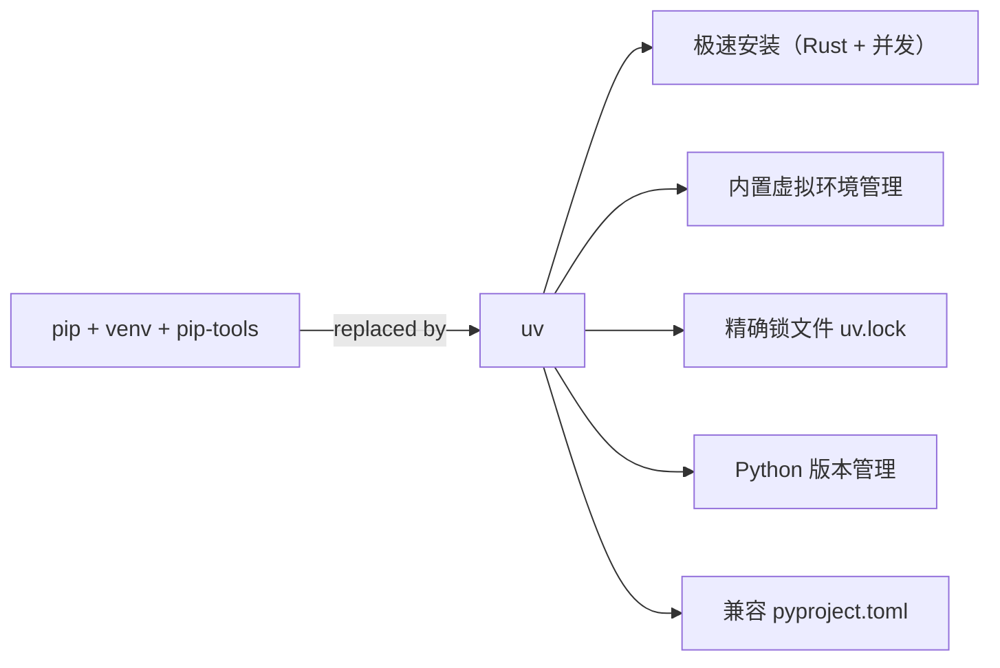
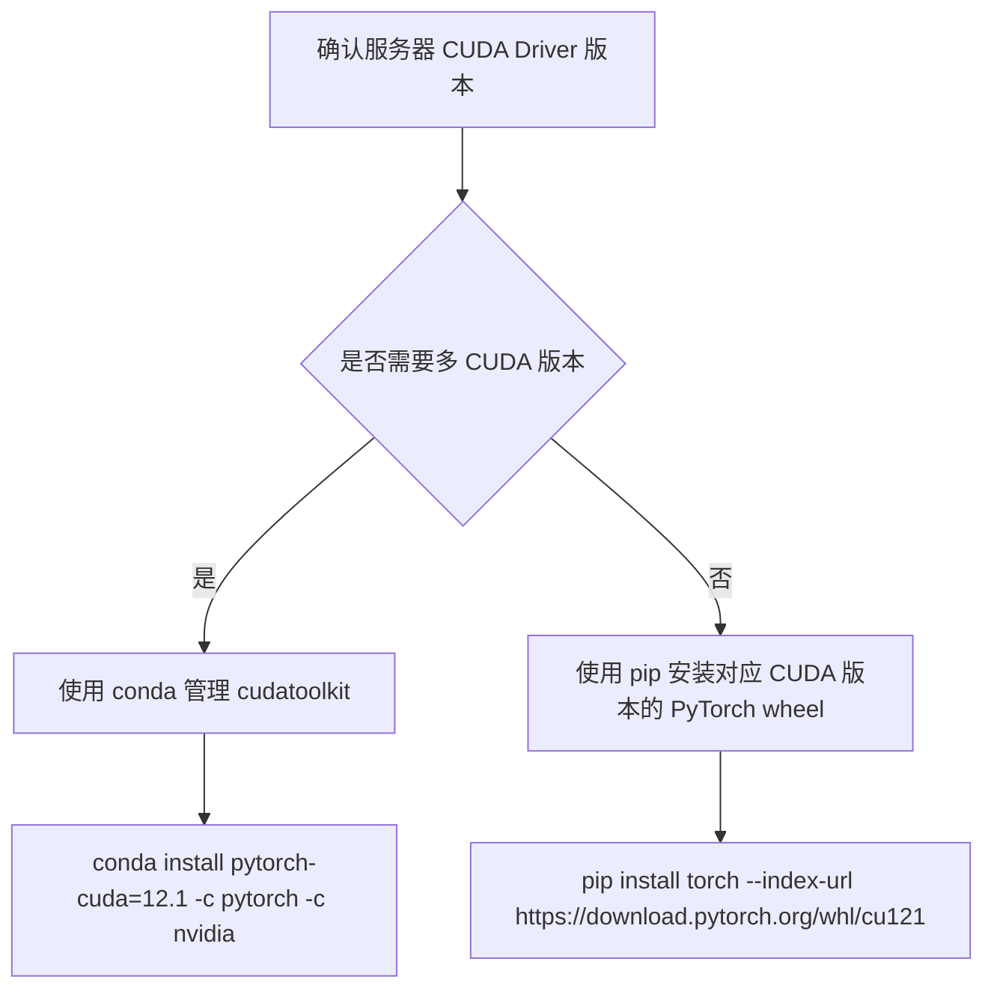

*图：沿图中的节点与箭头阅读，重点是明确解释器、venv、installer、lock/constraints 与可复现环境边界。*

---

对 AI/Agent 工程师来说，Python 环境管理绝非"装个包"这么简单。一个典型的 LLM 应用栈可能同时依赖 `torch==2.3`、`transformers==4.41`、`faiss-gpu`、`langchain`，以及若干个彼此版本敏感的 CUDA 绑定库。一旦环境混乱，`import torch` 可能因 CUDA 版本不匹配直接崩溃，RAG pipeline 在本地跑通而在 CI/CD 上失败，或者两个项目的 `numpy` 版本相互覆盖导致难以溯源的数值 bug。掌握 pip/conda/uv 的原理与最佳实践，是构建可复现、可协作 AI 工程项目的基础能力。

## 为什么环境隔离对 AI 工程师尤为重要

Python 默认将所有包安装到全局 `site-packages`，这在单项目场景下问题不大，但 AI 工程场景有其特殊性：

- **依赖版本极度敏感**：PyTorch 与 CUDA、cuDNN 版本需要精确匹配。`torch==2.1` 可能要求 `CUDA 11.8`，而 `torch==2.3` 需要 `CUDA 12.1`，混装必然报错。
- **库体积庞大且变更频繁**：`transformers`、`diffusers`、`vllm` 等库版本迭代快，API 破坏性变更常见。
- **多项目并存**：Agent 框架（LangChain/LlamaIndex）、微调脚本、推理服务往往是三个独立项目，依赖树互不兼容。
- **团队协作与 CI/CD 可复现**：本地"能跑"不等于生产环境"能跑"，精确的锁文件是 MLOps 流水线的必要条件。

虚拟环境（virtual environment）的本质是：为每个项目创建一个独立的 Python 解释器引用和 `site-packages` 目录，通过修改 `PATH` 和 `PYTHONPATH` 实现隔离。

```
项目根目录/
├── .venv/                      # 虚拟环境目录（不提交 Git）
│   └── lib/python3.11/
│       └── site-packages/      # 当前项目独立的包空间
├── src/                        # 业务代码
├── requirements.txt            # 或 pyproject.toml / uv.lock
└── .gitignore                  # 包含 .venv/
```

## pip 基础与进阶

pip（Package Installer for Python）是官方标准包管理器，理解其工作机制是后续工具的基础。

### 常用命令速查

```bash
# 安装指定版本（支持版本约束表达式）
pip install "torch>=2.1,<2.4" "transformers==4.41.0"

# 从 requirements.txt 批量安装
pip install -r requirements.txt

# 锁定当前环境所有包版本（含传递依赖）
pip freeze > requirements.txt

# 可编辑模式安装本地包（开发阶段常用）
pip install -e .

# 查看包依赖树
pip show transformers
pip install pipdeptree && pipdeptree

# 升级 pip 自身
python -m pip install --upgrade pip
```

### requirements.txt 的正确写法

`pip freeze` 输出的是全量锁文件（含所有传递依赖），适合生产部署保证复现，但不适合作为项目的"直接依赖声明"。推荐区分两个文件：

```
# requirements.in（只写直接依赖，提交 Git）
torch>=2.1
transformers>=4.40
fastapi>=0.111
pydantic>=2.0

# requirements.txt（pip-compile 生成的锁文件，提交 Git）
# 由 pip-tools 根据 requirements.in 自动生成，含精确版本和哈希
```

```bash
pip install pip-tools
pip-compile requirements.in --output-file requirements.txt
pip-sync requirements.txt  # 同步环境（会删除多余包）
```

### 国内镜像加速

在国内网络环境下，直接连接 PyPI 往往很慢。可通过 `-i` 参数临时指定镜像，或写入配置文件永久生效：

```bash
# 临时使用清华镜像
pip install torch -i https://pypi.tuna.tsinghua.edu.cn/simple

# 永久配置（写入 ~/.pip/pip.conf）
pip config set global.index-url https://pypi.tuna.tsinghua.edu.cn/simple
pip config set global.trusted-host pypi.tuna.tsinghua.edu.cn
```

常用国内镜像源：

| 镜像站 | 地址 |
|--------|------|
| 清华大学 TUNA | `https://pypi.tuna.tsinghua.edu.cn/simple` |
| 阿里云 | `https://mirrors.aliyun.com/pypi/simple/` |
| 中科大 USTC | `https://pypi.mirrors.ustc.edu.cn/simple/` |

### pip install -e 可编辑模式

当你在开发自己的 Python 包（如一个内部 RAG 工具库）时，`pip install -e .` 会在 `site-packages` 中创建一个指向源码目录的软链接，修改代码后无需重装即可生效。这对 AI 工程中频繁迭代的工具链尤为实用。（参见 [Python Packaging User Guide: Installing packages](https://packaging.python.org/en/latest/tutorials/installing-packages/)）

```bash
# 项目结构
my_rag_lib/
├── pyproject.toml
└── src/
    └── my_rag_lib/
        └── __init__.py

# 可编辑安装
pip install -e .

# 之后修改 src/ 下的代码，import 直接生效
```

## venv 虚拟环境管理

`venv` 是 Python 3.3+ 标准库内置模块，无需额外安装，是最轻量的隔离方案。

```bash
# 创建虚拟环境（推荐放在项目根目录，命名 .venv）
python -m venv .venv

# 激活（macOS / Linux）
source .venv/bin/activate

# 激活（Windows PowerShell）
.venv\Scripts\Activate.ps1

# 确认当前使用的 Python
which python          # 应指向 .venv/bin/python
python --version

# 退出虚拟环境
deactivate
```

激活后，shell 提示符会显示 `(.venv)`，`python` 和 `pip` 命令均指向虚拟环境内部。`.gitignore` 中务必添加 `.venv/`。

## conda 环境管理

conda 不仅是包管理器，更是**跨语言的环境管理器**，可以管理 C/C++、Fortran 编译的二进制库（如 CUDA toolkit、cuDNN、MKL-BLAS）。这是 pip+venv 无法替代的核心能力，也是 AI/ML 工程中 conda 仍不可或缺的原因。

### 基础操作

```bash
# 创建指定 Python 版本的新环境
conda create -n llm-dev python=3.11

# 激活 / 退出
conda activate llm-dev
conda deactivate

# 安装包（优先使用 conda-forge 渠道）
conda install -c conda-forge numpy scipy

# 查看所有环境
conda env list

# 删除环境
conda remove -n llm-dev --all
```

### 导出与复现（environment.yml）

```bash
# 导出当前环境（含 conda 和 pip 安装的包）
conda env export > environment.yml

# 跨平台导出（只导出直接依赖，去掉平台相关的 build 字符串）
conda env export --from-history > environment.yml

# 在另一台机器还原
conda env create -f environment.yml
conda activate <env-name>
```

一个典型的 AI 项目 `environment.yml`：

```yaml
name: rag-project
channels:
  - pytorch
  - nvidia
  - conda-forge
  - defaults
dependencies:
  - python=3.11
  - cudatoolkit=12.1
  - pytorch=2.3.0
  - pip
  - pip:
    - transformers==4.41.0
    - langchain==0.2.0
    - faiss-cpu==1.8.0
    - fastapi>=0.111
```

### CUDA 依赖管理

这是 conda 最大的优势场景。通过 `nvidia` 和 `pytorch` 渠道，可以同时管理 CUDA toolkit 版本，避免与系统 CUDA 冲突：

```bash
# 安装 PyTorch + 指定 CUDA 版本（conda 管理 CUDA toolkit，无需系统安装）
conda install pytorch==2.3.0 torchvision torchaudio pytorch-cuda=12.1 \
  -c pytorch -c nvidia

# 验证 CUDA 可用
python -c "import torch; print(torch.cuda.is_available(), torch.version.cuda)"
```

## uv：新一代包管理器

uv 由 Astral 团队（Ruff 的作者）用 Rust 实现，2024 年发布后迅速成为社区热点。核心特性：**比 pip 快 10-100 倍**，同时兼具环境管理、Python 版本管理、项目管理等功能，是 pip+venv+pip-tools 的现代替代方案。



### 安装与基础使用

```bash
# 安装 uv（macOS/Linux）
curl -LsSf https://astral.sh/uv/install.sh | sh

# 安装指定 Python 版本
uv python install 3.11

# 创建虚拟环境
uv venv .venv --python 3.11

# pip 兼容模式（可直接替换 pip 命令）
uv pip install requests
uv pip install -r requirements.txt
uv pip freeze
```

### 项目管理模式（推荐）

```bash
# 初始化新项目（生成 pyproject.toml）
uv init my-agent-project
cd my-agent-project

# 添加依赖（自动更新 pyproject.toml 和 uv.lock）
uv add langchain openai
uv add --dev pytest pytest-asyncio  # 开发依赖

# 同步环境（根据 uv.lock 精确还原）
uv sync

# 运行脚本（自动激活环境）
uv run python main.py
uv run pytest
```

### pyproject.toml 示例

```toml
[project]
name = "my-agent"
version = "0.1.0"
requires-python = ">=3.11"
dependencies = [
    "langchain>=0.2",
    "openai>=1.30",
    "fastapi>=0.111",
    "pydantic>=2.0",
]

[project.optional-dependencies]
dev = ["pytest>=8.0", "pytest-asyncio", "ruff"]
gpu = ["torch>=2.3", "transformers>=4.41"]
```

uv 的速度优势来源：Rust 实现无 Python 启动开销、并发下载、全局内容寻址缓存（相同包哈希只下载一次，多项目共享）。

## 工具横向对比

| 维度 | pip + venv | conda | uv | poetry |
|------|-----------|-------|-----|--------|
| 安装速度 | 慢 | 较慢 | 极快（10-100x） | 慢 |
| 虚拟环境 | 需手动 venv | 内置 | 内置 | 内置 |
| Python 版本管理 | 不支持 | 支持 | 支持 | 不支持（依赖 pyenv） |
| 非 Python 依赖（CUDA/BLAS） | 不支持 | **支持** | 不支持 | 不支持 |
| 精确锁文件 | 需 pip-tools | environment.yml（不精确） | uv.lock（精确） | poetry.lock（精确） |
| pyproject.toml | 基础支持 | 不支持 | 完整支持 | 完整支持 |
| 适用场景 | 通用/简单项目 | AI/ML/科学计算 | 现代 Python 项目 | 库开发/发布 |
| 学习成本 | 低 | 中 | 低 | 中 |
| 成熟度 | 极高 | 高 | 较新（2024+） | 中 |

## AI 工程最佳实践

### PyTorch/CUDA 版本管理策略



**关键原则**：CUDA Driver 版本 >= CUDA Runtime 版本，Driver 向下兼容。Driver 11.8 可以运行 CUDA 11.x 的程序，但无法运行 CUDA 12.x。

### LLM 应用项目推荐结构

```bash
llm-app/
├── .venv/                    # 虚拟环境（git ignore）
├── pyproject.toml            # 项目元数据 + 直接依赖
├── uv.lock                   # 精确锁文件（提交 Git）
├── requirements-gpu.txt      # GPU 特定依赖（可选，CI 使用 CPU 版）
├── Dockerfile                # 生产镜像
├── src/
│   └── app/
└── tests/
```

### 版本固定策略

对 AI 工程项目，推荐区分三类依赖的固定粒度：

```toml
# pyproject.toml 直接依赖：使用 >= 约束保持灵活性
dependencies = [
    "fastapi>=0.111",         # Web 框架：大版本稳定，允许小版本升级
    "pydantic>=2.0,<3.0",     # 有破坏性变更风险，锁大版本
    "transformers>=4.40,<5",  # 同上
    "torch>=2.1",             # PyTorch：由 uv.lock 锁精确版本
]
```

锁文件（`uv.lock` 或 `requirements.txt`）才是保证复现的最终依据，直接依赖声明只用于表达语义约束。

### Docker 镜像中的依赖管理

```dockerfile
FROM pytorch/pytorch:2.3.0-cuda12.1-cudnn8-runtime

WORKDIR /app

# 先复制锁文件，利用 Docker 层缓存
COPY uv.lock pyproject.toml ./

RUN pip install uv && uv sync --no-dev

COPY src/ ./src/

CMD ["uv", "run", "python", "-m", "app"]
```

## 常见误区

**误区 1：在生产镜像中使用 `pip install -r requirements.txt` 而不固定哈希**
`requirements.txt` 如果只有版本号没有哈希，每次构建都可能拉取到不同的包内容（同版本号可能被 republish）。使用 `pip install --require-hashes -r requirements.txt` 或 uv.lock 保证内容一致性。

**误区 2：把 `.venv` 目录提交到 Git**
虚拟环境包含绝对路径和平台特定的二进制文件，不可移植。`.gitignore` 中必须排除 `.venv/`、`venv/`、`env/`。

**误区 3：在 conda 环境中随意混用 pip**
conda 环境中用 pip 安装的包，conda 无法追踪其依赖关系，可能导致环境损坏。若必须混用，规则是：**先 conda，后 pip，且不要用 pip 升级/降级 conda 已管理的包**。

**误区 4：`pip freeze` 直接作为项目依赖声明**
`pip freeze` 输出的是全量快照（含所有传递依赖），将其作为 `requirements.txt` 会使文件包含数百行，难以理解和维护。应区分"直接依赖声明"和"锁文件"两个角色。

**误区 5：AI 项目忽略 CUDA/cuDNN 版本，只锁 Python 包**
Python 包版本相同，但底层 CUDA 版本不同，运行时行为可能完全不同甚至崩溃。CUDA 版本信息应纳入 `environment.yml` 或 Dockerfile 显式管理。

## 最佳实践

- **新项目优先选 uv**：速度快、锁文件精确、兼容 pyproject.toml，是纯 Python 项目的现代首选。
- **AI/ML 项目用 conda 管理 CUDA**：只用 conda 管理 Python 版本和 CUDA toolkit，应用层依赖交给 pip 或 uv 管理。
- **锁文件必须提交 Git**：无论使用 `uv.lock`、`poetry.lock` 还是 `requirements.txt`，锁文件是 CI/CD 和团队协作的唯一真相来源。
- **CI 环境和本地环境使用同一锁文件**：通过 `uv sync` 或 `pip-sync` 保证完全一致，而非 `pip install -r requirements.txt`（后者允许升级）。
- **区分 CPU 和 GPU 依赖**：CI/CD 流水线通常不需要 GPU，可用 `torch` CPU 版加速构建；生产部署用 GPU 版。通过 `extras` 或独立 requirements 文件区分。
- **定期更新依赖并跑测试**：AI 库更新频繁，用 `uv lock --upgrade` 或 `pip-compile --upgrade` 定期刷新锁文件，配合测试套件验证。

## 面试常问

**Q：虚拟环境的隔离原理是什么？**
激活虚拟环境时，脚本将 `.venv/bin` 插入 `PATH` 最前面，并设置 `VIRTUAL_ENV` 环境变量。Python 解释器启动时会检测 `VIRTUAL_ENV`，优先搜索该目录下的 `site-packages`，从而实现与系统 Python 完全隔离。（参见 [Python venv](https://docs.python.org/3/library/venv.html)）

**Q：`pip install -e .` 的作用和使用场景？**
以"可编辑模式"（editable install）安装本地包：在 `site-packages` 中创建一个 `.pth` 文件指向源码目录，修改源码后无需重新安装即可生效。适用于开发自己的工具库、Agent 框架插件等需要频繁迭代的场景。

**Q：conda 和 pip 的核心区别？**
pip 只管理 Python 包（.whl 或源码包）；conda 是跨语言包管理器，可以管理 C/C++ 编译的二进制库（如 CUDA toolkit、cuDNN、OpenBLAS），且内置环境管理功能。AI/ML 场景中 conda 的核心价值在于统一管理 CUDA 版本，避免与系统 CUDA 冲突。

**Q：uv 为什么比 pip 快这么多？**
uv 用 Rust 实现，主要优势：① 无 Python 解释器启动开销；② 依赖解析和下载完全并发；③ 全局内容寻址缓存（Content-Addressable Storage），相同哈希的包只下载一次，多项目共享；④ 更高效的依赖解析算法（PubGrub）。

**Q：如何在 AI 项目中保证 CUDA 版本一致性？**
三种方案：① Docker 镜像使用官方 `pytorch/pytorch:x.x.x-cudaX.X` 基础镜像，固定 CUDA 版本；② conda 通过 `pytorch-cuda=12.1` 管理 CUDA toolkit，写入 `environment.yml`；③ pip 安装时使用 PyTorch 官方 CUDA-specific wheel（`--index-url https://download.pytorch.org/whl/cu121`），配合 `pip freeze` 或 `uv.lock` 锁定版本。

**Q：pyproject.toml 相比 setup.py 有哪些优势？**
`pyproject.toml` 是 PEP 517/518 定义的现代标准，将构建系统声明、项目元数据、依赖声明统一在一个文件中，工具无关（pip、uv、poetry、hatch 均支持）；`setup.py` 是命令式脚本，存在安全风险（执行任意代码），pip 已逐步放弃对其的支持。

## 参考资料

- [Python venv](https://docs.python.org/3/library/venv.html)
- [Python Packaging User Guide: Installing packages](https://packaging.python.org/en/latest/tutorials/installing-packages/)
