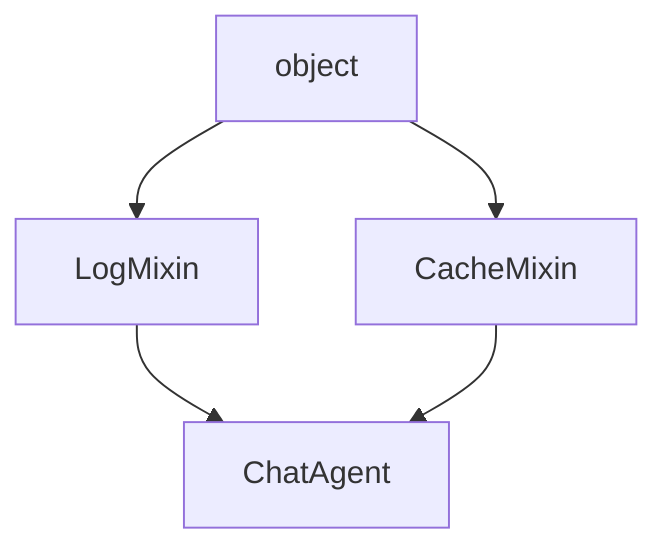
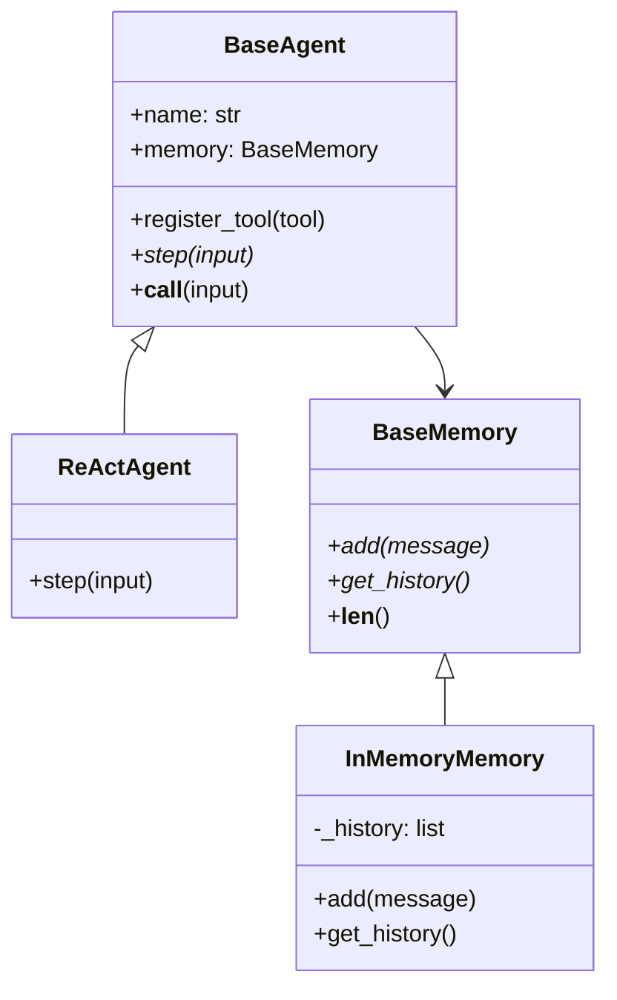

*图：沿图中的节点与箭头阅读，重点是Python 数据模型解释对象、类、属性查找、descriptor、继承、特殊方法和组合边界。*

---

Python 在 AI/Agent 工程中使用广泛，许多框架提供 Python API，但具体实现还可能包含 TypeScript、Rust、C/C++ 或远程服务。理解 Python 的数据模型与面向对象机制，有助于阅读 Python 侧源码并设计清晰的扩展接口。

## 核心数据类型（Core Data Types）

Python 里"一切皆对象"，连 `42`、`True`、`None` 都是对象，都有类型和方法。标量类型按可变性分为两类：

| 类型 | 示例 | 不可变 | 说明 |
|------|------|--------|------|
| `int` | `42`, `-7` | 是 | 任意精度，无溢出 |
| `float` | `3.14` | 是 | IEEE 754 双精度 |
| `str` | `"hello"` | 是 | Unicode，切片产生新对象 |
| `bool` | `True/False` | 是 | `int` 子类，`True == 1` |
| `None` | `None` | 是 | 单例，用 `is` 判断 |

**不可变（Immutable）** 意味着对象创建后其值无法改变。`a += " world"` 并非修改字符串，而是创建了新对象并让 `a` 指向它。这对函数传参影响极大：传入不可变对象，函数内"修改"不影响外部；传入可变对象，原地修改会反映到调用方。

```python
# 不可变：外部变量不受影响
def modify_str(s: str) -> str:
    s += "_modified"
    return s

text = "prompt"
modify_str(text)
print(text)  # "prompt"，未被修改

# 可变：外部列表被修改
def append_item(lst: list, item) -> None:
    lst.append(item)

docs = ["doc1"]
append_item(docs, "doc2")
print(docs)  # ["doc1", "doc2"]
```

## 容器类型与 AI 数据处理选型

在 RAG（检索增强生成）和 Agent 数据管道中，选对容器类型能显著影响性能和正确性。

| 类型 | 有序 | 可变 | 唯一性 | 时间复杂度（查找） |
|------|------|------|--------|-------------------|
| `list` | 是 | 是 | 否 | O(n) |
| `tuple` | 是 | 否 | 否 | O(n) |
| `dict` | 是（3.7+） | 是 | 键唯一 | O(1) 均摊 |
| `set` | 否 | 是 | 是 | O(1) 均摊 |

**AI 场景选型建议：**

- **`list`**：存储有序的文档块（chunks）、对话历史（conversation history）。需要索引访问时首选。
- **`tuple`**：函数返回多个值、配置常量、作为字典键（如坐标 `(row, col)`）。不可变保证数据完整性。
- **`dict`**：工具注册表（tool registry）、元数据（metadata）存储、LLM 的消息结构 `{"role": "user", "content": "..."}`。
- **`set`**：去重已访问 URL、快速判断 token 是否在词表中（`O(1)` vs list 的 `O(n)`）。

```python
# RAG 场景：用 dict 存储文档块与向量的映射
chunk_store: dict[str, dict] = {
    "chunk_001": {"text": "...", "embedding": [0.1, 0.2, ...], "source": "doc_a.pdf"},
    "chunk_002": {"text": "...", "embedding": [0.3, 0.4, ...], "source": "doc_b.pdf"},
}

# 用 set 快速去重已处理文件
processed_files: set[str] = {"doc_a.pdf", "doc_b.pdf"}
if new_file not in processed_files:  # O(1)
    processed_files.add(new_file)
```

## 类与实例（Class & Instance）

[Python Data Model](https://docs.python.org/3/reference/datamodel.html) 定义对象、类型、特殊方法和属性访问协议；类语法只是这些运行时协议的入口。


### `__init__`、实例方法、类方法、静态方法

[Descriptor HowTo](https://docs.python.org/3/howto/descriptor.html) 展示了 data descriptor、实例字典、non-data descriptor/类属性与 `__getattr__` 的查找优先级，方法绑定也建立在 descriptor 协议上。


```python
class EmbeddingModel:
    # 类属性：所有实例共享
    default_dim = 1536

    def __init__(self, model_name: str, dim: int | None = None):
        # 实例属性：每个实例独有
        self.model_name = model_name
        self.dim = dim or self.default_dim
        self._cache: dict = {}

    # 实例方法：操作实例状态，第一个参数是 self
    def embed(self, text: str) -> list[float]:
        if text in self._cache:
            return self._cache[text]
        # ... 调用模型 ...
        return []

    # 类方法：接收类本身，常用于工厂模式（factory method）
    @classmethod
    def from_config(cls, config: dict) -> "EmbeddingModel":
        return cls(config["model"], config.get("dim"))

    # 静态方法：不依赖类或实例状态的工具函数
    @staticmethod
    def cosine_similarity(a: list[float], b: list[float]) -> float:
        dot = sum(x * y for x, y in zip(a, b))
        norm_a = sum(x**2 for x in a) ** 0.5
        norm_b = sum(x**2 for x in b) ** 0.5
        return dot / (norm_a * norm_b + 1e-8)
```

**类属性陷阱**：通过实例对类属性赋值，只会在实例上创建同名实例属性，不影响其他实例。若类属性是可变对象（如 `list`），多个实例共享同一个列表，修改一个会影响所有实例——这是常见 Bug 来源。

## 继承与多态（Inheritance & Polymorphism）

### 单继承与 `super()`

```python
class BaseLLM:
    def __init__(self, model: str, temperature: float = 0.7):
        self.model = model
        self.temperature = temperature

    def complete(self, prompt: str) -> str:
        raise NotImplementedError

class OpenAILLM(BaseLLM):
    def __init__(self, model: str, api_key: str, **kwargs):
        super().__init__(model, **kwargs)  # 调用父类 __init__
        self.api_key = api_key

    def complete(self, prompt: str) -> str:
        # 实际调用 OpenAI API
        return f"[OpenAI:{self.model}] response"
```

### 多继承与 MRO（Method Resolution Order）

Python 使用 **C3 线性化算法** 确定多继承时的方法查找顺序，规则是：子类优先于父类，且保证每个类只出现一次。



```python
class LogMixin:
    def run(self, input: str) -> str:
        print(f"[LOG] input={input}")
        return super().run(input)  # super() 遵循 MRO，不是"父类"

class CacheMixin:
    _cache: dict = {}
    def run(self, input: str) -> str:
        if input in self._cache:
            return self._cache[input]
        result = super().run(input)
        self._cache[input] = result
        return result

class BaseAgent:
    def run(self, input: str) -> str:
        return f"result for {input}"

class ChatAgent(LogMixin, CacheMixin, BaseAgent):
    pass

print(ChatAgent.__mro__)
# ChatAgent -> LogMixin -> CacheMixin -> BaseAgent -> object
agent = ChatAgent()
agent.run("hello")  # LogMixin.run -> CacheMixin.run -> BaseAgent.run
```

`super()` 调用的是 MRO 链中**当前类的下一个**，而非简单的父类。这是 Mixin 模式能正确协作的关键。

## 魔术方法（Dunder Methods）

魔术方法是 Python 协议的实现方式——无需继承接口，只要实现约定方法，对象就能被内置语法识别。

| 魔术方法 | 触发场景 | AI 场景用途 |
|---------|---------|------------|
| `__repr__` | `repr(obj)`、调试器显示 | 打印 Agent 状态 |
| `__str__` | `str(obj)`、`print()` | 格式化输出 |
| `__len__` | `len(obj)` | 返回 Memory 条目数 |
| `__getitem__` | `obj[key]` | 按索引访问文档块 |
| `__call__` | `obj(...)` | 让 Tool 对象像函数一样调用 |
| `__iter__` | `for x in obj` | 遍历检索结果 |

```python
class ToolRegistry:
    def __init__(self):
        self._tools: dict[str, callable] = {}

    def register(self, name: str, fn: callable) -> None:
        self._tools[name] = fn

    def __getitem__(self, name: str) -> callable:
        return self._tools[name]  # registry["search"]

    def __len__(self) -> int:
        return len(self._tools)  # len(registry)

    def __repr__(self) -> str:
        return f"ToolRegistry(tools={list(self._tools.keys())})"

    def __call__(self, name: str, **kwargs):
        return self._tools[name](**kwargs)  # registry("search", query="...")
```

## dataclass 与 NamedTuple

在 Agent 系统中，大量数据结构是"纯数据容器"（value object），用 `dataclass` 或 `NamedTuple` 比手写类更简洁、可读性更高。

```python
from dataclasses import dataclass, field
from typing import NamedTuple

# dataclass：可变，支持默认值工厂，可添加方法
@dataclass
class Document:
    id: str
    content: str
    score: float = 0.0
    metadata: dict = field(default_factory=dict)  # 可变默认值必须用 field

    def is_relevant(self, threshold: float = 0.7) -> bool:
        return self.score >= threshold

# NamedTuple：不可变，可解包，可作为字典键
class RetrievalResult(NamedTuple):
    chunk_id: str
    score: float
    text: str

result = RetrievalResult("chunk_001", 0.92, "Python is...")
chunk_id, score, text = result  # 支持解包
print(result.score)             # 支持按名访问
```

`@dataclass(frozen=True)` 使实例不可变并自动生成 `__hash__`，可放入集合或作字典键，适合表示不可变的配置快照（config snapshot）。

## 协议（Protocol）与鸭子类型（Duck Typing）

Python 3.8+ 引入 `typing.Protocol`，实现**结构化子类型**（structural subtyping）：不需要显式继承，只要实现了协议定义的方法，就满足类型约束。这是鸭子类型的静态化表达。

```python
from typing import Protocol, runtime_checkable

@runtime_checkable
class Retrievable(Protocol):
    def retrieve(self, query: str, top_k: int) -> list[Document]: ...
    def __len__(self) -> int: ...

class VectorStore:
    # 无需继承 Retrievable，只要实现对应方法
    def retrieve(self, query: str, top_k: int = 5) -> list[Document]:
        # ... 向量检索 ...
        return []

    def __len__(self) -> int:
        return 0

def build_rag_pipeline(store: Retrievable) -> None:
    # 类型注解为 Protocol，接受任何实现了对应方法的对象
    docs = store.retrieve("what is RAG?", top_k=3)

store = VectorStore()
print(isinstance(store, Retrievable))  # True（需要 @runtime_checkable）
build_rag_pipeline(store)              # 类型检查通过
```

Protocol 比抽象基类（ABC）更灵活——第三方库的类无需修改就能满足你定义的协议，这在集成不同向量数据库（Pinecone、Weaviate、Milvus）时非常有用。

## AI/Agent 场景中的 OOP 设计

以下是一个简化的 Agent 框架骨架，展示继承、Protocol、dataclass、魔术方法如何协同工作：

```python
from abc import ABC, abstractmethod
from dataclasses import dataclass, field
from typing import Protocol

# ── 数据结构 ──────────────────────────────────────────
@dataclass
class Message:
    role: str   # "user" | "assistant" | "tool"
    content: str

@dataclass
class ToolCall:
    name: str
    args: dict = field(default_factory=dict)

# ── Tool 协议：任何实现了 __call__ 和 name 的对象都是合法 Tool ──
class ToolProtocol(Protocol):
    name: str
    def __call__(self, **kwargs) -> str: ...

# ── Memory 接口（ABC：强制子类实现）──────────────────
class BaseMemory(ABC):
    @abstractmethod
    def add(self, message: Message) -> None: ...

    @abstractmethod
    def get_history(self) -> list[Message]: ...

    def __len__(self) -> int:
        return len(self.get_history())

class InMemoryMemory(BaseMemory):
    def __init__(self):
        self._history: list[Message] = []

    def add(self, message: Message) -> None:
        self._history.append(message)

    def get_history(self) -> list[Message]:
        return self._history.copy()

# ── Agent 基类 ─────────────────────────────────────
class BaseAgent(ABC):
    def __init__(self, name: str, memory: BaseMemory | None = None):
        self.name = name
        self.memory = memory or InMemoryMemory()
        self._tools: dict[str, ToolProtocol] = {}

    def register_tool(self, tool: ToolProtocol) -> None:
        self._tools[tool.name] = tool

    @abstractmethod
    def step(self, user_input: str) -> str: ...

    def __call__(self, user_input: str) -> str:
        """让 agent 像函数一样调用：result = agent("问题")"""
        return self.step(user_input)

    def __repr__(self) -> str:
        return f"{type(self).__name__}(name={self.name!r}, tools={list(self._tools)})"

# ── 具体 Agent ─────────────────────────────────────
class ReActAgent(BaseAgent):
    def step(self, user_input: str) -> str:
        self.memory.add(Message("user", user_input))
        # Reason -> Act -> Observe 循环（简化）
        response = f"[ReAct] processed: {user_input}"
        self.memory.add(Message("assistant", response))
        return response
```



这种设计的核心价值：`BaseAgent` 定义骨架，`ReActAgent`/`PlanActAgent` 各自实现 `step()`；`BaseMemory` 的 ABC 保证接口统一，可以无缝替换为 Redis 或数据库实现；`ToolProtocol` 使用结构化子类型，集成第三方工具无需修改其源码。

## 常见误区

**1. 可变对象作为默认参数**

```python
# 错误：默认列表在函数定义时创建一次，所有调用共享
def add_message(msg, history=[]):
    history.append(msg)
    return history

# 正确：用 None 哨兵值
def add_message(msg, history=None):
    if history is None:
        history = []
    history.append(msg)
    return history
```

**2. 类属性用于存储可变状态**

```python
# 错误：所有实例共享同一个 messages 列表
class Agent:
    messages = []  # 危险！

# 正确：在 __init__ 中初始化实例属性
class Agent:
    def __init__(self):
        self.messages = []
```

**3. `is` 与 `==` 混用**

`is` 比较对象身份（内存地址），`==` 比较值。`None`、`True`、`False` 是单例，用 `is` 判断；其他情况几乎都应用 `==`。小整数（-5 到 256）和短字符串有缓存，`a is b` 可能为 `True`，但不可依赖。

**4. 忽略 `super()` 的 MRO 语义**

在多继承 Mixin 模式中，`super()` 不是"调父类"，而是"调 MRO 链的下一个"。每个 Mixin 都应调用 `super().method()`，否则链会断裂，某些基类方法永远不会被调用。

## 最佳实践

- **优先使用 `dataclass` 或 `NamedTuple`** 表示纯数据结构，减少样板代码。
- **用 `Protocol` 定义接口**，而非强制继承 ABC，提升模块间的解耦程度（尤其集成第三方库时）。
- **`ABC` 用于框架骨架**：当你要强制子类实现某些方法，且子类明确属于你的框架体系时，`@abstractmethod` 比运行时报错更早发现问题。
- **`__slots__` 优化大量小对象**：在 RAG 中可能有数万个 `Document` 实例，`__slots__` 能减少约 40% 内存占用。
- **`__repr__` 永远值得实现**：调试 Agent 工作流时，清晰的 repr 能节省大量时间。
- **工厂方法用 `@classmethod`**：`Model.from_config(cfg)`、`Agent.from_checkpoint(path)` 比在 `__init__` 里写大量 if/else 更清晰。

## 面试常问

**Q: `__new__` 和 `__init__` 的区别？**  
`__new__` 负责创建并返回实例（`cls` 为参数），`__init__` 负责初始化已有实例（`self` 为参数）。单例模式通常在 `__new__` 中控制只创建一个实例。

**Q: `@classmethod` vs `@staticmethod`？**  
`classmethod` 第一个参数是类 `cls`，可以访问/修改类状态，常用于工厂方法和继承场景；`staticmethod` 不接收类或实例，是纯工具函数，放在类里只是命名空间组织。

**Q: Python 多继承的 MRO 是什么算法？**  
C3 线性化算法。规则：子类在父类前，保留各父类列表中的相对顺序，每个类只出现一次。`ClassName.__mro__` 可以查看完整顺序。

**Q: `Protocol` 和 `ABC` 如何选择？**  
需要强制子类实现且子类属于自己的体系 → `ABC`；需要对接第三方类或希望解耦 → `Protocol`（结构化子类型，无需显式继承）。两者可以结合：`class BaseStore(ABC, Protocol)`。

**Q: `dataclass(frozen=True)` 的使用场景？**  
配置对象（Config）、缓存键（cache key）、作为字典键或集合元素时。`frozen=True` 自动生成 `__hash__`，同时防止意外修改，是不可变值对象的首选方案。

## 参考资料

- [Python data model](https://docs.python.org/3/reference/datamodel.html)
- [Python descriptor how-to guide](https://docs.python.org/3/howto/descriptor.html)
