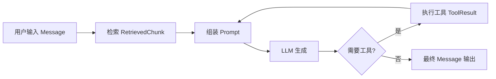

在构建 AI Agent、RAG 流水线或调用 LLM 工具（Tool Calling）的过程中，数据流动极为复杂：用户消息、检索结果、工具返回值、模型输出，每一层都需要清晰的结构约定。Python 的类型注解（Type Annotations）与 Pydantic 正是解决这一问题的核心工具——前者让意图可读可检查，后者让意图在运行时强制执行。

## 为什么 AI/Agent 工程师尤其需要类型系统

### 结构化输出与 Tool Schema

OpenAI Function Calling、Anthropic Tool Use 等机制的本质是：把函数签名编译为 JSON Schema，告诉 LLM "你可以调用这个工具，入参结构如下"。Pydantic 模型天然就是 JSON Schema 的声明式描述，可以一行代码生成：

```python
from pydantic import BaseModel

class SearchInput(BaseModel):
    query: str
    top_k: int = 5

print(SearchInput.model_json_schema())
# {"properties": {"query": {"type": "string"}, "top_k": {"default": 5, "type": "integer"}}, ...}
```

这个 schema 可以直接注入到 OpenAI 的 `tools` 参数或 LangChain/LlamaIndex 的 tool 定义中，无需手写 JSON。类型错了、字段漏了，校验层立刻抛错，而不是让错误数据悄悄流入下游。

### RAG 流水线的数据契约

一条典型的 RAG 链路会经历：原始文档 → 分块（Chunk）→ Embedding → 检索结果 → 组装 Prompt → LLM 输出。每一步的输入输出如果没有明确的数据结构，调试时会非常痛苦。用 Pydantic 建模这些中间态，既是文档，也是运行时保障。

## Python 类型注解基础

### 变量与函数注解

```python
# 变量注解
name: str = "Alice"
age: int = 30
scores: list[float] = [9.5, 8.0]
metadata: dict[str, str] = {"source": "wiki"}

# 函数参数与返回值注解
def embed_text(text: str, model: str = "text-embedding-3-small") -> list[float]:
    ...

def retrieve(query: str, top_k: int = 5) -> list[dict[str, str]]:
    ...
```

**关键认知**：注解本身在运行时不做任何检查，只是存储在 `__annotations__` 中的元数据。写了 `age: int` 并不会阻止你赋值字符串——Python 解释器完全忽略注解的类型约束。注解的价值来自两类工具：静态检查器（mypy、pyright）在运行前发现错误；Pydantic 等库主动读取注解并在运行时执行验证。

```python
def add(a: int, b: int) -> int:
    return a + b

add("hello", " world")  # 不报错！Python 不检查，返回 "hello world"
```

## typing 模块常用类型

Python 3.9 之前，内置容器（`list`、`dict`）不支持泛型下标，必须从 `typing` 导入大写版本。3.9+ 两者均可用，但 `typing` 版本兼容更老的代码库。

| typing 类型 | 含义 | Python 3.10+ 推荐写法 |
|---|---|---|
| `List[int]` | 整数列表 | `list[int]` |
| `Dict[str, Any]` | 字符串键字典 | `dict[str, Any]` |
| `Optional[str]` | `str` 或 `None` | `str \| None` |
| `Union[int, str]` | 整数或字符串 | `int \| str` |
| `Tuple[int, ...]` | 任意长度整数元组 | `tuple[int, ...]` |
| `Callable[[int], str]` | 接受 int 返回 str 的函数 | 同左 |
| `Any` | 放弃类型检查 | 慎用 |
| `TypeVar` | 泛型类型变量 | 同左 |

```python
from typing import Callable, TypeVar, Any

T = TypeVar("T")

# TypeVar：保证输入输出类型一致，不退化为 Any
def first_or_default(items: list[T], default: T) -> T:
    return items[0] if items else default

# Callable：描述高阶函数
def process_chunks(
    chunks: list[str],
    fn: Callable[[str], list[float]]
) -> list[list[float]]:
    return [fn(c) for c in chunks]
```

`TypeVar` 表达"类型变量"，调用时由传入参数推断出具体类型。如果写成 `Any`，类型检查器会对整个函数的返回值失去追踪。

## Python 3.10+ 新语法

### X | Y 联合类型

```python
# 替代 Union[int, str] 和 Optional[str]
def parse_id(value: int | str) -> int:
    return int(value)

def get_document(doc_id: int | None = None) -> dict | None:
    ...
```

### match 语句（结构模式匹配）

`match` 不只是 `switch`，它支持解构、类型检查、守卫条件，非常适合处理 Agent 的多类型消息路由：

```python
def route_message(msg: dict | str | None) -> str:
    match msg:
        case None:
            return "空消息"
        case str() as s if len(s) > 0:
            return f"文本: {s[:50]}"
        case {"role": "tool", "content": content}:
            return f"工具返回: {content}"
        case {"role": role, **rest}:
            return f"角色 {role} 的消息"
        case _:
            return "未知格式"
```

## Pydantic v2 BaseModel

Pydantic 的核心价值：在对象初始化时真正验证数据，类型错误立刻抛出 `ValidationError`，而不是沉默接受。v2 核心用 Rust 重写（pydantic-core），验证性能比 v1 快 5-50 倍。

```python
from pydantic import BaseModel, ValidationError

class Document(BaseModel):
    doc_id: str
    content: str
    source: str
    score: float = 0.0

doc = Document(doc_id="d1", content="Python 简介", source="wiki")
print(doc.model_dump())
# {'doc_id': 'd1', 'content': 'Python 简介', 'source': 'wiki', 'score': 0.0}

# 类型强制转换（coerce）：能转就转，转不了才报错
doc2 = Document(doc_id=42, content="test", source="x")  # doc_id=42 → "42"

try:
    Document(doc_id="d1", content="test", source="x", score="not-a-number")
except ValidationError as e:
    print(e)  # score 字段验证失败
```

Pydantic 默认开启**类型强制转换**：`"42"` 可以赋值给 `int` 字段。如需严格模式，使用 `model_config = ConfigDict(strict=True)`。

### Field：细化字段约束

```python
from pydantic import BaseModel, Field
from pydantic import ConfigDict

class Chunk(BaseModel):
    model_config = ConfigDict(populate_by_name=True)

    chunk_id: str = Field(min_length=1, description="分块唯一 ID")
    text: str = Field(min_length=1, max_length=8000, description="分块文本")
    embedding: list[float] | None = Field(default=None)
    metadata: dict[str, str] = Field(default_factory=dict)
    # alias：接受外部 JSON 中的不同键名（如 snake_case ↔ camelCase）
    token_count: int = Field(alias="tokenCount", default=0)
```

`default_factory` 与 `default` 的区别：可变对象（`list`、`dict`）必须用 `default_factory`，否则所有实例共享同一个对象（经典 Python 陷阱）。

### @field_validator 与 @model_validator

Pydantic v2 推荐 `@field_validator`（取代 v1 的 `@validator`）：

```python
from pydantic import BaseModel, field_validator, model_validator

class Message(BaseModel):
    role: str
    content: str
    tool_call_id: str | None = None

    @field_validator("role")
    @classmethod
    def role_must_be_valid(cls, v: str) -> str:
        allowed = {"system", "user", "assistant", "tool"}
        if v not in allowed:
            raise ValueError(f"role 必须是 {allowed} 之一，得到 {v!r}")
        return v

    @model_validator(mode="after")
    def tool_message_requires_id(self) -> "Message":
        if self.role == "tool" and not self.tool_call_id:
            raise ValueError("role=tool 的消息必须提供 tool_call_id")
        return self
```

`field_validator` 验证单个字段，在字段赋值时触发；`model_validator(mode="after")` 在所有字段赋值完成后运行，适合**跨字段联合校验**。

## Pydantic 与 JSON Schema / OpenAI Function Calling

这是 AI 工程师最需要掌握的核心用法。Pydantic 模型可以直接生成符合 JSON Schema Draft 7 的 schema：

```python
from pydantic import BaseModel, Field

class WebSearchTool(BaseModel):
    """在互联网上搜索信息"""
    query: str = Field(description="搜索关键词")
    num_results: int = Field(default=5, ge=1, le=20, description="返回结果数量")

schema = WebSearchTool.model_json_schema()
```

将此 schema 注入 OpenAI API：

```python
import openai

tools = [{
    "type": "function",
    "function": {
        "name": "web_search",
        "description": WebSearchTool.__doc__,
        "parameters": WebSearchTool.model_json_schema(),
    }
}]

# LLM 返回 tool_call 后，用 Pydantic 解析并验证入参
def handle_tool_call(arguments_json: str) -> WebSearchTool:
    return WebSearchTool.model_validate_json(arguments_json)
```

这样做的好处：LLM 生成的 JSON 入参经过 Pydantic 验证，字段缺失或类型错误会立刻被捕获，而不是在工具执行中途崩溃。

## 用 Pydantic 建模 RAG/Agent 数据结构

以下是一套实用的 RAG/Agent 核心数据模型示例：

```python
from pydantic import BaseModel, Field
from typing import Literal
from datetime import datetime

# 原始文档
class Document(BaseModel):
    doc_id: str
    title: str
    content: str
    source_url: str | None = None
    created_at: datetime = Field(default_factory=datetime.utcnow)
    metadata: dict[str, str] = Field(default_factory=dict)

# 检索分块
class Chunk(BaseModel):
    chunk_id: str
    doc_id: str
    text: str
    embedding: list[float] | None = None
    token_count: int = 0

# 检索结果（带相关度分数）
class RetrievedChunk(Chunk):
    score: float  # 余弦相似度或 BM25 分数
    rank: int

# 对话消息（支持多角色）
class Message(BaseModel):
    role: Literal["system", "user", "assistant", "tool"]
    content: str
    tool_call_id: str | None = None
    name: str | None = None  # tool 角色消息的工具名

# 工具调用结果
class ToolResult(BaseModel):
    tool_call_id: str
    tool_name: str
    output: str
    is_error: bool = False
    metadata: dict[str, str] = Field(default_factory=dict)

# Agent 运行一步的状态
class AgentStep(BaseModel):
    step_id: int
    messages: list[Message]
    retrieved_chunks: list[RetrievedChunk] = Field(default_factory=list)
    tool_results: list[ToolResult] = Field(default_factory=list)
    is_final: bool = False
```

数据流向：



## Pydantic v1 vs v2 API 对比

| 功能 | v1 | v2 |
|---|---|---|
| 序列化 | `.dict()` | `.model_dump()` |
| JSON 序列化 | `.json()` | `.model_dump_json()` |
| 验证器装饰器 | `@validator` | `@field_validator` |
| JSON 解析 | `.parse_raw()` | `.model_validate_json()` |
| 配置类 | `class Config` | `model_config = ConfigDict(...)` |
| 根验证器 | `@root_validator` | `@model_validator` |
| schema 生成 | `.schema()` | `.model_json_schema()` |

## 常见误区

**误区一：注解等于运行时类型检查**

原生 Python 注解在运行时完全不做检查。只有 Pydantic、`beartype`、`typeguard` 等第三方库才会在运行时执行类型验证。注解对 Python 解释器而言只是可读的注释。

**误区二：`Optional[str]` 等于"可选参数"**

`Optional[str]` 只是 `str | None` 的别名，与参数有无默认值无关。没有默认值的 `Optional[str]` 参数仍然是**必传**的，只是值可以为 `None`。

```python
def find(name: Optional[str]) -> ...:
    ...

find()      # TypeError：缺少必需参数
find(None)  # 合法
```

**误区三：可变对象用 `default` 而非 `default_factory`**

```python
# 错误：所有实例共享同一个 list
class Bad(BaseModel):
    tags: list[str] = []  # Pydantic 会警告，v2 会直接报错

# 正确
class Good(BaseModel):
    tags: list[str] = Field(default_factory=list)
```

**误区四：混用 Pydantic v1 和 v2 API**

在 v2 中调用 `.dict()` 不会报错（有向后兼容层），但行为可能与预期不同。升级时要全面搜索并替换旧 API。

**误区五：`Any` 类型滥用**

在 Agent/RAG 代码中，为了"方便"大量使用 `Any` 会让类型检查器失效，调试时无法依赖类型推断。遇到真正不确定的结构，优先用 `dict[str, Any]` 或 `Union` 表达，而不是裸 `Any`。

## 最佳实践

1. **为每个中间数据结构建 Pydantic 模型**：Document、Chunk、Message、ToolResult，不要用裸 `dict` 传递。
2. **Tool Schema 从 Pydantic 生成，而非手写**：减少 schema 与代码不同步的风险。
3. **严格模式（`strict=True`）用于关键校验**：如解析 LLM 返回的结构化输出，避免静默强制转换掩盖问题。
4. **`model_validator(mode="after")` 处理跨字段约束**：如 `role=tool` 时必须有 `tool_call_id`。
5. **用 `Annotated` + `Field` 内联元数据**：`Annotated[int, Field(gt=0, description="...")]` 比在 `Field(...)` 中写更具可读性，且与 FastAPI、OpenAI schema 生成兼容。
6. **启用 mypy 或 pyright**：类型注解只有配合静态检查器才能发挥最大价值，建议在 CI 中强制执行。

## 面试常问

**Q：Python 类型注解在运行时有什么效果？**
A：几乎没有直接效果。注解存储在 `__annotations__` 中，Python 解释器不做类型检查。需要运行时检查必须引入 Pydantic 等库。

**Q：`TypeVar` 和 `Any` 有什么区别？**
A：`TypeVar` 表达"类型变量"，让类型检查器能追踪输入输出的类型关系（如输入 `list[int]`，输出也是 `int`）；`Any` 完全放弃检查，与其相关的所有类型推断都会失效。

**Q：Pydantic v2 相比 v1 有哪些核心改进？**
A：核心用 Rust 重写，性能提升 5-50 倍；API 更一致（`model_dump`、`model_validate_json` 等）；`@field_validator` 替代 `@validator`，语义更清晰；`ConfigDict` 替代内部 `Config` 类；默认开启更严格的行为。

**Q：如何用 Pydantic 模型生成 OpenAI function calling 的 schema？**
A：调用 `MyModel.model_json_schema()` 即可得到符合 JSON Schema Draft 7 的字典，直接作为 `tools[].function.parameters` 传入 OpenAI API。

**Q：`model_validator` 的 `mode="before"` 和 `mode="after"` 区别？**
A：`mode="before"` 在字段验证前触发，接收原始输入数据（通常是 `dict`），适合数据预处理；`mode="after"` 在所有字段验证完成后触发，接收已构建的模型实例，适合跨字段校验。

**Q：`Protocol` 和 `ABC` 的区别，在 Agent 框架中如何选择？**
A：`Protocol` 实现结构化子类型（静态版本的 duck typing），无需显式继承，适合定义工具接口、检索器接口等——只要对象有对应方法就满足协议；`ABC` 需要显式继承并实现抽象方法，适合强制子类实现某些行为。Agent 框架中 `Protocol` 更灵活，第三方工具无需修改代码即可适配。
