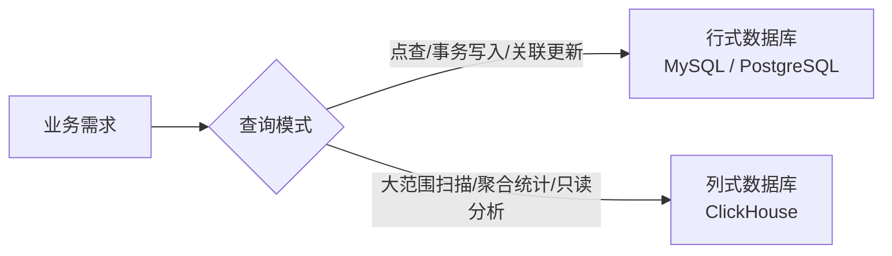

# ClickHouse 列式数据库入门

ClickHouse 是一款开源的列式 OLAP 数据库，专为海量数据的高速聚合分析而设计。当你需要对数十亿行日志做实时统计、或把数仓查询从分钟级压缩到秒级，ClickHouse 往往是第一个被考虑的方案。

## 列式存储原理

传统行式数据库（MySQL、PostgreSQL）把一行数据连续存储在磁盘上，读取某列时必须扫描整行。列式数据库把同一列的所有值连续存放，分析查询只需读取涉及的列，跳过其余列。

```
行式存储（每行连续）：
| id | name  | age | salary |
|  1 | Alice |  30 |  8000  |
|  2 | Bob   |  25 |  6000  |

列式存储（每列连续）：
id:     1, 2, 3, ...
name:   Alice, Bob, ...
age:    30, 25, ...
salary: 8000, 6000, ...
```

列式存储在 OLAP 场景下有两项核心优势：

1. **减少 I/O**：`SELECT sum(salary) FROM employees` 只读 salary 列，其余列完全不加载。
2. **压缩率更高**：同列数据类型一致、相邻值相近，LZ4、ZSTD 等算法可以获得极高压缩比，存储体积大幅缩小、读盘更快。

## MergeTree 引擎

MergeTree 是 ClickHouse 最核心的存储引擎，几乎所有生产场景都基于它或其变体（ReplicatedMergeTree、AggregatingMergeTree、SummingMergeTree 等）。

### 写入与合并机制

数据写入时，ClickHouse 先把每批次数据写成独立的**数据块（part）**，后台再异步将小块合并成大块——这就是"MergeTree"名字的由来。每个 part 内部按主键排序存储。

```sql
CREATE TABLE events
(
    event_date  Date,
    user_id     UInt64,
    event_type  LowCardinality(String),
    duration_ms UInt32
)
ENGINE = MergeTree()
PARTITION BY toYYYYMM(event_date)
ORDER BY (event_date, user_id);
```

### 主键与排序键

ClickHouse 里 `ORDER BY` 定义的就是**排序键**，同时也是稀疏索引（primary key）的依据。它不像 MySQL 主键那样要求唯一，只控制数据在磁盘上的物理顺序，决定查询时能跳过多少数据块。

**常见误区**：把高基数字段（如 UUID）放在排序键最左侧，导致索引效果几乎为零。应把**过滤频率高、基数适中**的字段放在前面，高基数字段放在后面。

```sql
-- 好：先按日期和业务维度筛选，再定位具体用户
ORDER BY (event_date, event_type, user_id)

-- 差：UUID 基数极高，稀疏索引无法跳过任何数据块
ORDER BY (uuid, event_date)
```

## 分区设计

分区（Partition）是数据在目录层面的物理分割，查询时可以跳过整个分区目录（Partition Pruning），比索引粒度更粗但效果极显著。

```sql
-- 按月分区
PARTITION BY toYYYYMM(event_date)

-- 按天分区（数据量极大时）
PARTITION BY toYYYYMMDD(event_date)

-- 按业务维度分区
PARTITION BY (toYYYYMM(event_date), region)
```

**分区设计原则**：

| 情况 | 建议 |
|------|------|
| 分区数过多（> 数千） | 写入和合并开销剧增，应粗化粒度 |
| 分区粒度过粗 | 每次查询扫描量仍然很大，失去剪枝效果 |
| 查询总带时间范围过滤 | 按时间分区是最常见的正确选择 |
| 需要按维度快速删除数据 | 分区可整体 DROP，效率远高于 DELETE |

删除整个分区（而非逐行 DELETE）是 ClickHouse 的惯用做法：

```sql
ALTER TABLE events DROP PARTITION '202405';
```

## 常用聚合函数与 GROUP BY 优化

ClickHouse 内置了丰富的聚合函数，许多在行式数据库中需要复杂子查询才能表达的统计，在这里一行搞定。

```sql
-- 基础聚合
SELECT
    event_type,
    count()                    AS pv,
    uniq(user_id)              AS uv,        -- 近似去重，极快
    uniqExact(user_id)         AS exact_uv,  -- 精确去重，较慢
    avg(duration_ms)           AS avg_dur,
    quantile(0.95)(duration_ms) AS p95_dur
FROM events
WHERE event_date >= '2024-01-01'
GROUP BY event_type
ORDER BY pv DESC;
```

### uniq vs uniqExact

`uniq` 使用 HyperLogLog 算法，误差约 2%，但内存消耗极小、速度极快，适合 UV 统计这类对精度要求不高的场景。`uniqExact` 精确但内存占用与基数成正比，高基数时慎用。

### GROUP BY 优化技巧

```sql
-- 1. 利用 WITH ROLLUP 生成多层级汇总（减少多次查询）
SELECT event_date, event_type, count()
FROM events
GROUP BY event_date, event_type WITH ROLLUP;

-- 2. HAVING 在聚合后过滤（WHERE 在聚合前过滤，尽量把条件放 WHERE）
SELECT user_id, count() AS cnt
FROM events
WHERE event_date = '2024-05-01'
GROUP BY user_id
HAVING cnt > 10;

-- 3. 物化预聚合：AggregatingMergeTree + 物化视图
CREATE MATERIALIZED VIEW events_daily_mv
ENGINE = AggregatingMergeTree()
PARTITION BY toYYYYMM(event_date)
ORDER BY (event_date, event_type)
AS SELECT
    event_date,
    event_type,
    countState()        AS pv_state,
    uniqState(user_id)  AS uv_state
FROM events
GROUP BY event_date, event_type;

-- 查询物化视图时用 Merge 函数合并状态
SELECT
    event_date,
    event_type,
    countMerge(pv_state)    AS pv,
    uniqMerge(uv_state)     AS uv
FROM events_daily_mv
GROUP BY event_date, event_type;
```

物化视图 + AggregatingMergeTree 是 ClickHouse 做预聚合的标准模式，可以把热门报表查询提速几个数量级。

## 与行式数据库的场景对比



| 维度 | 行式数据库（MySQL） | ClickHouse |
|------|--------------------|----|
| 适合查询 | 点查、JOIN、事务 | 全表扫描、聚合、GROUP BY |
| 写入模式 | 逐行写入，实时可见 | 批量写入，合并后可见 |
| UPDATE/DELETE | 高效 | 重量级操作，尽量避免 |
| 数据压缩 | 一般 | 极高（列同质 + 专用编解码） |
| 并发连接数 | 支持高并发短查询 | 适合低并发重查询 |
| 典型场景 | 用户注册、订单、支付 | 日志分析、埋点统计、监控 |

ClickHouse 本身不擅长频繁的单行更新和多表 JOIN（大表 JOIN 大表尤其要避免）。现实架构中常见的做法是：MySQL 负责在线事务，通过 CDC（如 Flink + Debezium）或定时同步将数据导入 ClickHouse，再由 ClickHouse 承担分析查询。

## 面试常问要点

- **为什么列式存储在 OLAP 下比行式快？** 减少无效列的 I/O 读取；同列数据类型一致，压缩率更高；向量化执行引擎可以用 SIMD 指令批量处理同类数据。
- **MergeTree 的主键和 MySQL 主键有什么区别？** ClickHouse 主键不唯一、不强制约束，是稀疏索引，每隔固定行数（默认 8192 行，即 `index_granularity`）写一条索引记录，用于定位数据块范围，而非精确定位单行。
- **如何设计分区和排序键？** 分区键决定文件目录层面的粒度，排序键决定块内的物理顺序和稀疏索引效果；通常分区用时间（月/天），排序键把高频过滤字段放左侧。
- **uniq 和 uniqExact 怎么选？** 对误差容忍（如 DAU、UV）用 `uniq`，需要精确数字（如财务计数）用 `uniqExact`，后者在高基数下内存消耗可能很大。
- **ClickHouse 能替代 MySQL 吗？** 不能，二者定位不同。ClickHouse 不支持高频点更新、复杂事务，适合分析读；MySQL 适合联机事务（OLTP）。
