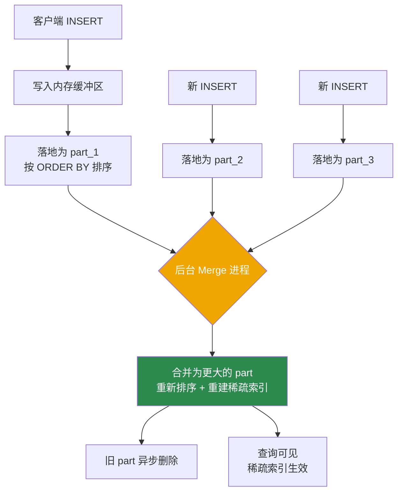
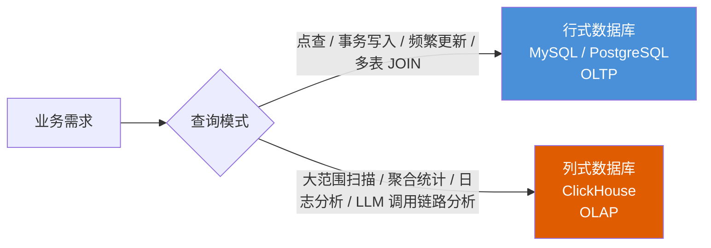

*图：沿图中的节点与箭头阅读，重点是解释列式存储、MergeTree parts、primary key 稀疏索引、后台 merge 和 OLAP 查询适用边界。*

---

ClickHouse 是一款开源的列式 OLAP（在线分析处理）数据库，专为海量数据的高速聚合分析而设计。对于 AI/Agent 工程师而言，它是存储和分析 LLM 调用日志（LLM call log）、Token 用量追踪（Token usage tracking）和 Agent 执行链路（Agent trace）的理想基础设施。（参见 [ClickHouse introduction](https://clickhouse.com/docs/intro)）

## 列式存储原理

### 行式与列式 I/O 的本质差异

传统行式数据库（Row-oriented Database，如 MySQL、PostgreSQL）将一行数据连续存储在磁盘上。当执行 `SELECT sum(tokens_in) FROM llm_logs` 这类只涉及单列的聚合时，引擎仍需将每一行的全部字段从磁盘读入内存，其中绝大部分字节对本次查询毫无用处。

列式数据库（Columnar Database）将同一列的所有值连续存放，分析查询只需将目标列的数据块加载到内存，完全跳过其他列。

```
行式存储（每行数据连续存放）：
[user_id=1 | model="gpt-4" | tokens_in=512 | tokens_out=256 | latency_ms=820]
[user_id=2 | model="claude-3" | tokens_in=1024 | tokens_out=512 | latency_ms=1200]

列式存储（每列数据连续存放）：
user_id 列:    1, 2, 3, 4, ...
model 列:      "gpt-4", "claude-3", "gpt-4", ...
tokens_in 列:  512, 1024, 800, 2048, ...
tokens_out 列: 256, 512, 400, 1024, ...
latency_ms 列: 820, 1200, 650, 980, ...
```

列式存储在 OLAP 场景下有两项核心优势：

| 优势 | 原理 | 典型收益 |
|------|------|----------|
| 减少磁盘 I/O | 只读目标列，跳过无关列 | 涉及列越少收益越大 |
| 压缩率更高 | 同列数据类型一致、相邻值相近，LZ4/ZSTD 效果显著 | 存储体积大幅缩减，读盘更快 |
| 向量化执行 | 同列数据连续，可用 SIMD 指令批量运算 | CPU 利用率提升 |

## MergeTree 引擎

[ClickHouse MergeTree 文档](https://clickhouse.com/docs/engines/table-engines/mergetree-family/mergetree) 说明批量写入形成不可变 parts，排序键与稀疏主索引用于跳过数据，后台 merge 再合并 parts。


MergeTree 是 ClickHouse 最核心的存储引擎，几乎所有生产场景都基于它或其变体（ReplicatedMergeTree、AggregatingMergeTree、SummingMergeTree 等）构建。

### 写入-数据块-合并生命周期

每次写入操作会将一批数据落地为独立的**数据块（part）**，每个 part 在写入时按排序键（sort key）完成排序。后台的合并进程（merge process）持续将小 part 合并为大 part，这正是"MergeTree"名字的来源。



**关键结论**：ClickHouse 的写入是批量 append 操作，不存在行级锁。读取时需要跨多个 part 合并结果，合并完成前查询会扫描更多文件。因此生产环境应避免频繁小批量写入（每次几行），推荐每批至少数千行。

### 稀疏索引与 index_granularity

ClickHouse 的主键索引不是 B-tree，而是**稀疏索引（sparse index）**：每隔固定行数（默认 8192 行，由 `index_granularity` 参数控制）写入一条索引记录，指向该数据粒度（granule）的起始位置。

查询时，引擎通过稀疏索引定位到可能包含数据的粒度范围，然后只扫描这些粒度，跳过其余部分。与 MySQL 主键不同，ClickHouse 的排序键不要求值唯一，它是物理排序的依据而非唯一性约束。

```sql
-- 以 LLM 调用日志表为例
CREATE TABLE llm_call_logs
(
    call_date    Date,
    call_time    DateTime,
    user_id      UInt64,
    model        LowCardinality(String),   -- 低基数字段用 LowCardinality 节省空间
    tokens_in    UInt32,
    tokens_out   UInt32,
    latency_ms   UInt32,
    is_error     UInt8
)
ENGINE = MergeTree()
PARTITION BY toYYYYMM(call_date)
ORDER BY (call_date, model, user_id)      -- 排序键：先日期，再模型，再用户
SETTINGS index_granularity = 8192;        -- 每 8192 行一条稀疏索引记录
```

## 分区设计

分区（Partition）是数据在目录层面的物理分割。查询引擎在执行时可以识别分区条件，**直接跳过不相关的分区目录**（分区剪枝，Partition Pruning），效果比稀疏索引更粗粒度但收益更显著。

### 分区粒度选择原则

```sql
-- 按月分区（最常见）：适合日志、埋点、调用记录
PARTITION BY toYYYYMM(call_date)

-- 按天分区：适合数据量极大（每天数十亿行）的场景
PARTITION BY toYYYYMMDD(call_date)

-- 按模型+月复合分区：适合需要按业务维度快速删数据
PARTITION BY (toYYYYMM(call_date), model)
```

| 场景 | 建议 | 原因 |
|------|------|------|
| 分区数超过数千 | 粗化粒度（改月为季度） | part 数量爆炸，写入和合并开销剧增 |
| 分区粒度过粗 | 适当细化 | 剪枝效果差，每次仍需扫描大量数据 |
| 查询总带时间范围过滤 | 按时间分区 | 最常见的正确选择 |
| 需要快速删除历史数据 | 按时间分区 + DROP PARTITION | 效率远高于 DELETE WHERE |

```sql
-- 删除整个分区（毫秒级，推荐用于数据保留策略）
ALTER TABLE llm_call_logs DROP PARTITION '202405';

-- 避免：逐行 DELETE 是重量级操作，ClickHouse 通过 mutation 实现，会重写整个 part
-- ALTER TABLE llm_call_logs DELETE WHERE call_date < '2024-05-01';  -- 慎用
```

### ORDER BY 排序键 vs MySQL 主键

这是初学者最容易混淆的概念差异：

| 对比维度 | MySQL 主键 | ClickHouse ORDER BY（排序键）|
|----------|-----------|---------------------------|
| 唯一性 | 强制唯一 | 不要求唯一 |
| 作用 | B-tree 索引，精确定位行 | 决定物理排序 + 稀疏索引的覆盖范围 |
| 值重复 | 报错 | 允许 |
| 查询定位粒度 | 精确到行 | 精确到粒度（默认 8192 行） |
| 设计目标 | 标识行 | 跳过不相关数据块 |

```sql
-- 好的设计：把高频过滤字段放左侧，高基数字段放右侧
ORDER BY (call_date, model, user_id)

-- 不好的设计：UUID 基数极高，稀疏索引无法跳过任何粒度
-- ORDER BY (request_uuid, call_date)
```

**原则**：将查询中 `WHERE` 子句最常出现的字段放在排序键左侧，高基数字段（UUID、IP 等）放在右侧或完全不放入排序键。

## 聚合函数与 GROUP BY 优化

ClickHouse 内置了丰富的聚合函数，很多在行式数据库中需要复杂子查询的统计，在这里可以一行表达。

### 核心聚合函数

```sql
SELECT
    model,
    toDate(call_time)              AS call_date,
    count()                        AS total_calls,     -- 总调用次数
    uniq(user_id)                  AS approx_uv,       -- 近似去重用户数（HyperLogLog，误差约 2%）
    uniqExact(user_id)             AS exact_uv,        -- 精确去重用户数（内存与基数成正比）
    sum(tokens_in)                 AS total_tokens_in,
    sum(tokens_out)                AS total_tokens_out,
    avg(latency_ms)                AS avg_latency,
    quantile(0.95)(latency_ms)     AS p95_latency,     -- 95 分位延迟
    quantile(0.99)(latency_ms)     AS p99_latency,
    countIf(is_error = 1)          AS error_count
FROM llm_call_logs
WHERE call_date >= '2024-01-01'
GROUP BY model, call_date
ORDER BY call_date DESC, total_calls DESC;
```

`uniq` 使用 HyperLogLog（一种概率基数估算算法）实现，误差约 2%，适合 DAU、UV 这类对精度要求不苛刻的场景。`uniqExact` 精确但内存消耗与基数线性相关，高基数（亿级以上）时慎用。

### GROUP BY WITH ROLLUP / CUBE

```sql
-- WITH ROLLUP：生成从细粒度到粗粒度的层级汇总，减少多次查询
SELECT
    model,
    toYYYYMM(call_date) AS ym,
    sum(tokens_in + tokens_out) AS total_tokens
FROM llm_call_logs
GROUP BY model, ym WITH ROLLUP
ORDER BY model, ym;
-- 结果包含：(model, ym) 明细 + (model, NULL) 按模型汇总 + (NULL, NULL) 总计

-- WITH CUBE：生成所有维度组合的交叉汇总
SELECT model, is_error, count()
FROM llm_call_logs
GROUP BY model, is_error WITH CUBE;
```

## 物化视图与预聚合模式

对于高频查询的统计报表（如每日 Token 消耗报表、每模型调用量看板），每次都全表扫描是巨大浪费。ClickHouse 提供了**物化视图（Materialized View）+ AggregatingMergeTree** 的预聚合模式。

### 具体示例：LLM 每日 Token 用量统计

```sql
-- 第一步：创建存储预聚合状态的目标表
CREATE TABLE llm_daily_token_stats
(
    call_date      Date,
    model          LowCardinality(String),
    total_calls    AggregateFunction(count),
    uv             AggregateFunction(uniq, UInt64),
    tokens_in_sum  AggregateFunction(sum, UInt32),
    tokens_out_sum AggregateFunction(sum, UInt32),
    p95_latency    AggregateFunction(quantile(0.95), UInt32)
)
ENGINE = AggregatingMergeTree()
PARTITION BY toYYYYMM(call_date)
ORDER BY (call_date, model);

-- 第二步：创建物化视图，将写入 llm_call_logs 的数据自动聚合写入目标表
CREATE MATERIALIZED VIEW llm_daily_token_mv
TO llm_daily_token_stats
AS SELECT
    call_date,
    model,
    countState()                AS total_calls,
    uniqState(user_id)          AS uv,
    sumState(tokens_in)         AS tokens_in_sum,
    sumState(tokens_out)        AS tokens_out_sum,
    quantileState(0.95)(latency_ms) AS p95_latency
FROM llm_call_logs
GROUP BY call_date, model;

-- 第三步：查询时用 Merge 函数合并聚合状态
SELECT
    call_date,
    model,
    countMerge(total_calls)        AS total_calls,
    uniqMerge(uv)                  AS approx_uv,
    sumMerge(tokens_in_sum)        AS total_tokens_in,
    sumMerge(tokens_out_sum)       AS total_tokens_out,
    quantileMerge(0.95)(p95_latency) AS p95_latency_ms
FROM llm_daily_token_stats
WHERE call_date >= '2024-01-01'
GROUP BY call_date, model
ORDER BY call_date DESC;
```

物化视图在数据写入 `llm_call_logs` 的同时自动触发，`*State` 函数将中间聚合状态持久化，`*Merge` 函数在查询时将状态合并为最终结果。AggregatingMergeTree 负责在后台合并同一分组下多个 part 的聚合状态，保证结果一致性。

## 与行式数据库的场景对比



| 维度 | 行式数据库（MySQL） | ClickHouse |
|------|--------------------|----|
| 适合查询 | 点查、JOIN、事务 | 全表扫描、聚合、GROUP BY |
| 写入模式 | 逐行写入，实时可见 | 批量写入，合并后效果最佳 |
| UPDATE / DELETE | 高效 | 重量级 mutation，尽量避免 |
| 数据压缩 | 一般 | 极高（列同质 + 专用编解码） |
| 主键语义 | 唯一约束 + B-tree | 排序键 + 稀疏索引，无唯一约束 |
| 并发模式 | 高并发短查询 | 低并发重查询 |
| 典型场景 | 用户注册、订单、支付 | LLM 调用日志、Agent trace、埋点统计、监控大盘 |

现实架构中，MySQL 负责在线事务，通过 CDC（Change Data Capture，如 Flink + Debezium）或定时同步将数据导入 ClickHouse，再由 ClickHouse 承担分析查询。

---

## 常见误区

1. **把高基数字段放在排序键最左侧**：如将 UUID 或 request_id 放到 ORDER BY 首位，会导致稀疏索引完全失效，每次查询都需要全量扫描。高基数字段应放在排序键末尾或不放入排序键。

2. **频繁小批量写入**：每次 INSERT 几行会产生大量小 part，后台合并压力剧增，严重时触发"too many parts"错误，导致写入被限速甚至阻塞。应使用 Buffer 引擎或应用层批量缓冲后再写入。

3. **用 DELETE WHERE 清理历史数据**：ClickHouse 的 DELETE 是通过 mutation 实现的，会重写整个 part，消耗极大。应设计好时间分区，用 `ALTER TABLE ... DROP PARTITION` 替代。

4. **混淆 uniq 和 uniqExact 的适用场景**：对精度要求不高的 UV 统计使用 `uniqExact` 会导致内存暴涨；反之，对精确数字有要求（如计费、合规审计）时错误使用 `uniq` 会引入误差。

5. **将 ClickHouse 当作 MySQL 替代品**：ClickHouse 不支持高频单行更新、不适合复杂多表 JOIN（大表 JOIN 大表尤其危险）、事务支持非常有限。两者定位不同，不可相互替代。

6. **忽视 LowCardinality 类型**：对枚举值少的字符串列（如 model 名、region、status）不使用 `LowCardinality(String)` 会浪费存储和计算资源；该类型通过字典编码显著提升压缩率和过滤速度。

---

## 最佳实践

- **分区键用时间维度**：按月或按天分区是最普遍的正确选择，结合数据保留策略定期 DROP PARTITION 清理旧数据。
- **排序键左侧放高频过滤字段**：优先将 `WHERE` 子句中最常用的字段（如 `call_date`、`model`）放在 ORDER BY 最左侧，确保稀疏索引发挥最大效果。
- **批量写入**：每批 INSERT 至少数千行，推荐数万行以上，可借助 Kafka + ClickHouse Kafka 引擎或应用层缓冲实现。
- **预聚合高频报表**：对每日/每小时汇总类查询，使用 Materialized View + AggregatingMergeTree 预聚合，将重复的全表扫描变为轻量的预聚合结果读取。
- **Agent trace / LLM 日志设计**：将 `model`、`user_id`、`call_date` 放入排序键；`tokens_in`、`tokens_out`、`latency_ms` 使用数值类型而非字符串；通过物化视图维护按模型、用户的每日 Token 消耗汇总，方便配额管控和成本分析。
- **避免大表 JOIN**：若必须关联，优先将小表放在 JOIN 右侧（ClickHouse 会将右表加载到内存），并考虑使用字典（Dictionary）替代维度表 JOIN。
- **监控 part 数量**：通过 `system.parts` 表监控各表的 part 数量，若活跃 part 持续偏多，需检查写入频率或调整合并参数。

---

## 面试常问要点

- **为什么列式存储在 OLAP 下比行式快？** 分析查询通常只涉及少数列，列式存储只读目标列，大幅减少磁盘 I/O；同列数据类型一致，LZ4/ZSTD 压缩率更高；连续存储的同类数据可被 SIMD 指令向量化批量处理，CPU 利用率更高。

- **MergeTree 的主键（排序键）和 MySQL 主键有什么本质区别？** ClickHouse 排序键不要求唯一，是稀疏索引，每隔 `index_granularity`（默认 8192）行记录一条索引，用于定位粒度范围，无法精确定位单行。MySQL 主键是 B-tree 唯一索引，可精确定位单行。

- **如何设计分区键和排序键？** 分区键决定目录层面的物理分割粒度，常用时间维度（月/天）；排序键决定块内物理顺序和稀疏索引覆盖，把高频过滤字段放左侧，高基数字段放右侧。两者服务于不同层次的查询优化，应协同设计。

- **uniq 和 uniqExact 怎么选？** `uniq` 基于 HyperLogLog，误差约 2%，内存极小，适合 DAU/UV 等允许误差的场景；`uniqExact` 精确，但内存随基数线性增长，高基数时可能 OOM，适合需要精确数字的计费或审计场景。

- **物化视图 + AggregatingMergeTree 解决什么问题？** 解决高频重复聚合的性能瓶颈：数据写入时实时预聚合，查询时只需合并少量预聚合状态，避免每次查询都全表扫描；特别适合 LLM Token 用量每日报表、Agent 调用量统计等固定维度的汇总看板。

- **ClickHouse 能替代 MySQL 吗？** 不能。ClickHouse 不支持高频单行更新、复杂事务和多表 JOIN，适合分析型只读查询（OLAP）；MySQL 适合联机事务处理（OLTP）。二者通常配合使用：MySQL 处理写入和事务，ClickHouse 承担分析查询。

## 参考资料

- [ClickHouse introduction](https://clickhouse.com/docs/intro)
- [ClickHouse MergeTree](https://clickhouse.com/docs/engines/table-engines/mergetree-family/mergetree)
