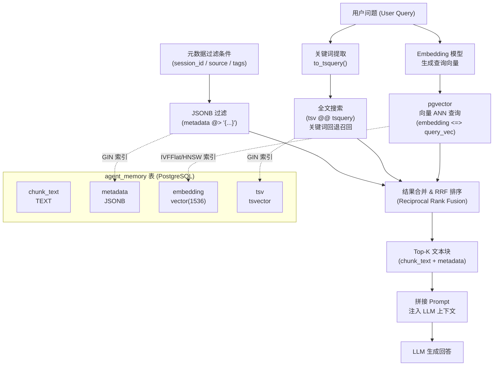

PostgreSQL 在标准关系型能力之上，内置了文档存储、向量检索、全文搜索、递归查询和异步消息等特性，使其在 AI/Agent 系统中能同时承担结构化数据库、向量库和事件总线的角色，无需引入额外中间件。

## JSONB：半结构化数据存储

PostgreSQL 提供两种 JSON 类型，底层实现截然不同。

| 类型 | 存储方式 | 写入开销 | 查询性能 | GIN 索引 | 保留原始格式 |
|------|----------|----------|----------|----------|--------------|
| `json` | 原始文本 | 低 | 每次解析，较慢 | 不支持 | 是 |
| `jsonb` | 二进制分解 | 略高 | 直接访问，快 | 支持 | 否（去重、排序键） |

**结论：除非需要精确还原原始 JSON 格式（含重复键、空白字符），否则一律选 `jsonb`。**

在 AI/Agent 场景中，JSONB 天然适合存储 LLM 元数据（模型名、温度、token 用量）和工具调用记录（tool_calls 数组），这些数据结构不固定但需要灵活查询。

### 操作符全览

| 操作符 | 返回类型 | 语义 | 示例 |
|--------|----------|------|------|
| `->` | `jsonb` | 按键或数组下标取值 | `data->'name'` |
| `->>` | `text` | 按键或数组下标取值（文本） | `data->>'name'` |
| `#>` | `jsonb` | 按路径数组取值 | `data#>'{address,city}'` |
| `#>>` | `text` | 按路径数组取值（文本） | `data#>>'{address,city}'` |
| `@>` | `boolean` | 左侧是否包含（containment）右侧 | `data @> '{"role":"admin"}'` |
| `?` | `boolean` | 顶层键是否存在 | `data ? 'email'` |
| `?｜` | `boolean` | 任意键存在即为真 | `data ?｜ ARRAY['email','phone']` |
| `?&` | `boolean` | 全部键存在才为真 | `data ?& ARRAY['name','age']` |

```sql
CREATE TABLE agent_calls (
    id         BIGSERIAL PRIMARY KEY,
    session_id TEXT NOT NULL,
    metadata   JSONB NOT NULL,   -- 存储 LLM 元数据与工具调用记录
    created_at TIMESTAMPTZ DEFAULT now()
);

INSERT INTO agent_calls (session_id, metadata) VALUES
('sess_001', '{
    "model": "claude-opus-4",
    "usage": {"input_tokens": 512, "output_tokens": 128},
    "tool_calls": [{"name": "web_search", "status": "ok"}],
    "tags": ["rag", "search"]
}'),
('sess_002', '{
    "model": "claude-sonnet-4",
    "usage": {"input_tokens": 1024, "output_tokens": 256},
    "tool_calls": [{"name": "code_exec", "status": "error"}],
    "tags": ["coding"]
}');

-- 取模型名（返回 text，可直接比较）
SELECT metadata->>'model' FROM agent_calls;

-- 嵌套路径：取 input_tokens
SELECT metadata#>>'{usage,input_tokens}' AS input_tokens FROM agent_calls;

-- 包含查询：找出调用了 web_search 工具的记录
SELECT session_id
FROM agent_calls
WHERE metadata->'tool_calls' @> '[{"name":"web_search"}]';

-- 键存在检测：有 tags 字段的记录
SELECT * FROM agent_calls WHERE metadata ? 'tags';

-- 任意标签匹配
SELECT * FROM agent_calls WHERE metadata->'tags' ?| ARRAY['rag','coding'];
```

### GIN 索引（广义倒排索引）

对 `jsonb` 列建 GIN（Generalized Inverted Index，广义倒排索引）后，`@>`、`?`、`?|`、`?&` 均可走索引，避免全表扫描。

```sql
-- 全列 GIN 索引：支持所有 jsonb 操作符
CREATE INDEX idx_agent_calls_meta ON agent_calls USING GIN (metadata);

-- jsonb_path_ops 操作符类：索引体积更小，仅支持 @> 操作符
CREATE INDEX idx_agent_calls_meta_path
    ON agent_calls USING GIN (metadata jsonb_path_ops);
```

对高频访问的固定字段，用表达式索引（Expression Index）代价更低：

```sql
-- 对 model 字段建 B-tree 索引，支持等值与排序
CREATE INDEX idx_agent_calls_model ON agent_calls ((metadata->>'model'));

SELECT * FROM agent_calls WHERE metadata->>'model' = 'claude-opus-4';
```

---

## 全文搜索（Full-Text Search）

PostgreSQL 内置全文搜索通过两种数据类型实现：`tsvector`（文档向量，预处理后的词位列表）和 `tsquery`（查询表达式，支持布尔组合）。

```sql
CREATE TABLE documents (
    id    BIGSERIAL PRIMARY KEY,
    title TEXT NOT NULL,
    body  TEXT NOT NULL,
    -- 生成列自动维护 tsvector，写入时自动更新
    tsv   TSVECTOR GENERATED ALWAYS AS (
              to_tsvector('english', title || ' ' || body)
          ) STORED
);

CREATE INDEX idx_documents_tsv ON documents USING GIN (tsv);

-- 全文查询：title 或 body 包含 "vector" 且包含 "search"
SELECT title
FROM documents
WHERE tsv @@ to_tsquery('english', 'vector & search');

-- ts_headline：高亮匹配片段，适合 RAG 结果展示
SELECT title,
       ts_headline('english', body,
                   to_tsquery('vector & search'),
                   'MaxWords=30, MinWords=15') AS snippet
FROM documents
WHERE tsv @@ to_tsquery('english', 'vector & search')
LIMIT 10;
```

**在 RAG（Retrieval-Augmented Generation）管道中**，向量相似度（pgvector）负责语义召回，全文搜索作为混合检索（Hybrid Retrieval）的关键词回退策略，两者分数可通过 RRF（Reciprocal Rank Fusion）融合后再排序，显著提升召回率。

中文全文搜索需安装 `pg_jieba` 或 `zhparser` 扩展，并指定相应的文本搜索配置（Text Search Configuration）。

---

## 表继承与声明式分区

### 表继承（Table Inheritance）

表继承是 PostgreSQL 的面向对象特性，子表自动获得父表所有列。

```sql
CREATE TABLE events (
    id         BIGSERIAL PRIMARY KEY,
    session_id TEXT NOT NULL,
    occurred_at TIMESTAMPTZ DEFAULT now()
);

CREATE TABLE tool_events (
    tool_name TEXT,
    duration_ms INT
) INHERITS (events);

-- 查父表时自动包含子表数据
SELECT * FROM events;          -- 返回 events + tool_events 所有行
SELECT * FROM ONLY events;     -- 只查父表本身
```

### 声明式分区（Declarative Partitioning）

PostgreSQL 10+ 引入声明式分区（Declarative Partitioning），按范围、列表或哈希将大表拆分为多个物理子表，查询时由优化器自动修剪（Partition Pruning）无关分区。

```sql
-- 按月分区的 Agent 调用日志表
CREATE TABLE agent_logs (
    id         BIGSERIAL,
    session_id TEXT NOT NULL,
    log_time   TIMESTAMPTZ NOT NULL,
    payload    JSONB
) PARTITION BY RANGE (log_time);

CREATE TABLE agent_logs_2025_01
    PARTITION OF agent_logs
    FOR VALUES FROM ('2025-01-01') TO ('2025-02-01');

CREATE TABLE agent_logs_2025_02
    PARTITION OF agent_logs
    FOR VALUES FROM ('2025-02-01') TO ('2025-03-01');

-- 查询自动只扫描 2025-01 分区
SELECT * FROM agent_logs
WHERE log_time BETWEEN '2025-01-10' AND '2025-01-20';
```

新项目应优先选择声明式分区，它支持全局索引、外键约束，且分区管理更直观。

---

## WITH RECURSIVE：知识图谱遍历

`WITH RECURSIVE`（递归公用表表达式）允许查询引用自身结果，适合处理树形或图形结构，如组织架构、分类树或知识图谱（Knowledge Graph）中的关系链。

```sql
-- 知识图谱：实体节点与有向关系边
CREATE TABLE kg_nodes (
    id   INT PRIMARY KEY,
    name TEXT NOT NULL,
    type TEXT            -- 'concept' | 'entity' | 'document'
);

CREATE TABLE kg_edges (
    from_id INT REFERENCES kg_nodes(id),
    to_id   INT REFERENCES kg_nodes(id),
    rel     TEXT NOT NULL  -- 关系类型，如 'relates_to' / 'part_of'
);

-- 从节点 1 出发，遍历所有可达节点（防止循环：depth < 8）
WITH RECURSIVE reachable AS (
    -- 锚点（Anchor）：起始节点
    SELECT id, name, 0 AS depth, ARRAY[id] AS path
    FROM kg_nodes
    WHERE id = 1

    UNION ALL

    -- 递归部分：沿边向外扩展
    SELECT n.id, n.name, r.depth + 1, r.path || n.id
    FROM kg_nodes n
    JOIN kg_edges e ON e.to_id = n.id
    JOIN reachable r ON e.from_id = r.id
    WHERE n.id <> ALL(r.path)   -- 避免循环
      AND r.depth < 8
)
SELECT id, name, depth, path FROM reachable ORDER BY depth, id;
```

PostgreSQL 14 起支持 `CYCLE` 子句，可声明式检测并中断循环：

```sql
WITH RECURSIVE reachable AS (
    SELECT id, name, 0 AS depth FROM kg_nodes WHERE id = 1
    UNION ALL
    SELECT n.id, n.name, r.depth + 1
    FROM kg_nodes n
    JOIN kg_edges e ON e.to_id = n.id
    JOIN reachable r ON e.from_id = r.id
) CYCLE id SET is_cycle USING cycle_path
SELECT * FROM reachable WHERE NOT is_cycle;
```

---

## LISTEN / NOTIFY：Agent 事件总线

`LISTEN`/`NOTIFY` 是 PostgreSQL 内置的发布-订阅（Pub/Sub）机制，基于数据库连接传递通知，无需部署 Redis 或 Kafka，是构建轻量级 Agent 事件总线的最简方案。

```sql
-- Agent 编排层（Orchestrator）订阅任务完成事件
LISTEN agent_task_done;

-- 工具执行层（Tool Runner）完成任务后发送通知
-- payload 最大 8000 字节，建议存 JSON 引用 ID 而非完整数据
NOTIFY agent_task_done, '{"task_id":"t_42","status":"ok","session":"sess_001"}';

-- 触发器自动通知：工具调用状态变更时触发
CREATE OR REPLACE FUNCTION notify_tool_done() RETURNS TRIGGER AS $$
BEGIN
    PERFORM pg_notify(
        'agent_task_done',
        json_build_object(
            'task_id',  NEW.id,
            'status',   NEW.status,
            'session',  NEW.session_id
        )::text
    );
    RETURN NEW;
END;
$$ LANGUAGE plpgsql;

CREATE TRIGGER trg_tool_done
AFTER UPDATE OF status ON agent_calls
FOR EACH ROW
WHEN (NEW.status IN ('ok', 'error'))
EXECUTE FUNCTION notify_tool_done();
```

Node.js 中使用 `pg` 库接收通知：

```sql
-- 伪代码逻辑等价的 SQL 视角：客户端保持长连接并监听
-- client.query('LISTEN agent_task_done')
-- client.on('notification', msg => handleTaskDone(msg.payload))
```

适用场景：Agent 子任务完成后通知编排层推进下一步、数据库写入后触发缓存失效、低吞吐任务队列。不适用于高吞吐（> 数千条/秒）或需要持久化的消息场景，彼时应使用专用消息队列。

---

## 扩展生态（Extension Ecosystem）

PostgreSQL 通过 `CREATE EXTENSION` 加载扩展，核心能力通过社区扩展大幅拓展。

| 扩展 | 功能 | AI/Agent 场景 |
|------|------|---------------|
| `pgvector` | 向量类型与 ANN 搜索 | 存储 embedding，语义检索 |
| `PostGIS` | 地理空间类型与函数 | 地理围栏、位置感知 Agent |
| `pg_trgm` | 三元字符组（Trigram）相似度 | 模糊匹配、LIKE 索引加速 |
| `pg_stat_statements` | SQL 执行统计 | 慢查询分析、性能调优 |
| `uuid-ossp` | UUID 生成（v14+ 内置 `gen_random_uuid()`） | 分布式主键 |

### pgvector：向量相似度搜索

`pgvector` 为 PostgreSQL 添加 `vector` 类型和近似最近邻（ANN，Approximate Nearest Neighbor）索引，是在关系库中实现语义检索的核心扩展。

```sql
CREATE EXTENSION vector;
CREATE EXTENSION pg_trgm;  -- 用于全文模糊回退

-- Agent 记忆存储（Memory Store）完整 Schema
-- 单表同时存储文本块、元数据 JSONB 和 embedding 向量
CREATE TABLE agent_memory (
    id           BIGSERIAL PRIMARY KEY,
    session_id   TEXT        NOT NULL,
    chunk_text   TEXT        NOT NULL,              -- 原始文本块
    metadata     JSONB       NOT NULL DEFAULT '{}', -- LLM 元数据、来源、标签
    embedding    vector(1536),                      -- text-embedding-3-small 维度
    tsv          TSVECTOR GENERATED ALWAYS AS (
                     to_tsvector('english', chunk_text)
                 ) STORED,                          -- 全文搜索向量
    created_at   TIMESTAMPTZ DEFAULT now()
);

-- 向量 ANN 索引（IVFFlat：构建快，适合中等规模）
CREATE INDEX idx_memory_vec
    ON agent_memory USING ivfflat (embedding vector_cosine_ops)
    WITH (lists = 100);

-- 或使用 HNSW 索引（查询更快，构建较慢，适合大规模）
-- CREATE INDEX idx_memory_vec_hnsw
--     ON agent_memory USING hnsw (embedding vector_cosine_ops);

-- 全文搜索 GIN 索引（关键词召回兜底）
CREATE INDEX idx_memory_tsv ON agent_memory USING GIN (tsv);

-- JSONB GIN 索引（按元数据过滤）
CREATE INDEX idx_memory_meta ON agent_memory USING GIN (metadata);

-- 向量相似度检索：找出与查询 embedding 最接近的 5 条记忆
-- $1 为查询 embedding，$2 为 session 过滤
SELECT id,
       chunk_text,
       metadata,
       1 - (embedding <=> $1::vector) AS cosine_similarity
FROM agent_memory
WHERE session_id = $2
  AND metadata @> '{"source":"web"}'   -- 按元数据过滤
ORDER BY embedding <=> $1::vector
LIMIT 5;
```

### pgvector + JSONB 构建 RAG 管道

下图展示向量检索与 JSONB 元数据过滤如何在同一张表内协同，为 RAG 管道提供语义召回与精确过滤双重能力。



---

## 常见误区

**误区一：在需要索引的列上使用 `json` 类型。**
`json` 类型不支持 GIN 索引，所有 `@>`、`?` 操作符都会退化为全表扫描。应始终选用 `jsonb`。

**误区二：混淆 `->` 与 `->>` 的返回类型。**
`->` 返回 `jsonb`，在 `WHERE` 中直接与字符串比较会报类型错误或行为不符预期。应使用 `->>` 返回 `text` 后再做比较，或显式转型：`(metadata->>'age')::int > 25`。

**误区三：对 `@>` 包含语义理解不足。**
`@>` 是"超集"语义：左侧必须包含右侧所有内容。`'["a","b"]'::jsonb @> '["a"]'` 为真，但 `'["a"]'::jsonb @> '["a","b"]'` 为假。对数组而言，是子集关系，而非元素存在性检测。

**误区四：对 pgvector IVFFlat 索引在冷启动时不准确。**
IVFFlat 索引基于聚类，`lists` 参数建议设为记录数 / 1000（最小 10）。插入数据后需执行 `VACUUM ANALYZE` 使统计信息生效；数据量 < 10 万行时，顺序扫描（SeqScan）反而更快，不必强制走索引。

**误区五：LISTEN/NOTIFY 当作持久化消息队列使用。**
通知在连接断开期间会丢失，不具备持久性。适合低频、容忍丢失的实时通知，不适合需要 At-Least-Once 保证的任务队列。

**误区六：WITH RECURSIVE 忽略循环防护。**
在图结构数据中若不加 `WHERE id <> ALL(path)` 或 `CYCLE` 子句，循环引用会导致无限递归直至内存耗尽。

---

## 最佳实践

1. **JSONB 列配 GIN 索引，表达式列配 B-tree 索引。** 对整列 JSONB 建 GIN 满足通用过滤；对高频等值/范围查询的固定字段额外建表达式 B-tree，两者互补。

2. **RAG 表结构三合一设计。** 将 `chunk_text`、`metadata JSONB`、`embedding vector` 放在同一张表，避免 JOIN。索引分三层：IVFFlat/HNSW 用于向量召回，GIN 用于全文搜索，JSONB GIN 用于元数据过滤。

3. **向量索引与数据量匹配。** 数据量 < 5 万行时无需建向量索引，直接顺序扫描；5 万–100 万行用 IVFFlat（`lists = sqrt(row_count)`）；> 100 万行用 HNSW（`m=16, ef_construction=64`）。

4. **分区表管理时序日志。** Agent 调用日志按月 RANGE 分区，历史分区可通过 `DETACH PARTITION` 后归档，不影响在线查询性能。

5. **LISTEN/NOTIFY payload 保持轻量。** 只传递 ID 或事件类型，完整数据从数据库按需读取，避免超过 8000 字节限制。

6. **使用 `pg_stat_statements` 监控慢查询。** 在生产环境启用该扩展，定期查询 `pg_stat_statements` 视图找出高频慢查询，有针对性地加索引或重写 SQL。

7. **WITH RECURSIVE 必须有终止条件。** 始终在递归部分加深度限制列或使用 `CYCLE` 子句，并在测试环境用小数据集验证终止行为。

---

## 面试常问要点

**Q：`json` 和 `jsonb` 的核心区别是什么？**
A：`json` 以原始文本存储，每次查询重新解析，不支持 GIN 索引；`jsonb` 以二进制分解格式存储，查询直接读取，支持 GIN 索引，会去除重复键并对键排序。除需精确保留原始格式外，所有场景应选 `jsonb`。

**Q：JSONB GIN 索引的两种操作符类有什么区别？**
A：默认操作符类支持 `@>`、`?`、`?|`、`?&` 全部操作符，索引较大；`jsonb_path_ops` 仅支持 `@>`，但索引体积更小、构建更快，适合只需包含查询的场景。

**Q：pgvector 的 IVFFlat 和 HNSW 索引如何选择？**
A：IVFFlat 基于倒排文件（Inverted File），构建快、内存占用小，但查询需要扫描多个聚类（`probes` 参数控制精度与速度权衡），适合中等规模；HNSW（Hierarchical Navigable Small World）是图索引，查询更快、精度更高，但构建慢、内存占用大，适合大规模生产环境。

**Q：PostgreSQL 全文搜索与向量搜索如何配合？**
A：两者互为补充。向量搜索（pgvector）负责语义相似性召回，能找到语义相关但关键词不同的文档；全文搜索（`tsvector`/`tsquery`）负责精确关键词匹配，作为回退或补充。混合检索使用 RRF（Reciprocal Rank Fusion）融合两路排序结果，综合召回率优于任何单一方式。

**Q：WITH RECURSIVE 有哪些风险点？**
A：主要风险是循环引用导致无限递归。应对措施：① 在递归部分维护已访问节点数组（`path`），用 `WHERE id <> ALL(path)` 剪枝；② PostgreSQL 14+ 使用 `CYCLE id SET is_cycle` 声明式检测；③ 始终加 `depth < N` 作为兜底深度限制。

**Q：LISTEN/NOTIFY 适合用于 Agent 事件总线吗？有什么限制？**
A：适合低吞吐、容忍消息丢失的场景，优势是零额外依赖、与事务集成（在事务提交后才发送通知）。主要限制：① 通知不持久化，连接断开期间的通知丢失；② payload 上限 8000 字节；③ 不支持消息确认（ACK）和重试。需要可靠性保障时，应升级为 pg_boss 或外部消息队列。
