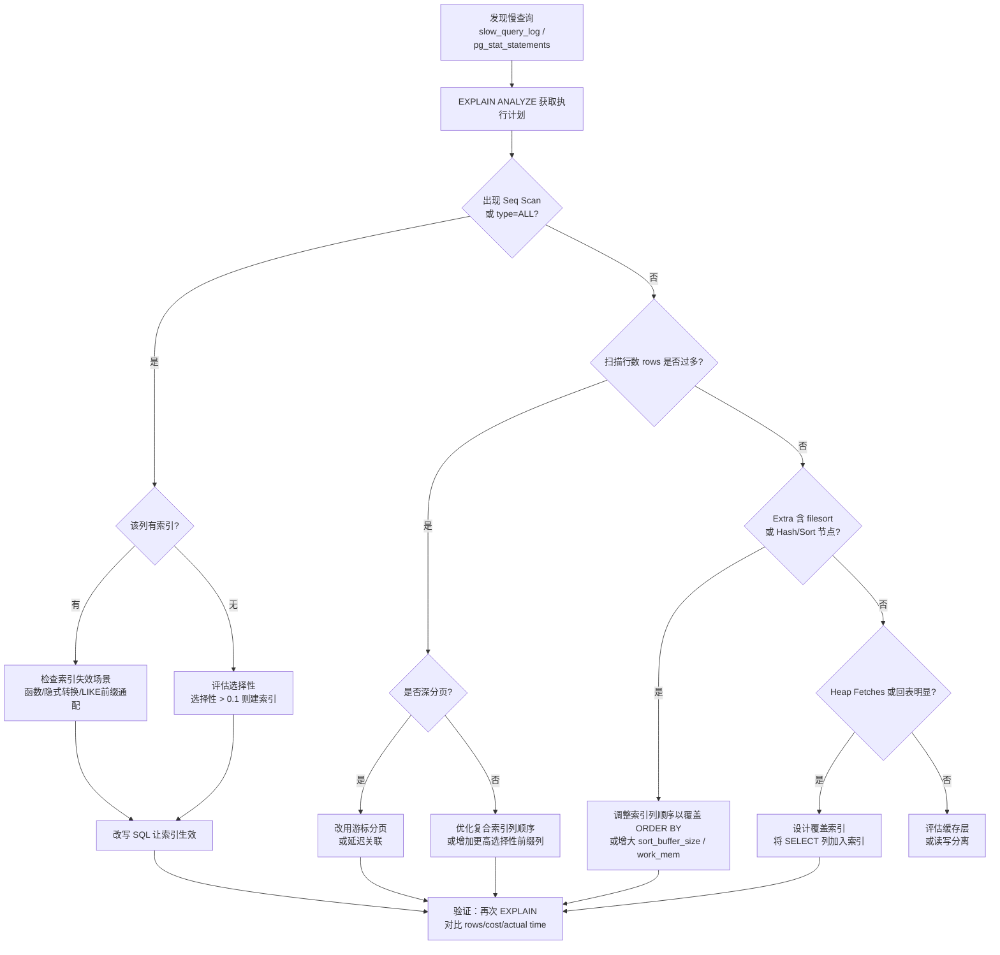

数据库索引（Index）是建立在数据列上的有序辅助结构，将全表扫描的线性代价降低为对数级别。理解索引的物理结构、适用边界与失效场景，是写出可扩展 SQL 查询的前提。

## 索引的底层数据结构

### B-Tree 索引的内部组织

B-Tree（平衡多路搜索树，Balanced Multi-way Search Tree）是关系型数据库最通用的索引类型，InnoDB 与 PostgreSQL 默认均采用 B+ Tree 变体，分为两层角色：

- **非叶节点（Non-leaf / Internal Node）**：仅存储路由键（Routing Key）与子节点指针，树高通常 3-4 层即可覆盖数亿行。
- **叶子节点（Leaf Node）**：以双向链表串联，存储索引键值与行指针（InnoDB 存主键值；PostgreSQL 存堆文件 `ctid`），双向链表使范围扫描无需回溯根节点。
- **回表（Heap Fetch）**：非覆盖索引查询时，叶节点取到行指针后还需访问主键 B-Tree 或堆文件获取完整行，产生额外随机 I/O。

```sql
-- 演示 B-Tree 叶节点链表对范围查询的支持
-- 以下查询可直接沿叶节点链表顺序扫描，无需多次从根部开始
SELECT order_id, amount
FROM orders
WHERE created_at BETWEEN '2025-01-01' AND '2025-03-31'
ORDER BY created_at;
```

### Hash 索引

Hash 索引（哈希索引）对键值做哈希运算后直接定位桶（Bucket），等值查找时间复杂度为 O(1)，但无法支持范围查询、排序和前缀匹配。MySQL InnoDB 会在内存中对热点页自动构建自适应哈希索引（Adaptive Hash Index，AHI），不需手动干预；PostgreSQL 支持显式创建。

```sql
-- PostgreSQL 显式 Hash 索引，适合纯等值高频查询
CREATE INDEX idx_session_token_hash ON sessions USING HASH (token);

-- 适用：等值查找
SELECT user_id FROM sessions WHERE token = 'abc123';

-- 不适用：范围查询（无法走 Hash 索引）
-- SELECT * FROM sessions WHERE created_at > '2025-01-01';
```

| 特性 | B-Tree | Hash |
|------|--------|------|
| 等值查询 | O(log N) | O(1) |
| 范围查询 | 支持 | 不支持 |
| 排序 / ORDER BY | 支持 | 不支持 |
| LIKE 前缀匹配 | 支持 | 不支持 |
| 存储开销 | 较大 | 较小 |

## 索引选择性与基数

**基数（Cardinality）** 是索引列中不重复值的数量，**选择性（Selectivity）** = `Cardinality / Total Rows`，越接近 1 过滤效果越好。性别列选择性约 0.5 几乎没有区分能力，用户 ID 或邮箱接近 1 过滤效果极佳。

优化器（Query Optimizer）依据统计信息中的基数估算决定是否走索引，过时时可手动更新：

```sql
-- MySQL：更新表统计信息
ANALYZE TABLE orders;

-- PostgreSQL：更新统计信息（autovacuum 也会自动触发）
ANALYZE orders;

-- 查看 PostgreSQL 列级统计
SELECT attname, n_distinct, correlation
FROM pg_stats
WHERE tablename = 'orders';
```

`n_distinct` 为估计不重复值数；`correlation` 接近 1 表示物理存储与索引顺序高度相关，Index Scan 的 I/O 放大很小；接近 0 时顺序扫描可能反而更快，这也是 PostgreSQL 优化器有时不选索引的原因。

## 复合索引与最左前缀原则

### 设计原则

复合索引（Composite Index，又称联合索引）将多列合并为一棵 B-Tree，键排序规则为"先按第一列排序，再在相同第一列下按第二列排序……"。**最左前缀原则（Leftmost Prefix Rule）** 因此而来：查询过滤条件必须从索引最左列开始连续匹配。

```sql
-- 复合索引：(user_id, status, created_at)
CREATE INDEX idx_orders_composite ON orders (user_id, status, created_at);

-- ✓ 完整利用：命中前三列
SELECT * FROM orders WHERE user_id = 42 AND status = 'paid' AND created_at > '2025-01-01';

-- ✓ 利用前两列：user_id + status 等值，created_at 未过滤
SELECT * FROM orders WHERE user_id = 42 AND status = 'paid';

-- ✓ 仅利用第一列：user_id 等值
SELECT * FROM orders WHERE user_id = 42;

-- ✗ 跳过最左列：无法使用该索引
SELECT * FROM orders WHERE status = 'paid' AND created_at > '2025-01-01';
```

**列顺序建议**：等值过滤列靠前（选择性高优先），范围查询列（`>`、`BETWEEN`）放最后，范围条件之后的列无法继续利用索引。

### 覆盖索引与 Index Only Scan

当查询所需的所有列（`SELECT` 列表 + `WHERE` 条件列 + `ORDER BY` 列）均包含在索引内时，引擎无需回表，这种索引称为**覆盖索引（Covering Index）**。PostgreSQL 执行计划中表现为 `Index Only Scan`，MySQL `Extra` 列显示 `Using index`。

```sql
-- 覆盖索引示例：索引含 user_id, status, amount
CREATE INDEX idx_orders_cover ON orders (user_id, status, amount);

-- 查询只取这三列 => 完全走覆盖索引，Heap Fetches: 0
SELECT user_id, status, amount FROM orders WHERE user_id = 42;
```

```sql
-- PostgreSQL EXPLAIN 验证
EXPLAIN ANALYZE
SELECT user_id, status, amount FROM orders WHERE user_id = 42;

-- 期望输出（已简化）
Index Only Scan using idx_orders_cover on orders
  (cost=0.43..8.45 rows=12 width=20)
  (actual time=0.028..0.036 rows=12 loops=1)
  Index Cond: (user_id = 42)
  Heap Fetches: 0   -- 0 = 完全无回表
```

## 索引失效的典型场景

以下写法会导致索引无法被优化器选择，是生产环境中最常见的性能陷阱：

| 场景 | 反例 | 原因 | 修正方向 |
|------|------|------|----------|
| 对索引列套函数 | `WHERE YEAR(created_at) = 2025` | 函数破坏列的有序性，优化器无法定位起始位置 | 改为范围查询 |
| 隐式类型转换（Implicit Cast） | `WHERE phone = 13800138000`（phone 为 VARCHAR） | 引擎将列转换为数值型，相当于对列做函数 | 保持参数类型一致 |
| LIKE 以通配符开头 | `WHERE name LIKE '%张'` | 后缀通配无法确定 B-Tree 起始键 | 改前缀 `'张%'` 或用全文索引 |
| OR 连接非索引列 | `WHERE id = 1 OR remark = 'test'` | 任一侧无索引则退化为全表扫描 | 拆成 UNION 或补建索引 |
| NOT IN / != | `WHERE status != 'cancelled'` | 不等值通常无法利用 B-Tree 定位范围 | 改为 IN 或正向过滤 |
| 索引列参与计算 | `WHERE age + 1 > 18` | 等价于对列套函数 | 将计算移到参数侧 |
| 违反最左前缀 | `WHERE status = 'paid'`（缺少 user_id） | B-Tree 按 user_id 排序，跳过后无法定位 | 调整索引列顺序或增加单列索引 |

```sql
-- 索引失效 vs 正确改写示例

-- × 失效：对 created_at 套函数
SELECT * FROM orders WHERE DATE(created_at) = '2025-03-01';

-- ✓ 改为等价范围查询
SELECT * FROM orders
WHERE created_at >= '2025-03-01 00:00:00'
  AND created_at <  '2025-03-02 00:00:00';

-- × 失效：字符串列用数值参数（隐式转换）
SELECT * FROM users WHERE phone = 13800138000;

-- ✓ 加引号保持类型一致
SELECT * FROM users WHERE phone = '13800138000';

-- × 失效：索引列做算术
SELECT * FROM events WHERE created_at + INTERVAL 7 DAY > NOW();

-- ✓ 将运算移到等式另一侧
SELECT * FROM events WHERE created_at > NOW() - INTERVAL 7 DAY;
```

## EXPLAIN 执行计划解读

### MySQL EXPLAIN 关键字段

`EXPLAIN` 输出中最重要的字段是 `type`，其访问类型从优到劣的顺序为：

```
system > const > eq_ref > ref > range > index > ALL
```

| type | 含义 | 典型场景 |
|------|------|----------|
| `const` | 主键/唯一索引等值，最多 1 行 | `WHERE id = 1` |
| `eq_ref` | JOIN 被驱动表走唯一索引 | 主键关联 |
| `ref` | 非唯一索引等值扫描 | 普通索引等值 |
| `range` | 索引范围扫描 | `BETWEEN`、`LIKE 'pre%'` |
| `index` | 全索引扫描（仍很慢） | 无条件覆盖索引扫描 |
| `ALL` | 全表扫描，警戒线 | 大表须立即排查 |

```sql
EXPLAIN SELECT * FROM orders WHERE user_id = 42 AND status = 'paid'\G

-- 示例输出（关注 type 和 Extra）
-- type:  ref
-- key:   idx_orders_composite
-- rows:  47
-- Extra: Using index condition
```

`Extra` 中 `Using index` 为覆盖索引（好）；`Using filesort` 需额外排序；`Using temporary` 用了临时表，两者均需优化。

### PostgreSQL EXPLAIN ANALYZE 解读

```sql
EXPLAIN (ANALYZE, BUFFERS, FORMAT TEXT)
SELECT user_id, amount FROM orders WHERE user_id = 42;
```

输出节点格式：

```
Index Only Scan using idx_orders_cover on orders
  (cost=0.43..8.45 rows=12 width=12)
  (actual time=0.032..0.041 rows=12 loops=1)
  Buffers: shared hit=4
```

- `cost=启动..总代价` 是优化器估算（相对值）；`actual time` 仅在 `ANALYZE` 模式下出现，是真实耗时（ms）。`rows` 的预估与实际差距过大说明统计信息需更新。`Buffers: shared hit` 越高越好，`read` 表示从磁盘读取应尽量减少。`Seq Scan` 出现在大表或 `Sort` 节点超出 `work_mem` 时需重点优化。

## 慢查询诊断流程



### 深分页优化

`LIMIT offset, size` 的代价随 offset 线性增长，因为引擎必须扫描并丢弃前 offset 行：

```sql
-- 传统深分页（offset=100000 时极慢）
SELECT * FROM orders ORDER BY id LIMIT 100000, 10;

-- 方案一：延迟关联（Deferred Join）——先走覆盖索引取主键，再回表）
SELECT o.*
FROM orders o
JOIN (
  SELECT id FROM orders ORDER BY id LIMIT 100000, 10
) tmp ON o.id = tmp.id;

-- 方案二：游标分页（Keyset Pagination，推荐）——前端记录上次末尾 id
SELECT * FROM orders
WHERE id > :last_seen_id
ORDER BY id
LIMIT 10;
```

游标分页代价始终为 `O(log N + page_size)`，是处理海量数据分页的最优方案。

### JOIN 中的索引策略

嵌套循环 JOIN（Nested Loop Join）中，被驱动表（Inner Table）的关联列**必须**有索引，否则驱动表每行都触发全表扫描：

```sql
-- 确保 orders.customer_id 上有索引
CREATE INDEX idx_orders_customer_id ON orders (customer_id);

SELECT c.name, COUNT(o.id) AS order_count
FROM customers c
JOIN orders o ON o.customer_id = c.id
GROUP BY c.id;
```

## pgvector 混合查询与索引规划

AI / RAG（检索增强生成，Retrieval-Augmented Generation）场景中，向量数据库常与关系型元数据结合。PostgreSQL + pgvector 扩展支持在同一张表内同时做**元数据过滤（Metadata Filtering）**与**向量近邻排序（ANN Search）**。

### 混合查询的典型结构

```sql
-- documents 表同时含 metadata 列（关系型）和 embedding 列（向量）
CREATE TABLE documents (
  id         BIGSERIAL PRIMARY KEY,
  tenant_id  INT        NOT NULL,
  doc_type   VARCHAR(32),
  embedding  VECTOR(1536),
  content    TEXT
);

-- 为元数据建 B-Tree 索引
CREATE INDEX idx_docs_tenant_type ON documents (tenant_id, doc_type);

-- 为向量列建 IVFFlat 或 HNSW 近似近邻索引
CREATE INDEX idx_docs_embedding ON documents
  USING hnsw (embedding vector_cosine_ops)
  WITH (m = 16, ef_construction = 64);

-- 混合查询：先按 metadata 过滤，再按向量距离排序
SELECT id, content,
       embedding <=> '[0.1, 0.2, ...]'::vector AS distance
FROM documents
WHERE tenant_id = 101
  AND doc_type = 'knowledge_base'
ORDER BY embedding <=> '[0.1, 0.2, ...]'::vector
LIMIT 5;
```

### 索引规划的核心挑战

pgvector 的 HNSW / IVFFlat 索引在遇到 `WHERE` 过滤时面临两难：先走向量索引取 Top-K 候选再过滤（选择性强时召回率下降，需扩大 `ef_search`）；还是先用 B-Tree 过滤出候选子集再对其暴力扫描（过滤后行数 < 总量 10% 时往往更快）。PostgreSQL 优化器会根据统计信息自动选择路径，可用 `EXPLAIN ANALYZE` 验证。

```sql
-- 查看优化器实际选择的路径
EXPLAIN ANALYZE
SELECT id, embedding <=> '[0.1, ...]'::vector AS dist
FROM documents
WHERE tenant_id = 101 AND doc_type = 'knowledge_base'
ORDER BY dist
LIMIT 5;
-- Seq Scan + Sort => 优化器认为过滤后行数足够少，暴力扫描更优
-- Index Scan using idx_docs_embedding => 走了向量索引
```

**工程建议**：高选择性元数据先用 B-Tree 过滤；HNSW 参数按数据量调整；必要时 `SET hnsw.ef_search = 100` 权衡召回率与速度。

## 常见误区

**误区一：索引越多越好**
每次写入（INSERT / UPDATE / DELETE）都需同步更新所有相关索引的 B-Tree，写密集场景中冗余索引会显著拖慢吞吐量。定期用 `sys.schema_unused_indexes`（MySQL）或 `pg_stat_user_indexes`（PostgreSQL）清理未使用的索引。

**误区二：EXPLAIN rows 等于实际扫描行数**
`rows` 是基于统计信息的估算，可能与实际相差数量级。只有 `EXPLAIN ANALYZE` 才给出真实行数；统计信息过时时优化器可能选错执行计划。

**误区三：`LIKE '%keyword%'` 加索引就能提速**
双侧通配符完全无法使用 B-Tree 索引，需改用全文索引（MySQL `FULLTEXT`，PostgreSQL `tsvector` + GIN）或外部搜索引擎。

**误区四：NULL 一定不走索引**
B-Tree 索引能存储 NULL，`IS NULL` / `IS NOT NULL` 在多数场景可走索引，但复合索引中含 NULL 时需用 `EXPLAIN` 验证实际行为。

**误区五：OR 两侧都有索引就没问题**
MySQL 的 Index Merge 合并代价不低；两侧选择性均高时，改写为 `UNION ALL` 执行计划更可预测、性能更好。

## 最佳实践

1. **建索引前评估选择性**：`SELECT COUNT(DISTINCT col) / COUNT(*) FROM table`，结果低于 0.1 的列单独建索引收益很小。
2. **复合索引优先于多个单列索引**：`(a, b)` 复合索引在 `WHERE a = ? AND b = ?` 场景下通常优于各自单列索引，且树数量更少。
3. **指定列 + 覆盖索引**：避免 `SELECT *`，将高频查询的返回列加入索引，消除回表。
4. **范围查询列放复合索引末尾**：范围条件截断后续列的利用，等值列靠前、范围列最后。
5. **保持统计信息最新**：定期执行 `ANALYZE` 或调小 `autovacuum_analyze_threshold`，避免优化器依据陈旧统计选错执行计划。
6. **深分页改游标分页**：`OFFSET` 超过 1000 时均应考虑 Keyset Pagination，代价与翻页深度无关。
7. **RAG 混合查询先过滤后向量扫描**：元数据选择性强时，B-Tree 先收窄候选集再做向量扫描，优于先走向量索引。
8. **监控慢查询**：MySQL 开启 `slow_query_log`；PostgreSQL 用 `pg_stat_statements` 按 `mean_exec_time` 排序定期审查。

## 面试常问要点

- **B-Tree 叶节点双向链表的作用**：范围扫描和 ORDER BY 可沿叶节点链表顺序遍历，无需多次从根节点重新查找。
- **最左前缀原则的本质**：复合索引按列顺序排序，跳过最左列后 B-Tree 中该范围无序，无法定位起始键。
- **覆盖索引 vs 回表的代价**：回表是随机 I/O，在 HDD 上代价可达顺序 I/O 数十倍；覆盖索引消除回表是最直接的查询加速手段。
- **EXPLAIN type 优先级**：`const > eq_ref > ref > range > index > ALL`，大表出现 `ALL` 即为需优化的慢查询。
- **`LIKE '%abc'` 为何不走索引**：B-Tree 按前缀有序，后缀通配无法确定扫描起始键，只能退化为全表或全索引扫描。
- **选择性低的列为何优化器放弃索引**：索引扫描 + 回表的随机 I/O 代价可超过全表顺序扫描，PostgreSQL 会参考 `correlation` 做判断。
- **pgvector 混合查询为何有时不走向量索引**：元数据过滤后候选行数极少时，对子集做向量暴力扫描代价低于 HNSW 图遍历，优化器自动选择 B-Tree 先过滤。
- **索引列做运算为何失效**：运算后列值不再与索引键对应，优化器无法定位，正确做法是将计算移到参数侧。
