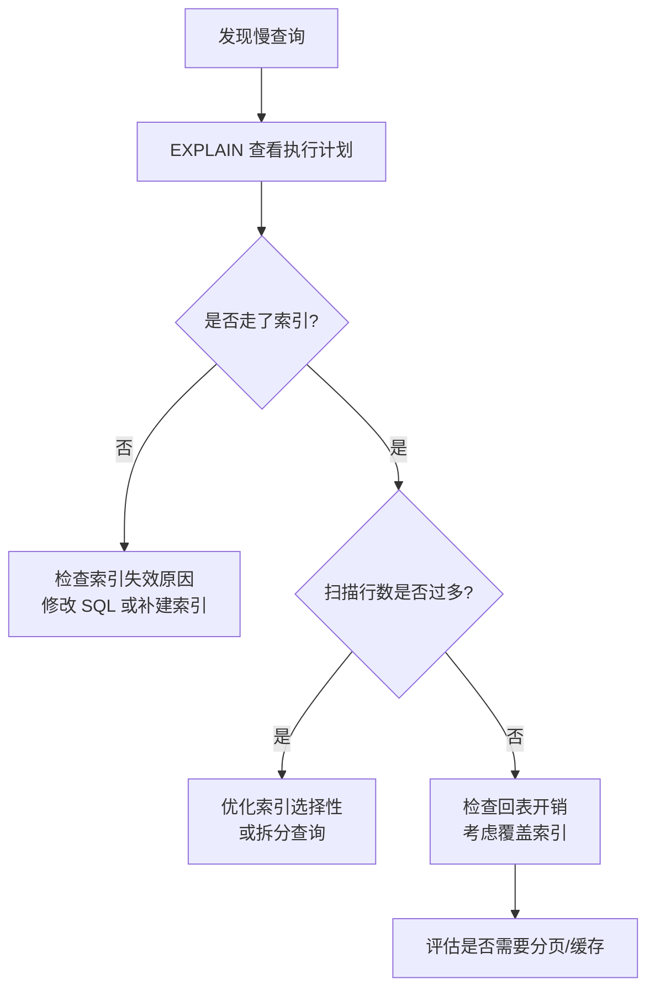

索引是数据库查询性能的核心保障，理解索引的底层结构与失效场景，是写出高效 SQL 的前提。本节以 MySQL / PostgreSQL 通用原理为主，结合执行计划解读与慢查询优化思路展开。

## 索引类型

### B-Tree 索引

绝大多数关系型数据库的默认索引类型。B-Tree（平衡多路搜索树）将数据有序地存储在叶子节点，非叶节点保存路由键，从而将等值查找、范围查找、排序、前缀匹配的时间复杂度降到 O(log N)。

适用场景：等值查询、范围查询（`<`、`>`、`BETWEEN`）、`ORDER BY`、`GROUP BY`、`LIKE 'prefix%'`。

```sql
-- 在 orders 表的 created_at 列上创建 B-Tree 索引
CREATE INDEX idx_orders_created_at ON orders (created_at);

-- 可以走索引的范围查询
SELECT * FROM orders WHERE created_at BETWEEN '2024-01-01' AND '2024-06-30';
```

### Hash 索引

仅支持等值比较（`=`、`IN`），不支持范围查询和排序。MySQL InnoDB 在内存中维护自适应哈希索引（AHI），无需手动创建；PostgreSQL 支持显式 `HASH` 索引。

```sql
-- PostgreSQL 显式创建 Hash 索引（仅适合等值场景）
CREATE INDEX idx_users_email_hash ON users USING HASH (email);
```

### 复合索引（联合索引）

将多列合并为一个索引，遵循**最左前缀原则**：查询条件必须从索引最左列开始连续匹配，才能有效利用该索引。

```sql
-- 复合索引：(user_id, status, created_at)
CREATE INDEX idx_orders_user_status_time ON orders (user_id, status, created_at);

-- 能走索引（前两列连续匹配）
SELECT * FROM orders WHERE user_id = 42 AND status = 'paid';

-- 不走索引（跳过了 user_id）
SELECT * FROM orders WHERE status = 'paid' AND created_at > '2024-01-01';
```

复合索引的列顺序设计原则：选择性高的列放前面，查询条件中常用作等值过滤的列靠前，范围查询列放最后。

### 覆盖索引（Covering Index）

当一条查询所需的所有列都包含在索引中时，引擎无需回表读取主键数据页，这类索引称为覆盖索引。执行计划中会出现 `Using index`（MySQL）或 `Index Only Scan`（PostgreSQL）。

```sql
-- 索引包含 user_id、status、amount 三列
CREATE INDEX idx_orders_cover ON orders (user_id, status, amount);

-- 查询只取这三列，可实现 Index Only Scan，避免回表
SELECT user_id, status, amount FROM orders WHERE user_id = 42;
```

## 索引失效场景

以下写法会导致索引无法使用，是高频踩坑点：

| 场景 | 示例 | 原因 |
|------|------|------|
| 对列做函数运算 | `WHERE YEAR(created_at) = 2024` | 函数破坏了索引有序性 |
| 隐式类型转换 | `WHERE phone = 13800138000`（phone 是 VARCHAR） | 引擎对列做了隐式转换 |
| `LIKE` 以通配符开头 | `WHERE name LIKE '%张'` | 无法利用前缀有序性 |
| `OR` 连接非索引列 | `WHERE id = 1 OR remark = 'foo'` | 一侧没有索引导致全表扫描 |
| `!=` / `NOT IN` | `WHERE status != 'cancelled'` | 不等值通常无法走索引 |
| 复合索引不从最左列开始 | `WHERE status = 'paid'`（缺少 user_id） | 违反最左前缀原则 |
| 索引列参与计算 | `WHERE age + 1 > 18` | 等价于对列做函数操作 |

```sql
-- 索引失效：对列套函数
SELECT * FROM orders WHERE DATE(created_at) = '2024-03-01';

-- 改写为范围查询，让索引生效
SELECT * FROM orders
WHERE created_at >= '2024-03-01 00:00:00'
  AND created_at <  '2024-03-02 00:00:00';
```

## EXPLAIN 执行计划解读

`EXPLAIN` 是分析 SQL 性能的第一工具，可以看到优化器选择的访问路径。

```sql
-- MySQL
EXPLAIN SELECT * FROM orders WHERE user_id = 42 AND status = 'paid';

-- PostgreSQL（ANALYZE 会实际执行并附上真实耗时）
EXPLAIN ANALYZE SELECT * FROM orders WHERE user_id = 42 AND status = 'paid';
```

### MySQL EXPLAIN 关键字段

| 字段 | 含义 | 关注点 |
|------|------|--------|
| `type` | 访问类型 | `ALL`（全表）最差；`ref`/`range`/`eq_ref`/`const` 较好 |
| `key` | 实际使用的索引 | `NULL` 表示未命中任何索引 |
| `rows` | 预估扫描行数 | 越小越好 |
| `Extra` | 附加信息 | `Using index` 好；`Using filesort` / `Using temporary` 需优化 |
| `filtered` | 引擎过滤后剩余比例 | 越高说明索引过滤效率越好 |

```
-- 典型的全表扫描（type=ALL，需要警惕）
id  select_type  table   type  key   rows    Extra
1   SIMPLE       orders  ALL   NULL  980000  Using where
```

### PostgreSQL EXPLAIN ANALYZE 示例

```sql
EXPLAIN ANALYZE
SELECT user_id, amount FROM orders WHERE user_id = 42;

-- 输出示例（已简化）
Index Only Scan using idx_orders_cover on orders
  (cost=0.43..8.45 rows=12 width=12)
  (actual time=0.032..0.041 rows=12 loops=1)
  Index Cond: (user_id = 42)
  Heap Fetches: 0          -- 0 表示完全走覆盖索引，无回表
```

`cost=启动开销..总开销`，`actual time=实际启动..实际总耗时`，`rows` 为实际行数，`loops` 为该节点执行次数。关注 `Seq Scan` 出现在大表上的情况，以及 `Sort` / `Hash` 节点的内存占用（`Memory Usage`）。

## 慢查询优化思路

### 分析流程



### 常见优化手段

**1. 补充或重建索引**

对高频查询字段建索引，避免大表全表扫描。对已有复合索引调整列顺序以符合实际查询模式。

**2. 消除回表**

将 `SELECT *` 改为只取需要的列，配合覆盖索引消除回表开销。

```sql
-- 改前：SELECT * 导致回表
SELECT * FROM orders WHERE user_id = 42 AND status = 'paid';

-- 改后：只取业务需要的列，触发覆盖索引
SELECT order_id, amount, created_at FROM orders WHERE user_id = 42 AND status = 'paid';
```

**3. 分页优化**

深分页（`LIMIT 100000, 10`）会扫描并丢弃大量数据，可改用"延迟关联"或游标分页：

```sql
-- 传统深分页（性能差）
SELECT * FROM orders ORDER BY id LIMIT 100000, 10;

-- 延迟关联（先走覆盖索引取主键，再回表）
SELECT o.* FROM orders o
JOIN (
  SELECT id FROM orders ORDER BY id LIMIT 100000, 10
) tmp ON o.id = tmp.id;

-- 游标分页（推荐，要求前端记录上次末尾 id）
SELECT * FROM orders WHERE id > :last_id ORDER BY id LIMIT 10;
```

**4. 避免在索引列上做计算**

将计算从列侧移到参数侧，让索引保持可用：

```sql
-- 失效写法
WHERE created_at + INTERVAL 7 DAY > NOW()

-- 正确写法
WHERE created_at > NOW() - INTERVAL 7 DAY
```

**5. 大表 JOIN 的索引策略**

两表 JOIN 时，驱动表（小表）扫描后，被驱动表（大表）的关联列必须有索引，否则每行都触发全表扫描，代价极高。

```sql
-- 确保 orders.customer_id 上有索引再做 JOIN
SELECT c.name, COUNT(o.id)
FROM customers c
JOIN orders o ON o.customer_id = c.id
GROUP BY c.id;
```

## 面试常问要点

- **B-Tree 与 Hash 索引的本质区别**：B-Tree 有序，支持范围和排序；Hash 等值查找更快，但不支持范围查询。
- **联合索引最左前缀原则**：必须从最左列连续匹配，中间断开则后续列无法使用索引。
- **覆盖索引 vs 回表**：查询列全在索引内 = 不回表；`SELECT *` 通常导致回表。
- **EXPLAIN type 字段的优先级**：`const > eq_ref > ref > range > index > ALL`，`ALL` 出现在大表上基本可判定为慢查询。
- **为什么 `LIKE '%abc'` 不走索引**：B-Tree 按前缀有序，后缀通配无法利用有序性定位起始位置。
- **索引并非越多越好**：索引会占用额外存储，且写入（INSERT/UPDATE/DELETE）时需要同步维护所有相关索引，过多索引会拖慢写操作。
