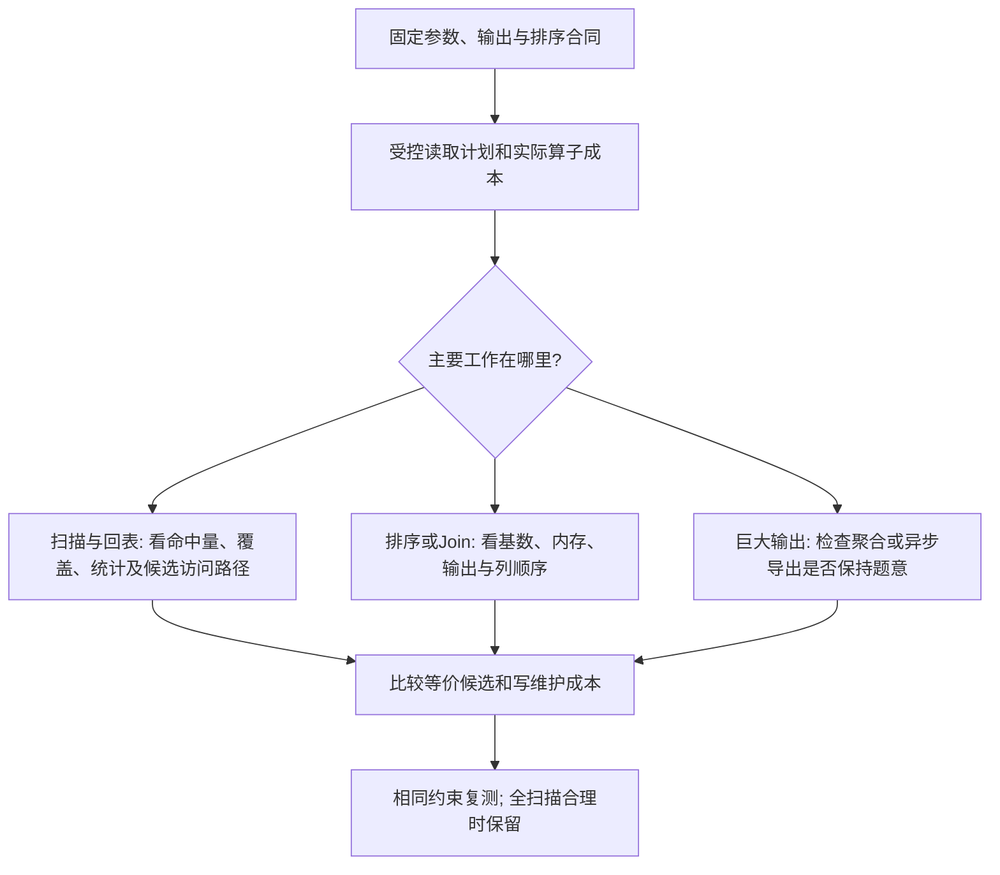

*图中数字为教学示意，未在本次运行数据库；观察计划、统计与写成本如何进入诊断，候选索引可能不改善，应回退或继续定位。*

---

数据库索引（Index）是建立在数据列上的有序辅助结构，可以减少定位和过滤工作，但取结果、回表、排序与传输的成本仍需计算。理解索引的物理结构、适用边界与失效场景，是写出可扩展 SQL 查询的前提。

本文SQL、计划输出和参数为示意，混合涉及MySQL8.4、PostgreSQL18与pgvector；没有在完整数据库运行，数字不代表实验结果。

## 贯穿案例：索引筛完仍有几亿行，下一步是什么

假设分析表有千亿行，查询租户 A 最近一个月的特定事件，并输出所有明细；倒排索引匹配后仍有两亿行。这些是题设数字，不是本文跑分。倒排索引把值或词项映射到候选行ID，帮助过滤；它不能让确实需要读取和传输的两亿条结果消失。[Doris3.x倒排索引](https://doris.apache.org/docs/3.x/table-design/index/inverted-index/)描述这种行级过滤机制。

先由业务确认输出：如果只需每日总额，就在DB内按明确口径聚合，减少输出明细；如果必须导出全部明细，则检查分区裁剪、列裁剪、分批异步导出和下游带宽，保留任务状态。再用profile拆分候选定位、列读取、join/聚合/排序、网络与客户端消费，不能继续盲目加索引。

回到小例子 `(tenant_id,event_type,created_at)`：前两列等值和日期范围缩小扫描区间；只请求少量必要列减少读取。若租户A占绝大多数行，原索引可能无法减少足够工作。若结果本就必须包含多数行，全扫描可能更合理；将结果改成Top20则要有稳定排序与业务允许的截断，不能为加速偷偷改题意。

## 索引的底层数据结构

### B-Tree 索引的内部组织

B-Tree（平衡多路搜索树，Balanced Multi-way Search Tree）是关系型数据库最通用的索引类型，InnoDB 与 PostgreSQL 默认均采用 B+ Tree 变体，分为两层角色：

- **非叶节点（Non-leaf / Internal Node）**：仅存储路由键（Routing Key）与子节点指针，扇出和高度取决于页大小、键宽与数据量，不能用固定层数推导通用容量。
- **叶子节点（Leaf Node）**：以双向链表串联，存储有序键和定位信息（InnoDB 聚簇索引叶子含行数据，二级索引含主键；PostgreSQL B-tree 通常指向堆元组），双向链表使范围扫描无需回溯根节点。
- **回表（Heap Fetch）**：非覆盖索引查询时，叶节点取到行指针后还需访问主键 B-Tree 或堆文件获取完整行，产生额外随机 I/O。

```sql
-- 演示 B-Tree 叶节点链表对范围查询的支持
-- 以下查询可直接沿叶节点链表顺序扫描，无需多次从根部开始
SELECT order_id, amount
FROM orders
WHERE created_at BETWEEN '2025-01-01' AND '2025-03-31'
ORDER BY created_at;
```

### Hash 索引

Hash 索引（哈希索引）对键值做哈希运算后定位桶，平均查找可接近 O(1)，但冲突、桶分布与实际 I/O 会改变成本；它不支持范围查询、排序和前缀匹配。InnoDB 的自适应哈希索引（AHI）只有启用后才会根据访问模式按需构建，MySQL8.4默认关闭，是否开启应比较具体负载下的收益与争用；PostgreSQL 支持显式创建哈希索引。（[MySQL8.4 AHI](https://docs.oracle.com/cd/E17952_01/mysql-8.4-en/innodb-adaptive-hash.html)）

```sql
-- PostgreSQL 显式 Hash 索引，适合纯等值高频查询
CREATE INDEX idx_session_token_hash ON sessions USING HASH (token);

-- 适用：等值查找
SELECT user_id FROM sessions WHERE token = 'abc123';

-- 不适用：范围查询（无法走 Hash 索引）
-- SELECT * FROM sessions WHERE created_at > '2025-01-01';
```

| 特性 | B-Tree | Hash |
|------|--------|------|
| 等值查询 | O(log N) | O(1) |
| 范围查询 | 支持 | 不支持 |
| 排序 / ORDER BY | 支持 | 不支持 |
| LIKE 前缀匹配 | 支持 | 不支持 |
| 存储开销 | 取决于键宽、页布局与覆盖字段 | 取决于桶布局、冲突与装载 |

## 索引选择性与基数

**基数**是不同值数量，`不同值数/总行数` 可以粗看列区分度，但不是某次查询的过滤比例。两个取值的列在百万行表中，这个比值是约 2/1000000，而不是 0.5；某个取值也可能只出现一行。判断索引收益要看查询参数对应的命中行数、数据分布、输出列和访问成本，不能只用固定区分度阈值。

优化器（Query Optimizer）依据统计信息中的基数估算决定是否走索引，过时时可手动更新：

```sql
-- MySQL：更新表统计信息
ANALYZE TABLE orders;

-- PostgreSQL：更新统计信息（autovacuum 也会自动触发）
ANALYZE orders;

-- 查看 PostgreSQL 列级统计
SELECT attname, n_distinct, correlation
FROM pg_stats
WHERE tablename = 'orders';
```

`n_distinct` 为正值时表示估计不重复值数，为负值时表示不同值占行数的比例的相反数，例如-1表示不同值数随行数增长、估计每行一个不同值。`correlation` 接近+1或-1时，物理行顺序与列逻辑顺序高度相关，优化器通常估计索引扫描的随机访问成本更低；它仍不能单独决定计划，还要看命中量、输出列和总成本。（[PostgreSQL18 pg_stats](https://www.postgresql.org/docs/18/view-pg-stats.html)）

## 复合索引与最左前缀原则

### 设计原则

复合索引（Composite Index，又称联合索引）将多列合并为一棵 B-Tree，键排序规则为"先按第一列排序，再在相同第一列下按第二列排序……"。**最左前缀原则（Leftmost Prefix Rule）** 因此而来：前导列等值通常最有利于收窄扫描区间；这不是“缺最左列绝对不能用索引”的判定规则。PostgreSQL18 和 MySQL8.4 在适用条件下支持 skip scan，优化器仍按成本选路径。

```sql
-- 复合索引：(user_id, status, created_at)
CREATE INDEX idx_orders_composite ON orders (user_id, status, created_at);

-- ✓ 完整利用：命中前三列
SELECT * FROM orders WHERE user_id = 42 AND status = 'paid' AND created_at > '2025-01-01';

-- ✓ 利用前两列：user_id + status 等值，created_at 未过滤
SELECT * FROM orders WHERE user_id = 42 AND status = 'paid';

-- ✓ 仅利用第一列：user_id 等值
SELECT * FROM orders WHERE user_id = 42;

-- 缺前导列：不能套用普通连续前缀定位；仍需核对实际计划
SELECT * FROM orders WHERE status = 'paid' AND created_at > '2025-01-01';
```

**列顺序建议**：先按真实过滤和排序设计候选索引。前导等值及接下来的范围约束影响扫描区间，后续列仍可能用于索引内过滤、覆盖或部分排序。选择性最高列不是所有查询的固定首列，范围列也不总要置于最后。

### 覆盖索引与 Index Only Scan

当查询所需的所有列都在索引内时，具备仅从索引取值的条件；PostgreSQL 还要从 visibility map 确认可见性，否则仍需访问堆，这种索引称为**覆盖索引（Covering Index）**。PostgreSQL 执行计划中表现为 `Index Only Scan`，MySQL `Extra` 列显示 `Using index`。

```sql
-- 覆盖索引示例：索引含 user_id, status, amount
CREATE INDEX idx_orders_cover ON orders (user_id, status, amount);

-- 查询只取这些列；PG能否Heap Fetches=0还受页面可见性影响
SELECT user_id, status, amount FROM orders WHERE user_id = 42;
```

```sql
-- PostgreSQL EXPLAIN 验证
EXPLAIN ANALYZE
SELECT user_id, status, amount FROM orders WHERE user_id = 42;

-- 计划格式示意（未在数据库运行，数字不是实测）
Index Only Scan using idx_orders_cover on orders
  (cost=0.43..8.45 rows=12 width=20)
  (actual time=0.028..0.036 rows=12 loops=1)
  Index Cond: (user_id = 42)
  Heap Fetches: 0   -- 0 = 完全无回表
```

## 索引失效的典型场景

以下写法可能改变可用扫描区间或增加成本；具体引擎、表达式索引、参数和统计信息会改变计划，不能把语法形状直接判成索引绝对失效：

| 场景 | 反例 | 原因 | 修正方向 |
|------|------|------|----------|
| 对索引列套函数 | `WHERE YEAR(created_at) = 2025` | 函数破坏列的有序性，优化器无法定位起始位置 | 改为范围查询 |
| 隐式类型转换（Implicit Cast） | `WHERE phone = 13800138000`（phone 为 VARCHAR） | 引擎将列转换为数值型，相当于对列做函数 | 保持参数类型一致 |
| LIKE 以通配符开头 | `WHERE name LIKE '%张'` | 后缀通配无法确定 B-Tree 起始键 | 改前缀 `'张%'` 或用全文索引 |
| OR 连接非索引列 | `WHERE id = 1 OR remark = 'test'` | 可能无法用简单索引合并覆盖整个条件，仍需核对成本 | 拆成 UNION 或补建索引 |
| NOT IN / != | `WHERE status != 'cancelled'` | 可表达范围，但命中比例高时收益有限 | 改为 IN 或正向过滤 |
| 索引列参与计算 | `WHERE age + 1 > 18` | 等价于对列套函数 | 将计算移到参数侧 |
| 违反最左前缀 | `WHERE status = 'paid'`（缺少 user_id） | 普通前缀定位受限；skip scan或全索引扫描仍可能可用 | 调整索引列顺序或增加单列索引 |

```sql
-- 索引失效 vs 正确改写示例

-- 普通B-tree定位可能受限：对 created_at 套函数
SELECT * FROM orders WHERE DATE(created_at) = '2025-03-01';

-- ✓ 改为等价范围查询
SELECT * FROM orders
WHERE created_at >= '2025-03-01 00:00:00'
  AND created_at <  '2025-03-02 00:00:00';

-- 普通B-tree定位可能受限：字符串列用数值参数（隐式转换）
SELECT * FROM users WHERE phone = 13800138000;

-- ✓ 加引号保持类型一致
SELECT * FROM users WHERE phone = '13800138000';

-- 普通B-tree定位可能受限：索引列做算术
SELECT * FROM events WHERE created_at + INTERVAL 7 DAY > NOW();

-- ✓ 将运算移到等式另一侧
SELECT * FROM events WHERE created_at > NOW() - INTERVAL 7 DAY;
```

## EXPLAIN 执行计划解读

### MySQL EXPLAIN 关键字段

`EXPLAIN` 输出中最重要的字段是 `type`，它描述访问方式，下列列表不是脱离数据与输出成本的性能排行榜：

```
system / const / eq_ref / ref / range / index / ALL
```

| type | 含义 | 典型场景 |
|------|------|----------|
| `const` | 主键/唯一索引等值，最多 1 行 | `WHERE id = 1` |
| `eq_ref` | JOIN 被驱动表走唯一索引 | 主键关联 |
| `ref` | 非唯一索引等值扫描 | 普通索引等值 |
| `range` | 索引范围扫描 | `BETWEEN`、`LIKE 'pre%'` |
| `index` | 全索引扫描，成本取决于大小与覆盖 | 无条件覆盖索引扫描 |
| `ALL` | 全表扫描，可能是合理低成本方案 | 结合实际读取与输出量检查 |

```sql
EXPLAIN SELECT * FROM orders WHERE user_id = 42 AND status = 'paid'\G

-- 示例输出（关注 type 和 Extra）
-- type:  ref
-- key:   idx_orders_composite
-- rows:  47
-- Extra: Using index condition
```

`Using index` 表示覆盖访问；`Using filesort` 表示额外排序，不等于一定落磁盘；`Using temporary` 表示临时结果。是否优化取决于数据量、内存、实际耗时与替代计划，不能仅凭标志下结论。

### PostgreSQL EXPLAIN ANALYZE 解读

[PostgreSQL EXPLAIN 文档](https://www.postgresql.org/docs/18/using-explain.html) 区分估算成本/行数与 `EXPLAIN ANALYZE` 的实际执行数据；诊断重点是 estimated 与 actual 的偏差及其上游原因。


```sql
EXPLAIN (ANALYZE, BUFFERS, FORMAT TEXT)
SELECT user_id, amount FROM orders WHERE user_id = 42;
```

输出节点格式：

```
Index Only Scan using idx_orders_cover on orders
  (cost=0.43..8.45 rows=12 width=12)
  (actual time=0.032..0.041 rows=12 loops=1)
  Buffers: shared hit=4
```

- `cost=启动..总代价` 是优化器估算（相对值）；`actual time` 仅在 `ANALYZE` 模式下出现，是真实耗时（ms）。`rows`预估与实际差距大时排查统计时效、数据偏斜、列相关性和参数分布；ANALYZE并不保证修复所有误差。Buffers 的 hit/read 是访问计数，hit多也可能表示做了更多无用工作；read表示读取到共享缓冲，底层可能命中操作系统缓存，不能直接等同物理磁盘I/O。先比较总访问、实际行数、loops与节点耗时，再检查统计误差、扫描或排序是否构成瓶颈。

## 慢查询诊断流程


```mermaid
flowchart TD
    A[固定参数、输出与排序合同] --> B[受控读取计划和实际算子成本]
    B --> C{主要工作在哪里?}
    C --> D[扫描与回表: 看命中量、覆盖、统计及候选访问路径]
    C --> E[排序或Join: 看基数、内存、输出与列顺序]
    C --> F[巨大输出: 检查聚合或异步导出是否保持题意]
    D --> G[比较等价候选和写维护成本]
    E --> G
    F --> G
    G --> H[相同约束复测; 全扫描合理时保留]
```

### 深分页优化

`LIMIT offset, size` 的代价随 offset 线性增长，因为引擎必须扫描并丢弃前 offset 行：

```sql
-- 传统深分页（offset=100000 时极慢）
SELECT * FROM orders ORDER BY id LIMIT 100000, 10;

-- 方案一：延迟关联（Deferred Join）——先走覆盖索引取主键，再回表）
SELECT o.*
FROM orders o
JOIN (
  SELECT id FROM orders ORDER BY id LIMIT 100000, 10
) tmp ON o.id = tmp.id;

-- 方案二：游标分页（Keyset Pagination，推荐）——前端记录上次末尾 id
SELECT * FROM orders
WHERE id > :last_seen_id
ORDER BY id
LIMIT 10;
```

有合适有序索引且过滤可快速匹配时，游标分页可避开扫描前 offset 行。复杂过滤可能仍需扫描更多候选，不能承诺固定成本；还需稳定的唯一排序键、方向与一致性合同。

### JOIN 中的索引策略

嵌套循环 JOIN（Nested Loop Join）中，大外层和重复内层扫描时，关联索引可能有帮助；小表、物化、缓存及其他 join 策略也可能更合适，应读实际 plan而不是规定所有内表必须建索引：

```sql
-- 确保 orders.customer_id 上有索引
CREATE INDEX idx_orders_customer_id ON orders (customer_id);

SELECT c.name, COUNT(o.id) AS order_count
FROM customers c
JOIN orders o ON o.customer_id = c.id
GROUP BY c.id;
```

## pgvector 混合查询与索引规划

AI / RAG（检索增强生成，Retrieval-Augmented Generation）场景中，向量数据库常与关系型元数据结合。PostgreSQL + pgvector 扩展支持在同一张表内同时做**元数据过滤（Metadata Filtering）**与**向量近邻排序（ANN Search）**。

### 混合查询的典型结构

```sql
-- documents 表同时含 metadata 列（关系型）和 embedding 列（向量）
CREATE TABLE documents (
  id         BIGSERIAL PRIMARY KEY,
  tenant_id  INT        NOT NULL,
  doc_type   VARCHAR(32),
  embedding  VECTOR(1536),
  content    TEXT
);

-- 为元数据建 B-Tree 索引
CREATE INDEX idx_docs_tenant_type ON documents (tenant_id, doc_type);

-- 为向量列建 IVFFlat 或 HNSW 近似近邻索引
CREATE INDEX idx_docs_embedding ON documents
  USING hnsw (embedding vector_cosine_ops)
  WITH (m = 16, ef_construction = 64);

-- 逻辑合同：限定metadata范围并按距离排序；实际执行先后看plan
SELECT id, content,
       embedding <=> '[0.1, 0.2, ...]'::vector AS distance
FROM documents
WHERE tenant_id = 101
  AND doc_type = 'knowledge_base'
ORDER BY embedding <=> '[0.1, 0.2, ...]'::vector
LIMIT 5;
```

### 索引规划的核心挑战

pgvector 的 HNSW / IVFFlat 索引在遇到 `WHERE` 过滤时面临两难：先走向量索引取 Top-K 候选再过滤（选择性强时召回率下降，需扩大 `ef_search`）；还是先用 B-Tree 过滤出候选子集再对其暴力扫描；取决于候选量、向量维数、索引和过滤分布，没有通用10%界线。PostgreSQL 优化器会根据统计信息自动选择路径，可用 `EXPLAIN ANALYZE` 验证。

```sql
-- 查看优化器实际选择的路径
EXPLAIN ANALYZE
SELECT id, embedding <=> '[0.1, ...]'::vector AS dist
FROM documents
WHERE tenant_id = 101 AND doc_type = 'knowledge_base'
ORDER BY dist
LIMIT 5;
-- Seq Scan + Sort => 实际采用扫描后排序；原因需结合统计、成本和参数核对
-- Index Scan using idx_docs_embedding => 走了向量索引
```

**工程建议**：在相同权限、召回和输出合同下比较B-tree过滤后精确距离与ANN后过滤；前者不是必优。HNSW搜索预算变化需一起检查召回、延迟及过滤后结果不足，参数不照抄固定值。

## 常见误区

**误区一：索引越多越好**
每次写入（INSERT / UPDATE / DELETE）都需同步更新所有相关索引的 B-Tree，写密集场景中冗余索引会显著拖慢吞吐量。定期用 `sys.schema_unused_indexes`（MySQL）或 `pg_stat_user_indexes`（PostgreSQL）清理未使用的索引。（参见 [PostgreSQL indexes introduction](https://www.postgresql.org/docs/current/indexes-intro.html)）

**误区二：EXPLAIN rows 等于实际扫描行数**
`rows` 是基于统计信息的估算，可能与实际相差数量级。`EXPLAIN ANALYZE` 实际执行并报告观测行数；节点rows与loops要一起读；统计信息过时时优化器可能选错执行计划。

**误区三：`LIKE '%keyword%'` 加索引就能提速**
前导通配一般不能用普通B-tree前缀缩小区间，但覆盖全索引扫描等仍可能出现，不能等同完全未使用索引，需改用全文索引（MySQL `FULLTEXT`，PostgreSQL `tsvector` + GIN）或外部搜索引擎。

**误区四：NULL 一定不走索引**
B-Tree 索引能存储 NULL，`IS NULL` / `IS NOT NULL` 在多数场景可走索引，但复合索引中含 NULL 时需用 `EXPLAIN` 验证实际行为。

**误区五：OR 两侧都有索引就没问题**
MySQL 的 Index Merge 合并代价不低；改写为 UNION 时还须处理两侧重合造成的重复语义；只有等价且实际计划更合适时采用，不承诺必然更快。

## 最佳实践

1. **建索引前评估选择性**：`SELECT COUNT(DISTINCT col) / COUNT(*) FROM table`，该比例只描述列区分度，另看查询参数命中率与分布，不能设置通用0.1门槛。
2. **复合索引优先于多个单列索引**：`(a, b)` 复合索引在 `WHERE a = ? AND b = ?` 场景下通常优于各自单列索引，且树数量更少。
3. **指定列 + 覆盖索引**：避免 `SELECT *`，将高频查询的返回列加入索引，消除回表。
4. **比较过滤与排序的列顺序**：前导等值及其后的范围影响扫描区间，后续列仍可能过滤或覆盖；不能统一规定范围列最后。
5. **保持统计信息最新**：定期执行 `ANALYZE` 或调小 `autovacuum_analyze_threshold`，避免优化器依据陈旧统计选错执行计划。
6. **深分页改游标分页**：出现深分页瓶颈时比较 Keyset Pagination；需要稳定排序、跳页需求和并发变更合同，没有固定1000阈值。
7. **验证混合查询路径**：按候选量、维数、召回目标和过滤分布比较精确与ANN方案，不能把SQL书写顺序当执行顺序。
8. **监控慢查询**：MySQL 开启 `slow_query_log`；PostgreSQL 用 `pg_stat_statements` 按 `mean_exec_time` 排序定期审查。

## 面试常问要点

- **B-Tree 叶节点双向链表的作用**：范围扫描和 ORDER BY 可沿叶节点链表顺序遍历，无需多次从根节点重新查找。
- **最左前缀原则的本质**：复合索引按列顺序排序，缺前导列时不能套用单个连续前缀范围；引擎可在条件允许时使用skip scan等路径，仍要看成本。
- **覆盖索引 vs 回表的代价**：回表可能增加页访问，实际成本依赖缓存与布局；覆盖有机会减少访问，但也增加索引体积与写成本。
- **EXPLAIN type 优先级**：访问类型不是完整性能排序；ALL是否合理取决于过滤、输出、数据布局与实际耗时。
- **`LIKE '%abc'` 为何不走索引**：B-Tree 按前缀有序，后缀通配无法确定扫描起始键，只能退化为全表或全索引扫描。
- **选择性低的列为何优化器放弃索引**：索引扫描 + 回表的随机 I/O 代价可超过全表顺序扫描，PostgreSQL 会参考 `correlation` 做判断。
- **pgvector 混合查询为何有时不走向量索引**：元数据过滤后候选行数极少时，对子集做向量暴力扫描代价低于 HNSW 图遍历，可能选择过滤后精确扫描；实际计划也受统计、参数和索引成本影响。
- **索引列做运算为何失效**：运算后列值不再与索引键对应，普通索引可能无法直接定位变换后的表达式；可比较等价范围改写或引擎支持的表达式索引。

## 面试口述与教学补充

“我先看查询的过滤、返回和排序合同，再从执行计划定位实际工作。复合索引按列顺序组织，前导等值通常有利，但缺前导列、范围后列和函数条件都要结合引擎版本分析，不能绝对判失效。索引降低定位成本，低过滤率、回表、排序及巨大输出仍可能是瓶颈；如果业务只需汇总，我先改为等价聚合，否则做异步分批并验证端到端资源。”

以下为教学模拟追问，不是来源面经原题：

- **Doris倒排索引命中两亿行，继续加一个索引一定有效吗？** 看新条件能否进一步减少候选，若瓶颈是必需输出量，先确认聚合或异步导出合同。
- **PostgreSQL18查询只有第二列条件，联合B-tree一定不能用吗？** 不一定，符合成本条件时可skip scan；看前导列不同值数量和实际plan。
- **Index Only Scan却有Heap Fetches，是计划错了吗？** 未必，MVCC可见性可能仍需查堆，不能把覆盖列齐全当零回表保证。

## 出现于（热度来源）

<!-- interview-source-history:start -->
- [字节 AI 全栈一面：Pipeline 质量、Doris 与消息轮播（2026 年 9 月）](../../../interview/bytedance/base/bytedance-base-23.md)（cluster-3f37b9b18f24）
- [字节 Agent Infra 校招：运行时、MySQL 与 LRU（2026 年 9 月）](../../../interview/bytedance/base/bytedance-base-25.md)（cluster-74e92db1eff9）
- [阿里云可观测存储 AI Agent 工程岗一面：存储性能与查询优化（2026 年 8 月）](../../../interview/alibaba/ai/alibaba-ai-7.md)（cluster-cf26fe3b37d5）
<!-- interview-source-history:end -->

## 参考资料

核验于2026-10-02：PostgreSQL18、MySQL8.4、Doris3.x；pgvector维护者README为滚动文档。查询示例中的向量省略号为占位值，不可直接执行，实际维数和检索参数须按部署验证。

- [PostgreSQL Using EXPLAIN](https://www.postgresql.org/docs/18/using-explain.html)
- [PostgreSQL indexes introduction](https://www.postgresql.org/docs/current/indexes-intro.html)

- [PostgreSQL18：Multicolumn indexes / skip scan](https://www.postgresql.org/docs/18/indexes-multicolumn.html)
- [PostgreSQL18：Index-only scans与可见性](https://www.postgresql.org/docs/18/indexes-index-only-scans.html)
- [MySQL8.4：聚簇与二级索引](https://dev.mysql.com/doc/refman/8.4/en/innodb-index-types.html)
- [MySQL8.4：范围与skip scan](https://dev.mysql.com/doc/refman/8.4/en/range-optimization.html)
- [Doris3.x：Inverted Index](https://doris.apache.org/docs/3.x/table-design/index/inverted-index/)
- [pgvector维护者：Filtering与近似索引](https://github.com/pgvector/pgvector)
