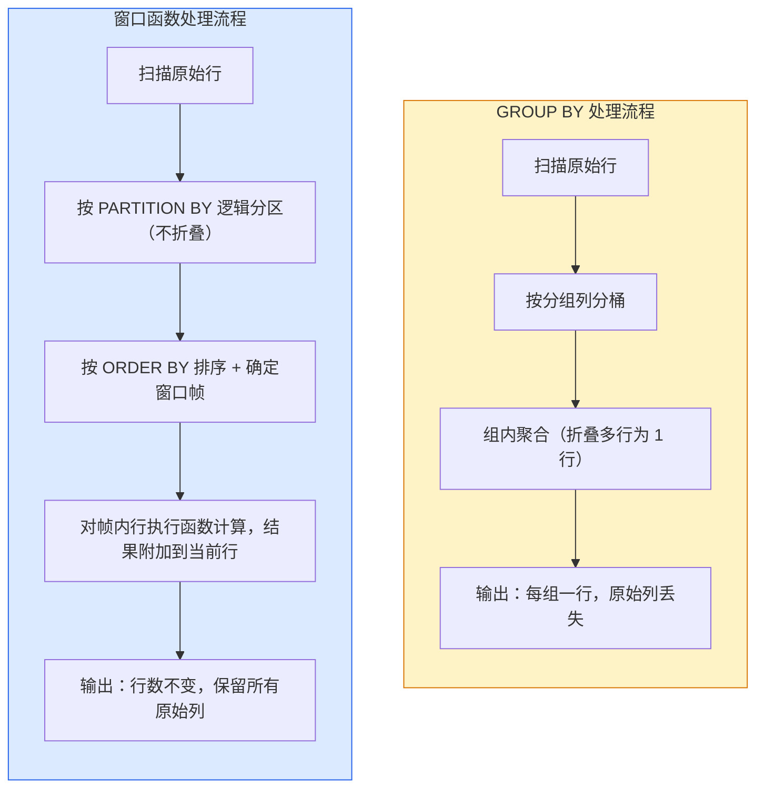

窗口函数与分析查询需要把“机制是什么”“边界在哪里”“怎样验证”放在同一条学习路径中。本文以 [PostgreSQL window functions tutorial](https://www.postgresql.org/docs/current/tutorial-window.html) 对“窗口、partition、order、frame 与执行位置”的说明为事实边界，并用 [PostgreSQL window function reference](https://www.postgresql.org/docs/current/functions-window.html) 校准“排名、值函数、聚合窗口和默认 frame 语义”。文中的代码和工程方案用于解释这些机制；涉及具体版本、默认值或部署行为时，应再回到所链接的一手资料确认。


*图：窗口函数与分析查询的核心组件、信息流与验证边界。*

---

窗口函数（Window Function）是 SQL 分析能力的核心特性，它允许对与当前行相关的一组行执行计算，同时保留每一行不被折叠——这一特性使排名、累计、时序偏移等复杂分析场景的表达能力远超传统聚合写法，在 LLM 推理链路日志分析、Agent 执行轨迹回溯等场景中尤为常用。

## 窗口函数与 GROUP BY 的本质差异

理解两者的处理模型差异，是掌握窗口函数的前提。



两者在 SQL 执行顺序中所处的位置同样不同：

```
FROM → JOIN → WHERE → GROUP BY → HAVING → SELECT（含窗口函数）→ DISTINCT → ORDER BY → LIMIT
```

窗口函数在 `SELECT` 阶段执行，因此**无法在 `WHERE`、`HAVING`、`GROUP BY` 中直接引用窗口函数的计算结果**，必须通过子查询或公用表表达式（CTE，Common Table Expression）包裹后再过滤。

| 特性 | 聚合函数（GROUP BY） | 窗口函数（OVER） |
|------|---------------------|-----------------|
| 输出行数 | 每组一行，原始行被折叠 | 与输入行数相同 |
| 可访问的列 | 仅分组列和聚合结果 | 可同时访问所有原始列 |
| 典型用途 | 统计汇总、去重计数 | 排名、累计、时序偏移、移动平均 |
| 结果可过滤性 | 可在 HAVING 中过滤 | 须包裹为子查询后在外层过滤 |

---

## OVER 子句语法深度解析

窗口函数的所有行为由 `OVER` 子句控制，完整语法如下：

```sql
函数名([参数]) OVER (
  [PARTITION BY 分区列1, 分区列2, ...]
  [ORDER BY 排序列 ASC|DESC NULLS FIRST|LAST]
  [ROWS | RANGE BETWEEN 起点 AND 终点]
)
```

### PARTITION BY

将结果集划分为逻辑上独立的分区，函数在每个分区内独立重置计算。省略时，整个结果集视为单一分区。

```sql
-- 每个部门内独立排名
RANK() OVER (PARTITION BY dept_id ORDER BY salary DESC)

-- 全局排名（无 PARTITION BY）
RANK() OVER (ORDER BY salary DESC)
```

### ORDER BY

决定分区内行的处理顺序。对排名函数，它直接决定名次分配；对聚合窗口函数，它决定累计方向；省略时，所有行被视为无序，窗口帧默认覆盖整个分区。

### 窗口帧（Window Frame）

窗口帧在 `PARTITION BY` + `ORDER BY` 确定的有序分区内，进一步缩小参与计算的行范围。

```
ROWS  BETWEEN <起点> AND <终点>
RANGE BETWEEN <起点> AND <终点>
GROUPS BETWEEN <起点> AND <终点>   -- PostgreSQL 11+ / SQLite 3.28+
```

常用边界关键字：

| 边界关键字 | 含义 |
|-----------|------|
| `UNBOUNDED PRECEDING` | 分区第一行（起点常用） |
| `N PRECEDING` | 当前行往前第 N 行 / N 个值单位 |
| `CURRENT ROW` | 当前行 |
| `N FOLLOWING` | 当前行往后第 N 行 / N 个值单位 |
| `UNBOUNDED FOLLOWING` | 分区最后一行（终点常用） |

**ROWS 与 RANGE 的关键差异**：`ROWS` 按物理行偏移，精确且可预测；`RANGE` 按排序列的值域偏移，**排序列相同的所有行被视为同一位置**，帧边界会自动扩展以包含所有并列行。

```sql
-- 场景：exam_date 有重复值（同一天多场考试）

-- ROWS：精确取物理上前后各 1 行，最多 3 行
AVG(score) OVER (ORDER BY exam_date ROWS BETWEEN 1 PRECEDING AND 1 FOLLOWING)

-- RANGE：取 exam_date 值在 [当前日期 - 1, 当前日期 + 1] 区间内的所有行
-- 若当天有 5 条记录，它们全部被纳入，实际参与行数可能远超 3 行
AVG(score) OVER (ORDER BY exam_date RANGE BETWEEN 1 PRECEDING AND 1 FOLLOWING)
```

**默认帧规则（易踩坑）**：仅写 `ORDER BY` 而不指定帧时，默认帧为 `RANGE BETWEEN UNBOUNDED PRECEDING AND CURRENT ROW`，而非 `ROWS`。当排序列存在重复值时，当前行的"CURRENT ROW"会把所有并列行都纳入，导致累计值在并列行处跳跃。

---

## 排名函数（Ranking Functions）

### ROW_NUMBER / RANK / DENSE_RANK

```sql
SELECT
  name,
  dept_id,
  salary,
  ROW_NUMBER()  OVER (PARTITION BY dept_id ORDER BY salary DESC) AS row_num,
  RANK()        OVER (PARTITION BY dept_id ORDER BY salary DESC) AS rnk,
  DENSE_RANK()  OVER (PARTITION BY dept_id ORDER BY salary DESC) AS dense_rnk
FROM employees;
```

假设某部门中 Alice 与 Bob 薪资并列第一（10000），Carol 薪资 8000：

| name  | salary | ROW_NUMBER | RANK | DENSE_RANK |
|-------|--------|-----------|------|------------|
| Alice | 10000  | 1         | 1    | 1          |
| Bob   | 10000  | 2         | 1    | 1          |
| Carol | 8000   | 3         | 3    | 2          |

- `ROW_NUMBER`：无论是否并列，每行赋予唯一连续编号；并列行的顺序由数据库内部决定，不保证稳定性。
- `RANK`：并列行获得相同名次，下一名次跳过已用编号（1, 1, 3）；名次数量等于前面更高排序值的行数加一。
- `DENSE_RANK`：并列行获得相同名次，下一名次紧接不跳号（1, 1, 2）；适用于"第几名"语义强烈的场景。

**取每组 Top N 的标准写法**：

```sql
-- 取每个部门薪资前 3 名（允许并列，用 DENSE_RANK）
WITH ranked AS (
  SELECT
    emp_id,
    name,
    dept_id,
    salary,
    DENSE_RANK() OVER (PARTITION BY dept_id ORDER BY salary DESC) AS rnk
  FROM employees
)
SELECT emp_id, name, dept_id, salary
FROM ranked
WHERE rnk <= 3;
```

### NTILE：分桶函数

将分区内的行尽量均匀地分配到 N 个桶（编号从 1 开始），常用于百分位划分、A/B 分组。若行数不能被 N 整除，前几个桶会多分配一行。

```sql
SELECT
  name,
  salary,
  NTILE(4) OVER (ORDER BY salary ASC) AS quartile   -- 四分位
FROM employees;
```

---

## 时序偏移函数：LAG 与 LEAD

`LAG`（滞后）访问当前行之前的行，`LEAD`（超前）访问之后的行。在时间序列分析（如 LLM 调用链路的请求间隔、Agent 步骤耗时环比）中是最常用的窗口函数之一。

```sql
LAG(列名 [, 偏移量 [, 默认值]])  OVER (PARTITION BY ... ORDER BY ...)
LEAD(列名 [, 偏移量 [, 默认值]]) OVER (PARTITION BY ... ORDER BY ...)
```

- 偏移量默认为 1；默认值用于当目标行不存在时（如第一行调用 `LAG`），不指定时返回 `NULL`。

**示例：计算月度营收环比增长率**：

```sql
SELECT
  month,
  revenue,
  LAG(revenue, 1, 0)           OVER (ORDER BY month)                           AS prev_revenue,
  revenue - LAG(revenue, 1, 0) OVER (ORDER BY month)                           AS mom_diff,
  ROUND(
    (revenue - LAG(revenue, 1) OVER (ORDER BY month))
    / NULLIF(LAG(revenue, 1) OVER (ORDER BY month), 0) * 100,
    2
  )                                                                              AS mom_pct
FROM monthly_sales;
```

**Agent 轨迹日志中计算会话间隔（Session Gap）**：

在 LLM 推理管道中，每次工具调用、模型请求都会产生带时间戳的日志行。判断相邻事件是否属于同一"会话（session）"，常见方法是计算相邻事件的时间差，若超过阈值则认为新会话开始。

```sql
-- agent_events 表：agent_id, event_id, event_time, event_type
-- 目标：为每个 agent 的每条事件标记 session_id
-- 规则：同一 agent 内，相邻事件间隔超过 30 分钟则开启新 session

WITH gaps AS (
  SELECT
    agent_id,
    event_id,
    event_time,
    event_type,
    LAG(event_time) OVER (
      PARTITION BY agent_id
      ORDER BY event_time
    ) AS prev_event_time,
    -- 与上一事件的秒数差，NULL 表示该 agent 的第一条事件
    EXTRACT(EPOCH FROM (
      event_time - LAG(event_time) OVER (
        PARTITION BY agent_id ORDER BY event_time
      )
    )) AS gap_seconds
  FROM agent_events
),
session_flags AS (
  SELECT
    *,
    -- 第一条事件或间隔超 1800 秒则为新 session 起点，标记为 1
    CASE
      WHEN prev_event_time IS NULL OR gap_seconds > 1800 THEN 1
      ELSE 0
    END AS is_new_session
  FROM gaps
)
SELECT
  agent_id,
  event_id,
  event_time,
  event_type,
  gap_seconds,
  -- 对 is_new_session 做累计求和，即可得到单调递增的 session 编号
  SUM(is_new_session) OVER (
    PARTITION BY agent_id
    ORDER BY event_time
    ROWS BETWEEN UNBOUNDED PRECEDING AND CURRENT ROW
  ) AS session_id
FROM session_flags
ORDER BY agent_id, event_time;
```

此模式（LAG 计算间隔 → 标记分界点 → 累计求和生成 ID）在时序日志分析中极为通用，同样适用于用户行为漏斗、网络请求重试链路的拆分。

---

## 聚合窗口函数：累计与滑动计算

### 累计求和（Running Total）

```sql
SELECT
  order_date,
  amount,
  SUM(amount) OVER (
    ORDER BY order_date
    ROWS BETWEEN UNBOUNDED PRECEDING AND CURRENT ROW
  ) AS running_total
FROM orders;
```

显式写出 `ROWS BETWEEN UNBOUNDED PRECEDING AND CURRENT ROW` 比依赖默认帧更清晰，且在排序列有重复值时行为确定（使用 `RANGE` 默认帧时，并列日期的所有行会被一次性累加）。

### 滑动窗口平均（Moving Average）

```sql
-- 最近 7 天（包含当天）的日均销售额
SELECT
  sale_date,
  amount,
  AVG(amount) OVER (
    ORDER BY sale_date
    ROWS BETWEEN 6 PRECEDING AND CURRENT ROW
  ) AS ma_7d,
  -- 也可以做前向平均（预测场景）
  AVG(amount) OVER (
    ORDER BY sale_date
    ROWS BETWEEN CURRENT ROW AND 6 FOLLOWING
  ) AS forward_ma_7d
FROM daily_sales;
```

### FIRST_VALUE / LAST_VALUE

获取窗口帧内第一行或最后一行的值，常用于"与分区最优值的差距"计算。

```sql
SELECT
  emp_id,
  name,
  dept_id,
  salary,
  FIRST_VALUE(salary) OVER (
    PARTITION BY dept_id ORDER BY salary DESC
    ROWS BETWEEN UNBOUNDED PRECEDING AND UNBOUNDED FOLLOWING
  ) AS dept_max_salary,
  LAST_VALUE(salary) OVER (
    PARTITION BY dept_id ORDER BY salary DESC
    ROWS BETWEEN UNBOUNDED PRECEDING AND UNBOUNDED FOLLOWING
  ) AS dept_min_salary,
  salary - FIRST_VALUE(salary) OVER (
    PARTITION BY dept_id ORDER BY salary DESC
    ROWS BETWEEN UNBOUNDED PRECEDING AND UNBOUNDED FOLLOWING
  ) AS gap_to_max   -- 负值，表示与部门最高薪的差距
FROM employees;
```

`LAST_VALUE` 的一个常见陷阱：**不指定帧时，默认帧终点是 `CURRENT ROW`，而非分区末尾**，导致 `LAST_VALUE` 返回当前行自身的值，并非预期的分区最后一行。必须显式写 `ROWS BETWEEN UNBOUNDED PRECEDING AND UNBOUNDED FOLLOWING`。

---

## 常见误区

**1. 在 WHERE 中直接过滤窗口函数结果**

窗口函数在 `SELECT` 阶段才执行，WHERE 阶段尚未产生其别名，直接引用会报"列不存在"错误。

```sql
-- 错误写法
SELECT *, RANK() OVER (ORDER BY salary DESC) AS rnk
FROM employees
WHERE rnk <= 3;   -- ORA-00904 / column "rnk" does not exist

-- 正确写法：用 CTE 包裹
WITH ranked AS (
  SELECT *, RANK() OVER (ORDER BY salary DESC) AS rnk
  FROM employees
)
SELECT * FROM ranked WHERE rnk <= 3;
```

**2. LAST_VALUE 返回当前行自身**

未显式指定帧终点时，默认帧终点为 `CURRENT ROW`，`LAST_VALUE` 永远返回当前行的值。应始终为 `FIRST_VALUE`/`LAST_VALUE` 显式声明帧范围。

**3. RANGE 默认帧在重复值场景下产生非预期的跳跃累计**

当 `ORDER BY` 列存在重复值且使用默认 `RANGE` 帧时，同一值的所有行会在同一步骤被全部纳入帧，导致 `SUM` 累计值在这些行上相同（而不是逐行递增）。若需逐行递增，应改用 `ROWS` 帧。

**4. PARTITION BY 缺失导致全局计算**

省略 `PARTITION BY` 时整个结果集视为单一分区。若本意是按部门内排名，遗漏 `PARTITION BY dept_id` 会得到全局排名，结果在语义上完全错误却不报任何错误提示。

**5. ROW_NUMBER 在并列场景的不稳定性**

`ROW_NUMBER` 对并列行的排序由数据库内部决定，在没有额外决胜列时不保证幂等。若要让结果可重复，`ORDER BY` 需包含能完全确定顺序的唯一列（如主键）。

---

## 最佳实践

- **始终显式声明窗口帧**：不依赖默认帧，尤其是使用 `SUM`/`AVG`/`FIRST_VALUE`/`LAST_VALUE` 时，使意图一目了然，也避免重复值陷阱。
- **优先使用 CTE 分层**：将窗口函数计算与后续过滤/聚合分层写在不同 CTE 中，可读性和调试效率均更高。
- **避免在同一查询中重复相同 OVER 子句**：部分数据库（如 PostgreSQL）支持 `WINDOW` 子句命名复用，减少冗余。
  ```sql
  SELECT
    salary,
    RANK()       OVER w,
    DENSE_RANK() OVER w,
    ROW_NUMBER() OVER w
  FROM employees
  WINDOW w AS (PARTITION BY dept_id ORDER BY salary DESC);
  ```
- **时序分析优先用 ROWS 而非 RANGE**：日志、事件流等场景中，`ROWS` 的物理行偏移语义更符合直觉，`RANGE` 留给需要值域语义的场景（如"过去 7 天内"而非"前 7 行"）。
- **性能意识**：窗口函数通常需要排序，在大表上要确保 `PARTITION BY` 和 `ORDER BY` 列有合适索引；多个窗口函数若共享相同 `OVER` 定义，数据库优化器通常能合并为单次扫描。

---

## 面试常问要点

- **ROW_NUMBER / RANK / DENSE_RANK 三者区别**：核心在于并列时的编号策略；RANK 跳号，DENSE_RANK 不跳号，ROW_NUMBER 强制唯一但不稳定。
- **取每组 Top N**：标准答案是排名函数 + CTE/子查询过滤，直接写 `WHERE rnk <= N` 在外层过滤。
- **窗口函数执行顺序**：位于 `SELECT` 阶段，晚于 `WHERE`/`GROUP BY`/`HAVING`，因此不能在这些子句中直接引用窗口函数结果。
- **ROWS 与 RANGE 的差异及默认值**：仅写 `ORDER BY` 时默认是 `RANGE UNBOUNDED PRECEDING TO CURRENT ROW`；重复值时二者行为差异是高频考点。
- **LAG/LEAD 实现时序计算**：如环比增长、相邻事件间隔、会话切割；能写出完整的 session 切割 SQL 是加分项。
- **LAST_VALUE 陷阱**：考官常考"为什么 LAST_VALUE 返回的是当前行自身"，答案是默认帧终点为 CURRENT ROW，需显式扩展帧到 UNBOUNDED FOLLOWING。

## 参考资料

- [PostgreSQL window functions tutorial](https://www.postgresql.org/docs/current/tutorial-window.html)
- [PostgreSQL window function reference](https://www.postgresql.org/docs/current/functions-window.html)
