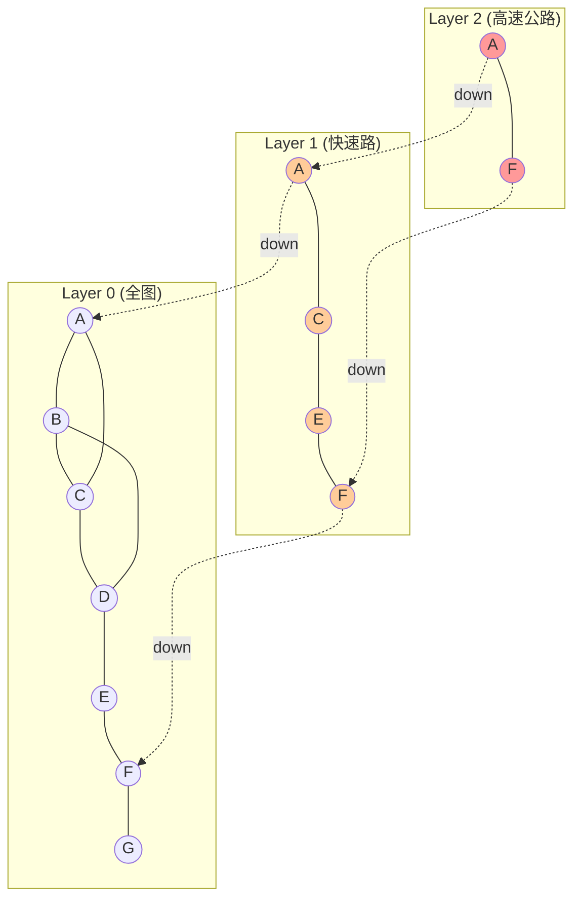
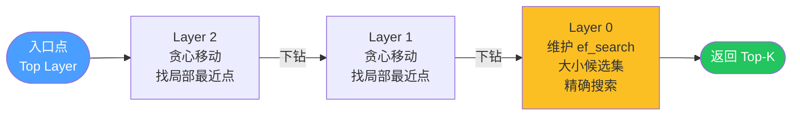

*图：沿图中的节点与箭头阅读，重点是解释多层小世界图的构建、贪心搜索、ef/M 参数和 recall-memory-latency 权衡。*

---

向量检索是 RAG 与语义搜索系统的核心基础设施——给定一条查询向量，需要从数百万乃至数十亿条向量中实时返回最相似的 K 条。理解其背后的算法原理，是 AI/Agent 工程师优化系统性能、正确选型的前提。

## 为什么精确最近邻不可用

精确最近邻（Exact K-Nearest Neighbor，KNN）的暴力实现思路简单：对查询向量 $q$，遍历库中所有 $N$ 条向量，逐一计算距离，取最小的 $K$ 个。

**复杂度分析**：每次距离计算的时间复杂度为 $O(D)$，遍历全库则是 $O(N \cdot D)$。当 $N = 10^6$、$D = 1536$ 时，单次查询需要约 $1.5 \times 10^9$ 次浮点运算，CPU 上延迟超过 1 秒，无法满足在线场景的 100ms 要求。

| 方法 | 查询时间复杂度 | 精度 | 适用规模 |
|------|--------------|------|---------|
| 暴力检索（Brute Force） | $O(N \cdot D)$ | 100% | $N < 10^5$ |
| 树方法（KD-Tree） | $O(D \cdot 2^D)$ 高维退化 | 100% | $D < 20$ |
| 量化方法（IVFFlat） | $O(\text{nprobe} \cdot N/\text{nlist} \cdot D)$ | 可调 | $N > 10^8$ |
| 图方法（HNSW） | $O(\log N)$ 量级 | 可调 | $N \leq 10^8$ |

近似最近邻（Approximate Nearest Neighbor，ANN）算法通过放弃极少量精度，换取数量级的速度提升，是工业落地的主流选择。

## ANN 三大流派

### 基于树的方法

KD-Tree（K 维树）将向量空间沿各坐标轴递归二分，形成二叉树结构。查询时先找到叶节点再回溯，理论上可以剪枝大量不必要的分支。

**高维灾难（Curse of Dimensionality）**：低维（$D < 20$）时 KD-Tree 效率极高，但维度升高后高维空间中所有点到查询点的距离趋于相等，KD-Tree 无法有效剪枝，退化为全遍历。512 维以上嵌入向量不应使用 KD-Tree。

### 基于量化的方法

**IVFFlat（Inverted File Flat，倒排文件索引）** 是典型代表：

1. **离线建索引**：用 K-means 将全库向量聚成 `nlist` 个簇，记录每个向量属于哪个簇（倒排索引）。
2. **在线查询**：计算查询向量与 `nlist` 个簇中心的距离，取最近的 `nprobe` 个簇，仅在这些簇内做暴力搜索。

关键权衡：`nprobe` 越大，覆盖范围越广，召回率越高，但速度越慢。`nlist` 建议取 $4\sqrt{N}$ 到 $16\sqrt{N}$，`nprobe` 从 `nlist` 的 1% 起调。IVFFlat 内存占用低，是十亿级场景（搭配乘积量化 PQ）的首选。

### 基于图的方法

图方法将向量集合构建为近似近邻图（Approximate Nearest Neighbor Graph），查询时从入口节点出发沿边"贪心爬坡"，每步移动到距查询向量更近的邻居直到收敛。图方法在同等召回率下查询速度最快，但需额外存储图结构。**HNSW** 是工业界最广泛使用的图索引算法，Milvus、Qdrant、Weaviate、pgvector 等向量数据库均以它为核心。（参见 [Efficient and robust approximate nearest neighbor search using Hierarchical Navigable Small World graphs](https://arxiv.org/abs/1603.09320)；参见 [pgvector HNSW documentation](https://github.com/pgvector/pgvector)）

## HNSW 深度解析

### NSW 的直觉：可导航小世界

NSW（Navigable Small World，可导航小世界图）的灵感来自"六度分隔"现象：若每个节点同时拥有少量跨区域长边和多个局部短边，则从任意起点经过 $O(\log N)$ 次跳转即可抵达目标附近。单层 NSW 的缺陷是建图顺序影响质量——早期节点成为高连接"枢纽"，图结构不均匀，查询易陷入局部最优。

### 分层结构：向跳表借鉴

HNSW（Hierarchical Navigable Small World）引入了类似跳表（Skip List）的分层思想来解决上述问题：

- **第 0 层**：包含所有向量节点，构成最稠密的完整图（全图）。
- **第 1、2、…层**：每个节点以概率 $p = e^{-1/m_L}$ 出现在更高一层（$m_L$ 为归一化因子，通常取 $1/\ln(M)$）。层数越高，节点越稀疏，边越"长"（两端向量距离越远），充当"高速公路"。

这种概率指数衰减保证了各层节点分布均匀，不依赖插入顺序，从根本上解决了 NSW 的图质量问题。



### 节点插入算法

插入新向量 $q$ 时，算法步骤如下：

1. **随机决定层数**：按 $\lfloor -\ln(\text{uniform}(0,1)) \cdot m_L \rfloor$ 为 $q$ 分配最高层 $l_q$。
2. **从顶层向下搜索入口点**：从全局入口点出发，在第 $L_{top}$ 层到第 $l_q + 1$ 层之间，每层只做贪心搜索找到最近的 1 个候选点（ef=1），作为下一层的入口。
3. **从 $l_q$ 层到第 0 层建边**：每层维护一个大小为 `ef_construction` 的动态候选集，用优先队列实现最近邻扩展（类似 BFS），找到该层最近的邻居后，按启发式规则（Heuristic Neighbor Selection）从候选集中选出最多 $M$ 条边（第 0 层最多 $2M$ 条），双向连接。

启发式选边规则（Heuristic Neighbor Selection）优先保留"多样化"邻居：若候选点 $e$ 与查询点的距离，大于 $e$ 到任意已选邻居的距离，则丢弃 $e$，防止边集中偏向同一方向。

### 查询算法

查询 $K$ 近邻时，流程如下：



1. 从顶层入口点出发，在每层执行贪心搜索（候选集大小为 1），找到该层局部最近点后下移到下一层。
2. 到达第 0 层后，维护大小为 `ef_search` 的候选集（$\text{ef\_search} \geq K$），通过优先队列扩展搜索，直到候选集中最差点比当前最优候选点的距离差更大（收敛）。
3. 从候选集取出最近的 $K$ 个节点返回。

### 关键参数详解

```python
# 参数含义速查
params = {
    "M": "每节点最大双向连接数，第0层为2M。控制图密度。",
    "ef_construction": "建图时候选集大小，控制建图质量（一次性开销）",
    "ef_search": "查询时候选集大小，控制查询精度（运行时可调）",
}

# 参数经验范围
# M: 8–64（文本检索常用 16–32，高维嵌入可用 32–48）
# ef_construction: 必须 >= M，推荐 2*M 到 4*M
# ef_search: 必须 >= K，从 2*K 起调，按召回率目标调整
```

| 参数 | 影响阶段 | 增大的收益 | 增大的代价 | 能否运行时调整 |
|------|---------|-----------|-----------|-------------|
| `M` | 建图 | 召回率↑，图连通性↑ | 内存↑（$O(N \cdot M)$），建图时间↑ | 否（重建索引） |
| `ef_construction` | 建图 | 图边质量↑，召回率↑ | 建图时间↑ | 否（重建索引） |
| `ef_search` | 查询 | 召回率↑ | 查询延迟↑ | 是 |

### 召回率（Recall@K）测量

召回率是 ANN 算法精度的核心指标：

$$\text{Recall@K} = \frac{|\text{ANN结果集} \cap \text{精确KNN结果集}|}{K}$$

测量方法：从数据集中随机抽取若干查询向量，分别用 ANN 和暴力检索得到 Top-K 结果，统计两个集合的交集大小除以 K，对所有查询取平均。

```python
import numpy as np

def recall_at_k(ann_results: np.ndarray, exact_results: np.ndarray) -> float:
    """
    ann_results: shape (num_queries, K)，ANN 返回的 ID 列表
    exact_results: shape (num_queries, K)，暴力检索返回的 ID 列表
    """
    num_queries, k = ann_results.shape
    recall_sum = 0.0
    for i in range(num_queries):
        ann_set = set(ann_results[i])
        exact_set = set(exact_results[i])
        recall_sum += len(ann_set & exact_set) / k
    return recall_sum / num_queries
```

## 内存布局与存储代价

HNSW 内存主要来自每个节点的邻接表（Adjacency List）：第 0 层每节点最多 $2M$ 个邻居 ID，高层最多 $M$ 个。考虑概率指数衰减，平均每节点存储约 $1.58M$ 个邻居。

以 $N = 10^6$、$M = 32$ 为例，邻接表约占 $10^6 \times 1.58 \times 32 \times 4 \approx 200$ MB；加上原始向量（128 维约 512 MB），总计约 700 MB。高维嵌入（$D = 1536$）时原始向量占主体，邻接表反而是小头。预估公式：

$$\text{mem} \approx N \times (D \times 4 + 1.58 \times M \times 4) \text{ bytes}$$

## Python 代码示例

### hnswlib（轻量独立库）

```python
import hnswlib
import numpy as np

DIM = 768
NUM_ELEMENTS = 500_000
K = 10

rng = np.random.default_rng(42)
data = rng.random((NUM_ELEMENTS, DIM), dtype=np.float32)
queries = rng.random((100, DIM), dtype=np.float32)

# 初始化：space 支持 'cosine'、'l2'、'ip'（内积）
index = hnswlib.Index(space="cosine", dim=DIM)

# 建图
# ef_construction=200 表示建图时每步维护 200 个候选
# M=32 控制图密度，文本嵌入推荐 16–32
index.init_index(max_elements=NUM_ELEMENTS, ef_construction=200, M=32)

# cosine 空间内部会自动 L2 归一化，无需手动处理
index.add_items(data, ids=np.arange(NUM_ELEMENTS))

# ef_search 必须 >= K；上线前应通过召回率曲线确定工作点
index.set_ef(50)

labels, distances = index.knn_query(queries, k=K)

# 衡量不同 ef_search 下的召回率（需先用暴力检索得到 exact_labels）
for ef in [10, 20, 50, 100, 200]:
    index.set_ef(ef)
    ann_labels, _ = index.knn_query(queries, k=K)
    # recall = recall_at_k(ann_labels, exact_labels)
    # print(f"ef_search={ef:4d}  recall@{K}={recall:.4f}")

# 持久化与加载
index.save_index("hnsw.bin")
index2 = hnswlib.Index(space="cosine", dim=DIM)
index2.load_index("hnsw.bin", max_elements=NUM_ELEMENTS)

# 增量插入：无需重建，直接调用 add_items
new_data = rng.random((1000, DIM), dtype=np.float32)
new_ids = np.arange(NUM_ELEMENTS, NUM_ELEMENTS + 1000)
index2.add_items(new_data, ids=new_ids)
```

### faiss HNSW（Facebook AI 研究院）

```python
import faiss
import numpy as np

DIM = 768
NUM_ELEMENTS = 500_000

rng = np.random.default_rng(42)
data = rng.random((NUM_ELEMENTS, DIM), dtype=np.float32)
queries = rng.random((100, DIM), dtype=np.float32)

# IndexHNSWFlat 使用 L2 距离
# 若需内积/余弦，先 L2 归一化再用 IndexHNSWFlat，
# 或使用 IndexHNSWSQ（标量量化节省内存）
M = 32
index = faiss.IndexHNSWFlat(DIM, M)

# 建图质量参数（在 add 之前设置）
index.hnsw.efConstruction = 200

# faiss HNSW 不支持 ID 映射；若需要，需包一层 IndexIDMap
index.add(data)

# 查询精度参数（可随时修改）
index.hnsw.efSearch = 64

distances, labels = index.search(queries, k=10)

# 节省内存：用 IndexHNSWSQ 替代 IndexHNSWFlat
# sq = faiss.ScalarQuantizer.QT_8bit
# index_sq = faiss.IndexHNSWSQ(DIM, sq, M)
# index_sq.hnsw.efConstruction = 200
# index_sq.train(data)
# index_sq.add(data)
```

## 删除问题与重建策略

HNSW 的删除是最显著的工程痛点。hnswlib 的 `mark_deleted(id)` 是**逻辑删除**：被标记节点不出现在查询结果中，但仍作为图中间节点存在，查询路径依然途经它。

**图退化**：删除比例超过约 10–15% 后，无效节点浪费跳转步骤，召回率下降、延迟升高。应对策略：

1. **定期完全重建**：导出有效向量，清空索引后重新建图，适合删除可预期的离线场景。
2. **双缓冲滚动重建**：后台异步重建新索引，完成后切换流量，零停机更新，是生产环境推荐方式。
3. **使用向量数据库抽象层**：Qdrant、Weaviate 等已在 HNSW 上封装 soft-delete + segment 合并机制，业务层无需手动管理。

```python
# hnswlib 逻辑删除示例
index.mark_deleted(42)   # ID=42 的向量不再出现在结果中
# 注意：调用后 index.get_current_count() 不变，只是结果中被过滤

# 检查当前有效元素数量（hnswlib >= 0.7）
# print(index.element_count)  # 包含被删除的
```

## 常见误区

**误区一：ef_search 设固定值不再调整**
ef_search 直接控制召回率与延迟的权衡。应在上线前绘制 Recall@K vs 延迟曲线，选取业务可接受的工作点，数据分布变化后重新校准。

**误区二：M 越大越好**
M 增大后内存与建图时间线性增长，而召回率提升边际递减。M=16 通常已能达到 95%+ 召回，M=32 是大多数场景的上限，盲目调大得不偿失。

**误区三：余弦相似度与 L2 距离可以混用**
余弦相似度要求向量预先 L2 归一化（$\|v\|_2 = 1$），而 L2 距离不需要归一化。hnswlib 的 `cosine` 空间自动处理归一化，faiss 的 `IndexHNSWFlat` 使用原始 L2，混淆会导致距离语义错误。

**误区四：逻辑删除后不重建索引**
大量逻辑删除后图退化，查询效率急剧下降。需根据删除比例制定重建策略。

**误区五：混淆 ef_construction 与 ef_search 的作用时机**
ef_construction 仅在建图时生效，索引建好后修改它无效。若索引已建好但召回率不足，只能调 ef_search（无需重建）或提高 ef_construction 后重建索引。

## 最佳实践

- **选型原则**：$N < 5 \times 10^7$、内存充足选 HNSW；$N > 10^8$ 或内存受限选 IVF+PQ。
- **参数起点**：M=16、ef_construction=100 作为基线，召回率不足时先调大 ef_construction（重建），再考虑调大 M。
- **归一化前置**：写入索引前统一 L2 归一化，用内积（Inner Product）等价余弦相似度，避免不同库归一化处理差异引入 bug。
- **召回率测量入 CI**：每次重建索引后用固定测试集测量 Recall@10，纳入 CI/CD 流水线，防止参数调整导致召回率静默下降。
- **删除提前规划**：系统设计时即规划重建策略（按周期或按删除比例触发），不要等问题暴露后再补救。

## 面试常问要点

- **HNSW 为什么查询快？** 分层结构让查询在高层以 $O(\log N)$ 跳转完成粗定位，再在底层精确搜索，每层大幅收窄候选范围，整体远低于 $O(N)$。
- **M、ef_construction、ef_search 三者关系？** M 是图结构参数（决定稠密度），ef_construction 是构建参数（决定图边质量），ef_search 是唯一不需重建索引即可调整召回率的运行时参数。
- **节点插入时层数如何决定？** 按 $\lfloor -\ln(\text{uniform}(0,1)) / \ln(M) \rfloor$ 随机抽样，概率指数衰减，与跳表层级分配思想一致。
- **HNSW 和 IVFFlat 怎么选？** $N < 5 \times 10^7$、内存够用选 HNSW；规模更大或内存受限选 IVF+PQ。
- **Recall@K 怎么算？** $\text{Recall@K} = \mathbb{E}\left[\frac{|\text{ANN}_i \cap \text{Exact}_i|}{K}\right]$，ANN 结果与暴力检索结果交集大小除以 K，对所有查询取均值。
- **HNSW 能高效删除吗？** 不能。删除是逻辑标记，不重整图结构，大量删除后图退化，需定期重建，这是 HNSW 相比 IVF 的主要工程劣势。
- **高层节点为何充当"高速公路"？** 高层稀疏，相邻节点向量距离可能很远，提供远程跳转能力，让查询从全局粗定位后再局部细化，避免底层陷入局部最优。

## 参考资料

- [Efficient and robust approximate nearest neighbor search using Hierarchical Navigable Small World graphs](https://arxiv.org/abs/1603.09320)
- [pgvector HNSW documentation](https://github.com/pgvector/pgvector)
