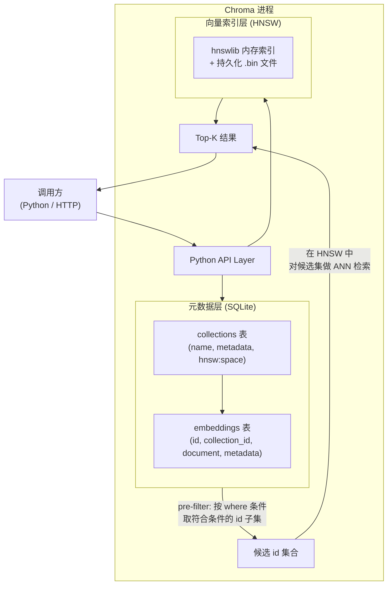

Chroma 是一款开源、嵌入式向量数据库（vector database），专为大语言模型（LLM）应用设计，能在本机零配置运行，同时提供平滑的服务化升级路径。理解它的存储架构、客户端模式与检索机制，是构建高质量 RAG（检索增强生成，Retrieval-Augmented Generation）系统的关键基础。

## 核心数据模型

Chroma 的数据模型围绕四个核心概念展开，理解它们的边界直接决定索引设计质量。

| 概念 | 类比 | 说明 |
|---|---|---|
| **Collection（集合）** | 关系型数据库的"表" | 向量空间的逻辑隔离单元，同一 Collection 内的文档共享同一距离空间 |
| **Document（文档）** | 行中的文本列 | 原始文本内容，Chroma 可调用内置或自定义嵌入函数将其转为向量 |
| **Embedding（嵌入向量）** | 行中的浮点数组列 | 文档的稠密向量表示，可由 Chroma 自动生成，也可由调用方传入 |
| **Metadata（元数据）** | 行中的其他结构化列 | 与文档绑定的键值对，用于精确过滤，不参与向量相似度计算 |

每条记录由唯一的 `id` 标识，`document`、`embedding`、`metadata` 均可选，但至少需要其中之一。`id` 一旦写入即代表该条记录的身份，增量更新和去重逻辑都依赖它。

## 存储架构

Chroma 在单机部署时由两层存储共同承载数据，两层各司其职、协同工作。



**SQLite** 负责持久化 Collection 配置、文档原文和元数据，是元数据过滤的执行引擎。**HNSW（层级可导航小世界，Hierarchical Navigable Small World）** 是向量索引的核心算法，检索复杂度近似 O(log n)，属于近似最近邻（ANN，Approximate Nearest Neighbor）算法，以少量精度损失换取极快速度。两层存储通过内部 `id` 关联，查询时先由 SQLite 过滤元数据，再把候选 `id` 集合交给 HNSW 做向量检索。

## 三种客户端模式

Chroma 提供三种运行模式，可以按开发阶段递进切换，不需要改变业务逻辑代码。

### 临时内存模式（Ephemeral）

```python
import chromadb

client = chromadb.EphemeralClient()
# 或旧写法：chromadb.Client()
```

进程结束后数据全部消失，适合单测、CI 流水线、Notebook 快速验证。优点是零 I/O 开销，缺点是不可持久化。

### 本地持久化模式（Persistent）

```python
import chromadb

client = chromadb.PersistentClient(path="./chroma_data")
```

数据写入指定目录，目录中包含 SQLite 文件（`chroma.sqlite3`）和每个 Collection 的 HNSW 二进制文件（`index.bin`）。重启后数据完整恢复，是本地原型和单机服务的首选模式。`PersistentClient` 仅支持单进程并发写入，多进程场景需升级到 HTTP 模式。

### HTTP 服务模式（HTTP Server）

```python
# 服务端：独立进程启动
# chroma run --path ./chroma_data --port 8000

# 客户端：连接远程实例
import chromadb

client = chromadb.HttpClient(host="localhost", port=8000)
```

Chroma Server 以独立进程或容器运行，多个 Python 进程通过 HTTP REST API 共享同一实例。适合团队共享索引、多副本推理服务或需要从 Jupyter Notebook 访问远程数据的场景。API 与前两种模式完全一致，切换只需替换 `client` 初始化行。

## `hnsw:space` 参数：重要性与不可变性

创建 Collection 时，`hnsw:space` 参数决定向量检索使用的距离函数，**一旦 Collection 创建后不可修改**。

```python
# 正确：建库前明确指定距离函数
collection = client.get_or_create_collection(
    name="semantic_docs",
    metadata={"hnsw:space": "cosine"},  # 可选：cosine / l2 / ip
)
```

| 距离函数 | 说明 | 适用场景 |
|---|---|---|
| `cosine`（余弦距离） | 衡量向量方向相似性，忽略模长 | 语义检索、文本嵌入（最常用） |
| `l2`（欧氏距离） | 衡量向量空间中的绝对距离，默认值 | 需要感知向量模长时 |
| `ip`（内积） | 等价于 cosine + 模长归一化 | 向量已做归一化处理时 |

**若建库时未指定，默认为 `l2`，而大多数预训练文本嵌入模型（如 OpenAI `text-embedding-*`、`BAAI/bge-*`）的官方推荐相似度均为余弦相似度。** 用错距离函数会导致检索结果在语义上完全不可信，且无法通过调参修复——唯一的解决方法是删除 Collection 并重建。建库前务必查阅所用嵌入模型的文档，确认其推荐的相似度度量方式。

## 增删查改 API

### 写入文档

```python
collection.add(
    ids=["doc_001", "doc_002", "doc_003"],
    documents=[
        "Chroma 是轻量级向量数据库",
        "LangChain 是 LLM 应用开发框架",
        "RAG 将检索与生成结合",
    ],
    metadatas=[
        {"source": "intro", "lang": "zh", "page": 1},
        {"source": "intro", "lang": "zh", "page": 2},
        {"source": "concept", "lang": "zh", "page": 1},
    ],
)
```

`add` 对已存在的 `id` 会抛出异常。幂等写入（如增量同步）必须用 `upsert`：

```python
collection.upsert(
    ids=["doc_001"],
    documents=["Chroma 是开源轻量级向量数据库"],
    metadatas=[{"source": "intro_v2", "lang": "zh", "page": 1}],
)
```

### 向量相似度查询

```python
results = collection.query(
    query_texts=["什么是向量数据库"],
    n_results=3,
    where={"lang": "zh"},
    include=["documents", "distances", "metadatas"],
)
# results["ids"]       -> [["doc_001", "doc_003", "doc_002"]]
# results["documents"] -> [[...]]
# results["distances"] -> [[0.12, 0.34, 0.45]]
```

`query` 支持一次传入多个查询文本（batch），返回结果的外层维度为 batch 大小。`distances` 在 `cosine` 模式下为 `1 - cosine_similarity`，越小越相似。

### 精确查找与删除

```python
# 按 id 精确读取（不做向量检索）
items = collection.get(ids=["doc_001"], include=["documents", "metadatas"])

# 按 id 删除
collection.delete(ids=["doc_003"])

# 按元数据条件批量删除（TTL 清理的核心接口）
collection.delete(where={"source": "intro"})
```

## 元数据过滤：运算符与 Pre-filter 机制

### 过滤运算符

`where` 参数的语法参照 MongoDB 查询风格：

```python
# 等值匹配（简写形式，等同于 $eq）
where={"lang": "zh"}

# 不等于
where={"source": {"$ne": "deprecated"}}

# IN 集合
where={"source": {"$in": ["intro", "concept"]}}

# 数值范围（适合 timestamp、page 等数值型字段）
where={"page": {"$gte": 2, "$lte": 10}}

# 逻辑 AND
where={"$and": [{"lang": "zh"}, {"page": {"$gt": 0}}]}

# 逻辑 OR
where={"$or": [{"source": "intro"}, {"source": "concept"}]}
```

完整运算符列表：`$eq`、`$ne`、`$in`、`$nin`、`$gt`、`$gte`、`$lt`、`$lte`、`$and`、`$or`。

### Pre-filter 对召回质量的影响

Chroma 采用 **pre-filter（预过滤）** 策略：先由 SQLite 执行 `where` 条件，得到符合条件的 `id` 候选集，再在候选集上执行 HNSW 向量检索，最终取 Top-K。

```
全量向量空间（N 条）
    ↓ SQLite where 过滤
候选集（M 条，M ≤ N）
    ↓ HNSW ANN 检索，取 Top-K
最终结果（K 条，K ≤ M）
```

**关键风险**：当过滤条件过严导致 `M` 极小（如 M < K），实际返回数会少于 `n_results`，甚至返回空结果——即使全量空间中存在语义相近文档，这是"有数据却检索不到"的常见根因。

**缓解方法**：
- 避免元数据过度细分，确保过滤后候选集有足够规模（建议 M ≥ 10 × K）。
- 宽泛检索场景可改为"先向量检索，再应用层过滤"的 post-filter 策略，代价是需多取结果后手动筛除。

## 内置嵌入函数与自定义嵌入函数

### 内置嵌入函数

不传 `embedding_function` 时，Chroma 默认使用 `all-MiniLM-L6-v2`（通过 `sentence-transformers` 加载）：

```python
# 隐式使用内置模型，适合英文快速实验
collection = client.get_or_create_collection(name="en_docs")
collection.add(ids=["1"], documents=["Hello world"])
```

**注意**：`all-MiniLM-L6-v2` 仅针对英文语料训练，中文场景效果差，不适合生产使用。

### 自定义嵌入函数

实现 `EmbeddingFunction` 接口即可接入任意模型：

```python
from chromadb import EmbeddingFunction, Documents, Embeddings
from openai import OpenAI

class OpenAIEmbeddingFn(EmbeddingFunction):
    def __init__(self, model: str = "text-embedding-3-small"):
        self.client = OpenAI()
        self.model = model

    def __call__(self, input: Documents) -> Embeddings:
        response = self.client.embeddings.create(input=input, model=self.model)
        return [item.embedding for item in response.data]

embed_fn = OpenAIEmbeddingFn()
collection = client.get_or_create_collection(
    name="zh_docs",
    embedding_function=embed_fn,
    metadata={"hnsw:space": "cosine"},
)
# 后续 add / query 时无需手动传 embeddings，Chroma 自动调用 embed_fn
collection.add(ids=["1"], documents=["向量数据库的核心原理"])
```

`embedding_function` 不被持久化，每次实例化 Collection 时必须传入，建议封装为工厂函数统一管理，避免建库与查询使用不同实例导致向量空间不对齐。

## LangChain 集成

### Chroma VectorStore

```python
from langchain_chroma import Chroma
from langchain_openai import OpenAIEmbeddings
from langchain_core.documents import Document

embed = OpenAIEmbeddings(model="text-embedding-3-small")

# 从 LangChain Document 列表构建（自动调用 embed，自动写入）
vectorstore = Chroma.from_documents(
    documents=docs,                    # List[Document]
    embedding=embed,
    persist_directory="./chroma_data",
    collection_name="rag_docs",
    collection_metadata={"hnsw:space": "cosine"},
)

# 连接已有持久化 Collection
vectorstore = Chroma(
    collection_name="rag_docs",
    embedding_function=embed,
    persist_directory="./chroma_data",
)
```

### as_retriever 与 filter 参数

```python
retriever = vectorstore.as_retriever(
    search_type="similarity",          # 或 "mmr"（最大边际相关性）
    search_kwargs={
        "k": 4,
        "filter": {"source": "manual"},  # 内部转换为 Chroma where 语法
    },
)

# 接入 LCEL Chain
from langchain_core.runnables import RunnablePassthrough
from langchain_core.prompts import ChatPromptTemplate
from langchain_openai import ChatOpenAI

prompt = ChatPromptTemplate.from_template(
    "根据以下上下文回答问题：\n{context}\n\n问题：{question}"
)
chain = (
    {"context": retriever, "question": RunnablePassthrough()}
    | prompt
    | ChatOpenAI(model="gpt-4o-mini")
)
answer = chain.invoke("什么是向量数据库？")
```

`langchain_chroma` 是独立包，需单独安装（`pip install langchain-chroma`），不要与旧版 `langchain_community.vectorstores.Chroma` 混用。

## Agent 长期记忆：多 Collection 多租户方案

### 设计模式

对于需要管理多个用户或多个会话记忆的 Agent 系统，推荐以 **Collection 为隔离单元** 的多租户策略：每个会话或用户拥有独立的 Collection，元数据中存储时间戳（`timestamp`）、会话 ID（`session_id`）和重要性评分（`importance_score`），并通过定期按元数据条件删除实现 TTL（生存时间）风格的记忆清理。

```python
import chromadb
import time
import hashlib

client = chromadb.PersistentClient(path="./agent_memory")

def get_session_collection(session_id: str):
    """每个 session 对应一个独立 Collection，天然隔离"""
    return client.get_or_create_collection(
        name=f"session_{session_id}",
        metadata={"hnsw:space": "cosine"},
        embedding_function=embed_fn,
    )

def remember(session_id: str, content: str, importance: float = 0.5):
    """写入一条记忆，附带时间戳和重要性评分"""
    col = get_session_collection(session_id)
    mem_id = hashlib.md5(f"{session_id}{content}{time.time()}".encode()).hexdigest()
    col.add(
        ids=[mem_id],
        documents=[content],
        metadatas=[{
            "session_id": session_id,
            "timestamp": int(time.time()),
            "importance_score": importance,
        }],
    )

def recall(session_id: str, query: str, k: int = 5):
    """检索与当前问题语义最相关的记忆"""
    col = get_session_collection(session_id)
    results = col.query(
        query_texts=[query],
        n_results=k,
        include=["documents", "metadatas", "distances"],
    )
    return results["documents"][0]

def cleanup_old_memories(session_id: str, ttl_seconds: int = 86400):
    """TTL 清理：删除超过指定时间且重要性低的记忆"""
    col = get_session_collection(session_id)
    cutoff = int(time.time()) - ttl_seconds
    col.delete(
        where={
            "$and": [
                {"timestamp": {"$lt": cutoff}},
                {"importance_score": {"$lt": 0.7}},
            ]
        }
    )
```

### 多租户架构要点

- **Collection 命名规范**：使用 `session_{id}` 或 `user_{id}` 前缀，便于枚举和批量清理。
- **importance_score 的作用**：高重要性记忆（用户偏好、关键事实）不参与 TTL 清理，低重要性记忆定期淘汰，控制索引规模。
- **跨 Collection 检索**：迭代各 Collection 分别查询后在应用层合并排序，Chroma 不支持跨 Collection 联合查询。

## 何时继续用 Chroma，何时迁移

| 维度 | 继续用 Chroma | 考虑迁移到专用向量数据库 |
|---|---|---|
| 数据规模 | 单 Collection 百万条以内 | 千万级以上，或需要分片 |
| 部署模式 | 单机 / 单进程 / 本地原型 | 多副本高可用、云原生 |
| 并发写入 | 低频、串行写入 | 高并发实时写入 |
| 权限管理 | 无需多租户权限隔离 | 需要行级权限、RBAC |
| 运维成本接受度 | 可接受自管理存储文件 | 需要托管云服务、备份、监控 |

迁移目标常见选项：**Qdrant**（本地部署友好，适合中大规模自托管）、**Weaviate**（多模态集成强）、**Pinecone**（全托管，运维零负担）、**Milvus**（超大规模分布式）。LangChain 对上述数据库均提供同接口封装，迁移时业务代码改动量极小。

## 常见误区

**误区 1：用错距离函数后尝试调参修复。** `hnsw:space` 创建后不可更改，唯一解法是删除 Collection 重建，建库前务必查阅嵌入模型文档。

**误区 2：`add` 和 `upsert` 混用。** `add` 遇到重复 `id` 抛异常，增量同步管道统一使用 `upsert`。

**误区 3：过滤条件过严导致静默召回失败。** Pre-filter 后候选集为空时 `query` 不报错但返回空列表，先用 `collection.get(where=...)` 验证命中数量。

**误区 4：建库和查询用了不同的嵌入模型实例。** `embedding_function` 不被持久化，每次实例化 Collection 时必须传入相同模型，否则向量空间不对齐，相似度计算失去意义。

**误区 5：内置 `all-MiniLM-L6-v2` 用于中文生产场景。** 该模型中文能力弱，中文 RAG 应换用 `BAAI/bge-small-zh-v1.5` 等专用模型或外部 API 嵌入。

## 最佳实践

- **用内容的稳定哈希作为 `id`**：以文件路径 + chunk 序号等稳定信息生成哈希，同一内容 `upsert` 天然幂等，避免重复条目。
- **metadata 字段前置规划**：写入阶段就把来源、时间戳、文档类型、分块序号写入 metadata，后期过滤依赖这些字段，补录代价极高。
- **批量写入控制批大小**：单次 `upsert` 建议 500～2000 条，避免内存峰值过高或嵌入 API 超时。
- **Collection 级别做逻辑隔离**：不同业务域、用户、语言的文档分入不同 Collection，而非依赖 metadata 区分，避免向量空间污染和 pre-filter 候选集过小。
- **监控 Collection 规模**：定期用 `collection.count()` 监控条目数，配合 TTL 清理保持规模可控。

## 面试常问要点

- **Chroma 底层向量索引用什么算法？** HNSW（层级可导航小世界），检索复杂度近似 O(log n)，属于 ANN 算法，不保证精确召回，以少量精度损失换取极快速度。元数据存储在 SQLite。

- **`hnsw:space` 能否在建库后修改？** 不能。Collection 创建后距离函数固定，切换需删除 Collection 重建，因此建库前必须确认嵌入模型的推荐相似度类型。

- **Chroma 的元数据过滤是 pre-filter 还是 post-filter？** Pre-filter。先由 SQLite 过滤元数据得到候选 `id` 集，再在候选集上执行 HNSW 检索。过滤条件过严时候选集过小会导致 Top-K 结果数量不足，是 RAG 召回率下降的常见隐患。

- **`add` 和 `upsert` 的区别？** `add` 遇到已存在 `id` 抛异常；`upsert` 存在则覆盖、不存在则插入，幂等写入统一用 `upsert`。

- **如何实现多租户 Agent 记忆？** 以 Collection 为隔离单元，metadata 存储 `timestamp`、`session_id`、`importance_score`，通过 `delete(where=...)` 实现 TTL 清理，跨 Collection 检索在应用层合并。

- **什么时候从 Chroma 迁移到专用向量数据库？** 数据量超千万、需要多副本高可用、高并发写入或细粒度权限控制时，应评估 Qdrant、Milvus、Pinecone 等方案。LangChain 封装统一接口，迁移成本较低。
