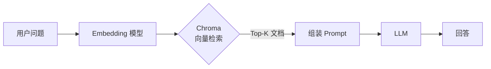

Chroma 是一款开源、轻量的向量数据库，专为 LLM 应用场景设计，能在本机零配置运行。它把向量存储、元数据过滤、相似度检索整合进一个 Python 包，是本地原型开发和小规模 RAG（检索增强生成）的首选起点。

## 核心概念

Chroma 的数据模型只有四个关键元素：

| 概念 | 说明 |
|---|---|
| **Collection** | 类比关系型数据库的"表"，同一个 Collection 内的文档共享同一个向量空间 |
| **Document** | 原始文本内容，Chroma 可自动调用内置 Embedding 函数将其转为向量 |
| **Embedding** | 文档的稠密向量表示，可由 Chroma 自动生成，也可由调用方传入 |
| **Metadata** | 与文档绑定的键值对，用于精确过滤，不参与向量相似度计算 |

每条记录必须有唯一的 `id`，`document`、`embedding`、`metadata` 均可选，但至少需要其中之一。

## 两种运行模式

### 内存模式（Ephemeral）

适合单次脚本、单元测试，进程结束后数据消失：

```python
import chromadb

client = chromadb.Client()  # 纯内存，不写磁盘
```

### 本地持久化模式（Persistent）

数据写入本地磁盘，重启后仍然存在：

```python
import chromadb

client = chromadb.PersistentClient(path="./chroma_data")
```

`path` 指定存储目录，Chroma 会在其中创建 SQLite 文件和向量索引文件。生产环境若需要多进程或远程访问，可改用 `HttpClient` 连接独立部署的 Chroma Server，但本地原型阶段 `PersistentClient` 已足够。

## 增删改查 API 骨架

### 创建 / 获取 Collection

```python
# 不存在则创建，存在则直接返回
collection = client.get_or_create_collection(
    name="my_docs",
    metadata={"hnsw:space": "cosine"},  # 相似度度量：cosine / l2 / ip
)
```

`hnsw:space` 决定向量检索时使用的距离函数，常用 `cosine`（余弦相似度）或 `l2`（欧氏距离）。默认为 `l2`，做语义检索时通常选 `cosine`。

### 写入文档

```python
collection.add(
    ids=["doc_1", "doc_2", "doc_3"],
    documents=[
        "Chroma 是向量数据库",
        "LangChain 是 LLM 应用框架",
        "RAG 将检索与生成结合",
    ],
    metadatas=[
        {"source": "intro", "lang": "zh"},
        {"source": "intro", "lang": "zh"},
        {"source": "concept", "lang": "zh"},
    ],
)
```

未传入 `embeddings` 时，Chroma 使用内置的 `all-MiniLM-L6-v2`（通过 `sentence-transformers`）自动生成向量。如果已有外部 Embedding（如 OpenAI），直接传入 `embeddings` 列表即可跳过内置模型。

### 查询（向量相似度检索）

```python
results = collection.query(
    query_texts=["什么是向量数据库"],
    n_results=2,
    where={"lang": "zh"},           # 元数据精确过滤
    include=["documents", "distances", "metadatas"],
)
```

`results` 是一个字典，包含 `ids`、`documents`、`distances`、`metadatas` 等列表，外层为 batch 维度（支持一次传入多个查询）。

### 更新与删除

```python
# 更新——id 存在则覆盖，不存在则插入（upsert 语义）
collection.upsert(
    ids=["doc_1"],
    documents=["Chroma 是轻量级向量数据库"],
    metadatas=[{"source": "updated"}],
)

# 按 id 删除
collection.delete(ids=["doc_3"])

# 按元数据条件删除
collection.delete(where={"source": "intro"})
```

## 元数据过滤

`where` 参数支持丰富的条件运算符，语法类似 MongoDB 查询：

```python
# 单条件
where={"source": "intro"}

# 多条件 AND
where={"$and": [{"lang": "zh"}, {"source": "intro"}]}

# 范围比较（适合数值型 metadata，如 timestamp、page）
where={"page": {"$gte": 5, "$lte": 10}}

# IN 运算
where={"source": {"$in": ["intro", "concept"]}}
```

元数据过滤先于向量检索执行，可显著缩小候选集，提高召回精度。

## 与 LangChain 集成

LangChain 对 Chroma 有一等支持，封装了 `Chroma` VectorStore 类，可直接作为 Retriever 使用：

```python
from langchain_chroma import Chroma
from langchain_openai import OpenAIEmbeddings

# 从已有文档构建
vectorstore = Chroma.from_documents(
    documents=docs,            # List[Document]
    embedding=OpenAIEmbeddings(),
    persist_directory="./chroma_data",
    collection_name="my_docs",
)

# 转为 Retriever，接入 RAG Chain
retriever = vectorstore.as_retriever(
    search_type="similarity",
    search_kwargs={"k": 4, "filter": {"source": "intro"}},
)
```

`langchain_chroma` 是独立包（从 `langchain_community` 拆出），安装时注意区分。LangChain 的 `filter` 参数内部会转换为 Chroma 的 `where` 语法。

### RAG 流程示意



## 适用场景与局限

**适合：**
- 本地快速原型，零基础设施依赖
- 小规模 RAG（文档量在数万条以内）
- 单机 Jupyter Notebook / 脚本实验

**不适合：**
- 大规模生产（亿级向量需要 Pinecone、Weaviate、Milvus 等）
- 多副本高可用部署
- 需要复杂权限管理或多租户隔离的场景

## 常见误区与最佳实践

**误区 1：内置 Embedding 在生产中被滥用。** `all-MiniLM-L6-v2` 仅适合英文语义，中文场景应换用更合适的模型（如 `BAAI/bge-small-zh`）或调用外部 API，并在建库和查询时保持 Embedding 模型一致。

**误区 2：`add` 和 `upsert` 混用。** `add` 对已存在的 id 会抛出异常，幂等写入必须用 `upsert`。增量同步文档时统一使用 `upsert` 可避免重复写入问题。

**误区 3：忽略 `hnsw:space` 的影响。** Collection 一旦创建，`hnsw:space` 不可更改；切换距离函数需重建 Collection。建库前先确认 Embedding 模型训练时使用的相似度类型。

**最佳实践：**
- 用文档的稳定唯一标识（如文件路径 + chunk 序号的哈希）作为 `id`，方便增量更新。
- 在 `metadata` 中存储来源、时间戳、分块序号等，为后续过滤留余地。
- 大批量写入时分批调用 `upsert`（每批几百到几千条），避免单次内存占用过高。

## 面试常问要点

- **Chroma 底层用什么存储向量？** 向量索引使用 HNSW（Hierarchical Navigable Small World）算法，元数据存储在 SQLite。
- **HNSW 检索的时间复杂度？** 近似 O(log n)，是 ANN（近似最近邻）算法，不保证精确召回，换取速度。
- **向量检索和元数据过滤的执行顺序？** Chroma 先用 `where` 条件过滤候选集，再在过滤结果上做向量检索（post-filtering 策略）；如果过滤条件过严导致候选集极小，召回质量会下降。
- **如何保证 Embedding 一致性？** 建库和查询必须使用完全相同的 Embedding 模型和参数，否则向量空间不对齐，相似度计算无意义。
