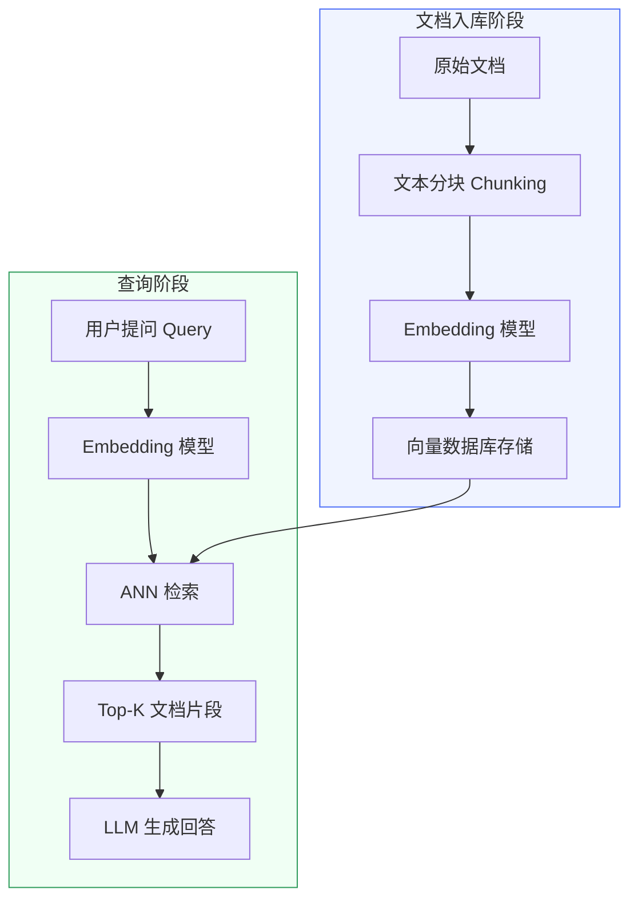

嵌入模型（Embedding Model）是将文本映射为稠密向量的核心组件，RAG（检索增强生成）和语义搜索管道的检索质量几乎完全取决于嵌入模型的选型与配置。理解其工作原理、相似度度量机制以及工程上的权衡，是构建可靠 AI Agent 系统的必备基础。

## 为什么 Embedding 对 RAG 至关重要

在 RAG 系统中，文档在入库时被转换为向量存入向量数据库（Vector Database），用户提问时同样被转换为向量，通过近似最近邻（Approximate Nearest Neighbor，ANN）检索返回最相关的文档片段，再送入语言模型生成回答。整个流程中，嵌入模型决定了"语义近"是否能被准确识别——若嵌入质量差，即使语言模型再强，召回到的文档也是噪声。



嵌入模型在入库和查询两个阶段都参与计算，且必须使用**同一个模型**——不同模型的向量空间不兼容，混用会让相似度计算完全失效。

## 相似度度量

### 三种度量方式对比

两个向量之间的"语义距离"需要用度量函数来量化，常见的有以下三种。

| 度量方式 | 计算本质 | 典型适用场景 | 注意事项 |
|---------|---------|------------|---------|
| 余弦相似度（Cosine Similarity） | 两向量夹角的余弦值，范围 [-1, 1] | 最通用，语义检索默认选择 | 只关注方向，忽略模长 |
| 内积（Dot Product） | 各维度乘积之和，无固定范围 | 向量已归一化时与余弦等价 | 未归一化时受向量模长影响，结果难以解释 |
| 欧氏距离（L2 Distance） | 各维度差的平方和开方 | 低维空间、聚类场景 | 高维空间易受"维度诅咒"影响，语义检索中较少使用 |

### L2 归一化等价技巧

余弦相似度的计算公式为：

```
cos(a, b) = (a · b) / (‖a‖ × ‖b‖)
```

当向量经过 L2 归一化（即令 ‖a‖ = ‖b‖ = 1）后，分母恒为 1，余弦相似度退化为内积。这个性质在工程上非常有用：向量数据库中内积（inner product）索引通常比余弦索引更快，因此只要在写入前对向量做一次归一化，就可以用更高效的内积索引来代替余弦检索。

```python
import numpy as np

def l2_normalize(vec: np.ndarray) -> np.ndarray:
    norm = np.linalg.norm(vec)
    return vec / norm if norm > 0 else vec

# 归一化后，dot product == cosine similarity
vec_a = l2_normalize(np.array([1.2, -0.5, 3.0]))
vec_b = l2_normalize(np.array([0.8, 0.3, 2.5]))

cosine = np.dot(vec_a, vec_b) / (np.linalg.norm(vec_a) * np.linalg.norm(vec_b))
dot    = np.dot(vec_a, vec_b)  # 已归一化，两者相等

print(f"cosine: {cosine:.6f}, dot: {dot:.6f}")  # 输出一致
```

## 向量维度的权衡

维度（Dimension）直接影响语义表达能力、存储开销和检索延迟。

- **低维（128–384）**：存储节省，检索吞吐高，适合资源受限的边缘部署，但语义粒度较粗，细粒度区分能力有限。
- **中维（768–1024）**：BERT 类模型的主流输出规格，综合性价比最优，大多数业务场景的合理起点。
- **高维（1536、3072）**：大模型嵌入的常见规格，理论上语义更细腻，但向量数据库的 HNSW 索引构建时间和内存占用会随维度近线性增长。

维度越高不等于效果越好。模型的训练数据质量、对比学习目标以及与业务任务的匹配程度，才是决定检索质量的根本因素。

## 对称检索与非对称检索

### 核心区别

对称检索（Symmetric Retrieval）指查询文本和候选文本在语言风格与长度上基本一致，例如"相似问题推荐"场景。非对称检索（Asymmetric Retrieval）则是短查询（query）匹配长文档片段（passage），也就是 RAG 的典型场景。

### 指令感知模型（Instruction-Tuned Embedding）

E5 和 BGE 等模型在训练时专门针对非对称检索进行了优化，使用时需要在文本前加特定前缀，以区分 query 和 passage 的编码方式：

```python
from sentence_transformers import SentenceTransformer

model = SentenceTransformer("BAAI/bge-large-zh-v1.5")

# BGE 中文模型：query 加前缀，passage 不加
query    = "为大型语言模型添加检索增强生成的方法"
passages = [
    "RAG 通过检索外部知识库来扩展语言模型的知识边界……",
    "向量数据库存储文档嵌入，支持高效的近似最近邻搜索……",
]

query_prefix = "为这个句子生成表示以用于检索相关文章："
query_vec    = model.encode(query_prefix + query, normalize_embeddings=True)
passage_vecs = model.encode(passages, normalize_embeddings=True)

scores = passage_vecs @ query_vec
for passage, score in zip(passages, scores):
    print(f"score={score:.4f}  {passage[:30]}…")
```

忽略前缀是 RAG 系统中最常见的低级错误之一，会显著降低召回率。E5 系列（`multilingual-e5-large`）则使用 `"query: "` 和 `"passage: "` 作为前缀。

## Tokenization 限制与分块策略

绝大多数嵌入模型基于 Transformer 架构，输入长度受最大 token 数限制（通常为 512 token）。超出部分会被截断，截断后的向量无法准确表达原文语义。

分块（Chunking）策略需要配合模型的 token 上限设计：

- 按段落或句子分块，保留语义完整性，避免在句中硬截断。
- chunk 之间保留一定重叠（overlap），防止跨块的上下文信息丢失。
- 分块前先估算 token 数，可用 `tokenizers` 库快速检测，而不是简单按字符数估算（中文每个字约 1–1.5 token，但专有名词可能更高）。

```python
from transformers import AutoTokenizer

tokenizer = AutoTokenizer.from_pretrained("BAAI/bge-base-zh-v1.5")

def chunk_text(text: str, max_tokens: int = 450, overlap: int = 50) -> list[str]:
    """按 token 数分块，保留重叠窗口。"""
    tokens = tokenizer.encode(text, add_special_tokens=False)
    chunks = []
    start = 0
    while start < len(tokens):
        end = min(start + max_tokens, len(tokens))
        chunk_tokens = tokens[start:end]
        chunks.append(tokenizer.decode(chunk_tokens))
        if end == len(tokens):
            break
        start += max_tokens - overlap
    return chunks
```

## 主流模型与部署方式

### OpenAI text-embedding API

OpenAI 的嵌入 API 无需自行维护模型，通过 HTTPS 调用即可获得向量。第三代模型（`text-embedding-3-*`）支持**维度截断**功能，通过 `dimensions` 参数在不重新训练的前提下压缩输出维度，可在精度与存储成本之间灵活调节。

```python
from openai import OpenAI

client = OpenAI()  # 读取 OPENAI_API_KEY 环境变量

def embed_texts(texts: list[str], model: str = "text-embedding-3-small",
                dimensions: int | None = None) -> list[list[float]]:
    """批量获取 embedding，支持维度截断。"""
    texts = [t.replace("\n", " ") for t in texts]
    kwargs = {"input": texts, "model": model}
    if dimensions:
        kwargs["dimensions"] = dimensions
    response = client.embeddings.create(**kwargs)
    # 按原始顺序返回，API 保证 index 与输入顺序对应
    return [item.embedding for item in sorted(response.data, key=lambda x: x.index)]

vecs = embed_texts(["向量数据库是什么", "RAG 的原理"], dimensions=512)
print(f"维度: {len(vecs[0])}")  # 512
```

### 开源 sentence-transformers

`sentence-transformers` 库封装了编码、归一化和批处理逻辑，是本地部署最常用的入口。

```python
from sentence_transformers import SentenceTransformer
import numpy as np

# 中文首选 BGE 系列；多语言场景用 multilingual-e5-large
model = SentenceTransformer("BAAI/bge-base-zh-v1.5")

corpus = [
    "向量检索利用近似最近邻算法在高维空间中快速定位相似向量",
    "分词器将文本切分为 token，是 NLP 管道的第一步",
    "对比学习通过拉近正样本对、推远负样本对来训练表示模型",
]

# batch_size 根据显存调整；show_progress_bar 便于监控大批量进度
embeddings = model.encode(
    corpus,
    batch_size=64,
    normalize_embeddings=True,
    show_progress_bar=True,
)
print(f"shape: {embeddings.shape}")  # (3, 768)
```

常用开源模型对比：

| 模型 | 适用语言 | 向量维度 | 特点 |
|-----|---------|---------|-----|
| BAAI/bge-large-zh-v1.5 | 中英 | 1024 | 中文语义检索首选，需加 query 前缀 |
| BAAI/bge-m3 | 多语言 | 1024 | 支持稠密/稀疏/多粒度混合检索 |
| multilingual-e5-large | 100+ 语言 | 1024 | 多语言通用，需加 `query:` / `passage:` 前缀 |
| BAAI/bge-small-zh-v1.5 | 中英 | 512 | 轻量快速，资源受限场景 |

### 直接使用 transformers 库

当需要更细粒度地控制推理逻辑（如自定义池化策略）时，可直接调用 `transformers`：

```python
from transformers import AutoTokenizer, AutoModel
import torch
import torch.nn.functional as F

tokenizer = AutoTokenizer.from_pretrained("BAAI/bge-base-zh-v1.5")
model     = AutoModel.from_pretrained("BAAI/bge-base-zh-v1.5")
model.eval()

def encode_batch(texts: list[str], max_length: int = 512) -> torch.Tensor:
    inputs = tokenizer(
        texts,
        padding=True,
        truncation=True,
        max_length=max_length,
        return_tensors="pt",
    )
    with torch.no_grad():
        outputs = model(**inputs)
    # BGE 使用 [CLS] token 的隐藏状态作为句子表示
    cls_vecs = outputs.last_hidden_state[:, 0, :]
    return F.normalize(cls_vecs, p=2, dim=1)

vecs = encode_batch(["语义搜索", "向量检索"])
print(vecs.shape)  # torch.Size([2, 768])
```

### Ollama 本地服务

Ollama 将模型打包为可一键启动的本地 API 服务，适合快速实验和不方便使用 Python 推理环境的场景：

```python
import httpx

def embed_ollama(text: str, model: str = "nomic-embed-text") -> list[float]:
    resp = httpx.post(
        "http://localhost:11434/api/embeddings",
        json={"model": model, "prompt": text},
        timeout=30.0,
    )
    resp.raise_for_status()
    return resp.json()["embedding"]
```

生产环境若需更高吞吐，可换用 vLLM 或 Text Embeddings Inference（TEI）以支持连续批处理。

## 批量编码与吞吐优化

逐条调用嵌入 API 或模型是常见的性能瓶颈。批量（batch）调用能大幅摊薄每条文本的计算开销：

```python
from sentence_transformers import SentenceTransformer
from itertools import islice

def batch_iter(iterable, size: int):
    it = iter(iterable)
    while chunk := list(islice(it, size)):
        yield chunk

model = SentenceTransformer("BAAI/bge-base-zh-v1.5")

all_texts: list[str] = [...]  # 数以万计的文档片段

all_vecs = []
for batch in batch_iter(all_texts, size=256):
    vecs = model.encode(batch, batch_size=256, normalize_embeddings=True)
    all_vecs.extend(vecs.tolist())
```

对于热点文本（如高频 query），可在 Redis 中缓存 `(model_name, text_hash) -> vector`，避免重复计算。

## 对比学习与微调

### 对比学习的直觉

现代嵌入模型几乎都通过对比学习（Contrastive Learning）训练。其核心思想是：给定一个锚点文本（anchor），将语义相近的正样本对（positive pair）的向量拉近，同时将随机抽取或难负样本挖掘得到的负样本（negative）推远。常用的损失函数有 InfoNCE 和 Triplet Loss。

这种训练方式的优势在于不需要人工标注类别标签，只需构造（anchor, positive, negative）三元组——搜索日志中的点击数据、问答对、平行翻译语料都可以作为天然的正样本来源。

### 何时触发微调

通用嵌入模型在以下场景往往表现欠佳，此时应考虑在领域数据上微调：

- **领域专有词汇密集**：金融、法律、医疗等行业存在大量通用模型训练语料中低频出现的术语和缩写。
- **检索任务形态特殊**：例如代码搜索（自然语言查询匹配代码片段）、结构化查询（SQL 关键字 + 自然语言混合）。
- **语言风格差异大**：目标文档以古汉语、学术论文或内部术语体系为主。
- **离线评估召回率明显低于预期**：recall@10 低于业务基线，且更换更大通用模型无法改善。

## 嵌入质量评估

### Recall@K

最直接的离线评估指标是 recall@K：给定一批查询，每条查询有一个或多个已知的相关文档，计算 Top-K 检索结果中包含相关文档的比例。

```python
def recall_at_k(query_vecs, doc_vecs, relevant_doc_ids: list[list[int]], k: int = 10) -> float:
    """
    query_vecs:       shape (Q, D)，已归一化
    doc_vecs:         shape (N, D)，已归一化
    relevant_doc_ids: 每条 query 对应的相关文档 id 列表
    """
    import numpy as np

    scores = query_vecs @ doc_vecs.T  # (Q, N)
    hits = 0
    for i, rel_ids in enumerate(relevant_doc_ids):
        top_k_ids = np.argsort(scores[i])[::-1][:k].tolist()
        if any(rid in top_k_ids for rid in rel_ids):
            hits += 1
    return hits / len(relevant_doc_ids)
```

### 在自己的数据上评估

公开榜单（如 MTEB）的结论未必适用于你的业务数据。更可靠的做法是：

1. 从现有文档库中随机抽样若干片段作为候选集。
2. 人工（或用 LLM）为每个片段生成 2–3 条对应的查询。
3. 将这些（查询, 正样本文档 id）对作为评估集，计算候选模型的 recall@K。
4. 同时计算 MRR（Mean Reciprocal Rank）以衡量相关文档的排名质量。

这个评估集同时可以作为微调数据集的基础。

## 常见误区

**误区一：维度越高效果越好。** 维度是模型架构的固有属性，不能独立决定质量。训练数据质量和对比学习目标对效果的影响远大于维度本身，盲目追求高维度只会增加存储和索引开销。

**误区二：不同模型生成的向量可以混用。** 每个模型定义了一套独立的向量空间，不同空间之间没有可比性。若中途更换模型，必须对所有历史文档重新生成向量并重建索引。

**误区三：query 和 passage 可以对称编码。** 在 BGE、E5 等指令感知模型中，query 和 passage 使用不同的编码路径（通过前缀区分），混用会导致向量空间语义不对齐，召回率大幅下降。

**误区四：公开排行榜分数直接等于业务效果。** 公开评测集的领域分布与自身业务往往存在偏差。排行榜只能作为初始筛选依据，最终决策必须基于在自己数据上的离线评估结果。

## 最佳实践

- 选型时先在目标数据上运行 recall@K 离线评估，而不是直接以排行榜为准。
- 入库前对所有向量做 L2 归一化，统一使用内积检索，减少向量数据库配置复杂度。
- 分块策略要与模型的 token 上限匹配，保留语义完整性并设置合理的 overlap（10–15% 的 chunk 长度）。
- 批量入库时使用 `batch_encode`，batch_size 设为显存允许的最大值，避免逐条调用浪费吞吐。
- 对高频 query 建立缓存层，相同文本（以模型名 + 文本哈希为键）不重复计算。
- 模型确定后，向量数据库的 HNSW 参数（`M`、`ef_construction`）需要结合向量维度和数据规模重新调优。
- 领域专属场景（金融、法律、医疗、代码）若通用模型召回率不达标，优先考虑用对比学习在领域数据上微调，而不是无限堆叠更大的通用模型。

## 面试常问要点

- **为什么语义检索首选余弦相似度而不是欧氏距离？** 语义信息主要编码在向量方向上，而非模长。余弦相似度只关注两向量的夹角，不受模长影响，在高维空间下比欧氏距离更鲁棒。

- **L2 归一化后余弦等价于内积，这有什么工程意义？** 可以在向量数据库中使用更高效的内积（HNSW inner product）索引，同时避免每次查询时做除法运算，降低检索延迟。

- **token 上限超出怎么处理？** 按段落或句子分块，设置适当重叠窗口，保证每块不超过模型最大 token 数（留出 [CLS]/[SEP] 等特殊 token 的空间）；若业务必须处理超长文本，可换用支持更长上下文的嵌入模型（如 BGE-M3）。

- **如何判断是否需要微调嵌入模型？** 在自己的数据上运行 recall@K 评估，若结果显著低于业务目标，且通过换用更大通用模型无法改善，就应考虑用领域内的（query, positive, negative）三元组数据进行对比学习微调。

- **非对称检索中 query 和 passage 为什么需要不同编码？** 两者在语言风格和长度上差异显著，模型需要学习如何将"简短提问"的语义与"详细文档片段"的语义对齐。指令感知模型通过不同前缀触发不同的编码模式，使得两类文本最终落入相同的语义子空间，从而提升检索精度。

- **嵌入模型更换后需要做哪些工作？** 必须对所有已入库文档重新生成向量（旧向量与新模型不兼容），重建向量索引，并重新调整相似度阈值和 HNSW 参数。这是更换模型成本极高的根本原因，选型阶段应充分评估。
