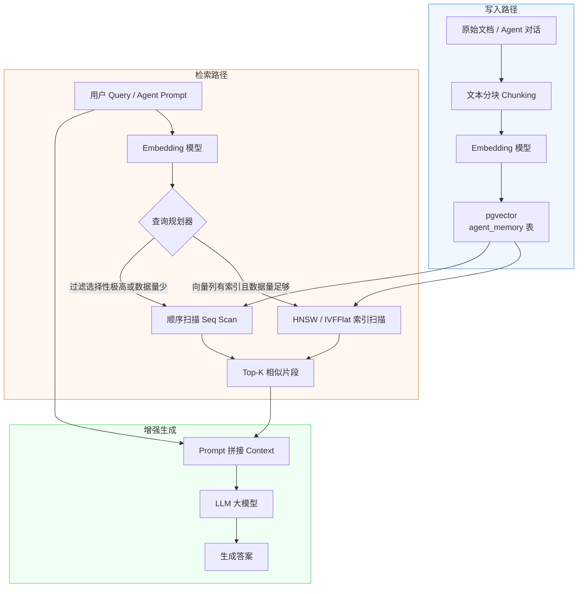

pgvector 向量存储与检索需要把“机制是什么”“边界在哪里”“怎样验证”放在同一条学习路径中。本文以 [pgvector official documentation](https://github.com/pgvector/pgvector) 对“vector 类型、距离操作符、exact/HNSW/IVFFlat 索引与过滤”的说明为事实边界，并用 [PostgreSQL index types](https://www.postgresql.org/docs/current/indexes-types.html) 校准“B-tree、Hash、GiST、SP-GiST、GIN、BRIN 的索引能力与边界”。文中的代码和工程方案用于解释这些机制；涉及具体版本、默认值或部署行为时，应再回到所链接的一手资料确认。


*图：pgvector 向量存储与检索的核心组件、信息流与验证边界。*

---

pgvector 是 PostgreSQL 的开源向量扩展（vector extension），让已有的关系型数据库原生支持高维向量的存储、索引与相似度检索，是 AI/Agent 工程师在现有 PostgreSQL 基础设施上构建检索增强生成（RAG，Retrieval-Augmented Generation）系统的最低成本路径之一。

## 安装与启用

### 系统层安装

pgvector 的安装方式取决于宿主机环境。生产环境推荐使用包管理器，CI/CD 或自定义编译版本时使用源码编译。

```sql
-- 方式一：包管理器（Ubuntu/Debian，以 PostgreSQL 15 为例）
-- 先在 Shell 执行：
-- sudo apt install postgresql-15-pgvector

-- 方式二：从源码编译（需要 pg_config 在 PATH 中）
-- git clone https://github.com/pgvector/pgvector.git
-- cd pgvector && make && sudo make install
```

两种方式都会将共享库和控制文件复制到 PostgreSQL 的扩展目录，之后在目标数据库中执行一次即可激活：

```sql
-- 在需要使用向量功能的数据库中执行
CREATE EXTENSION IF NOT EXISTS vector;
```

`IF NOT EXISTS` 保证脚本幂等，适合放入迁移（migration）脚本。

### 向量列类型与维度约束

pgvector 引入了 `vector(n)` 数据类型，`n` 为向量维度（dimension），最大支持 16000 维。维度在列定义时固定，插入时维度不匹配会直接报错，不会静默截断或补零。

```sql
-- Agent 记忆表：同时存储向量嵌入（embedding）、JSON 元数据与全文检索列
CREATE TABLE agent_memory (
    id            BIGSERIAL PRIMARY KEY,
    session_id    TEXT        NOT NULL,          -- Agent 会话标识
    role          TEXT        NOT NULL CHECK (role IN ('user','assistant','tool')),
    content       TEXT        NOT NULL,          -- 原始文本
    embedding     vector(1536),                  -- 嵌入向量，维度与模型对齐
    metadata      JSONB       NOT NULL DEFAULT '{}'::jsonb,  -- 任意扩展字段
    fts           TSVECTOR GENERATED ALWAYS AS   -- 全文检索列（自动生成）
                    (to_tsvector('chinese', content)) STORED,
    created_at    TIMESTAMPTZ NOT NULL DEFAULT now()
);

-- 为全文检索列单独建 GIN 索引
CREATE INDEX agent_memory_fts_idx ON agent_memory USING gin(fts);
-- 为 JSONB 元数据建索引，支持按任意字段过滤
CREATE INDEX agent_memory_meta_idx ON agent_memory USING gin(metadata);
```

这张表将关系型查询（`session_id`、`role`、时间范围）、向量语义检索与全文关键字检索（FTS，Full-Text Search）集中在同一张表，避免跨库联接（JOIN）的数据一致性风险。

## 距离运算符

pgvector 提供三种内置距离运算符（distance operator），对应三种不同的向量相似度度量方式：

| 运算符 | 距离类型 | 数学定义 | 适用场景 |
|--------|----------|----------|----------|
| `<->` | L2 欧氏距离（Euclidean distance） | $\sqrt{\sum(a_i - b_i)^2}$ | 坐标型向量、图像特征 |
| `<#>` | 负内积（negative inner product） | $-\sum a_i b_i$ | 向量已归一化时等价余弦 |
| `<=>` | 余弦距离（cosine distance） | $1 - \frac{a \cdot b}{\|a\|\|b\|}$ | 文本嵌入（最常用） |

余弦距离值域为 `[0, 2]`，结果为 0 表示完全相同，为 2 表示完全相反。对于大多数文本嵌入模型（embedding model）输出的已归一化向量，`<=>` 与 `<#>` 的排序结果等价，但语义更直观，推荐 RAG 场景默认使用 `<=>`。

## 相似度检索 SQL

### 基本向量查询

```sql
-- 找与查询向量余弦距离最近的 5 条记忆
SELECT
    id,
    session_id,
    content,
    embedding <=> '[0.12, 0.34, ...]'::vector AS distance
FROM agent_memory
ORDER BY distance
LIMIT 5;
```

`ORDER BY distance LIMIT k` 是 pgvector 触发近似最近邻（ANN，Approximate Nearest Neighbor）索引的标准模式，不可省略 `ORDER BY`，否则索引无法被激活。

### 带元数据过滤的混合查询

```sql
-- 仅在当前会话的 assistant 消息中做语义检索
SELECT
    id,
    content,
    metadata->>'source' AS source,
    embedding <=> $1 AS distance
FROM agent_memory
WHERE session_id = $2
  AND role = 'assistant'
  AND created_at > now() - interval '7 days'
ORDER BY distance
LIMIT 10;
```

混合查询（hybrid query）将元数据过滤（WHERE 子句）与向量排序结合。关键认知：**过滤条件的选择性（selectivity）决定查询规划器（query planner）的走向**——当 WHERE 条件过滤掉绝大多数行时，规划器可能判断顺序扫描（seq scan）比索引扫描更划算，直接跳过向量索引。这不是 Bug，而是基于代价的优化（CBO，Cost-Based Optimization）的正常行为。

### 用 EXPLAIN ANALYZE 验证索引命中

```sql
EXPLAIN (ANALYZE, BUFFERS, FORMAT TEXT)
SELECT id, content, embedding <=> $1 AS distance
FROM agent_memory
WHERE session_id = 'sess-001'
ORDER BY distance
LIMIT 10;
```

观察输出中是否出现 `Index Scan using ... on agent_memory`。若显示 `Seq Scan`，可通过以下方式干预：

```sql
-- 强制规划器偏向索引扫描（调试用，生产需谨慎）
SET enable_seqscan = off;

-- 或调低随机页面代价，令索引扫描在规划器眼中更便宜
SET random_page_cost = 1.1;  -- SSD 推荐值（默认 4.0）
```

更根本的解法是为过滤列（`session_id`、`role`）建立普通 B-Tree 索引，让规划器能准确估计过滤后的基数（cardinality），从而做出更好的决策。

## 索引

### IVFFlat 索引

IVFFlat（Inverted File with Flat compression，倒排文件平坦压缩）的核心思想是将向量空间划分为 `lists` 个簇（cluster），查询时只扫描最近的 `probes` 个簇，以牺牲少量召回率换取大幅提速。

```sql
-- 创建 IVFFlat 索引
-- lists 建议值：sqrt(行数)，如 100 万行取 1000
CREATE INDEX agent_memory_ivf_idx
    ON agent_memory
    USING ivfflat (embedding vector_cosine_ops)
    WITH (lists = 100);

-- 会话级别设置扫描的簇数（默认 1，召回率极低）
SET ivfflat.probes = 10;
```

**重要约束**：IVFFlat 在 `CREATE INDEX` 时对现有数据做 k-means 聚类。若表中数据量不足（官方建议行数 > `lists × 40`），聚类质量差，索引等同于无效。正确的流程是**先批量导入数据，再建索引**。增量插入后若数据量变化显著，需执行 `REINDEX` 重建。

| 参数 | 含义 | 调优方向 |
|------|------|----------|
| `lists` | 聚类数量 | 越大构建越慢，但每簇越精细；建议 `sqrt(N)` 到 `N/40` |
| `probes` | 查询时扫描的簇数 | 越大召回率越高，延迟越大；推荐从 10 开始按召回率测试 |

### HNSW 索引

HNSW（Hierarchical Navigable Small World，分层可导航小世界）构建多层跳表式图结构（graph），查询时从顶层出发贪心地向目标向量靠近，查询速度和召回率均优于 IVFFlat，但内存占用和构建时间更大。

```sql
-- 创建 HNSW 索引
-- m=16, ef_construction=64 是常见起点
CREATE INDEX agent_memory_hnsw_idx
    ON agent_memory
    USING hnsw (embedding vector_cosine_ops)
    WITH (m = 16, ef_construction = 64);

-- 查询时候选列表大小（默认 40）
SET hnsw.ef_search = 100;
```

| 参数 | 含义 | 调优方向 |
|------|------|----------|
| `m` | 每个节点的最大双向连接数 | 越大图质量越高，内存越大；建议 8–64 |
| `ef_construction` | 构建时候选列表大小 | 越大索引质量越高，构建越慢；建议 64–200 |
| `hnsw.ef_search` | 查询时候选列表大小 | 越大召回率越高，延迟越大；需在速度与召回间权衡 |

HNSW 支持增量插入（每次 INSERT 自动更新图结构），无需像 IVFFlat 那样重建，适合持续写入的 Agent 记忆场景。

### IVFFlat vs HNSW 对比

| 维度 | IVFFlat | HNSW |
|------|---------|------|
| 构建速度 | 快（k-means 一次性） | 慢（逐节点建图） |
| 查询速度 | 中（依赖 probes） | 快 |
| 内存占用 | 小 | 大（图结构本身） |
| 召回率 | 中（probes 调高可接近 HNSW） | 高 |
| 增量插入 | 需重建 | 原生支持 |
| 适用场景 | 离线批量、资源受限 | 在线写入、低延迟优先 |

## RAG 数据流架构

以下 Mermaid 图展示了向量数据从文档入库到 LLM 生成答案的完整流转路径：



## Python 集成示例

### 完整的 RAG Upsert 与检索

```python
import psycopg2
import psycopg2.extras
import numpy as np
from typing import Optional

# psycopg2 原生不认识 numpy array，需要手动适配或注册 pgvector 适配器
# 推荐安装：pip install psycopg2-binary pgvector
from pgvector.psycopg2 import register_vector

def get_connection(dsn: str) -> psycopg2.extensions.connection:
    conn = psycopg2.connect(dsn)
    register_vector(conn)  # 注册后可直接传 numpy array，无需 .tolist()
    return conn


def upsert_memory(
    conn: psycopg2.extensions.connection,
    session_id: str,
    role: str,
    content: str,
    embedding: np.ndarray,
    metadata: Optional[dict] = None,
) -> int:
    """插入或更新 Agent 记忆，返回记录 ID。"""
    metadata = metadata or {}
    with conn.cursor() as cur:
        cur.execute(
            """
            INSERT INTO agent_memory (session_id, role, content, embedding, metadata)
            VALUES (%s, %s, %s, %s, %s)
            ON CONFLICT (id) DO UPDATE
                SET content   = EXCLUDED.content,
                    embedding = EXCLUDED.embedding,
                    metadata  = EXCLUDED.metadata
            RETURNING id
            """,
            (session_id, role, content, embedding, psycopg2.extras.Json(metadata)),
        )
        row = cur.fetchone()
    conn.commit()
    return row[0]


def search_memory(
    conn: psycopg2.extensions.connection,
    query_embedding: np.ndarray,
    session_id: str,
    top_k: int = 5,
    ef_search: int = 100,
) -> list[dict]:
    """在指定会话内按余弦相似度检索最相关的 K 条记忆。"""
    with conn.cursor() as cur:
        # 会话级别调整 HNSW 候选列表大小以提升召回率
        cur.execute("SET hnsw.ef_search = %s", (ef_search,))
        cur.execute(
            """
            SELECT
                id,
                role,
                content,
                metadata,
                embedding <=> %s AS distance
            FROM agent_memory
            WHERE session_id = %s
            ORDER BY distance
            LIMIT %s
            """,
            (query_embedding, session_id, top_k),
        )
        rows = cur.fetchall()
    return [
        {
            "id": r[0],
            "role": r[1],
            "content": r[2],
            "metadata": r[3],
            "distance": float(r[4]),
        }
        for r in rows
    ]


def hybrid_search(
    conn: psycopg2.extensions.connection,
    query_embedding: np.ndarray,
    query_text: str,
    session_id: str,
    top_k: int = 5,
) -> list[dict]:
    """结合向量语义检索与全文关键字检索（RRF 融合排序）。"""
    with conn.cursor() as cur:
        cur.execute(
            """
            WITH vector_ranked AS (
                SELECT id, content,
                       ROW_NUMBER() OVER (ORDER BY embedding <=> %s) AS v_rank
                FROM agent_memory
                WHERE session_id = %s
                LIMIT 50
            ),
            fts_ranked AS (
                SELECT id, content,
                       ROW_NUMBER() OVER (ORDER BY ts_rank(fts, query) DESC) AS f_rank
                FROM agent_memory,
                     plainto_tsquery('chinese', %s) AS query
                WHERE session_id = %s
                  AND fts @@ query
                LIMIT 50
            )
            SELECT
                COALESCE(v.id, f.id) AS id,
                COALESCE(v.content, f.content) AS content,
                -- RRF（Reciprocal Rank Fusion）融合得分
                COALESCE(1.0 / (60 + v.v_rank), 0) +
                COALESCE(1.0 / (60 + f.f_rank), 0) AS rrf_score
            FROM vector_ranked v
            FULL OUTER JOIN fts_ranked f ON v.id = f.id
            ORDER BY rrf_score DESC
            LIMIT %s
            """,
            (query_embedding, session_id, query_text, session_id, top_k),
        )
        rows = cur.fetchall()
    return [{"id": r[0], "content": r[1], "rrf_score": float(r[2])} for r in rows]
```

`register_vector` 由 `pgvector` Python 包提供，调用后 psycopg2 可直接传递 `numpy.ndarray`，无需手动调用 `.tolist()`，序列化由适配器负责。

## pgvector vs 专用向量数据库

| 决策维度 | pgvector | 专用向量数据库（Pinecone / Qdrant / Weaviate） |
|----------|----------|----------------------------------------------|
| 运维复杂度 | 低（复用已有 PostgreSQL） | 需引入新服务，增加运维面 |
| 关系查询 / 事务 | 原生支持 JOIN、ACID | 不支持，跨库需应用层拼接 |
| 向量规模上限 | 百万量级较稳定，千万级有压力 | 设计目标即亿级 |
| 过滤后向量搜索 | 规划器可能回退 seq scan | 通常有专门的 payload 索引 |
| 索引类型丰富度 | IVFFlat、HNSW | 通常更丰富（含量化压缩等） |
| 与现有数据集成 | 同库 JOIN，零延迟 | 需要额外数据同步管道 |

**决策原则**：向量数量在百万量级以内、团队已有 PostgreSQL 基础设施、需要与关系型数据做 JOIN 时，pgvector 是最务实的选择。向量量级超过千万、对 P99 延迟极度敏感、或者需要多租户隔离与自动扩缩容时，再评估迁移到专用向量数据库的收益。

## 常见误区

**误区一：数据为空时先建索引**
IVFFlat 依赖 k-means 对现有数据聚类，表为空或行数过少时（< `lists × 40`）聚类质量极差，索引形同虚设。正确做法是批量导入数据后一次性建索引。若后续数据量翻倍，应执行 `REINDEX INDEX CONCURRENTLY` 重建。

**误区二：维度越高效果越好**
维度升高会带来"维度诅咒"（curse of dimensionality）：向量间距离趋于均等，最近邻与最远邻的距离差缩小，检索区分度下降，同时存储和计算成本线性增长。应使用嵌入模型推荐的维度，不要随意升维。

**误区三：忽视 `probes` / `ef_search` 调优**
两者默认值（`probes=1`，`ef_search=40`）为性能优先设置，召回率偏低。生产环境应针对业务的召回率目标做离线评估，按需调大，并通过 `SET` 命令在会话或事务级别生效，而非全局修改 `postgresql.conf`。

**误区四：认为混合查询一定走向量索引**
带 `WHERE` 子句的向量查询，当过滤条件选择性极高（过滤后只剩极少行）时，规划器会直接顺序扫描剩余行，向量索引被绕过。这是正确行为，无需干预。若确认应走索引但未走，先用 `EXPLAIN ANALYZE` 确认基数估计是否偏差，再考虑 `SET enable_seqscan = off` 验证。

**误区五：向量列不设 NOT NULL 约束**
`NULL` 向量会导致 `ORDER BY embedding <=> $1` 返回 NULL 行排在末尾，污染 Top-K 结果。嵌入列应加 `NOT NULL` 或在查询中加 `WHERE embedding IS NOT NULL`。

## 最佳实践

1. **表设计阶段**：向量列与元数据列、FTS 列同表存放，用 `JSONB` 承载可变字段，避免未来加列的 `ALTER TABLE` 锁表。
2. **索引策略**：数据规模 < 100 万行且写入频繁时选 HNSW；离线批量场景或内存受限时选 IVFFlat。两种索引都应在数据充足后建立。
3. **混合查询**：为所有常用过滤列（`session_id`、`role`、`created_at`）建 B-Tree 索引，帮助规划器准确估算基数，减少 seq scan 回退。
4. **召回率监控**：定期对生产流量做离线评估（ground truth 比对），以 Recall@K 衡量索引质量，及时调整 `probes` / `ef_search`。
5. **Python 集成**：始终使用 `pgvector` 包的 `register_vector` 而非手动 `.tolist()`，避免精度损失和序列化 Bug。批量写入时使用 `psycopg2.extras.execute_batch` 或 `execute_values` 降低往返次数。
6. **连接池**：向量检索往往是长查询，推荐使用 PgBouncer 的 transaction 模式做连接池，配合应用侧的 `SET hnsw.ef_search` 在每次事务开始时重置参数。

## 面试常问要点

- **pgvector 支持哪三种距离运算符，分别适用于什么场景？**
  `<->` L2 欧氏距离适合坐标型向量；`<#>` 负内积在向量已归一化时等价余弦；`<=>` 余弦距离是文本嵌入场景的标准选择，语义最直观。

- **IVFFlat 和 HNSW 如何选型？**
  IVFFlat 构建快、内存小，适合离线批量、资源受限场景，缺点是增量插入后需重建；HNSW 召回率高、查询快、支持增量插入，适合 Agent 记忆等持续写入场景，代价是内存占用更大。

- **为什么混合查询（带 WHERE 的向量查询）有时不走向量索引？**
  PostgreSQL 查询规划器基于代价估算（CBO）决策：当 WHERE 条件过滤后剩余行数极少时，顺序扫描这些行的代价低于加载索引的代价，规划器会合理地选择 seq scan。应用层无需强制干预，用 `EXPLAIN ANALYZE` 确认行为，若基数估计偏差大则通过 `ANALYZE` 更新统计信息。

- **如何验证向量查询是否命中索引？**
  执行 `EXPLAIN (ANALYZE, BUFFERS) SELECT ...`，查看执行计划中是否出现 `Index Scan using <index_name>` 节点。关注 `actual rows` 与 `estimated rows` 的差距，差距过大说明统计信息过期。

- **Agent 记忆表为什么要把 JSONB、vector、tsvector 放在同一张表？**
  同表存放支持单次 SQL 做向量 + 元数据 + 全文的联合过滤，避免跨库/跨表 JOIN 的额外网络往返与事务一致性问题；JSONB 的动态结构允许 Agent 记忆按业务需求扩展字段而不变更 schema。

- **pgvector 与专用向量数据库如何决策？**
  核心三要素：向量规模（百万以内 pgvector 足够）、是否需要关系查询（需要则强烈倾向 pgvector）、团队运维能力（已有 PostgreSQL 运维经验则无需引入新组件）。不是非此即彼，可先用 pgvector 验证业务价值，规模压力显现后再评估迁移收益。

## 参考资料

- [pgvector official documentation](https://github.com/pgvector/pgvector)
- [PostgreSQL index types](https://www.postgresql.org/docs/current/indexes-types.html)
