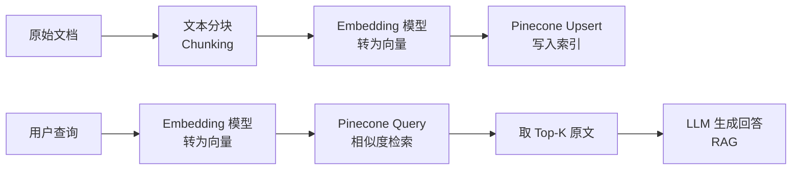

Pinecone 是一个全托管的向量数据库服务，专为大规模高维向量的存储与相似度检索而设计。在 RAG（检索增强生成）、语义搜索、推荐系统等场景中，它能将亿级向量的近似最近邻查询（ANN）延迟控制在毫秒级，让开发者无需自行运维基础设施。

## 核心概念

### Index（索引）

Index 是 Pinecone 中最顶层的存储单元，类似于关系型数据库中的表。创建索引时需要指定两个不可变参数：

- **dimension**：向量维度，必须与 Embedding 模型输出一致（如 `text-embedding-3-small` 输出 1536 维）
- **metric**：相似度计算方式，常用 `cosine`（余弦相似度）、`euclidean`（欧氏距离）、`dotproduct`（点积）

索引一旦创建，维度和度量方式无法修改，选型需在建库前确定。

### Namespace（命名空间）

Namespace 是索引内部的逻辑分区，同一索引下可以建立多个互相隔离的命名空间。典型用途：

- 多租户隔离：每个用户的数据写入独立 namespace
- 环境隔离：`dev` / `staging` / `prod` 用不同 namespace
- 数据分类：知识库文档与用户反馈分开存储

查询时若不指定 namespace，默认在空字符串 namespace 中检索。

### Pod-based vs Serverless

这是 Pinecone 架构上最重要的选择。

| 维度 | Pod-based | Serverless |
|------|-----------|------------|
| 计费方式 | 按 Pod 数量/类型持续计费 | 按读写操作量计费 |
| 冷启动 | 无 | 低流量时可能有延迟波动 |
| 可预测性 | 高，适合流量稳定的生产环境 | 高，适合流量波动大的场景 |
| 扩容方式 | 手动/自动扩 Pod | 自动伸缩，无需干预 |
| 适用场景 | 高吞吐、延迟敏感的 API 服务 | 原型开发、低频查询、初期产品 |

Serverless 是当前推荐的入门选择，Pod-based 适合对 SLA 有严格要求的生产系统。

## 典型操作

### 安装与初始化

```python
from pinecone import Pinecone, ServerlessSpec

pc = Pinecone(api_key="YOUR_API_KEY")
```

### 创建索引

```python
# Serverless 索引（推荐入门）
pc.create_index(
    name="my-knowledge-base",
    dimension=1536,
    metric="cosine",
    spec=ServerlessSpec(cloud="aws", region="us-east-1")
)

index = pc.Index("my-knowledge-base")
```

### Upsert（写入向量）

Upsert 兼具插入和更新语义：ID 已存在则覆盖，不存在则新增。每条记录包含三个字段：

- `id`：字符串，唯一标识符
- `values`：浮点数列表，即向量本体
- `metadata`：可选 dict，用于存储原文、来源等业务字段

```python
vectors = [
    {
        "id": "doc-001",
        "values": [0.12, 0.85, ..., 0.33],  # 1536维
        "metadata": {
            "text": "Pinecone 是向量数据库...",
            "source": "docs",
            "category": "database"
        }
    },
    # ... 更多向量
]

index.upsert(vectors=vectors, namespace="knowledge")
```

批量写入建议每批不超过 100 条，单条向量不超过 40KB。

### Query（向量检索）

```python
# 先用 Embedding 模型将查询文本转为向量
query_vector = embedding_model.encode("如何创建向量索引")

result = index.query(
    vector=query_vector,
    top_k=5,
    namespace="knowledge",
    include_metadata=True
)

for match in result["matches"]:
    print(f"score: {match['score']:.4f} | {match['metadata']['text'][:80]}")
```

`top_k` 指定返回最相似的前 N 条结果，`score` 取值范围因 metric 而异（cosine 在 -1 到 1 之间，越接近 1 越相似）。

### Delete（删除向量）

```python
# 按 ID 删除
index.delete(ids=["doc-001", "doc-002"], namespace="knowledge")

# 删除整个 namespace 下所有向量
index.delete(delete_all=True, namespace="knowledge")
```

## 元数据过滤

元数据过滤是 Pinecone 的重要能力，允许在向量检索的同时施加结构化条件，避免在结果集上做后置过滤的开销。

```python
result = index.query(
    vector=query_vector,
    top_k=10,
    namespace="knowledge",
    filter={
        "category": {"$in": ["database", "vector"]},
        "source": {"$eq": "docs"}
    },
    include_metadata=True
)
```

支持的过滤操作符：`$eq`、`$ne`、`$in`、`$nin`、`$gt`、`$gte`、`$lt`、`$lte`，以及 `$and`、`$or` 逻辑组合。

注意：元数据过滤会先筛选符合条件的候选集，再在其中做 ANN 检索，因此 **过滤条件过严可能导致候选集过小，影响召回质量**，这是常见的使用误区。

## 与 Embedding 模型配合的完整流程



关键原则：**写入时和查询时必须使用同一个 Embedding 模型**。如果索引用 `text-embedding-ada-002` 写入，查询时换用其他模型，向量空间不兼容，检索结果会完全失准。

```python
from openai import OpenAI

client = OpenAI()

def get_embedding(text: str, model: str = "text-embedding-3-small") -> list[float]:
    response = client.embeddings.create(input=text, model=model)
    return response.data[0].embedding

# 写入阶段
chunks = ["文档片段1", "文档片段2", ...]
vectors = [
    {"id": f"chunk-{i}", "values": get_embedding(chunk), "metadata": {"text": chunk}}
    for i, chunk in enumerate(chunks)
]
index.upsert(vectors=vectors, namespace="docs")

# 查询阶段
query_emb = get_embedding("用户的问题")
results = index.query(vector=query_emb, top_k=5, namespace="docs", include_metadata=True)
contexts = [m["metadata"]["text"] for m in results["matches"]]
```

## 最佳实践与常见误区

**最佳实践：**

- **ID 设计要有业务语义**，如 `{doc_id}-{chunk_index}`，便于后续按文档级别批量删除
- **namespace 按租户或数据集划分**，避免不同业务数据互相污染召回结果
- **upsert 做幂等重建**：文档更新时直接 upsert 相同 ID，无需先 delete 再 insert
- **控制 metadata 大小**，只存检索后需要展示或过滤的字段，不要把全文塞进去

**常见误区：**

- 维度写错：用了 3072 维的模型却建了 1536 维的索引，upsert 会报错
- 忘记指定 namespace：查询默认 namespace 为空字符串，数据写入了具名 namespace 却查不到
- top_k 设太小：RAG 场景建议至少取 5-10 条，再由 LLM 综合判断，而不是只取第 1 名
- 混用 metric：cosine 和 dotproduct 在非单位向量上行为不同，要与 Embedding 模型的推荐 metric 对齐

## 面试常问要点

- **ANN 与精确 KNN 的区别**：Pinecone 使用近似最近邻算法（如 HNSW），牺牲少量召回率换取数量级的速度提升
- **为什么不直接用关系型数据库存向量**：高维向量做欧氏距离全表扫描是 O(n×d) 的，千万级数据下秒级延迟无法接受
- **Serverless 冷启动问题**：低频索引第一次查询可能有额外延迟，生产环境可用心跳请求保持活跃
- **索引满了怎么办**：Pod-based 可以扩 Pod；Serverless 无需操心容量，自动伸缩
- **如何处理向量更新**：upsert 即可，Pinecone 会原地覆盖同 ID 的向量和 metadata
