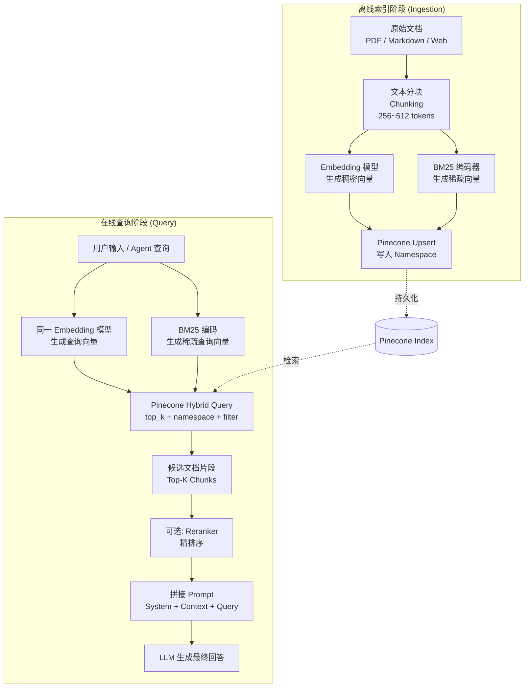

Pinecone 是全托管的向量数据库（Vector Database）服务，专为生产规模的近似最近邻检索（Approximate Nearest Neighbor, ANN）而设计。在构建检索增强生成（Retrieval-Augmented Generation, RAG）或语义搜索（Semantic Search）系统时，它负责将嵌入向量（Embedding）高效持久化并在毫秒级内返回最相关的候选片段。

## 核心概念与不可变约束

### 索引（Index）：维度与度量的不可变性

索引（Index）是 Pinecone 最顶层的存储与检索单元，类比关系型数据库中的表。核心架构约束：**创建时指定的维度（dimension）和相似度度量（metric）在索引生命周期内不可修改**。原因在于底层 ANN 图结构（HNSW）在构建时已将度量函数和空间维度编译进内部表示，后期修改等同于完整重建。建库前须确定：

| 参数 | 常见值 | 说明 |
|------|--------|------|
| `dimension` | 768 / 1536 / 3072 | 必须与 Embedding 模型输出维度完全一致 |
| `metric` | `cosine` | 对非单位向量做归一化后比较方向，与大多数文本 Embedding 模型对齐 |
| `metric` | `dotproduct` | 向量模长影响得分，适合已做 L2 归一化的场景或 Sparse-Dense 混合检索 |
| `metric` | `euclidean` | 欧氏距离，适合图像特征等欧氏空间有实际物理意义的场景 |

一旦发现维度选错，唯一解法是新建索引、重新 upsert 全量数据，代价极高。

### 命名空间（Namespace）：多租户隔离的最小单位

命名空间（Namespace）是索引内部的逻辑分区，同一索引下各命名空间共享底层存储但查询时互不可见，是多租户（Multi-tenant）Agent 知识库的核心隔离机制。

**多命名空间 Agent 知识库设计：**

| 命名空间模式 | 用途 | 示例键名 |
|--------------|------|----------|
| `shared-knowledge` | 全体用户共享的产品文档、FAQ | `shared-knowledge` |
| `user-{uid}` | 用户私有记忆、偏好、历史对话摘要 | `user-u1024` |
| `session-{sid}` | 单次会话的短期上下文缓冲 | `session-s9f3a` |
| `tenant-{tid}` | 企业租户的专属知识库 | `tenant-acmecorp` |

一个索引即可服务数千用户，无需为每人创建独立索引。**查询时不指定 namespace 则默认落入空字符串命名空间**，这是"写入了数据却查不到"最常见的原因。

### 架构选型：Serverless 与 Pod-based

Pinecone 提供两种底层架构，选型影响运维复杂度、弹性与延迟特性：

| 对比维度 | Serverless | Pod-based |
|----------|-----------|-----------|
| 扩容方式 | 自动弹性伸缩，无需干预 | 需手动或通过 API 扩充 Pod 数量 |
| 冷启动 | 低流量时首次查询可能出现延迟抖动 | 无冷启动，延迟稳定可预期 |
| 运维负担 | 极低，无需关注容量规划 | 需要规划 Pod 类型（s1/p1/p2）与副本数 |
| 适用场景 | 原型开发、流量波动大、按需访问的 Agent | 高吞吐、低延迟 SLA 严格的生产 API 服务 |
| 数据规模上限 | 随用量自动扩展 | 受 Pod 规格约束，需提前规划 |

**新项目优先 Serverless**；有严格 P99 延迟或吞吐 SLA 时迁移至 Pod-based。

## 核心 API 详解

### 初始化与索引创建

```python
from pinecone import Pinecone, ServerlessSpec, PodSpec

# 初始化客户端
pc = Pinecone(api_key="YOUR_API_KEY")

# 创建 Serverless 索引
pc.create_index(
    name="rag-knowledge-base",
    dimension=1536,           # text-embedding-3-small 的输出维度
    metric="cosine",
    spec=ServerlessSpec(cloud="aws", region="us-east-1")
)

# 获取索引操作句柄
index = pc.Index("rag-knowledge-base")
```

### Upsert API：向量写入与更新

Upsert 兼具插入（Insert）和更新（Update）语义：ID 存在则覆盖，不存在则新增。每条记录含三个字段：

- `id`：唯一标识符，建议格式 `{doc_id}-chunk-{i}`，便于文档级批量删除
- `values`：浮点列表，长度必须等于索引维度
- `metadata`：可选 dict，存原文、来源、标签等，支持后续过滤

```python
import time
from typing import Iterator

def batch_upsert(
    index,
    vectors: list[dict],
    namespace: str,
    batch_size: int = 100
) -> None:
    """按批次 upsert，每批不超过 100 条、单条不超过 40KB。"""
    for i in range(0, len(vectors), batch_size):
        batch = vectors[i : i + batch_size]
        index.upsert(vectors=batch, namespace=namespace)
        # 生产环境建议加适当退避，避免触发速率限制
        time.sleep(0.05)

# 构造向量列表
vectors = [
    {
        "id": f"doc-42-chunk-{i}",
        "values": get_embedding(chunk),     # 见后文定义
        "metadata": {
            "text": chunk,                  # 保留原文用于 RAG 拼接
            "doc_id": "doc-42",
            "category": "product-manual",
            "language": "zh",
            "created_at": "2025-01-15"
        }
    }
    for i, chunk in enumerate(chunks)
]

batch_upsert(index, vectors, namespace="shared-knowledge")
```

**批量写入建议：** 每批上限 100 条，单条 metadata 不超过 40KB；只存过滤字段与展示字段，不要把全文塞入 metadata。

### Query API：相似度检索

```python
result = index.query(
    vector=query_embedding,     # 查询向量，维度必须与索引一致
    top_k=10,                   # 返回最相似的前 K 条
    namespace="shared-knowledge",
    filter={                    # 可选：元数据过滤条件
        "category": {"$in": ["product-manual", "faq"]},
        "language": {"$eq": "zh"}
    },
    include_metadata=True       # 返回 metadata，RAG 场景必须开启
)

for match in result["matches"]:
    print(f"[{match['score']:.4f}] {match['metadata']['text'][:100]}")
```

`top_k` 建议设 5–10，再由 LLM 综合判断，优于只取第一名。`score` 语义因 metric 而异：cosine 输出 [-1, 1]，越接近 1 越相似；dotproduct 无界；euclidean 越小越相似。

### Delete API：向量删除

```python
# 按 ID 精确删除（适合文档更新时清除旧版本 chunk）
index.delete(ids=["doc-42-chunk-0", "doc-42-chunk-1"], namespace="shared-knowledge")

# 删除某 namespace 下的全部向量（适合用户注销、会话清理）
index.delete(delete_all=True, namespace="session-s9f3a")

# Pod-based 索引支持按 metadata 过滤批量删除（Serverless 暂不支持）
index.delete(
    filter={"doc_id": {"$eq": "doc-42"}},
    namespace="shared-knowledge"
)
```

## 元数据过滤与 ANN 候选集收缩问题

### 过滤操作符

Pinecone 支持 MongoDB 风格的过滤语法，可与向量检索联合使用：

| 操作符 | 含义 | 示例 |
|--------|------|------|
| `$eq` / `$ne` | 等于 / 不等于 | `{"status": {"$eq": "published"}}` |
| `$in` / `$nin` | 集合包含 / 不包含 | `{"tag": {"$in": ["AI", "ML"]}}` |
| `$gt` / `$gte` / `$lt` / `$lte` | 数值比较 | `{"score": {"$gte": 0.8}}` |
| `$and` / `$or` | 逻辑组合 | `{"$and": [{"a": ...}, {"b": ...}]}` |

### 候选集收缩（Candidate Set Shrinkage）问题

元数据过滤的执行机制：**先按条件圈定向量子集，再在子集上做 ANN**。若过滤过严，子集可能只有几十条，ANN 退化为暴力扫描，召回质量骤降。

**Recall@K 衡量方式：**

> Recall@K = |{ANN top-K} ∩ {精确 KNN top-K}| / K

在离线评估集上同时跑 Pinecone 查询与暴力检索（brute-force KNN），统计交集比例。Recall@K 骤降超 20% 时，通常说明该 filter 将候选集压缩过小。

**应对策略：**
- 放宽 filter，在应用层二次精筛
- 高基数字段（如 user_id）放 namespace 而非 filter，命名空间隔离对 ANN 性能影响最小
- 增大 `top_k` 再在应用层截断

## 稀疏-稠密混合检索（Sparse-Dense Hybrid Search）

### 概念与动机

纯向量检索（Dense Search）擅长语义相似性，但对精确词汇（专有名词、产品编号、代码片段）可能失准。稀疏检索（Sparse Search，如 BM25）精确匹配效果好，但无法理解同义词或跨语言语义。混合检索（Hybrid Search）线性融合两路得分：

> score_hybrid = α × score_dense + (1 - α) × score_sparse

α ∈ [0, 1] 控制语义与关键词的权重平衡。

### Pinecone 稀疏向量支持

Pinecone 在 upsert 时支持同时写入 `sparse_values`（词汇权重字典），查询时通过 `sparse_vector` 参数传入稀疏查询向量：

```python
from pinecone_text.sparse import BM25Encoder

# 训练或加载 BM25 编码器
bm25 = BM25Encoder.default()
bm25.fit(corpus_texts)   # 在语料上拟合 IDF 权重

# 写入时同时提供稠密向量和稀疏向量
hybrid_vectors = [
    {
        "id": f"doc-{i}",
        "values": get_embedding(text),          # 稠密向量 (Dense)
        "sparse_values": bm25.encode_documents(text),  # 稀疏向量 (Sparse)
        "metadata": {"text": text}
    }
    for i, text in enumerate(corpus_texts)
]
index.upsert(vectors=hybrid_vectors, namespace="hybrid-ns")

# 查询时同样传入双路向量
query_text = "Pinecone serverless cold start latency"
result = index.query(
    vector=get_embedding(query_text),
    sparse_vector=bm25.encode_queries(query_text),
    top_k=8,
    namespace="hybrid-ns",
    include_metadata=True
)
```

混合检索要求索引 metric 为 `dotproduct`，因稀疏得分本身即为点积形式。

## 完整生产级 RAG 流水线

### 流水线架构图



### 完整 Python 实现

```python
from openai import OpenAI
from pinecone import Pinecone, ServerlessSpec
from pinecone_text.sparse import BM25Encoder
import textwrap

# ── 初始化 ──────────────────────────────────────────────
openai_client = OpenAI(api_key="OPENAI_API_KEY")
pc = Pinecone(api_key="PINECONE_API_KEY")

EMBED_MODEL = "text-embedding-3-small"
EMBED_DIM = 1536
INDEX_NAME = "production-rag"
NAMESPACE = "shared-knowledge"

def get_embedding(text: str) -> list[float]:
    """所有阶段统一使用同一模型和同一参数。"""
    resp = openai_client.embeddings.create(input=text, model=EMBED_MODEL)
    return resp.data[0].embedding

# ── 索引创建（仅首次）───────────────────────────────────
if INDEX_NAME not in [idx.name for idx in pc.list_indexes()]:
    pc.create_index(
        name=INDEX_NAME,
        dimension=EMBED_DIM,
        metric="dotproduct",          # 混合检索必须用 dotproduct
        spec=ServerlessSpec(cloud="aws", region="us-east-1")
    )

index = pc.Index(INDEX_NAME)

# ── 离线索引：Chunk → Embed → Upsert ────────────────────
def simple_chunk(text: str, size: int = 400, overlap: int = 50) -> list[str]:
    words = text.split()
    chunks, i = [], 0
    while i < len(words):
        chunks.append(" ".join(words[i : i + size]))
        i += size - overlap
    return chunks

def ingest_documents(docs: list[dict], bm25: BM25Encoder) -> None:
    """
    docs: [{"id": "doc-1", "text": "...", "category": "..."}]
    """
    all_chunks = []
    for doc in docs:
        for j, chunk in enumerate(simple_chunk(doc["text"])):
            all_chunks.append({
                "chunk_text": chunk,
                "id": f"{doc['id']}-chunk-{j}",
                "doc_id": doc["id"],
                "category": doc.get("category", "general")
            })

    vectors = [
        {
            "id": c["id"],
            "values": get_embedding(c["chunk_text"]),
            "sparse_values": bm25.encode_documents(c["chunk_text"]),
            "metadata": {
                "text": c["chunk_text"],
                "doc_id": c["doc_id"],
                "category": c["category"]
            }
        }
        for c in all_chunks
    ]

    # 分批写入
    batch_size = 100
    for i in range(0, len(vectors), batch_size):
        index.upsert(vectors=vectors[i : i + batch_size], namespace=NAMESPACE)

# ── 在线查询：Query → Embed → Search → LLM ─────────────
def rag_query(
    question: str,
    bm25: BM25Encoder,
    top_k: int = 8,
    filter_expr: dict | None = None
) -> str:
    # 1. 将问题嵌入为向量
    q_dense = get_embedding(question)
    q_sparse = bm25.encode_queries(question)

    # 2. 混合检索 Pinecone
    result = index.query(
        vector=q_dense,
        sparse_vector=q_sparse,
        top_k=top_k,
        namespace=NAMESPACE,
        filter=filter_expr,
        include_metadata=True
    )

    # 3. 组装上下文
    contexts = "\n\n---\n\n".join(
        m["metadata"]["text"] for m in result["matches"]
    )

    # 4. 调用 LLM 生成回答
    prompt = textwrap.dedent(f"""
        你是一个专业助手，请基于以下参考资料回答用户问题。
        如果参考资料不足以回答，请说明。

        [参考资料]
        {contexts}

        [用户问题]
        {question}
    """).strip()

    resp = openai_client.chat.completions.create(
        model="gpt-4o-mini",
        messages=[{"role": "user", "content": prompt}]
    )
    return resp.choices[0].message.content
```

## Embedding 模型一致性的深层要求

Embedding 模型一致性（Embedding Model Consistency）是 RAG 系统中最容易被忽视却影响最严重的隐性约束。

向量数据库存储的是文本在特定模型**高维语义空间（Semantic Space）**中的坐标。不同模型的语义空间完全不兼容——维度、坐标轴含义、向量分布均不同。写入用模型 A、查询用模型 B 时，cosine 相似度计算的是两个不相容空间里的无意义夹角，返回结果本质上随机。

**会发生什么：**

| 不一致场景 | 表现症状 |
|------------|----------|
| 写入用 `text-embedding-ada-002`，查询用 `text-embedding-3-small` | top_k 返回内容与查询语义无关，score 分布异常 |
| 写入时 `input_type=document`，查询时忘记设 `input_type=query` | 某些模型（如 Cohere）区分文档与查询嵌入，混用导致召回率下降 |
| 同一模型版本升级（v1→v2） | 新旧向量共存，新写入数据与旧数据的相似度计算出现偏差 |
| 批处理时部分 batch 用了不同 tokenization 参数 | 极难排查的随机性召回质量下降 |

**工程保障：** 将模型名与维度集中定义为常量，所有调用路径统一引用。

```python
EMBEDDING_CONFIG = {
    "model": "text-embedding-3-small",
    "dimensions": 1536,
}

def get_embedding(text: str) -> list[float]:
    resp = openai_client.embeddings.create(
        input=text,
        model=EMBEDDING_CONFIG["model"],
        dimensions=EMBEDDING_CONFIG["dimensions"]
    )
    return resp.data[0].embedding
```

**模型升级策略：** 新建索引（新维度）→ 后台全量重建 → 双写过渡期 → 流量切换 → 下线旧索引。**同一索引中绝不混入不同模型生成的向量**。

---

## 常见误区

**1. 维度与模型不匹配**
dimension 不可变，建索引前须确认模型输出维度，选错只能新建索引全量重建。

**2. 忘记指定 namespace**
写入 `namespace="user-u1024"` 后查询时未传 namespace，落入空字符串命名空间，永远查不到。封装层应强制要求传入 namespace，禁用默认值。

**3. 过滤条件过严**
filter 先收缩候选集再做 ANN，候选集过小时 Recall@K 显著下降。高基数字段优先用 namespace 隔离，不要全部堆入 filter。

**4. Embedding 模型阶段不一致**
这是 RAG 系统最隐蔽的 bug，症状是"检索结果无关"，难以与代码错误关联。见上文"Embedding 模型一致性"章节。

**5. top_k 设置过小**
仅取 top_1 极不可靠，建议 5–10，由 LLM 综合判断，必要时先 Rerank 再截断。

**6. metric 与模型推荐不一致**
`cosine` 与 `dotproduct` 在已 L2 归一化向量上等价，未归一化时结果完全不同，务必与 Embedding 模型文档推荐保持一致。

---

## 最佳实践

- **ID 携带业务语义**：格式 `{doc_id}-chunk-{i}`，文档更新时按 doc_id 前缀批量定位旧 chunk 删除后再 upsert，避免僵尸向量污染召回。

- **集中管理 Embedding 配置**：模型名、维度、input_type 集中定义，所有调用路径统一引用，从根本上防止模型不一致。

- **namespace 按隔离需求分层**：区分 shared / user-{uid} / session-{sid}；用户注销时 `delete_all=True` 清理对应 namespace，合规成本极低。

- **Metadata 只存过滤与展示字段**：单条上限 40KB，不要塞完整文档或二进制数据。

- **Serverless 冷启动保活**：低频访问时设定时任务定期发空查询，避免冷启动延迟影响体验。

- **定期离线评估 Recall@K**：每次新增 filter 或调整 top_k 后，对比暴力 KNN 结果，防止召回质量静默退化。

- **Upsert 即幂等**：文档更新直接 upsert 同 ID，无需先 delete；只有 chunk 划分策略变化导致 ID 结构改变时才需要先清理旧 ID。

---

## 面试常问要点

- **ANN 与精确 KNN 的区别？** Pinecone 底层用 HNSW 构建分层近邻图，查询时贪心游走，复杂度约 O(log n)，以极小召回损失换取数量级速度提升；精确 KNN 全量计算距离为 O(n×d)，千万级数据下延迟在秒级。

- **为什么不用关系型数据库存向量？** n=1000 万、d=1536 的全表扫描约需 1.5×10¹⁰ 次浮点运算，延迟秒级以上；ANN 索引将其降至毫秒级。

- **Recall@K 怎么测？** 离线评估集同时跑 Pinecone ANN 和暴力 KNN，统计 |ANN_top_K ∩ KNN_top_K| / K，生产系统通常要求 Recall@10 ≥ 0.95。

- **元数据过滤为什么影响召回率？** 过滤先收缩候选集，子集过小时 HNSW 无法充分发挥图游走优势，等效于在非代表性小样本上暴力搜索。

- **Embedding 模型升级怎么处理？** 维度变化须新建索引，维度不变也须全量重建；过渡期双写，重建完成后切流量下线旧索引，绝不混用不同模型向量。

- **namespace 与 metadata filter 如何取舍？** 高基数隔离字段（user_id、tenant_id）放 namespace，查询天然限定分区，不收缩 ANN 候选集；低基数或范围匹配字段（category、date_range）放 filter。

- **Serverless 与 Pod-based 如何选型？** 无明确延迟/吞吐 SLA 优先 Serverless；有严格 P99 要求且流量稳定时选 Pod-based；两者迁移需重建索引，架构不可原地转换。
