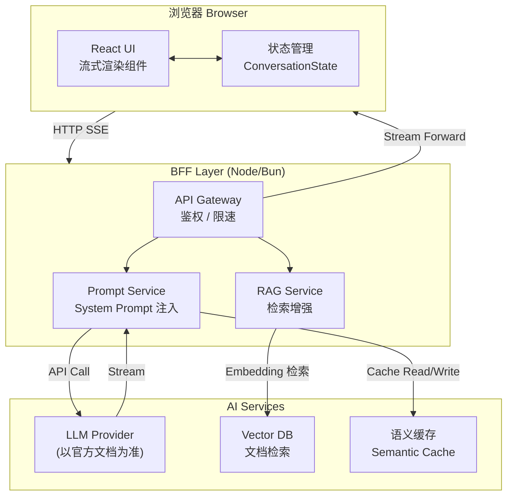

AIGC 时代的前端开发范式正在经历一场深层变革——从确定性的规则驱动 UI，走向由大语言模型（LLM）驱动的智能交互体验。前端工程师不仅要掌握传统的组件化思维，还需要理解流式渲染、对话状态管理、降级容错等全新的技术挑战。

## 范式转变：从规则到智能 (Paradigm Shift: Rule-Based to Intelligence-Based)

传统前端遵循确定性范式：给定输入，必有确定输出。表单校验、按钮状态、路由跳转都基于明确的条件分支。

AIGC 引入了**概率性输出**的概念：同一个 prompt 可能产生不同的内容；响应时长不固定；内容质量存在方差；甚至可能失败或拒绝回答。

这意味着前端需要应对：

- **不确定的响应时间**（首 Token 延迟 First Token Latency 可能长达数秒）
- **流式（Streaming）内容**而非一次性 JSON 响应
- **部分内容可用**时即时渲染的渐进渲染（Progressive Rendering）策略
- **降级（Graceful Degradation）**：AI 功能不可用时，体验不应完全崩溃

```typescript
// 传统确定性 UI 状态
type ButtonState = 'idle' | 'loading' | 'success' | 'error';

// AI 场景新增状态
type AIResponseState =
  | 'idle'
  | 'waiting'        // 等待第一个 token
  | 'streaming'      // 正在接收流
  | 'completed'
  | 'stopped'        // 用户主动中断
  | 'error';
```

## 应用场景全景 (Use Cases Overview)

| 类别 | 场景 | 核心技术 | 前端关注点 |
|------|------|----------|-----------|
| **内容生成** Content Generation | AI 写作助手 | LLM + Streaming | 流式渲染、撤销/重做 |
| | 代码生成 Code Generation | Code LLM | Syntax Highlight、diff 展示 |
| | 图片/资产生成 Image Generation | Diffusion Models | 进度轮询、预览占位 |
| **智能交互** Intelligent Interaction | 对话式 UI Conversational UI | LLM + 历史上下文 | 消息列表虚拟滚动 |
| | 语音 + LLM Voice + LLM | ASR + TTS + LLM | 音频可视化、实时字幕 |
| | 多模态输入 Multimodal Input | Vision LLM | 图片预处理、Base64 上传 |
| **数据分析** Data & Analytics | NL to SQL | Text-to-SQL LLM | SQL 预览、安全校验 |
| | 文档问答 / RAG | Embedding + Vector DB | 引用来源展示 |
| | 自然语言可视化 NL Visualization | LLM + Chart DSL | 动态图表渲染 |
| **开发者工具** Developer Tools | 代码审查助手 Code Review | Diff + LLM | Inline Comment UI |
| | PR 摘要 PR Summary | LLM | Markdown 渲染 |
| | 测试生成 Test Generation | Code LLM | 代码对比视图 |
| **个性化** Personalization | 个性化推荐 | Collaborative Filtering + LLM | 骨架屏、懒加载 |
| | 自适应 UI Adaptive UI | 用户行为 + LLM | 布局动态调整 |
| | 智能搜索 Smart Search | Semantic Search | 搜索建议、高亮 |

### 各类别架构模式简述

**内容生成**：前端通过 BFF（Backend for Frontend）转发 prompt，使用 `ReadableStream` 接收 SSE（Server-Sent Events）流，逐 token 渲染。

**智能交互**：维护 `messages[]` 会话历史，每轮请求携带完整上下文（或经过摘要压缩的历史）。多模态场景中，图片需在客户端压缩后以 Base64 或预签名 URL 方式传递。

**数据分析 / RAG**：后端负责 Retrieval（检索），前端展示检索结果引用卡片（Citation Card），并提供"查看原文"跳转链接。

**开发者工具**：通常以 VS Code Extension 或 Web 面板形式嵌入，前端需处理代码 diff 高亮与 inline comment 定位。

**个性化**：AI 推荐结果与传统推荐结果共存，前端做好 A/B 实验分桶与埋点，支持快速回滚。

---

## BFF 模式：AI 功能的通用网关 (BFF Pattern)

BFF（Backend for Frontend）在 AI 场景中几乎是**必选架构**，原因如下：

1. **密钥安全**：LLM API Key 绝不能暴露在前端；BFF 持有密钥并签发短期 Token。
2. **流量控制**：限速（Rate Limiting）、配额（Quota）管理在服务端集中处理。
3. **Prompt 工程**：System Prompt、Few-shot 样例等敏感信息保留在服务端。
4. **协议转换**：将 LLM 的 SSE 流转换为前端友好的格式，或注入额外元数据（如引用来源）。
5. **降级逻辑**：当 LLM 服务不可用时，BFF 可切换到备用模型或返回缓存结果。

```
┌─────────────┐    HTTP/SSE     ┌──────────────┐    API Call    ┌──────────────┐
│   Browser   │ ◄──────────── ▶ │     BFF      │ ◄────────── ▶ │  LLM Provider│
│  (React UI) │                 │  (Node/Bun)  │                │ (以官方文档   │
└─────────────┘                 └──────┬───────┘                │  为准)        │
                                       │                        └──────────────┘
                                       │ DB / Cache
                                       ▼
                                ┌──────────────┐
                                │  Quota / Log │
                                └──────────────┘
```

### BFF 流式转发示例

```typescript
// BFF: Next.js Route Handler (以官方文档为准)
export async function POST(req: Request) {
  const { messages } = await req.json();

  const stream = await llmClient.chat.completions.create({
    model: 'your-model', // 以官方文档为准
    messages,
    stream: true,
  });

  // 将 LLM stream 转为 Web ReadableStream
  const readableStream = new ReadableStream({
    async start(controller) {
      for await (const chunk of stream) {
        const delta = chunk.choices[0]?.delta?.content ?? '';
        if (delta) {
          controller.enqueue(new TextEncoder().encode(`data: ${JSON.stringify({ delta })}\n\n`));
        }
      }
      controller.enqueue(new TextEncoder().encode('data: [DONE]\n\n'));
      controller.close();
    },
  });

  return new Response(readableStream, {
    headers: {
      'Content-Type': 'text/event-stream',
      'Cache-Control': 'no-cache',
      'X-Accel-Buffering': 'no', // 禁用 Nginx 缓冲
    },
  });
}
```

---

## AI 特性的状态管理 (State Management for AI Features)

AI 功能引入了复杂的异步状态，需要统一建模。

### 会话状态结构

```typescript
interface Message {
  id: string;
  role: 'user' | 'assistant' | 'system';
  content: string;
  status: 'complete' | 'streaming' | 'error';
  citations?: Citation[];
  createdAt: number;
}

interface ConversationState {
  messages: Message[];
  streamingId: string | null;   // 当前正在流式输出的消息 ID
  abortController: AbortController | null;
  error: string | null;
  isWaiting: boolean;           // 等待第一个 token
}
```

### 乐观更新（Optimistic Updates）

用户发送消息后，立即在 UI 中追加用户消息（不等待服务端确认），同时插入一条 `status: 'streaming'` 的 assistant 消息占位：

```typescript
function useChatStore() {
  const [state, setState] = useState<ConversationState>(initialState);

  const sendMessage = useCallback(async (content: string) => {
    const userMsg: Message = {
      id: nanoid(),
      role: 'user',
      content,
      status: 'complete',
      createdAt: Date.now(),
    };
    const assistantMsg: Message = {
      id: nanoid(),
      role: 'assistant',
      content: '',
      status: 'streaming',
      createdAt: Date.now(),
    };

    // 乐观更新：立即渲染双方消息
    setState(prev => ({
      ...prev,
      messages: [...prev.messages, userMsg, assistantMsg],
      streamingId: assistantMsg.id,
      isWaiting: true,
    }));

    const ac = new AbortController();
    setState(prev => ({ ...prev, abortController: ac }));

    try {
      await streamCompletion({
        messages: [...state.messages, userMsg].map(m => ({ role: m.role, content: m.content })),
        signal: ac.signal,
        onDelta: (delta) => {
          setState(prev => ({
            ...prev,
            isWaiting: false,
            messages: prev.messages.map(m =>
              m.id === assistantMsg.id ? { ...m, content: m.content + delta } : m
            ),
          }));
        },
      });

      setState(prev => ({
        ...prev,
        streamingId: null,
        messages: prev.messages.map(m =>
          m.id === assistantMsg.id ? { ...m, status: 'complete' } : m
        ),
      }));
    } catch (err) {
      if ((err as Error).name === 'AbortError') {
        // 保留已生成内容，标记为完成
        setState(prev => ({
          ...prev,
          streamingId: null,
          messages: prev.messages.map(m =>
            m.id === assistantMsg.id ? { ...m, status: 'complete' } : m
          ),
        }));
      } else {
        setState(prev => ({
          ...prev,
          streamingId: null,
          error: (err as Error).message,
          messages: prev.messages.map(m =>
            m.id === assistantMsg.id
              ? { ...m, status: 'error', content: '生成失败，请重试。' }
              : m
          ),
        }));
      }
    }
  }, [state.messages]);

  const stopGenerating = useCallback(() => {
    state.abortController?.abort();
  }, [state.abortController]);

  return { state, sendMessage, stopGenerating };
}
```

---

## AI 场景专属 UX 模式 (UX Patterns for AI)

### 流式文字展示（Typewriter Effect）

流式输出本身已具有"打字机"效果，但原始 token 流可能导致渲染抖动（Layout Thrashing）。推荐以**字符批次**（每 16ms 渲染一批）而非逐 token 更新 DOM：

```typescript
function useBufferedStream(streamingContent: string, isStreaming: boolean) {
  const [displayed, setDisplayed] = useState('');
  const bufferRef = useRef('');

  useEffect(() => {
    bufferRef.current = streamingContent;
  }, [streamingContent]);

  useEffect(() => {
    if (!isStreaming) {
      setDisplayed(streamingContent);
      return;
    }
    const id = setInterval(() => {
      setDisplayed(bufferRef.current);
    }, 16); // ~60fps
    return () => clearInterval(id);
  }, [isStreaming]);

  return displayed;
}
```

### 停止生成（Stop Generating）按钮

必须在 `isWaiting || isStreaming` 状态下可见，点击后：
1. 调用 `AbortController.abort()`
2. 保留已生成的部分内容（不清空消息）
3. 显示"已停止"标记，提供"继续生成"入口

### 重新生成（Regenerate）与编辑

```typescript
const regenerate = (messageId: string) => {
  // 找到该 assistant 消息之前的最后一条 user 消息
  const idx = messages.findIndex(m => m.id === messageId);
  const userMsg = [...messages].slice(0, idx).reverse().find(m => m.role === 'user');
  if (userMsg) {
    // 截断历史并重新发送
    setMessages(messages.slice(0, idx));
    sendMessage(userMsg.content);
  }
};
```

### 引用来源展示（Citation Display）

RAG 场景中，每条 assistant 消息应携带 `citations[]`，UI 上以上标数字 `[1]` 内联，悬浮展示卡片，底部列出完整来源列表。需注意无障碍（Accessibility）：引用链接须有 `aria-label`，屏幕阅读器可读。

### 置信度指示器（Confidence Indicators）

对于结构化输出（如 NL to SQL），可展示模型对结果的置信度。注意：**置信度数值本身也由模型生成，不代表客观准确率**，UI 上应使用"参考"而非"准确率"等措辞。

---

## 架构图 (Architecture Diagram)



---

## 技术实现要点 (Technical Implementation)

### 流式 UI（Streaming UI）

客户端解析 SSE 的核心工具函数：

```typescript
async function streamCompletion(params: {
  messages: { role: string; content: string }[];
  signal: AbortSignal;
  onDelta: (delta: string) => void;
}) {
  const res = await fetch('/api/ai/chat', {
    method: 'POST',
    headers: { 'Content-Type': 'application/json' },
    body: JSON.stringify({ messages: params.messages }),
    signal: params.signal,
  });

  if (!res.ok) throw new Error(`HTTP ${res.status}`);
  if (!res.body) throw new Error('No response body');

  const reader = res.body.getReader();
  const decoder = new TextDecoder();
  let buffer = '';

  while (true) {
    const { value, done } = await reader.read();
    if (done) break;

    buffer += decoder.decode(value, { stream: true });
    const lines = buffer.split('\n');
    buffer = lines.pop() ?? ''; // 保留不完整行

    for (const line of lines) {
      if (line.startsWith('data: ')) {
        const data = line.slice(6).trim();
        if (data === '[DONE]') return;
        try {
          const parsed = JSON.parse(data);
          if (parsed.delta) params.onDelta(parsed.delta);
        } catch {
          // 忽略非 JSON 行
        }
      }
    }
  }
}
```

### 错误状态与降级（Error States & Graceful Degradation）

```typescript
// AI 功能降级策略
const AI_FEATURE_FLAGS = {
  writingAssistant: true,
  codeCompletion: true,
  nlSearch: false, // 当 AI 服务不可用时置为 false
};

function SmartSearchBar() {
  const isAIEnabled = AI_FEATURE_FLAGS.nlSearch;
  return isAIEnabled
    ? <AISearchInput placeholder="用自然语言描述你想找的内容..." />
    : <TraditionalSearchInput placeholder="搜索..." />;
}
```

### 无障碍（Accessibility）

- 流式输出区域应设置 `aria-live="polite"`，避免屏幕阅读器频繁打断
- 停止/重新生成按钮需有清晰的 `aria-label`
- Loading 状态使用 `aria-busy="true"` + 可视化骨架屏（Skeleton），而非仅依赖动画

```tsx
<div
  role="log"
  aria-live="polite"
  aria-label="AI 回复内容"
  aria-busy={isStreaming}
>
  <MarkdownRenderer content={displayedContent} />
</div>
```

---

## 性能考量 (Performance Considerations)

### 首 Token 延迟（First Token Latency, TTFT）

TTFT 是用户感知 AI 功能"快慢"的核心指标，通常比总延迟（Total Latency）更重要。前端优化手段：

- **立即显示 Waiting 状态**（光标闪烁或骨架屏）：用户看到"有动静"后对等待更有耐心
- **乐观 UI（Optimistic UI）**：在等待 AI 回复的同时，先展示用户消息
- **预热请求（Warmup Request）**：在用户很可能触发 AI 功能时（如聚焦输入框），提前发送一个轻量 keep-alive 请求

### 渐进渲染（Progressive Rendering）

流式输出中，Markdown 的 `**bold**`、代码块等语法可能横跨多个 token，导致渲染中间态难看。两种策略：

1. **延迟解析**：积累足够字符后再渲染 Markdown（牺牲部分实时感）
2. **增量解析器**：使用支持流式输入的 Markdown 解析器（以官方文档为准）

### 缓存策略（Caching Strategies）

| 缓存层级 | 适用场景 | 实现方式 |
|----------|----------|----------|
| 语义缓存 Semantic Cache | 相似 prompt 命中缓存 | 向量相似度匹配 |
| 客户端会话缓存 | 同一会话内重复提问 | `sessionStorage` + 消息 Hash |
| CDN / Edge Cache | 静态 prompt 结果（如 FAQ） | Cache-Control + ETag |
| 浏览器 IndexedDB | 离线历史记录 | Dexie.js / 原生 IDB |

---

## 未来趋势 (Future Trends)

### Agentic UI

Agent（智能体）不再只是"问答机器"，而是能够**规划、使用工具、自主执行多步任务**的系统。前端需要展示：

- **任务分解视图**（Tree/Timeline）：用户可观察 Agent 的推理过程
- **工具调用日志**：哪些 API 被调用、入参出参
- **中断与审批（Human-in-the-Loop）**：高风险操作需用户确认后方可继续

### Computer Use / 屏幕理解

LLM 通过截图感知 UI 并模拟操作鼠标键盘，前端需要：

- 截图 / DOM 序列化传输
- 操作回放与审计日志
- 安全沙箱（避免模型操作超出授权范围）

### 多模态（Multimodal）

图文混排输入（上传图片并提问）已成为标配；视频理解、实时音视频流接入 LLM 是下一个前沿。前端挑战在于客户端预处理（压缩、抽帧）以降低上传成本。

---

## 常见误区 (Common Mistakes)

1. **直接在前端调用 LLM API**：暴露 API Key，存在严重安全风险，必须经过 BFF。
2. **忽略 AbortController**：用户离开页面或切换对话时，未取消正在进行的请求，浪费带宽与服务端资源。
3. **流式内容直接 `innerHTML` 注入**：XSS 风险。需使用受信任的 Markdown 渲染器并做 Sanitize（如 DOMPurify）。
4. **不处理部分 JSON**：SSE 数据帧可能在 JSON 边界处被截断，必须使用 `buffer` 累积后再解析。
5. **把所有历史消息都发给 LLM**：随着对话增长，Token 消耗和延迟线性增加。应实现**历史摘要压缩**或**滑动窗口截断**。
6. **Loading 状态只有 `isLoading: boolean`**：AI 场景至少需区分 `waiting`（等待首 token）和 `streaming`（流式输出中）两种状态，对应不同的 UI 反馈。
7. **不做降级**：AI 服务不可用时，功能直接报错而没有回退到规则基 UI，导致整个功能模块不可用。

---

## 最佳实践 (Best Practices)

- **BFF 必选**：所有 LLM 调用经由服务端代理，密钥、限速、日志集中管理。
- **统一 AI 状态机**：定义清晰的状态枚举（`idle / waiting / streaming / completed / stopped / error`），UI 各处基于同一状态渲染，避免不一致。
- **`AbortController` 是一等公民**：每个 AI 请求绑定一个 `AbortController`，组件卸载、用户停止、超时时均调用 `abort()`。
- **流式输出批量更新 DOM**：用 `requestAnimationFrame` 或 `setInterval(16ms)` 节流，而非每个 token 触发一次 React re-render。
- **Markdown 渲染 + Sanitize**：永远不要直接插入模型生成的 HTML，用 DOMPurify + 白名单标签过滤。
- **TTFT 监控**：在埋点中记录"请求发出 → 首 token 到达"的时间差，作为 AI 体验的核心 SLA 指标。
- **引用来源可验证**：RAG 场景中展示原文链接，让用户能够核实信息，增强信任感。
- **Feature Flag 控制 AI 功能**：通过配置开关快速降级，不依赖前端代码热更新。

---

## 面试常问 (Interview Q&A)

**Q1：前端如何实现 AI 流式输出（Streaming）？核心原理是什么？**

A：核心使用 **Server-Sent Events（SSE）** 或 **ReadableStream**。服务端将 LLM 的 token 流以 `data: {...}\n\n` 格式推送，前端通过 `fetch` + `ReadableStream` 的 `getReader()` 循环读取字节块，用 `TextDecoder` 解码后按 `\n` 切分 SSE 行，解析 JSON 中的 `delta` 字段追加到消息内容中。关键细节：需维护一个字符串 `buffer` 处理跨数据帧的不完整行；用 `AbortController` 支持中止；DOM 更新需节流（`requestAnimationFrame`）避免渲染抖动。

**Q2：为什么 AI 功能必须通过 BFF，而不能直接在前端调用 LLM API？**

A：主要三个原因：① **安全**：API Key 若放在前端代码或环境变量中，任何人打开 Network 面板或 JS Bundle 即可提取，造成费用盗刷风险；② **控制**：BFF 可做用户级别的配额（Quota）、限速（Rate Limiting）、内容审核（Content Moderation）；③ **灵活**：System Prompt、Few-shot 示例等 Prompt 工程细节保留在服务端，前端无需感知；同时 BFF 可在不同 LLM Provider 之间切换，前端接口不变。

**Q3：对话型 AI 产品中，会话历史（Conversation History）如何管理？超长对话如何处理？**

A：短期内，将全部 `messages[]` 随每次请求携带。当历史过长（超出模型 Context Window 或成本过高）时，常见策略：① **滑动窗口**：只保留最近 N 轮，丢弃最早的消息（最简单，但会丢失早期上下文）；② **摘要压缩**：定期调用 LLM 将前 K 轮压缩为一段摘要，替换原始消息，追加到 `system` 消息中（保留语义，节省 Token）；③ **RAG 记忆**：将历史消息 Embedding 存入向量库，每轮检索相关历史片段注入（适合超长期记忆）。前端需存储完整历史用于 UI 展示，但发给后端的 `messages` 经过压缩处理。

**Q4：如何评估和监控前端 AI 功能的性能？关键指标有哪些？**

A：核心指标包括：① **TTFT（Time to First Token）**：用户触发请求 → 首个 token 到达前端的时间，直接影响感知响应速度，目标通常 < 1s；② **TPS（Tokens Per Second）**：流式输出的吞吐速度，影响阅读体验；③ **Total Latency**：完整响应时间；④ **Error Rate**：AI 请求失败率（含超时、模型拒绝、网络错误）；⑤ **Stop Rate**：用户主动停止生成的比例，高 Stop Rate 可能意味着首 token 延迟过长或输出质量差；⑥ **Regenerate Rate**：用户点击重新生成的比例，反映输出质量。这些指标需在前端埋点采集，发送到监控平台（以官方文档为准）。

**Q5：AI 生成内容的无障碍（Accessibility）如何保障？**

A：主要考虑：① **`aria-live` 区域**：流式输出容器设置 `aria-live="polite"`，让屏幕阅读器在适当时机播报新增内容（`assertive` 会频繁打断，不推荐）；② **`aria-busy`**：流式进行中设置 `aria-busy="true"`，提示屏幕阅读器内容未完整；③ **操作按钮语义**：停止、重新生成、复制等按钮必须有语义化 `aria-label`，不能只依赖图标；④ **引用链接**：Citation 上标链接需有描述性 `aria-label`（如"查看来源：文章标题"），而非仅显示数字；⑤ **键盘可操作**：所有 AI 交互操作（发送、停止、重试）需支持纯键盘操作，`Tab` 焦点顺序合理。

**Q6：NL to SQL 场景中，前端需要做哪些特殊处理？**

A：① **SQL 预览与高亮**：AI 生成的 SQL 需在执行前展示给用户，使用代码高亮组件增强可读性；② **危险操作警告**：前端可做简单的 SQL 静态分析，检测 `DROP`、`DELETE`、`TRUNCATE` 等危险关键词，执行前弹出二次确认；③ **执行权限控制**：BFF 侧应限制 SQL 的执行范围（只读账户、行数上限）；④ **错误反馈**：SQL 执行失败时，将数据库错误信息回传给 LLM，让其修正 SQL（Multi-turn Correction）；⑤ **结果可视化**：根据查询结果的列结构，智能推断适合的图表类型（表格、柱状图、折线图），由 LLM 或规则引擎生成图表配置。
