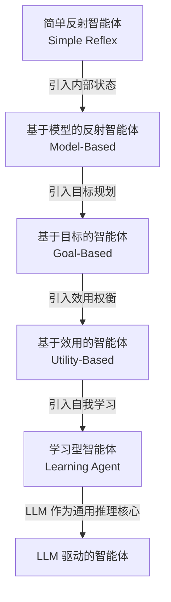
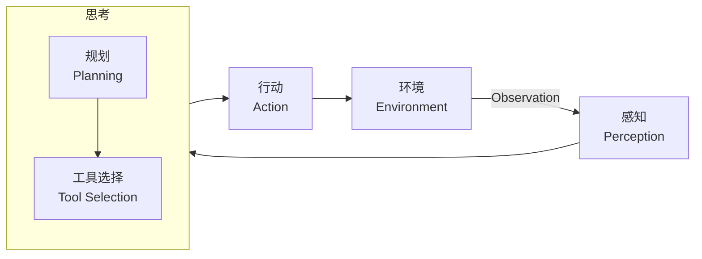
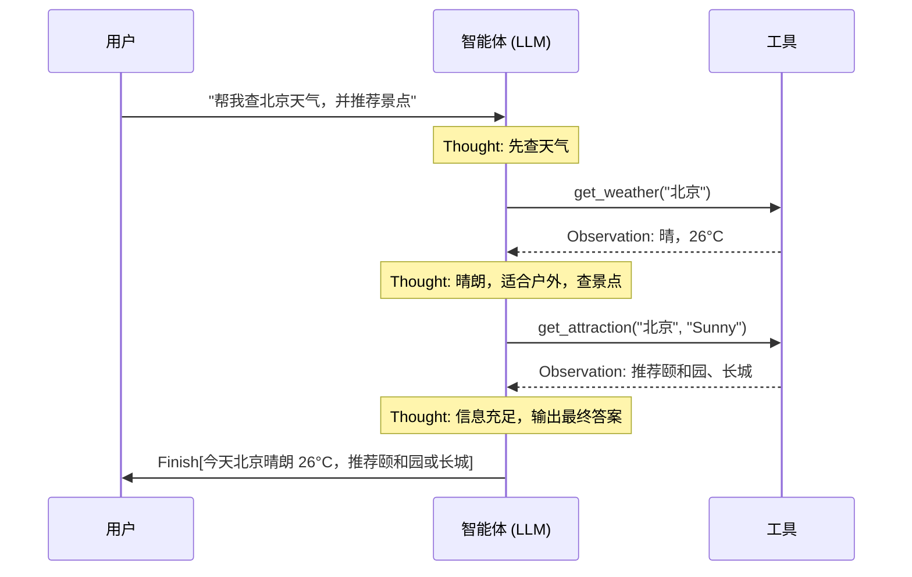

智能体（Agent）是 AI 领域最核心的概念之一——它不只是一段会回答问题的代码，而是一个能够持续感知环境、自主决策、并采取行动来达成目标的实体。理解智能体的本质，是深入 LLM 应用开发的必修课。

---

## 什么是智能体？

教科书对智能体的定义干净利落：**任何能通过传感器（Sensors）感知环境、并通过执行器（Actuators）自主采取行动以达成特定目标的实体，都是智能体。**

这个定义包含四个不可缺少的要素：

| 要素 | 说明 | 举例 |
|------|------|------|
| **环境（Environment）** | 智能体所处的外部世界 | 道路交通、金融市场、用户对话 |
| **传感器（Sensors）** | 感知环境状态的输入通道 | 摄像头、麦克风、API 数据流 |
| **执行器（Actuators）** | 对环境施加影响的输出通道 | 机械臂、代码执行器、HTTP 调用 |
| **自主性（Autonomy）** | 基于感知独立决策而非单纯执行指令 | LLM 推理、规划、工具选择 |

自主性是「智能体」与普通程序的本质区别。一个 `if-else` 脚本不是智能体；一个能根据环境反馈调整行动计划的系统，才是。

---

## 传统智能体的演进路线

在 LLM 出现之前，AI 先驱们已花了数十年构建各种形态的智能体。这条演进路线本身就是一套清晰的分类阶梯：



### 简单反射智能体

决策逻辑完全由「条件-动作」规则构成，不具备记忆和预测能力。自动恒温器是经典例子：温度超过阈值 → 启动制冷。

**优点**：速度快、确定性强。**局限**：遇到规则之外的情况就失灵，无法理解上下文。

### 基于模型的反射智能体

在反射基础上增加了**内部世界模型**，用于追踪无法直接感知的环境状态。自动驾驶车辆在隧道中失去视觉时，仍能靠内部模型估算前方车辆位置，正是这类智能体的体现。内部模型赋予了初级的「记忆」能力。

### 基于目标的智能体

行动不再只是被动响应，而是主动选择能导向目标状态的行动序列。GPS 导航是典型例子——系统会通过搜索算法（如 A\*）规划出到达目的地的最优路径。核心能力在于对未来的**考量与规划**。

### 基于效用的智能体

现实目标往往相互冲突（时间最短 vs 油耗最低 vs 避开拥堵）。效用型智能体通过为每种世界状态赋予**效用值**来做取舍，追求期望效用最大化，让决策更接近人类的理性选择。

### 学习型智能体

上述四类的知识都来自设计者的先验编码。学习型智能体增加了**学习元件**，通过与环境交互的结果（奖励/惩罚）自主修正决策策略——强化学习（Reinforcement Learning）是其最典型的实现路径。AlphaGo Zero 从零对弈自学，发现了超越人类既有认知的棋路，是这一类型的里程碑。

---

## LLM 驱动的新范式

大语言模型的出现不只是「更好的语言模型」，它从根本上改变了构建智能体的方式：

| 维度 | 传统智能体 | LLM 智能体 |
|------|-----------|-----------|
| **核心引擎** | 手工编写的规则/算法 | 预训练神经网络 |
| **知识来源** | 设计者显式编码 | 海量文本数据隐式习得 |
| **交互方式** | 结构化输入 | 自然语言，支持模糊指令 |
| **泛化能力** | 局限于设计边界 | 可处理未预见的场景 |
| **规划方式** | 预设搜索算法 | 涌现的链式推理（Chain-of-Thought）|

以智能旅行助手为例，当用户说「帮我规划一次厦门之旅」，LLM 智能体会自动：

1. **分解目标**：确认偏好 → 查询信息 → 制定草案 → 预订行程
2. **调用工具**：主动调用天气 API、预订接口等
3. **动态修正**：当用户说「这家酒店超出预算」时，重新搜索并调整方案

从「写代码定义每步逻辑」到「引导通用大脑规划行动」，这是 LLM 时代智能体开发的核心范式迁移。

---

## 智能体的三维度分类

理解智能体类型有三个互补的视角：

### 维度一：决策架构复杂度

即上文的演进路线（反射 → 模型 → 目标 → 效用 → 学习），聚焦于智能体内部的推理能力层次。

### 维度二：反应性 vs 规划性

```
反应式 ←———————————————→ 规划式
（即时响应，低延迟）        （深思熟虑，高质量）
安全气囊触发               商业计划制定
高频交易机器人              多步骤旅行规划
```

现代 LLM 智能体以**混合式**为主：在「思考（Reasoning）」阶段进行审议规划，在「行动（Acting）+ 观察（Observing）」阶段快速响应。把宏大任务切成无数「规划-反应」的微循环，兼顾灵活性与远见。

### 维度三：知识表示方式

| 范式 | 类比 | 优势 | 局限 |
|------|------|------|------|
| **符号主义 AI** | 图书管理员（显式规则） | 透明可解释 | 脆弱，无法处理规则外情况 |
| **亚符号主义 AI** | 牙牙学语的孩童（统计模式） | 鲁棒，处理非结构化数据 | 黑箱，难以解释，可能产生幻觉 |
| **神经符号主义 AI** | 系统 1（直觉）+ 系统 2（推理）协同 | 兼具感知与逻辑推理 | 工程复杂度高 |

诺贝尔经济学奖得主卡尼曼在《思考，快与慢》中提出的双系统理论，为理解神经符号主义提供了绝佳类比：系统 1（快速、直觉）对应神经网络的模式识别；系统 2（缓慢、逻辑）对应符号推理。LLM 智能体是这一融合的实践范例——神经网络提供感知与生成能力，Thought/Action 的结构化输出则提供可追溯的符号化推理轨迹。

---

## PEAS 模型：精确描述任务环境

在设计任何智能体之前，推荐用 **PEAS 模型**来规约其任务环境：

- **P（Performance）** — 性能度量：如何评价智能体的好坏？
- **E（Environment）** — 环境：智能体工作在哪里？
- **A（Actuators）** — 执行器：智能体能做什么？
- **S（Sensors）** — 传感器：智能体能感知什么？

以智能旅行助手为例：

| 要素 | 描述 |
|------|------|
| **Performance** | 行程满意度、预订成功率、预算符合度、规划完成时间 |
| **Environment** | 用户对话、实时天气、航班/酒店数据库、地图信息 |
| **Actuators** | 调用搜索 API、发起预订请求、生成行程文本 |
| **Sensors** | 用户文本输入、API 响应数据、环境状态变化通知 |

LLM 智能体的数字环境通常具有以下复杂特性：

- **部分可观察**：调用航班 API 只能看到该接口返回的部分数据，无法获得全量信息
- **随机性**：同一查询在不同时刻可能返回不同的票价和余票数量
- **多智能体环境**：其他用户的行为（如抢购最后一张特价票）会直接改变智能体的环境状态
- **序贯且动态**：当前动作影响未来，环境自身也在持续变化

---

## Agent Loop：智能体的运行心脏

智能体不是一次性的函数调用，它通过持续迭代的 **Agent Loop（智能体循环）**与环境交互：



循环的四个阶段：

1. **感知（Perception）**：通过传感器接收来自环境的观察（Observation），可以是用户指令，也可以是上一步行动的结果反馈
2. **思考（Thought）**：LLM 进行内部推理，包含**规划**（将目标分解为子任务）和**工具选择**（决定调用哪个工具、传什么参数）
3. **行动（Action）**：调用选定的工具与环境交互，改变环境状态
4. **观察（Observation）**：行动结果经感知系统处理，作为新的输入启动下一轮循环

---

## Thought-Action-Observation：核心交互协议

为了让 LLM 清晰地驱动上述循环，现代智能体框架要求 LLM 的输出遵循结构化格式：

```
Thought: 用户想知道北京的天气。我需要先查询天气，再根据天气推荐景点。
Action: get_weather(city="北京")
```

外部**解析器（Parser）**捕获 `Action` 并执行对应函数，函数返回的原始 JSON 经感知系统处理成自然语言：

```
Observation: 北京当前天气为晴，气温 26 摄氏度，微风。
```

这个 `Observation` 作为下一轮的输入，驱动新一轮的 `Thought` 和 `Action`。

完整的两轮循环示意：



这种 Thought-Action-Observation 循环也称 **ReAct** 范式，是 LangChain、LangGraph、AutoGen 等主流框架的共同设计基础。它将 LLM 的内部语言推理能力与外部工具的实际执行能力有效结合——LLM 不直接执行工具，只负责「决定调用什么、传什么参数」。

---

## 常见误区与面试考点

**常见误区：**

- **误区一**：「智能体 = 大模型」。大模型只是智能体的推理核心，完整的智能体还需要感知、记忆、工具、执行器等模块协同
- **误区二**：「智能体越自主越好」。高自主性意味着更高的不可控风险，需根据场景设计合理的人工介入机制
- **误区三**：「Agent Loop 会无限运行」。实际工程必须设置最大循环次数或终止条件，防止死循环

**面试常问：**

- 智能体的四个基本要素是什么？（环境、传感器、执行器、自主性）
- 传统智能体五类的演进逻辑是什么？每类的核心局限是什么？
- LLM 智能体与传统智能体的核心区别在哪里？
- PEAS 模型各字母含义？如何用它描述一个具体任务环境？
- Thought-Action-Observation 循环如何工作？解析器（Parser）在其中扮演什么角色？
- 什么是神经符号主义？LLM 智能体为何是其实践范例？
- Workflow 和 Agent 的本质区别是什么？各适合什么场景？

---

