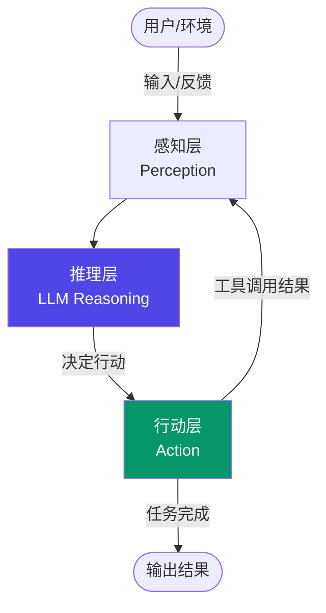
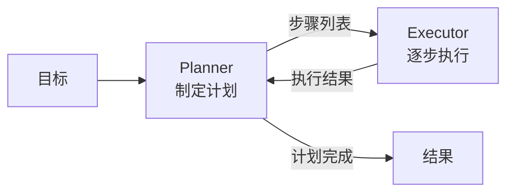

# AI Agent 架构模式总览

AI Agent 是能够自主感知环境、制定决策并采取行动以完成目标的智能系统。与单次 LLM 调用不同，Agent 通过持续的感知-推理-行动循环来解决复杂、多步骤的任务。

## 什么是 AI Agent

Agent 的核心是 **感知-推理-行动（Perception-Reasoning-Action）循环**：

1. **感知（Perception）**：接收用户输入、工具返回结果、环境状态
2. **推理（Reasoning）**：LLM 分析当前状态，决定下一步行动
3. **行动（Action）**：调用工具、访问数据库、生成回复等



## 核心组件

### LLM（大脑）

LLM 是 Agent 的核心推理引擎，负责理解任务、规划步骤、解析工具结果并生成最终答案。模型的能力（指令遵循、工具调用格式、推理能力）直接决定 Agent 的上限。

### Tools（工具）

工具让 Agent 具备与外部世界交互的能力：搜索网络、执行代码、读写文件、调用 API 等。每个工具通常包含：

- **名称与描述**：让 LLM 知道何时使用
- **输入 schema**：定义参数结构（JSON Schema）
- **执行逻辑**：实际运行代码

```ts
interface Tool {
  name: string;
  description: string;
  parameters: Record<string, unknown>; // JSON Schema
  execute: (params: unknown) => Promise<unknown>;
}
```

### Memory（记忆）

记忆系统让 Agent 能够跨轮次保持上下文：

| 类型 | 存储位置 | 特点 |
|------|----------|------|
| 短期记忆 | 上下文窗口 | 有限、临时、即时可用 |
| 长期记忆 | 向量数据库 | 持久、需检索、容量大 |
| 事件记忆 | 外部存储 | 记录历史交互片段 |
| 语义知识库 | 知识图谱/向量库 | 结构化领域知识 |

### Planning（规划）

规划模块负责将复杂目标拆解为可执行步骤。简单 Agent 依赖 LLM 隐式规划，复杂 Agent 有显式的规划阶段（如 Plan-and-Execute 模式）。

## 主流架构模式

### ReAct（Reasoning + Acting）

最常用的架构，LLM 交替输出 Thought（推理）和 Action（行动），通过 Observation（观察工具结果）循环迭代。适合工具调用密集的任务。

### Plan-and-Execute

先由规划器（Planner）生成完整任务计划，再由执行器（Executor）逐步执行。规划和执行解耦，适合任务结构清晰、步骤较长的场景。



### Reflexion

在 ReAct 基础上增加 **反思（Reflection）** 步骤：Agent 执行完成后，对结果进行自我评估，生成反思记忆，在下次尝试时利用这些反思改进策略。适合需要多次尝试才能成功的任务。

### AutoGPT 风格

自主循环运行，通过内部消息队列管理子任务，Agent 可以自我生成新目标。特点是高自主性，但也更难控制，生产环境中较少直接使用。

## 单 Agent vs 多 Agent

| 维度 | 单 Agent | 多 Agent |
|------|----------|----------|
| 复杂度 | 低 | 高 |
| 适用场景 | 单一目标、工具调用链路清晰 | 并行子任务、专家分工 |
| 通信方式 | 无需协调 | 需消息传递/共享状态 |
| 容错性 | 单点故障 | 可隔离错误 |
| 典型框架 | LangChain Agent | LangGraph、AutoGen |

多 Agent 系统常见模式：
- **Orchestrator-Worker**：主 Agent 分发子任务给专门 Agent
- **Pipeline**：Agent 串行传递处理结果
- **Debate**：多个 Agent 对同一问题给出不同视角后汇总

## 面试常问

**Agent 与普通 LLM 调用的区别？**

普通 LLM 调用是单次请求-响应，输入固定，输出即结果。Agent 是多轮循环：LLM 决策调用哪个工具、等待结果、再决策，直到任务完成。Agent 具备自主性和动态路径选择能力。

**工具调用机制是怎样的？**

现代 LLM 支持 Function Calling（或 Tool Use）：在请求中附带工具描述（JSON Schema），LLM 返回结构化的工具调用意图（工具名 + 参数），应用层解析后实际执行工具，将结果作为新消息传回 LLM 继续推理。关键点是 **LLM 不直接执行工具，只决定"调用什么、传什么参数"**。

**如何防止 Agent 无限循环？**

- 设置最大迭代次数（max_iterations）
- 检测重复行动模式
- 设置总 token 预算或时间超时
- 明确的停止条件（LLM 输出特定 Final Answer 格式）
