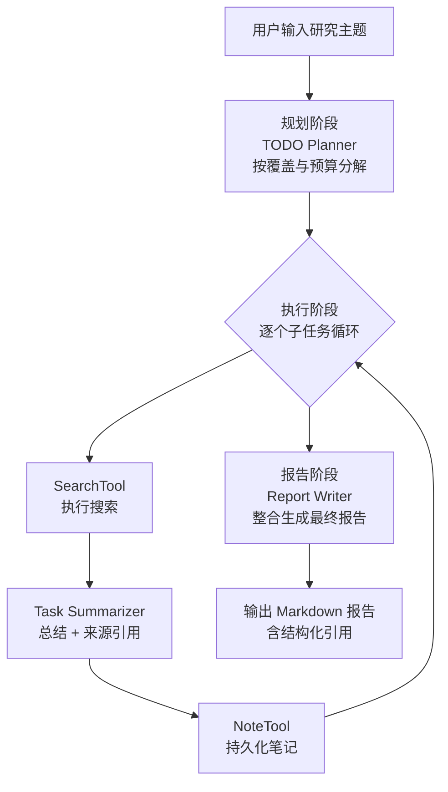
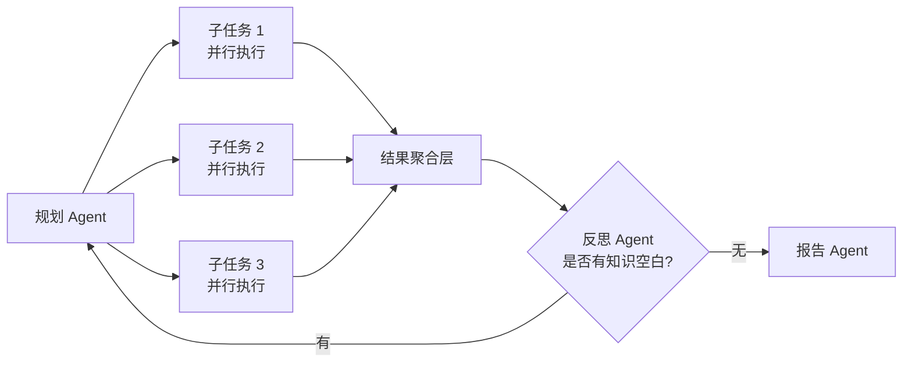

*图：沿“问题分解 → 并行检索 → 原始来源阅读 → 证据账本 → 交叉验证 → 带引用综合”读取，注入检测和停止条件包围整个闭环。*

---

深度研究（Deep Research）是智能体的一类典型知识密集型任务：用户给出一个开放主题，Agent 需要自主规划、多轮检索、综合归纳，最终交付带来源引用的结构化报告。本文以一个完整的实战项目为线索，剖析其架构设计、Agent 分工、工具系统与关键工程细节。（参见 [Deep Research System Card](https://cdn.openai.com/deep-research-system-card.pdf)；参见 [How we built our multi-agent research system](https://www.anthropic.com/engineering/multi-agent-research-system)）

## 为什么深度研究比普通搜索难

普通搜索返回一批链接，用户自行阅读整合。深度研究面临三个核心挑战：

1. **信息发散**：复杂主题往往包含多个子问题，单次搜索无法覆盖。
2. **事实更新快**：技术/政策领域信息日新月异，预训练知识会过时。
3. **来源可信度**：用户对研究报告有引用要求，不能无中生有。

因此，深度研究 Agent 需要具备三种核心能力：**问题剖析**（将主题拆解为可检索的子查询）、**多轮信息采集**（多源搜索 + 去重整合）、**反思与总结**（识别知识空白，决定是否继续检索，并生成结构化报告）。

## 整体架构

系统采用经典的前后端分离四层架构：

```mermaid
graph TD
    subgraph 前端层
        UI[Vue3 + TypeScript\n全屏模态 UI / Markdown 渲染]
    end
    subgraph 后端层
        CREATE[FastAPI\nPOST /api/research\n幂等创建 job]
        EVENTS[GET /api/research/{job_id}/events\nSSE 事件流]
        STORE[Job + Event Log\n状态与断点]
    end
    subgraph 智能体层
        P[TODO Planner\n研究规划专家]
        S[Task Summarizer\n任务总结专家]
        R[Report Writer\n报告撰写专家]
        T1[SearchTool\n多引擎搜索]
        T2[NoteTool\n笔记持久化]
    end
    subgraph 外部服务层
        SE[搜索引擎\nTavily / DuckDuckGo\nPerplexity / SearXNG]
        LLM[LLM 提供商\nOpenAI / DeepSeek / Qwen]
    end

    UI -- POST 创建 --> CREATE
    CREATE --> STORE
    UI -- EventSource GET --> EVENTS
    EVENTS --> STORE
    CREATE --> P
    P --> S
    S --> R
    P & S --> T1
    S --> T2
    T1 --> SE
    P & S & R --> LLM
```

**完整数据流**：用户输入主题 → 前端用带幂等键的 POST 创建研究 job → 后端只启动一次研究副作用并返回 `job_id` → 前端用 `EventSource` 对该 job 建立 GET SSE 连接 → 规划 Agent 分解子任务 → 执行、记录并生成报告 → 后端把带递增 ID 的事件写入日志并推送。连接中断后，浏览器仍连接同一个 job，并通过 `Last-Event-ID` 补收事件，而不是重新发起研究。

## TODO 驱动的研究范式

这是本系统的核心思想：将"研究"这个模糊的复杂任务，转化为"规划 → 执行 → 整合"的有序流程。



**一个具体的分解示例**（主题："Datawhale 是一个什么样的组织？"）：

```json
[
  {
    "title": "Datawhale 的基本信息",
    "intent": "了解组织定位、成立时间和发展历程",
    "query": "Datawhale organization introduction history 2024"
  },
  {
    "title": "Datawhale 的主要项目",
    "intent": "了解核心开源教程与社区内容",
    "query": "Datawhale projects tutorials open source 2024"
  },
  {
    "title": "Datawhale 的社区文化",
    "intent": "了解价值观与运营模式",
    "query": "Datawhale community culture open learning 2024"
  }
]
```

子任务数量由问题维度、来源独立性、预算和停止条件决定：过粗会漏掉证据，过细会重复检索并增加合并成本。每个子任务包含 `title`（标题）、`intent`（研究意图）、`query`（搜索关键词）；查询语言应匹配目标资料，而不是默认英文一定更好。

## 三 Agent 协作设计

系统设计了三个职责单一的 Agent，顺序协作：

| Agent | 职责 | 输入 | 输出 |
|-------|------|------|------|
| TODO Planner | 将主题分解为子任务 | 研究主题 + 当前日期 | JSON 格式子任务列表 |
| Task Summarizer | 总结单个子任务的搜索结果 | 子任务信息 + 搜索结果 | Markdown 总结 + 来源引用 |
| Report Writer | 整合所有总结，生成最终报告 | 研究主题 + 所有子任务总结 | 完整 Markdown 报告 |

职责单一的好处：每个 Agent 的 Prompt 可以专门优化；修改某个 Agent 不影响其他；单独调试某一阶段更容易。

### TODO Planner 的核心循环骨架

```python
class PlanningService:
    def __init__(self, llm: HelloAgentsLLM):
        self._agent = ToolAwareSimpleAgent(
            name="TODO Planner",
            system_prompt="你是一个研究规划专家",
            llm=llm,
            tool_call_listener=self._on_tool_call
        )

    def plan_todo_list(self, research_topic: str) -> list[TodoItem]:
        prompt = TODO_PLANNER_PROMPT.format(
            current_date=datetime.now().strftime("%Y年%m月%d日"),
            research_topic=research_topic,
        )
        response = self._agent.run(prompt)
        tasks = self._extract_json(response)  # 正则提取 JSON 数组
        return [TodoItem(**t) for t in tasks]

    def _extract_json(self, response: str) -> list[dict]:
        """Agent 响应可能包含额外文字，用正则提取 JSON 数组部分"""
        match = re.search(r'\[.*\]', response, re.DOTALL)
        if match:
            return json.loads(match.group(0))
        raise ValueError("无法从响应中提取 JSON")
```

### 主协调器的核心循环

```python
class DeepResearchAgent:
    def run(self, research_topic: str) -> str:
        # 阶段 1：规划
        self._emit({"type": "status", "message": "正在规划研究任务..."})
        todo_list = self.planner.plan_todo_list(research_topic)
        self._emit({"type": "tasks", "tasks": [t.dict() for t in todo_list]})

        # 阶段 2：逐个执行
        task_summaries = []
        for task in todo_list:
            self._emit({"type": "status", "message": f"正在研究：{task.title}"})

            search_results = self.search_service.search(task.query)
            summary, source_urls = self.summarizer.summarize_task(task, search_results)

            # 持久化到本地笔记
            self.notes_service.save_task_summary(task, search_results, summary)
            task_summaries.append((task, summary, source_urls))

            self._emit({"type": "task_completed", "task_id": task.id})

        # 阶段 3：生成报告
        self._emit({"type": "status", "message": "正在生成报告..."})
        report = self.reporter.generate_report(research_topic, task_summaries)
        self._emit({"type": "report", "content": report})

        return report
```

## 工具系统：SearchTool + NoteTool

### SearchTool：多引擎搜索

深度研究的质量高度依赖搜索结果的广度与准确度。系统扩展了 `SearchTool`，支持多个后端：

| 搜索引擎 | 特点 | 适用场景 |
|---------|------|---------|
| Tavily | AI 优化召回，直接返回摘要 | 通用研究，默认推荐 |
| DuckDuckGo | 免费，无需 API Key | 开发测试，隐私敏感场景 |
| Perplexity | 返回 AI 综合答案 + 来源 | 需要预综合的场景 |
| SearXNG | 开源自托管元搜索 | 私有化部署需求 |
| Advanced（混合模式） | 组合多引擎，去重合并 | 高质量研究需求 |

两个必做的后处理步骤：

```python
def deduplicate_sources(sources: list[dict]) -> list[dict]:
    """去除重复 URL，避免同一来源多次进入上下文"""
    seen = set()
    return [s for s in sources if s["url"] not in seen and not seen.add(s["url"])]

def limit_source_tokens(source: dict, max_tokens: int, tokenizer) -> dict:
    """使用目标模型对应的 tokenizer 执行硬 token 上限。"""
    token_ids = tokenizer.encode(source["snippet"])
    if len(token_ids) <= max_tokens:
        return source

    snippet = tokenizer.decode(token_ids[:max_tokens])
    return {**source, "snippet": snippet + "...", "truncated": True}
```

字符数与 token 数的映射会随模型、语言和文本内容变化，尤其不能用英文经验倍率约束中文。若只是限制 UI 预览长度，可以按字符截断；若约束模型上下文或费用，必须使用目标模型对应的 tokenizer，或调用提供商的 token counting API。

还可以加一层搜索结果缓存，避免相同查询重复消耗 API 配额：

```python
def _generate_cache_key(self, query: str, max_results: int) -> str:
    content = f"{query}_{max_results}_{self.config.search_api.value}"
    return hashlib.md5(content.encode()).hexdigest()
```

### NoteTool：笔记持久化

每个子任务的搜索结果和总结都以 Markdown 文件形式落盘，便于审计和断点恢复：

```
workspace/
├── notes/
│   ├── 1.md   # 子任务 1 的搜索原文 + 总结 + 来源
│   ├── 2.md
│   └── 3.md
└── reports/
    └── final_report.md
```

### ToolAwareSimpleAgent：工具调用监听扩展

为了将 Agent 的每次工具调用实时推送到前端，系统在基础 `SimpleAgent` 上扩展了 `ToolAwareSimpleAgent`，在 `_execute_tool_call` 中插入回调钩子：每次工具调用时触发 `tool_call_listener`，将工具名称、参数、结果通过 SSE 推送给用户，让"黑盒转圈"变成可见的研究轨迹，极大提升可观测性。

## 前后端实时通信：SSE

系统使用 SSE（Server-Sent Events）实现研究进度的流式推送，而非 WebSocket——SSE 更轻量，天然适合单向服务器推送场景。

`EventSource` 只能发起 GET，不适合同时承担“创建研究任务”的副作用。下面把写操作和事件订阅分开：POST 使用幂等键创建 job，GET 只读取该 job 的事件。示例把事件暂存在单进程内存中，展示协议与重连语义；生产环境应换成带 TTL 的持久化 job/event store。

**后端 FastAPI：幂等创建 + 可续传 SSE**：

```python
import asyncio
import json
from dataclasses import dataclass, field
from uuid import uuid4

from fastapi import FastAPI, Header, HTTPException
from fastapi.responses import StreamingResponse
from pydantic import BaseModel

app = FastAPI()

class CreateResearchRequest(BaseModel):
    topic: str

@dataclass
class ResearchJob:
    topic: str
    events: list[tuple[int, dict]] = field(default_factory=list)
    done: bool = False
    changed: asyncio.Condition = field(default_factory=asyncio.Condition)
    task: asyncio.Task | None = None

jobs: dict[str, ResearchJob] = {}
idempotency_index: dict[str, str] = {}
create_lock = asyncio.Lock()

async def publish(job: ResearchJob, payload: dict) -> None:
    async with job.changed:
        event_id = len(job.events) + 1
        job.events.append((event_id, payload))
        job.changed.notify_all()

async def run_research(job: ResearchJob) -> None:
    try:
        await publish(job, {"type": "progress", "stage": "planning"})
        todo_items = await planning_service.plan_todo_list(job.topic)
        await publish(job, {
            "type": "plan",
            "data": [item.model_dump() for item in todo_items],
        })

        task_summaries = []
        for task in todo_items:
            await publish(job, {
                "type": "progress",
                "stage": "executing",
                "text": f"正在研究：{task.title}",
            })
            results = await search_service.search(task.query)
            summary, urls = await summarization_service.summarize_task(task, results)
            task_summaries.append((task, summary, urls))
            await publish(job, {
                "type": "task_summary",
                "task_id": task.id,
                "summary": summary,
            })

        report = await reporting_service.generate_report(job.topic, task_summaries)
        await publish(job, {"type": "report", "data": report})
        await publish(job, {"type": "completed"})
    except Exception:
        # 生产服务应在受控日志中记录详细异常；事件流只返回稳定错误码和安全文案。
        await publish(job, {
            "type": "error",
            "code": "research_failed",
            "message": "研究任务失败，请稍后重试",
        })
    finally:
        async with job.changed:
            job.done = True
            job.changed.notify_all()

@app.post("/api/research", status_code=202)
async def create_research(
    body: CreateResearchRequest,
    idempotency_key: str | None = Header(default=None, alias="Idempotency-Key"),
):
    async with create_lock:
        if idempotency_key and idempotency_key in idempotency_index:
            job_id = idempotency_index[idempotency_key]
            if jobs[job_id].topic != body.topic:
                raise HTTPException(409, "幂等键已用于不同的研究主题")
            return {"job_id": job_id}

        job_id = uuid4().hex
        job = ResearchJob(topic=body.topic)
        jobs[job_id] = job
        if idempotency_key:
            idempotency_index[idempotency_key] = job_id
        # jobs 持有 task 的强引用；重复幂等请求只返回现有 job_id。
        job.task = asyncio.create_task(run_research(job))
        return {"job_id": job_id}

async def research_events(job: ResearchJob, last_event_id: int):
    cursor = last_event_id
    while True:
        async with job.changed:
            await job.changed.wait_for(
                lambda: len(job.events) > cursor or job.done
            )
            pending = job.events[cursor:]
            done = job.done

        for event_id, payload in pending:
            cursor = event_id
            data = json.dumps(payload, ensure_ascii=False)
            yield f"id: {event_id}\ndata: {data}\n\n"

        if done and cursor >= len(job.events):
            break

@app.get("/api/research/{job_id}/events")
async def get_research_events(
    job_id: str,
    last_event_id: str | None = Header(default=None, alias="Last-Event-ID"),
):
    job = jobs.get(job_id)
    if job is None:
        raise HTTPException(404, "research job 不存在或已过期")

    try:
        cursor = max(0, int(last_event_id or "0"))
    except ValueError:
        raise HTTPException(400, "Last-Event-ID 必须是非负整数")

    return StreamingResponse(
        research_events(job, cursor),
        media_type="text/event-stream",
        headers={"Cache-Control": "no-cache"},
    )
```

**前端 TypeScript：先创建一次，再订阅同一 job**：

```typescript
// composables/useResearch.ts
export function useResearch() {
  const progressText = ref('')
  const markdownContent = ref('')
  const isLoading = ref(false)

  const startResearch = async (topic: string) => {
    isLoading.value = true
    const idempotencyKey = crypto.randomUUID()

    const response = await fetch('/api/research', {
      method: 'POST',
      headers: {
        'Content-Type': 'application/json',
        'Idempotency-Key': idempotencyKey,
      },
      body: JSON.stringify({ topic }),
    })
    if (!response.ok) {
      isLoading.value = false
      throw new Error(`创建研究任务失败: ${response.status}`)
    }

    const { job_id: jobId } = await response.json() as { job_id: string }
    const es = new EventSource(
      `/api/research/${encodeURIComponent(jobId)}/events`,
    )

    es.onmessage = (event) => {
      const data = JSON.parse(event.data)
      switch (data.type) {
        case 'progress':
          progressText.value = data.text ?? data.stage
          break
        case 'report':
          markdownContent.value = data.data
          break
        case 'completed':
          isLoading.value = false
          es.close()
          break
        case 'error':
          isLoading.value = false
          es.close()
          break
      }
    }

    es.onerror = () => {
      // 不重新 POST。EventSource 会对同一 GET 自动重连，并发送 Last-Event-ID。
      // 只有收到 completed/error 或用户主动取消时才 close。
      progressText.value = '连接中断，正在恢复事件流…'
    }
  }

  return { progressText, markdownContent, isLoading, startResearch }
}
```

## 关键工程点总结

**1. 提示词的 JSON 约束**

规划 Agent 的输出需要被程序解析，必须在 Prompt 中明确约束：

- "只返回 JSON，不要包含任何其他文字"
- 提供完整的 JSON Schema 示例
- 在解析层做双重兜底（正则提取 + 直接解析）

**2. 搜索质量控制**

- 搜索关键词建议用英文（英文文档覆盖面更广）
- 结果去重（同一 URL 可能出现在多个搜索引擎）
- 用目标 tokenizer 执行 token 上限（防止长摘要撑爆 Agent 上下文窗口）
- 搜索缓存（相同查询不重复消耗 API 配额）

**3. 规划质量评估**

可以对规划结果做自动化评分：

```python
def evaluate_plan(todo_items: list[TodoItem], policy: PlanPolicy) -> dict:
    score = 100
    suggestions = []
    if len(todo_items) < policy.min_tasks:
        score -= policy.missing_coverage_penalty
        suggestions.append("子任务少于当前研究策略要求，请检查覆盖面")
    if len(todo_items) > policy.max_tasks:
        score -= policy.redundancy_penalty
        suggestions.append("子任务多于当前研究策略上限，请检查重复项")
    for task in todo_items:
        if len(task.query.split()) < policy.min_query_terms:
            score -= policy.query_penalty
            suggestions.append(f"任务「{task.title}」搜索查询未达到当前策略要求")
    return {"score": score, "suggestions": suggestions}
```

**4. 持久化与断点恢复**

NoteTool 将每个子任务的中间结果落盘，支持研究中断后从上次进度恢复，也为后续的质量审计提供完整的研究轨迹。

**5. 可观测性设计**

`ToolAwareSimpleAgent` 的回调机制 + SSE 推送，让用户在等待过程中能看到 Agent 正在做什么（搜索哪个关键词、调用了哪个工具、当前执行阶段），而非面对一个"黑盒转圈"。

## 架构扩展思路

当前系统是**顺序协作**模式（规划 → 执行 → 报告，同一时间只有一个 Agent 在工作）。面对更复杂的研究需求，可以考虑以下扩展方向：



- **并行执行**：多个子任务同时运行，大幅缩短研究时长（需要处理并发请求配额限制）。
- **反思循环（Reflection Loop）**：报告完成后，让另一个 Agent 评估报告质量，识别未覆盖的知识点，触发补充研究。
- **多源融合**：除搜索引擎外，接入学术数据库（arXiv）、代码仓库（GitHub）、知识图谱等专业数据源。

## 常见误区与最佳实践

**常见误区**：
- 认为存在通用子任务数量：应根据覆盖矩阵、依赖关系、并发/成本预算和证据增量动态拆分；当新搜索不再增加独立证据时停止扩张。
- 忽视搜索结果的 Token 管理：不做预算就把摘要全部喂给总结 Agent，可能触发上下文长度限制；字符截断不能替代目标模型 tokenizer。
- 期望 LLM 输出严格 JSON：即使 Prompt 要求很明确，LLM 有时仍会在 JSON 前后附加说明性文字，解析层必须做防御性处理。
- 不考虑来源引用：深度研究的可信度来自引用，总结 Agent 的 Prompt 必须明确要求为每个观点标注来源。

**最佳实践**：
- 搜索关键词优先使用英文，可配合日期限定词（如"2024"）确保时效性。
- 每个 Agent 的 Prompt 中包含具体输出示例（Few-shot），比纯描述更有效。
- 生产环境可对规范化查询和稳定来源做带 TTL/版本的缓存；命中率、节省金额和陈旧风险用真实流量测量，不假定固定百分比。
- 用 NoteTool 落盘研究过程，不仅支持断点恢复，还能构成"研究轨迹"数据集，用于后续 Agent 的微调。

## 面试常问要点

- 深度研究 Agent 与普通 RAG 问答 Agent 的本质区别是什么？
- TODO 驱动范式的"规划 → 执行 → 整合"三阶段各自的职责是什么？
- 为什么选择三个专职 Agent 而不是一个全能 Agent？职责单一带来什么工程优势？
- SSE 和 WebSocket 在实时流式场景中如何选择？各有什么优缺点？
- 搜索结果去重和 Token 截断解决了什么问题？如果不做会出现什么后果？
- 如何评估规划 Agent 生成的子任务质量？给出量化指标。
- `ToolAwareSimpleAgent` 的回调机制解决了什么问题？可以用于哪些场景？

## 参考资料

- [Deep Research System Card](https://cdn.openai.com/deep-research-system-card.pdf)
- [How we built our multi-agent research system](https://www.anthropic.com/engineering/multi-agent-research-system)
