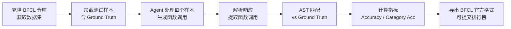

*图：沿图中的节点与箭头阅读，重点是任务成功、轨迹质量、工具正确性、成本与安全拆成可复现指标。*

---

构建一个 Agent 容易，但如何知道它"真的好用"？准确率一个数字远远不够——Agent 在什么任务上失败、失败的代价多大、换个表述方式还能答对吗？这些问题都需要系统化的评估体系来回答。本文介绍智能体性能评估的核心维度、主流基准与方法，以及为什么"单看准确率"会误导决策。

## 为什么需要系统化评估

在开发过程中，我们面临三类核心问题：

1. **能力验证**：Agent 是否真的具备了预期的能力？工具调用会用对吗？推理链是否合理？
2. **横向对比**：换了提示词或换了 LLM 底座之后，是否真的有进步？进步在哪个维度？
3. **可靠性保证**：上线之前，如何量化 Agent 在生产环境的可靠性？

没有系统化评估，这三个问题的答案都是"感觉上好像更好了"——而"感觉"在工程中是不可靠的。

智能体评估面临的独特挑战：

- **输出不确定性**：同一问题可能有多个正确答案，简单的对错判断不够；
- **评估维度多样**：工具调用需要检查函数签名，问答需要评估语义相似度，规划需要检查步骤合理性；
- **评估成本高昂**：每次评估都需要大量 API 调用，一次完整评估可能耗费数百元。

## 核心评估维度

### 任务成功率（Task Success Rate）

最直接的指标——**Agent 是否最终完成了任务**。

对于有明确正确答案的任务（数学题、代码执行），可以用精确匹配（Exact Match）或准确率（Accuracy）：

$$\text{Accuracy} = \frac{\text{正确完成任务数}}{\text{总任务数}}$$

对于开放式任务（文章撰写、代码设计），需要更复杂的评估方法（见后文的 LLM Judge）。

**为什么准确率不够**：
- 不能区分"几乎对"和"完全错"——预测 71 和预测 0 在准确率上等价；
- 无法反映成功路径的质量——用了 20 步工具调用才对，和用 3 步才对，准确率相同；
- 无法捕捉鲁棒性——同一问题换一种表述就答错了，准确率不会告诉你这个。

### 效率（Efficiency）

Agent 完成任务的**资源消耗**，包括：

- **Token 消耗**：总输入 + 输出 token 数，直接对应 API 成本；
- **工具调用次数**：不必要的冗余调用既浪费成本又增加延迟；
- **端到端延迟**：从用户提问到给出答案的总时间；
- **推理步骤数**：对于多步推理任务，步骤数反映了推理效率。

$$\text{平均推理步骤} = \frac{1}{N_{\text{正确}}} \sum_{i \in \text{正确}} \text{steps}_i$$

高准确率但低效率的 Agent 在生产环境中可能无法接受（成本/延迟超标）。

### 鲁棒性（Robustness）

**Agent 在不同条件下的稳定性**：

- **表述鲁棒性**：同一语义的问题，不同表达方式是否都能答对？
- **噪声鲁棒性**：输入包含拼写错误、不相关信息时是否仍然正确？
- **边界条件处理**：输入为空、超出能力范围的任务，是否能优雅失败（而非胡乱瞎答）？
- **故障恢复能力（Failure Recovery）**：工具调用失败后，Agent 是否能自动重试或切换策略？

鲁棒性差的 Agent 在测试集上表现好，但在生产中遇到真实用户的各种奇怪输入时会频繁失败。

### 成本（Cost）

评估**经济可行性**：

- **每次任务成本**：平均 API 费用；
- **Token 效率**：有效信息 / 总 token 数（信噪比）；
- **推理时间**：实际部署的响应时间是否可接受。

一个准确率 95% 但每次任务花费 $0.5 的 Agent，可能不如准确率 88% 但每次只花 $0.02 的 Agent 实用。

## 主流评估基准

### BFCL：工具调用能力评估

**BFCL（Berkeley Function Calling Leaderboard）**是 UC Berkeley 推出的工具调用专项基准，包含 1120+ 测试样本，分四类难度：

| 类别 | 描述 | 难度 |
|------|------|------|
| Simple | 单函数调用 | 低 |
| Multiple | 需要调用多个函数 | 中 |
| Parallel | 需要并行调用多个函数 | 高 |
| Irrelevance | 判断是否需要调用函数 | 高 |

**评估算法：AST 匹配（Abstract Syntax Tree Matching）**

BFCL 不用字符串匹配，而是将函数调用解析为语法树后比较：

```python
# AST 匹配的优势：
# ✅ 参数顺序不同也算匹配
# get_weather(city="Beijing", unit="celsius")
# get_weather(unit="celsius", city="Beijing")  → 匹配

# ✅ 等价表达式匹配
# calculate(x=2+3) 和 calculate(x=5)  → 匹配

# ❌ 函数名不同不匹配
# get_weather(city="Beijing") 和 get_temperature(city="Beijing")  → 不匹配
```

**指标定义：**

$$\text{Accuracy} = \frac{1}{N} \sum_{i=1}^{N} \text{AST\_Match}(P_i, G_i)$$

$$\text{Weighted Accuracy} = \sum_{c} w_c \cdot \text{Accuracy}_c \quad \text{（按类别加权）}$$

BFCL 的评估结果可以直接提交到官方排行榜，方便横向对比不同模型和框架。

### GAIA：通用 AI 助手综合能力评估

**GAIA（General AI Assistants）**由 Meta AI 和 Hugging Face 联合推出，466 个真实世界问题，分三个难度级别：

| 级别 | 特点 | 样本数（validation）|
|------|------|---------------------|
| Level 1 | 零步或单步推理 | 53 |
| Level 2 | 多步推理，需要工具辅助 | 62 |
| Level 3 | 复杂多步推理，涉及多种工具 | 50 |

GAIA 题目代表真实的综合能力挑战：多步推理、知识运用、网页浏览、文件处理等能力的综合考察。

**评估算法：准精确匹配（Quasi Exact Match）**

先对答案做归一化，再精确比较：

$$\text{Quasi\_Exact\_Match}(A_{\text{pred}}, A_{\text{true}}) = \begin{cases} 1 & \text{if } \mathcal{N}(A_{\text{pred}}) = \mathcal{N}(A_{\text{true}}) \\ 0 & \text{otherwise} \end{cases}$$

归一化规则：数字去掉逗号分隔符和单位符号（`$1,234` → `1234`）；字符串转小写、去掉冠词（`"The United States"` → `"united states"`）；列表按字母顺序排序后合并。

**难度递进下降率**（分析 Agent 的能力边界）：

$$\text{Drop Rate}_{\ell \to \ell+1} = \frac{\text{Accuracy}_\ell - \text{Accuracy}_{\ell+1}}{\text{Accuracy}_\ell}$$

下降率越小，说明 Agent 应对任务复杂度增加的鲁棒性越好。

GAIA 的官方系统提示词强制要求答案格式为 `FINAL ANSWER: [答案]`，评估时从中提取答案进行匹配。

### AgentBench、WebArena 等其他基准

[AgentBench](https://arxiv.org/abs/2308.03688) 在多个交互环境中评估智能体，提醒我们不能用单一静态问答分数代替跨任务的行动能力。

[WebArena](https://arxiv.org/abs/2307.13854) 用可执行的网站任务和功能正确性判定端到端结果，因此评估对象是实际完成的任务，而不只是生成文本的相似度。


| 基准 | 主办方 | 特点 |
|------|--------|------|
| AgentBench | 清华大学 | 8 个领域综合评估 |
| WebArena | CMU | 真实网页环境中的任务完成 |
| ToolBench | 清华大学 | 16000+ 真实 API 调用场景 |
| SOTOPIA | - | 社交场景中的 Agent 互动能力 |

## LLM Judge：开放式评估方法

对于没有精确答案的任务（文章质量、代码设计、数据生成质量等），**LLM Judge** 用强模型作为评委打分：

```python
# LLM Judge 评估流程示意（以官方文档为准）
judge_prompt = """
你是一位严格的评审专家。请从以下维度评估这道数学题的质量：

题目：{generated_question}

评分维度（各 1-5 分）：
1. 正确性：题目本身是否有误
2. 清晰度：题目表述是否清楚
3. 难度匹配：是否符合目标难度
4. 原创性：是否与常见题目雷同

请以 JSON 格式输出评分和理由。
"""

# 优势：
# - 可以评估主观质量
# - 提供详细的评分理由
# - 成本低于人工，但高于规则匹配
```

**LLM Judge 的使用注意事项**：
- 不同 LLM 作为 Judge 可能给出不同结果，评估结果本身存在偏差；
- 强模型（GPT-4 级）作为 Judge 比弱模型更可靠；
- 需要关注 Judge 对"自己家模型输出"的偏好（Position Bias、Verbosity Bias）。

## Win Rate：相对比较评估

当难以给出绝对分数时，**Win Rate** 用来做两个方案之间的相对比较：

```python
# Win Rate 评估流程
# 给 LLM Judge 两个方案 A 和 B，让它判断哪个更好

compare_prompt = """
请判断方案 A 和方案 B 哪个更好，或者相当：
方案 A：{response_a}
方案 B：{response_b}
请回答 A / B / Tie。
"""

# Win Rate(A vs B) = A 胜利次数 / 总比较次数
# 常用于：改版前后对比、模型升级评估、提示词 A/B 测试
```

Win Rate 相比绝对分数更稳定，因为 LLM Judge 打绝对分时主观性强，但判断相对优劣时一致性更高。

## 评估实战流程

以 BFCL 为例的完整评估流程：



```python
from hello_agents import SimpleAgent, HelloAgentsLLM
from hello_agents.tools import BFCLEvaluationTool
# 以官方文档为准

llm = HelloAgentsLLM()
agent = SimpleAgent(name="MyAgent", llm=llm)

bfcl_tool = BFCLEvaluationTool()
results = bfcl_tool.run(
    agent=agent,
    category="simple_python",   # 从最简单的类别开始
    max_samples=50,              # 渐进式：先小批次验证
)

print(f"准确率: {results['overall_accuracy']:.2%}")
print(f"正确数: {results['correct_samples']}/{results['total_samples']}")
```

**渐进式评估策略**（降低成本、快速迭代）：

1. 先用 5–10 个样本快速验证流程是否通顺；
2. 准确率 > 80% 后扩大到 50–100 样本确认稳定性；
3. 最终做全量评估，可提交排行榜。

## 为什么准确率不够：一个完整视角

下面的对比展示了只看准确率会错过什么：

| Agent | 准确率 | 平均 Token 消耗 | 鲁棒性（表述变化） | 平均延迟 |
|-------|--------|----------------|-------------------|----------|
| Agent A | 92% | 2000 | 低（换表述掉到 70%） | 3s |
| Agent B | 88% | 500 | 高（换表述仍有 85%） | 0.8s |
| Agent C | 95% | 5000 | 中（80%） | 8s |

只看准确率会选 C，但实际上：
- C 的成本是 B 的 10 倍，延迟是 B 的 10 倍，生产中可能不可接受；
- A 的鲁棒性差，真实用户的各种表述下会频繁失败；
- B 在综合考量下可能是最优选择。

评估维度选取应与**业务目标对齐**：如果成本是最高约束，重点看 Token 效率；如果是客户服务场景，鲁棒性比准确率更重要；如果是研究竞赛，准确率才是第一位。

## 常见误区与最佳实践

**误区 1：测试集越大越好**  
测试集的质量和多样性比数量更重要。100 个精心设计的测试样本，比 1000 个雷同样本更有价值。

**误区 2：评估结果是绝对的**  
同一 Agent 在不同测试集、不同测试条件下结果可能差异很大。评估要标注测试集版本、评估日期和具体配置。

**误区 3：忽略错误分析**  
准确率只告诉你"答对了多少"，错误分析（哪类题错、为什么错）才能指导改进方向。

**最佳实践**：
- 为每个业务场景选择对应的评估维度，不要用"通用"评估指标凑数；
- 建立持续评估 CI/CD：每次改动自动触发关键测试集的评估，防止性能退化（Regression）；
- 分类统计错误：工具调用失败、推理错误、格式错误分开统计，问题定位更精准；
- 在发布重大改动前，同时评估准确率、鲁棒性和成本，综合权衡再决策；
- 对于 LLM Judge 评估，做交叉验证（让多个不同 Judge 评分取平均），减少单一 Judge 的偏差。

## 面试常问

- **Q：BFCL 为什么用 AST 匹配而不是字符串匹配？**  
  函数调用的参数顺序可以不同但语义相同，字符串匹配会把正确答案判成错误。AST 匹配在语义层面比较，更准确反映 Agent 真实能力。

- **Q：GAIA 的"准精确匹配"解决了什么问题？**  
  真实问题的答案表述多样（"$1,234" vs "1234" vs "1234 元"），直接字符串比较会低估 Agent 能力。归一化后匹配更公平。

- **Q：LLM Judge 和人工评估的区别是什么？**  
  LLM Judge 成本低、速度快、一致性强（相同问题每次评分接近）；人工评估成本高、速度慢，但对新颖题型的判断更可靠，也不存在 Judge 的偏见问题。实践中两者结合：LLM Judge 做大规模初筛，人工评估做抽样验证和 Corner Case 审查。

- **Q：如何在有限预算下设计评估方案？**  
  优先级：先用小样本（50–100 条）快速验证核心能力（准确率）；再用已有基准（BFCL、GAIA）做标准化测试方便横向对比；最后对业务关键路径做专项鲁棒性和成本评估。

## 参考资料

- [AgentBench: Evaluating LLMs as Agents](https://arxiv.org/abs/2308.03688)
- [WebArena: A Realistic Web Environment for Building Autonomous Agents](https://arxiv.org/abs/2307.13854)
